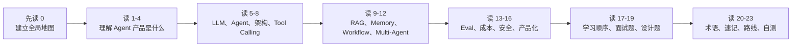
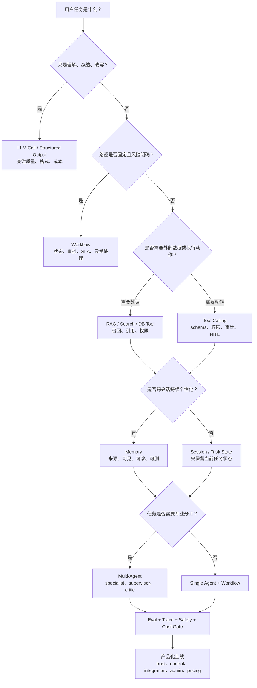
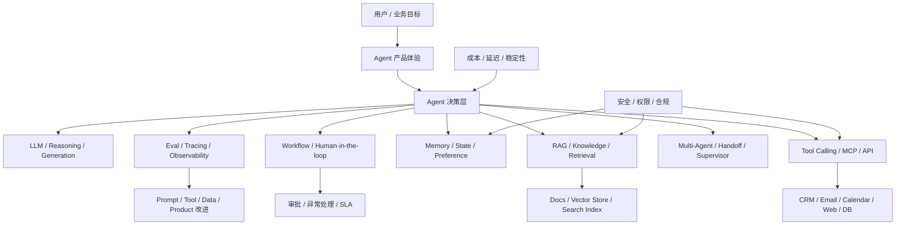

# Agent PM 技术知识总览

更新时间：2026-06-04  
适用对象：强技术型 Agent 产品经理、AI Native PM、Agent Builder PM  
贯穿案例：GTM / Sales / Marketing Agent

## 0. 先读这一页

### 0.1 三分钟速读

如果你只用 3 分钟预习这篇，记住下面 8 句话：

| 你要记住的点 | 面试里怎么说 |
|---|---|
| Agent 产品不是一个模型 | 它是 LLM、工具、知识、记忆、流程、权限、评测和产品体验的组合系统 |
| LLM 是大脑，但不是完整产品 | LLM 负责理解、推理和生成；真正的业务闭环还需要 Tool Calling、RAG、Workflow 和 Eval |
| Agent 适合开放任务，Workflow 适合确定任务 | 研究账号可以 Agent 化，外发邮件审批更适合 workflow |
| Tool Calling 是行动边界 | Agent 能查 CRM、写 CRM、发邮件还是只生成草稿，取决于工具权限和产品策略 |
| RAG 是企业知识和证据层 | 它让 Agent 使用私有知识、最新知识和可引用证据，而不是凭空编 |
| Memory 是连续体验，不是无限聊天记录 | 记忆必须有来源、权限、可编辑和可删除机制 |
| Eval 是生产级 Agent 的地基 | 要评最终答案、执行过程、工具调用、检索、成本、延迟和安全 |
| 企业 Agent 的关键词是 trust + control | 用户要看见证据、能确认高风险动作、能追溯失败、能控制权限 |

一句面试总括：

> Agent PM 的技术能力不是会背模型名，而是能把一个智能任务拆成模型、工具、知识、记忆、流程、评测、安全和产品化边界。比如 GTM Agent 不是“帮销售写邮件”，而是查 CRM、检索案例、发现 buying signals、生成证据化草稿、等待审批、写回 CRM，并用 eval 和 trace 持续改进。

### 0.2 本篇阅读路线

如果时间很紧，建议这样读：

| 你有多少时间 | 读哪些部分 | 目标 |
|---|---|---|
| 10 分钟 | 0、2、4、21、23 | 建立全局心智模型，能说出一版 30 秒回答 |
| 30 分钟 | 0、3、5-16、18、19 | 能回答常见概念题和设计题 |
| 2 小时 | 全文 + References | 能把 GTM Agent 从 MVP 讲到生产上线 |
| 面试前复习 | 0.3、17、18、19、21、23 | 快速找回决策表、话术和自测标准 |

### 0.3 PM 决策速查表

| 决策问题 | 推荐判断 | GTM / Sales Agent 例子 |
|---|---|---|
| 这个功能要不要做成 Agent？ | 信息不完整、多步骤、多工具、路径开放时才做 Agent | “研究 Acme 并找切入点”适合 Agent |
| 什么时候不用 Agent？ | 路径固定、风险高、规则明确时优先 workflow 或普通 LLM call | “审批后发送邮件”应是 workflow |
| 选强模型还是小模型？ | 高推理和高价值任务用强模型，分类、抽取、路由用小模型 | 写策略建议用强模型，lead 标签用小模型 |
| 用 RAG 还是 fine-tuning？ | 企业知识、更新频繁、需要引用时优先 RAG | 客户案例、产品文档、battlecard 用 RAG |
| 要不要 Memory？ | 只有能提升连续体验且可解释、可删除时才记 | 记销售偏好和账号历史，但不乱记隐私 |
| 要不要 Multi-Agent？ | 单 Agent 不能清晰完成专业分工或独立审查时再用 | Research、Copywriting、Compliance 可拆分 |
| 哪些工具能自动执行？ | 只读和草稿工具可自动，高风险写操作要确认 | 查 CRM 自动，发送邮件必须 approval |
| 怎么证明有效？ | 同时看业务价值、质量、过程、安全、成本 | 节省研究时间、邮件通过率、引用准确率、cost per brief |
| 什么情况下不能上线？ | 无权限过滤、无 trace、无 eval、无失败降级、无审批策略 | 能直接外发未审邮件就不应上线 |

### 0.4 全局学习路径 / 决策图

这张图的用法：

1. 面试设计题先从用户任务开始，不要先说模型。
2. 每次引入 Agent、RAG、Memory、Multi-Agent，都要说明“为什么需要”。
3. 所有路径最后都要落到 Eval、Trace、Safety、Cost 和产品化。

### 0.5 学完后你应该能做到

- 用 30 秒解释 Agent PM 的完整技术地图。
- 用 2 分钟讲清一个 GTM Agent 的端到端架构。
- 判断一个需求应该用 LLM call、workflow、Agent 还是 Multi-Agent。
- 解释 Tool Calling、RAG、Memory、Workflow、Eval 分别解决什么产品问题。
- 给 Sales Agent 设计工具权限、RAG 数据源、审批流程和核心指标。
- 说清生产级 Agent 为什么需要 trace、eval、成本控制和安全门禁。
- 在面试中把技术概念翻译成用户体验、产品取舍、风险边界和上线策略。

## 1. 这份总览解决什么问题

Agent PM 面对的不是单一 AI 功能，而是一整套产品系统：LLM 负责理解与生成，Agent 负责规划与行动，Tool Calling 连接外部系统，RAG 连接企业知识，Memory 形成连续体验，Workflow 控制业务流程，Multi-Agent 拆分复杂任务，Eval 证明效果，稳定性与成本决定能否规模化，安全合规决定能否进入企业场景，产品化方法决定能否从 demo 变成可购买、可使用、可运营的产品。

这份文档的目标是建立一张“大而全”的技术知识地图，让你能回答三类核心问题：

1. 面试官问概念时：你能清楚解释“它是什么、解决什么问题、放在架构哪里”。
2. 面试官问设计题时：你能从业务目标拆到架构、数据、工具、评测、权限、成本和上线策略。
3. 和工程团队协作时：你能用准确术语表达产品需求、约束、验收指标和风险边界。

## 2. Agent PM 的核心心智模型

一句话：Agent 产品不是“会聊天的模型”，而是“带有业务目标、上下文、工具、流程、记忆、权限和评测闭环的智能执行系统”。

可以把一个典型 Agent 产品拆成 12 层：

| 层级 | 技术模块 | 解决的产品问题 | PM 需要关心什么 |
|---|---|---|---|
| 1 | LLM 基础 | 理解、推理、生成、多模态 | 模型能力边界、成本、延迟、可控性 |
| 2 | Agent 基础 | 让模型从回答问题变成完成任务 | 任务是否需要自主决策，用户如何信任过程 |
| 3 | Agent 架构 | 单 Agent、工作流、Planner-Executor、Supervisor | 复杂度、可解释性、失败恢复 |
| 4 | Tool Calling | 访问 CRM、邮件、搜索、日历、数据库等外部系统 | 工具边界、权限、参数校验、审批 |
| 5 | RAG | 使用企业私有知识与最新知识 | 数据源、召回质量、引用、权限过滤 |
| 6 | Memory | 跨轮、跨会话、跨用户保留上下文 | 记什么、不记什么、可删除、可解释 |
| 7 | Workflow | 把 Agent 嵌入确定性业务流程 | 人工审批、状态机、SLA、异常处理 |
| 8 | Multi-Agent | 将复杂任务拆给多个角色或能力 | 是否真需要多 Agent，如何避免协作成本 |
| 9 | Eval | 证明 Agent 是否真的好用 | 离线评测、在线监控、人工反馈、回归集 |
| 10 | 稳定性、成本、性能 | 让 Agent 可规模化运行 | 延迟、Token 成本、缓存、降级、限流 |
| 11 | 安全权限与合规 | 防止泄露、误操作、越权、注入攻击 | 最小权限、审计、数据治理、合规承诺 |
| 12 | 产品化 | 从 demo 到企业级产品 | UX、定价、集成、运营、上线与 adoption |

## 3. 贯穿案例：GTM / Sales / Marketing Agent

我们用一个统一案例串起所有模块：

一个 GTM / Sales Agent 帮助销售团队研究目标客户，读取 CRM 里的账号与联系人，搜索公司新闻和招聘信号，结合内部案例库与产品文档，生成有证据的 outreach reason，草拟邮件，安排后续跟进，并把结果写回 CRM。

这个案例对应的技术链路是：

1. 用户输入：销售说“帮我研究 Acme，找 3 个可切入的购买信号，并写一封给 VP Sales 的邮件”。
2. LLM：理解意图，拆解任务，生成候选分析。
3. Agent：决定需要查 CRM、网页、内部案例库、联系人信息。
4. Tool Calling：调用 CRM、搜索、邮件草稿、日历、数据 enrichment API。
5. RAG：检索内部产品文档、客户案例、竞品 battlecard、合规话术。
6. Memory：记住该销售偏好的语气、目标行业、之前联系过哪些账号。
7. Workflow：研究、生成、审批、发送、写回 CRM、提醒跟进。
8. Multi-Agent：研究 Agent、文案 Agent、合规检查 Agent、CRM 更新 Agent 分工。
9. Eval：检查购买信号是否有证据、邮件是否个性化、CRM 字段是否正确。
10. 稳定性成本：限制搜索次数、缓存企业资料、异步执行长任务。
11. 安全合规：防止把内部 pricing 或客户隐私写进外发邮件。
12. 产品化：让销售看到证据来源、可编辑草稿、一键批准、自动记录。

## 4. 模块关系总图

这张图的面试表达：

> 我会把 Agent 产品看成一个闭环系统：前台是任务体验，后台是模型、工具、知识、记忆和流程编排；上线后必须用 eval、trace、用户反馈和安全策略持续迭代。PM 的职责不是实现每个底层组件，而是定义能力边界、用户价值、验收指标、风险控制和上线策略。

## 5. 模块一：LLM 基础

### 解决什么产品问题

LLM 解决自然语言理解、生成、总结、分类、推理、结构化输出、多模态理解等问题。它是 Agent 的“大脑”，但不是完整产品。没有工具、知识、权限和评测的 LLM 只能回答，不能稳定地完成业务任务。

### PM 必须理解什么

PM 需要理解模型选择会影响四件事：能力、延迟、成本、可控性。强推理模型适合复杂规划和多步骤决策，小模型适合分类、改写、字段抽取、成本敏感任务。多模态模型适合处理截图、网页、文档、图表、销售电话录音等输入。

### 核心概念

| 概念 | PM 解释 |
|---|---|
| Token | 模型处理文本的计费和上下文单位，影响成本与上下文长度 |
| Context Window | 一次请求能放入的上下文上限，不等于可靠记忆 |
| Temperature | 控制输出随机性，生成创意内容可高，结构化任务应低 |
| Structured Output | 让模型按 JSON/schema 输出，便于系统消费 |
| Reasoning Model | 更适合复杂推理和规划，但通常更慢更贵 |
| Embedding | 把文本变成向量，用于语义检索和相似度匹配 |
| Fine-tuning | 改变模型行为或领域风格，不是解决知识更新的首选 |

### 常见产品决策

| 决策 | 什么时候选 | 什么时候避免 |
|---|---|---|
| 大模型 | 复杂推理、长文分析、高价值任务 | 高频低价值任务、简单分类 |
| 小模型 | 成本敏感、字段抽取、路由、批处理 | 复杂规划、模糊业务判断 |
| RAG 而不是 fine-tuning | 需要引用企业知识、知识经常变化 | 只是想改变固定输出格式 |
| 结构化输出 | 下游要入库、调用工具、触发流程 | 纯创意探索阶段 |

### GTM Agent 例子

销售邮件生成可以用较强模型，但“判断这条新闻是否是购买信号”“抽取公司名和职位”“给 lead 打标签”可以用更便宜的小模型。这样 PM 能把用户体验和毛利率一起设计。

### 面试说法

> 我不会把模型选择当成单纯追最新模型，而会按任务拆分：高推理任务用强模型，规则化任务用小模型或传统逻辑；知识问题优先 RAG；对下游系统有要求的输出必须 schema 化，并通过 eval 验证。

## 6. 模块二：Agent 基础

### 解决什么产品问题

Agent 解决“用户给目标，系统自己决定步骤并调用工具完成任务”的问题。它比 chatbot 更主动，比固定 workflow 更灵活。

Anthropic 对 agentic systems 的划分很适合 PM：workflow 是 LLM 和工具沿预定义路径运行，agent 是 LLM 动态决定流程和工具使用。这个区别直接决定产品复杂度、可预测性和风险。

### PM 必须理解什么

不要为了“显得 AI Native”而把所有功能都做成 Agent。Agent 的价值在于开放任务、信息不完整、多工具、多步骤和需要动态决策；如果任务路径固定，用 workflow 更稳、更便宜、更可控。

### 核心概念图

| 层级 | 能力 | 例子 |
|---|---|---|
| LLM Call | 一次生成 | “总结这篇客户新闻” |
| Chain | 固定多步 | “先总结，再改写成邮件” |
| Workflow | 条件分支和状态 | “如果邮件涉及折扣，则进入审批” |
| Agent | 自主选择步骤和工具 | “研究账号并决定下一步触达策略” |
| Multi-Agent | 多角色协作 | “研究员、文案、合规、CRM 更新分工” |

### 常见失败模式

| 失败 | 产品表现 | PM 应对 |
|---|---|---|
| 过度自主 | Agent 做了用户没授权的动作 | 权限分级、审批、只读默认 |
| 路径不透明 | 用户不知道为什么这样建议 | 展示证据、步骤、引用和可回滚操作 |
| 循环失控 | 不断搜索或调用工具 | 最大步数、预算、超时、降级 |
| 目标漂移 | 做着做着偏离用户任务 | 明确任务边界、阶段性确认 |

### GTM Agent 例子

“帮我研究 Acme 并写邮件”适合 Agent，因为它需要判断查什么数据、是否有足够证据、是否应该找联系人、是否需要从内部案例库找相似客户。但“把邮件语气改得更礼貌”只是 LLM call，不需要 Agent。

### 面试说法

> 我会先判断任务是否真的需要 Agent。如果路径稳定、风险高、SLA 明确，我倾向 workflow；如果任务开放、信息源多、用户只关心目标，我才使用 Agent，并给它加工具权限、审批、trace 和 eval。

## 7. 模块三：Agent 架构

### 解决什么产品问题

Agent 架构决定系统如何从用户目标走到业务结果。它影响可解释性、可测试性、成本、延迟、失败恢复和团队协作。

### 常见架构模式

| 架构 | 怎么工作 | 适合场景 | 风险 |
|---|---|---|---|
| Single Agent | 一个 Agent 负责规划和执行 | MVP、简单工具集、单人任务 | 上下文膨胀、职责混乱 |
| Router | 先分类，再分发到不同能力 | 多意图入口、客服、销售助手 | 分类错误导致体验断裂 |
| Planner-Executor | 先生成计划，再逐步执行 | 复杂研究、长任务 | 计划与执行脱节 |
| ReAct Loop | 思考、行动、观察循环 | 多工具探索任务 | 步数失控、不可预测 |
| Workflow + Agent | 关键路径确定，局部交给 Agent | 企业流程、审批、合规 | 设计复杂，需要状态管理 |
| Supervisor / Handoff | 主控 Agent 分派给子 Agent | 多领域能力组合 | 协作成本高、责任边界难 |

### PM 需要到什么深度

PM 不需要写 orchestration 框架，但要能画出：

1. 用户任务入口是什么。
2. 哪些步骤是确定性的 workflow。
3. 哪些步骤需要模型判断。
4. Agent 能调用哪些工具。
5. 每个高风险动作是否需要审批。
6. 失败时如何重试、降级、解释。
7. 用什么指标判断架构有效。

### GTM Agent 例子

推荐 MVP 架构：

1. Router 判断任务类型：账号研究、邮件生成、CRM 更新、跟进提醒。
2. Research Agent 调 CRM、网页搜索、内部案例库。
3. Draft Agent 生成邮件草稿和理由。
4. Compliance Check 用规则和模型检查敏感信息。
5. Workflow 等待销售批准后发送或写回 CRM。

这比“一个全能 Agent 直接发送邮件”更适合企业销售场景。

## 8. 模块四：Tool Calling

### 解决什么产品问题

Tool Calling 让模型不只生成文本，还能访问外部数据和执行动作。OpenAI 官方文档把 function calling / tool calling 描述为模型与外部系统、应用数据和动作交互的方式，并强调这是一个多步骤流程：模型请求工具、应用执行工具、工具结果再回到模型。

### PM 必须理解什么

工具是 Agent 产品能力边界的核心。Agent 能不能查 CRM、能不能发邮件、能不能改客户阶段、能不能删除数据，本质上都是产品权限和风险设计。

### 核心概念

| 概念 | PM 解释 |
|---|---|
| Tool / Function | 暴露给模型的外部能力 |
| Schema | 工具参数定义，减少误调用 |
| Tool Result | 工具执行后的结构化结果 |
| Strict Mode | 要求输出符合 schema，提高可靠性 |
| Tool Choice | 控制模型是否必须或禁止调用某工具 |
| Parallel Tool Calls | 一次请求可能调用多个工具，提升效率但增加控制难度 |
| MCP | 标准化连接工具、数据源和工作流的协议 |

### 常见产品决策

| 决策 | PM 问题 |
|---|---|
| 哪些工具只读，哪些可写 | 默认只读，写操作加审批 |
| 工具参数如何设计 | 参数越清晰，误调用越少 |
| 是否允许并行调用 | 研究类任务可并行，高风险写操作要谨慎 |
| 是否接 MCP | 生态和集成速度更好，但要审查 server 安全和权限 |
| 工具失败怎么办 | 重试、替代工具、用户澄清、降级为草稿 |

### GTM Agent 例子

工具清单可以分层：

| 权限层 | 工具 | 策略 |
|---|---|---|
| 只读 | CRM 查询、联系人查询、网页搜索、内部案例检索 | 默认允许，记录 trace |
| 草稿 | 生成邮件、生成 LinkedIn message、生成 call prep | 默认允许，用户可编辑 |
| 可写 | 写回 CRM note、创建 task、发送邮件 | 需要用户确认或企业策略审批 |
| 高风险 | 修改 deal stage、批量发送、删除记录 | MVP 阶段避免或强审批 |

### 面试说法

> Tool Calling 是 Agent 从“建议”变成“执行”的关键。我会把工具按风险分级：只读工具优先开放，写操作必须 schema 校验、权限控制、审计日志和必要的人审。

## 9. 模块五：RAG 知识库与检索增强

### 解决什么产品问题

RAG 解决“模型没有企业私有知识、知识过期、需要证据来源”的问题。LlamaIndex 文档强调，LLM 没有被训练在你的私有数据上，RAG 通过加载、索引、存储、查询和评估，把相关上下文交给 LLM。

### PM 必须理解什么

RAG 不是“上传文档就完了”。RAG 质量取决于数据源、清洗、chunk、embedding、索引、metadata、权限过滤、检索策略、rerank、引用和评测。

### 核心概念

| 概念 | PM 解释 |
|---|---|
| Ingestion | 把文档、网页、数据库、API 内容接入 |
| Chunking | 把大文档切成可检索片段 |
| Embedding | 将文本转成向量 |
| Vector Store | 存储和检索向量的系统 |
| Semantic Search | 按语义相似度检索 |
| Hybrid Search | 结合关键词和向量，适合专有名词、代码、产品名 |
| Reranking | 对候选结果重新排序，提高精准度 |
| Grounding / Citation | 输出引用证据，提升可信度 |
| Metadata Filtering | 按权限、时间、地区、文档类型过滤 |

### 常见产品决策

| 决策 | 选择建议 |
|---|---|
| 先做哪些数据源 | 从高价值、高结构化、高频使用的数据开始 |
| 是否必须引用 | 企业知识、销售话术、合规内容必须引用 |
| 向量检索还是混合检索 | 销售资料常有公司名、产品名，建议混合检索 |
| Top K 多大 | 召回不足会漏信息，过大增加噪声和成本 |
| 权限怎么做 | 检索前和检索后都要做权限过滤，避免越权引用 |

### 常见失败模式

| 失败 | 例子 | 应对 |
|---|---|---|
| 召回不到 | 找不到最新 battlecard | 数据同步、chunk、metadata、hybrid search |
| 召回太多噪声 | 邮件引用了不相关案例 | rerank、score threshold、query rewrite |
| 引用不真实 | 输出有链接但证据不支持结论 | 引用校验、faithfulness eval |
| 权限泄露 | 销售看到别区客户合同 | 权限过滤、审计、租户隔离 |

### GTM Agent 例子

Agent 要写给 Acme 的邮件时，应检索：

1. Acme 所在行业的内部案例。
2. 当前产品最新 positioning。
3. 竞争对手 battlecard。
4. 可公开引用的客户成功故事。
5. 不可外发的内部限制条款。

输出时应把“为什么建议这个切入点”绑定到证据，而不是只给漂亮文案。

## 10. 模块六：Memory 记忆系统

### 解决什么产品问题

Memory 解决连续体验、个性化和跨会话任务状态。它让 Agent 记住用户偏好、历史决策、当前任务进度和长期业务上下文。

### PM 必须理解什么

Memory 不等于把全部聊天记录塞进上下文。真正的产品设计问题是：记什么、什么时候记、谁能看、多久保留、如何删除、如何解释记忆来源、记错了怎么办。

### Memory 类型

| 类型 | 说明 | GTM 例子 |
|---|---|---|
| Short-term / Session | 当前对话上下文 | 这次正在研究 Acme |
| Task State | 长任务进度和中间结果 | 已查 CRM，待查招聘信号 |
| User Preference | 用户偏好 | 该销售喜欢简洁、直接的邮件 |
| Entity Memory | 对客户、账号、联系人累积理解 | Acme 上次拒绝点是安全审计 |
| Organizational Memory | 团队共享知识 | 金融行业外发话术规范 |

### 常见产品决策

| 决策 | PM 要点 |
|---|---|
| 自动记忆还是显式保存 | 企业场景建议重要记忆可见、可编辑 |
| 记忆是否跨团队共享 | 涉及客户数据时要按权限隔离 |
| 记忆如何更新 | 新证据覆盖旧记忆时要保留来源和时间 |
| 记忆如何删除 | 支持用户和管理员删除，满足隐私合规 |

### 常见失败模式

| 失败 | 产品风险 |
|---|---|
| 记错偏好 | Agent 反复用错误语气或错误行业假设 |
| 过度记忆 | 用户觉得被监控或泄露隐私 |
| 记忆污染 | 一次错误结果长期影响后续任务 |
| 权限混乱 | A 销售看到 B 销售客户信息 |

### 面试说法

> 我会把 memory 设计成可控的产品能力，而不是无限聊天历史。短期状态用于完成当前任务，长期记忆用于个性化和业务连续性；所有长期记忆都要有来源、权限、可编辑和可删除机制。

## 11. 模块七：Workflow 编排与自动化

### 解决什么产品问题

Workflow 解决可预测、可审计、可运营的业务流程。Agent 适合动态判断，workflow 适合确定性路径、审批、状态管理和跨系统自动化。

n8n 的 human-in-the-loop 工具调用文档体现了企业级 Agent 的关键思路：高风险工具调用前可以暂停流程，请人审批，通过后才执行。

### PM 必须理解什么

很多企业 Agent 的最佳形态不是“全自动”，而是“自动准备 + 人类确认 + 系统执行”。PM 要把用户信任和业务风险放在自动化率之前。

### 常见 workflow 模式

| 模式 | 适合场景 |
|---|---|
| Sequential | 研究、总结、生成、检查 |
| Routing | 不同任务走不同 Agent 或流程 |
| Parallelization | 同时查公司新闻、招聘、财报、CRM |
| Evaluator-Optimizer | 生成草稿后自动评分和改写 |
| Human-in-the-loop | 外发邮件、改 CRM、审批折扣 |
| Scheduled Workflow | 每周更新目标账号信号 |
| Event-driven Workflow | CRM 新 lead 创建后自动 enrich |

### GTM Agent 例子

推荐工作流：

1. 每天早上扫描目标账号新闻和招聘变化。
2. 发现 buying signal 后生成 evidence card。
3. Agent 草拟邮件和 call prep。
4. 销售审批或修改。
5. 批准后写回 CRM task，不默认直接发送。
6. 后续根据回复和会议结果更新记忆和 eval 数据。

## 12. 模块八：Multi-Agent 多智能体

### 解决什么产品问题

Multi-Agent 解决复杂任务分工、专业化能力和上下文隔离。它适合任务天然包含多个角色、多个知识域或多种评判标准。

### PM 必须理解什么

Multi-Agent 很容易被过度设计。多个 Agent 不一定更智能，可能只是更慢、更贵、更难 debug。PM 要能说明为什么单 Agent 或 workflow 不够。

### 常见模式

| 模式 | 说明 | GTM 例子 |
|---|---|---|
| Specialist Agents | 每个 Agent 负责一个专业任务 | Research、Copywriting、Compliance |
| Supervisor | 主控分配任务并整合结果 | Account Strategist 汇总 |
| Debate / Critic | 一个生成，一个审查 | 文案 Agent + 合规 Critic |
| Handoff | 根据任务移交给不同 Agent | 从 Research 移交给 CRM Update |
| Parallel Agents | 并行探索多个方向 | 同时分析招聘、新闻、技术栈 |

### 设计原则

1. 先证明单 Agent 不够，再引入 Multi-Agent。
2. 每个 Agent 必须有清晰输入、输出和成功标准。
3. 避免所有 Agent 共享全部上下文，减少噪声和泄露。
4. Supervisor 必须可观测，否则难以定位失败。
5. Multi-Agent 的 eval 要评估过程，不只评估最终答案。

### 面试说法

> 我会把 Multi-Agent 当成复杂任务的组织方式，而不是默认架构。只有当任务需要专业分工、并行探索或独立审查时才使用；否则单 Agent + workflow 更简单可靠。

## 13. 模块九：Eval 评测体系

### 解决什么产品问题

Eval 解决“Agent 到底有没有变好”的问题。没有 eval，Agent 产品只能靠主观 demo。LangSmith 文档强调，LLM 输出非确定性，评测需要把“好”拆成可衡量标准，并贯穿开发前、上线后和持续改进。

### PM 必须理解什么

Agent 评测不是只看最终回答，而要看任务成功、工具选择、检索质量、事实性、安全性、格式、成本、延迟和用户满意度。

### Eval 分层

| 层级 | 评测对象 | 指标例子 |
|---|---|---|
| Prompt / Output | 单次输出质量 | 正确性、语气、格式、完整性 |
| RAG | 检索和引用 | Recall@K、faithfulness、citation accuracy |
| Tool Calling | 工具选择与参数 | tool selection accuracy、schema pass rate |
| Agent Trajectory | 执行路径 | 步数、无效调用率、任务完成率 |
| Workflow | 流程结果 | 审批通过率、SLA、异常率 |
| Product | 用户价值 | adoption、time saved、conversion lift |
| Safety | 风险控制 | PII 泄露率、越权率、prompt injection pass rate |

### 评测方法

| 方法 | 用途 |
|---|---|
| Golden Dataset | 固定测试集，防回归 |
| Human Evaluation | 主观质量、业务判断 |
| LLM-as-Judge | 批量评估事实性、语气、相关性，但要校准 |
| Code / Rule Eval | JSON 格式、字段存在、禁止词、权限规则 |
| Pairwise Eval | 比较两个版本谁更好 |
| Online Monitoring | 线上 trace、用户反馈、异常检测 |
| Red Teaming | 安全、越权、注入、滥用测试 |

### GTM Agent 评测样例

| 能力 | 评测问题 | 指标 |
|---|---|---|
| 账号研究 | 是否找到真实、近期、相关 buying signals | evidence precision、recency |
| 邮件生成 | 是否个性化、有证据、不过度夸张 | personalization score、approval rate |
| RAG | 引用是否支持结论 | citation support rate |
| CRM 写回 | 字段是否正确 | schema pass rate、write error rate |
| 安全 | 是否外发敏感信息 | PII / confidential leakage rate |
| 商业价值 | 是否提升销售效率 | research time saved、reply rate lift |

### 面试说法

> 我会从 MVP 第一天就建 eval。先用 20-50 条高质量业务样例做离线集，上线后把低评分、用户修改多、失败 trace 自动回流成新测试集。Agent 的指标必须同时覆盖质量、过程、成本、延迟和安全。

## 14. 模块十：稳定性、成本与性能

### 解决什么产品问题

稳定性、成本和性能决定 Agent 能否从 demo 进入生产。如果一个 Agent 研究一次账号要 2 分钟、成本 5 美元、还经常卡住，销售团队不会每天使用。

### PM 必须理解什么

Agent 成本不是单次 LLM 调用成本，而是模型调用、上下文长度、工具调用、搜索、RAG 存储、rerank、重试、trace、人工审核和失败恢复的总成本。

### 关键指标

| 指标 | 含义 |
|---|---|
| Latency | 用户等待时间，区分首 token、总耗时、后台任务耗时 |
| Cost per Task | 完成一次业务任务的总成本 |
| Token per Task | 每次任务输入输出 token |
| Tool Call Count | 工具调用次数和失败率 |
| Retry Rate | 重试越多，越可能不稳定或成本失控 |
| Completion Rate | 任务成功完成比例 |
| Fallback Rate | 降级到人工或简单模式的比例 |
| Cache Hit Rate | 缓存命中率，影响成本和速度 |

### 优化手段

| 手段 | PM 视角 |
|---|---|
| 任务拆分 | 高价值步骤用强模型，低价值步骤用小模型 |
| 缓存 | 公司资料、内部文档、系统 prompt 可缓存 |
| 异步任务 | 长研究任务后台跑，完成后通知 |
| 限制步数 | 防止 Agent 循环失控 |
| Tool Budget | 每个任务限制搜索和 API 调用次数 |
| Degradation | 搜索失败时用 CRM + 内部知识生成较弱结果 |
| Batch Processing | 每日账号扫描适合批处理 |
| Observability | trace 每一步，定位成本热点 |

### GTM Agent 例子

实时聊天中不应等待 Agent 查 20 个来源。更好的产品体验是：先快速给出已有 CRM 和内部知识结果；深度研究作为后台任务运行；高价值账号可允许更多工具预算，低价值 lead 用轻量模式。

## 15. 模块十一：安全、权限与合规

### 解决什么产品问题

安全合规决定 Agent 能否进入企业核心系统。Agent 的风险比普通 chatbot 更高，因为它会检索私有数据、调用工具、写入系统、影响客户沟通。

OWASP Top 10 for LLM Applications 2025 覆盖 prompt injection、敏感信息泄露、供应链、数据和模型投毒、不安全输出处理、过度代理、系统提示泄露、向量和 embedding 弱点、错误信息、无界消耗等风险。NIST AI RMF 和 GenAI Profile 则提供治理、映射、测量、管理 AI 风险的框架。

### PM 必须理解什么

PM 不需要成为安全工程师，但必须把权限、审批、数据边界、审计、保留策略和合规承诺写进产品需求。

### 风险地图

| 风险 | 产品例子 | PM 控制 |
|---|---|---|
| Prompt Injection | 网页内容诱导 Agent 泄露 CRM 数据 | 不信任外部内容、工具隔离、输出检查 |
| Sensitive Info Disclosure | 邮件草稿包含内部 pricing | DLP、禁止词、合规 Agent、人审 |
| Excessive Agency | Agent 未授权发送邮件或改 deal stage | 最小权限、审批、只读默认 |
| Vector / Embedding Weakness | 知识库被投毒，检索到恶意指令 | 数据源治理、索引审查、检索后过滤 |
| System Prompt Leakage | 用户诱导输出系统规则 | 不把秘密放 prompt，输出过滤 |
| Unbounded Consumption | Agent 无限搜索导致成本爆炸 | 预算、限流、超时 |
| PII / Privacy | 联系人邮箱、电话被不当处理 | 数据最小化、权限、保留和删除 |

### GTM Agent 安全设计

1. CRM 查询按用户权限过滤。
2. 外部网页内容只作为数据，不作为指令。
3. 外发邮件前检查敏感信息、虚假承诺、未经批准折扣。
4. 写回 CRM 需要记录操作者、Agent trace、工具参数和时间。
5. 用户可以看到“为什么推荐这条信息”和“来源是什么”。
6. 管理员可以配置哪些工具需要审批。

### 面试说法

> 对企业 Agent，我会默认最小权限和人类确认。安全不是最后加的过滤器，而是从数据接入、检索、工具调用、记忆、输出和审计全链路设计。

## 16. 模块十二：Agent 产品化方法

### 解决什么产品问题

产品化解决从“技术可行”到“用户愿意每天用、企业愿意采购”的问题。Agent PM 需要把能力做成可信、可控、可衡量、可集成、可运营的产品体验。

### 产品化关注点

| 维度 | PM 问题 |
|---|---|
| 用户任务 | Agent 替用户完成哪一个高频或高价值任务 |
| UX | 用户如何设置目标、查看过程、编辑结果、批准动作 |
| Trust | 是否显示证据、步骤、置信度、风险提醒 |
| Control | 哪些动作自动，哪些动作需要确认 |
| Integration | 接 CRM、邮件、日历、Slack、数据仓库还是浏览器 |
| Admin | 企业管理员如何配置权限、工具、数据源和审计 |
| Pricing | 按席位、任务、用量、自动化结果还是企业套餐 |
| Onboarding | 用户如何连接数据、导入模板、跑第一个成功任务 |
| Feedback Loop | 用户修改、点赞、拒绝如何回流 eval |

### MVP 范围建议

对 GTM Agent，MVP 不建议一开始做“全自动销售代表”。更合理的切入是：

1. 目标账号研究卡片。
2. 有证据的个性化邮件草稿。
3. CRM 只读集成。
4. 内部案例库 RAG。
5. 用户批准后写回 CRM note 或 task。
6. 基础 eval：证据相关性、邮件通过率、节省时间。

### 上线路线

| 阶段 | 目标 | 技术重点 |
|---|---|---|
| Prototype | 证明用户价值 | 单 Agent、少量工具、人工验证 |
| MVP | 形成稳定核心工作流 | RAG、schema tool、审批、基本 eval |
| Beta | 小团队真实使用 | 权限、trace、成本控制、反馈闭环 |
| GA | 企业级上线 | 安全合规、管理后台、SLA、监控 |
| Scale | 扩展场景和商业化 | 多工具、多团队、自动化策略、定价 |

### 生产级所有权地图

Agent PM 面试里，一个加分点是能说清“这不是一个人或一个模型负责到底”，而是多个系统和团队共同承担。

| 层级 | 常见 owner | PM 需要定义的决策 |
|---|---|---|
| 产品交互层 | Product + Frontend | 用户如何设置目标、查看证据、编辑结果、批准动作、恢复失败 |
| 应用后端 | Backend / Product Engineering | 业务对象、权限检查、任务状态、API 封装、写回策略 |
| 编排运行时 | Agent / Platform Engineering | workflow vs agent loop、状态机、重试、interrupt、人机协同 |
| 工具集成 | Backend / Integration Team | tool schema、幂等性、错误格式、权限、审计、回滚 |
| 知识 / RAG | Data / Search / ML Platform | 数据源、ACL、索引更新、召回、引用、数据新鲜度 |
| 模型供应 | AI Platform / Vendor | 模型选择、版本、限流、成本、延迟、fallback |
| 安全与 IAM | Security / Platform / Legal | 最小权限、租户隔离、PII、DLP、审批、合规承诺 |
| Eval / Observability | Platform + Product Analytics | trace 覆盖、golden set、线上指标、回归、成本监控 |
| 管理后台 | Product + Enterprise Admin | 数据源配置、工具开关、角色权限、审计日志、保留策略 |

面试表达：

> 我会把 Agent 产品拆成产品体验、应用后端、编排、工具、知识、安全、评测和观测几个责任面。PM 不需要实现每个底层模块，但必须定义每个模块的产品边界、上线门禁和验收指标，并和对应 owner 对齐。

### Agent 状态生命周期

生产 Agent 的难点之一是 state，不是 prompt。PM 至少要区分这些状态：

| State 类型 | 例子 | 产品要求 |
|---|---|---|
| Run state | 当前执行到第几步、上一次工具结果 | 可 trace、可恢复、可 replay |
| Workflow state | 待审批、已发送、失败、重试中 | 持久化、可中断、可继续、可审计 |
| Conversation state | 当前对话中的用户目标和上下文 | 会话级，不应自动变成长期记忆 |
| Task state | 20 个账号中哪些已研究、哪些待确认 | 可展示进度、支持部分完成 |
| User memory | 用户偏好的邮件语气、行业偏好 | 可见、可编辑、可删除、有来源 |
| Team / org memory | 团队 playbook、ICP、禁用话术 | 权限隔离、版本化、管理员可控 |
| Audit log | 谁批准了外发、哪个工具写了 CRM | 不可随意篡改、可导出、可追责 |
| Eval case | 某次失败 trace 变成回归样本 | 可复现、可分类、可用于版本门禁 |

面试里可以这样说：

> 如果 Agent 要上线，我会把会话上下文、任务状态、长期记忆和审计日志分开设计。用户偏好可以记，但必须可见可删；工作流状态要可恢复；写操作要有审计；失败样本要进入 eval set。

### GTM Agent 上线门禁

一个可面试的上线门禁不是“效果不错就上线”，而是“没有过这些 gate 不上线”。

| Gate | 不上线条件 |
|---|---|
| 价值 gate | 销售研究时间没有明显下降，或采纳率低于约定阈值 |
| 质量 gate | 证据准确率、字段完整率、结构化输出成功率未达标 |
| 安全 gate | red-team 中出现越权读取、未批准外发、敏感信息泄露 |
| 权限 gate | CRM、邮件、文档等工具没有按用户身份做权限过滤 |
| Trace gate | 关键模型调用、检索、工具调用、审批没有完整 trace |
| 成本 gate | cost per successful account brief 超过业务可接受范围 |
| 延迟 gate | p95 完成时间不符合用户工作流预期 |
| Fallback gate | CRM、搜索、RAG 或模型失败时没有安全降级路径 |
| 回滚 gate | prompt、模型、tool schema、RAG index 升级后无法回滚 |

GTM Agent MVP 的最低门槛可以是：

- 外发邮件和关键 CRM 写入必须 human approval。
- 所有 buying signal 必须有证据来源和时间。
- 100% 写工具调用记录 actor、tool、parameters、timestamp、result。
- 0 个 critical unauthorized action。
- 有 shadow mode 或小流量 beta 先验证。
- 有人工拒绝原因回流，能转成 eval case。

### 版本与回归

Agent 产品会同时变化很多东西，所以“版本”不只是一版代码。

| 版本对象 | 为什么重要 | PM 要求 |
|---|---|---|
| Prompt version | 行为规则改变会影响输出 | 每次改动有 changelog 和 eval |
| Model version | 模型升级可能让质量、成本、延迟变化 | 升级前跑 golden set 和线上 shadow |
| Tool schema version | 字段和语义变化会影响执行 | schema 改动要兼容或迁移 |
| RAG index version | 数据更新会影响引用和答案 | 记录索引时间、数据源、权限策略 |
| Eval set version | 评测集变化会影响分数可比性 | 分基础集、回归集、线上失败集 |
| Safety policy version | 权限和合规策略变化影响可执行动作 | 高风险变更需审批和回滚 |

面试表达：

> Agent 的稳定性不是一次调好 prompt，而是版本治理。模型、prompt、工具 schema、RAG index 和 eval set 都要版本化，否则线上问题无法复现，升级也无法证明变好。

### 工具执行可靠性

工具调用是 Agent 从“建议”变成“行动”的地方，也是风险最大的地方。

| 控制项 | PM 解释 |
|---|---|
| Idempotency | 重试不会重复创建任务、重复发邮件、重复写 CRM |
| Dry run / preview | 高风险动作先展示将要执行的结果 |
| Confirmation | 外发、删除、付款、改权限、关键 CRM 字段写入必须确认 |
| Retry policy | 网络失败、限流、超时要有明确重试和停止规则 |
| Conflict handling | CRM 字段已被人改过时不能直接覆盖 |
| Compensation | 误写后能撤销、标记、创建修复任务或通知 owner |
| Error contract | 工具失败要返回模型和 UI 都能理解的错误类型 |
| Budget limit | 限制搜索次数、工具调用次数、最大运行时间和 token 成本 |

一句话：

> Agent PM 不能只定义“能调用 CRM”，还要定义它什么时候能读、什么时候能写、写之前谁确认、失败如何恢复、错误如何进入 trace。

## 17. 推荐学习顺序

### 第一阶段：建立基本语言

1. LLM 基础：Token、上下文、prompt、结构化输出、模型选择。
2. Agent 基础：Agent vs workflow vs chatbot。
3. Tool Calling：工具、schema、权限、执行闭环。

目标：能解释 Agent 为什么不仅是聊天机器人。

### 第二阶段：理解产品架构

4. RAG：企业知识、检索、引用、权限。
5. Workflow：状态、审批、业务流程。
6. Memory：短期状态、长期偏好、隐私边界。
7. Agent 架构：Router、Planner、Executor、Supervisor。

目标：能画出一个可上线的 Agent 产品架构。

### 第三阶段：进入复杂系统

8. Multi-Agent：分工、handoff、supervisor、critic。
9. Eval：离线集、在线监控、trace、LLM-as-judge、人评。
10. 稳定性成本：延迟、缓存、预算、降级。
11. 安全合规：OWASP、权限、审计、数据治理。

目标：能回答“为什么这个 Agent 可靠、便宜、安全”。

### 第四阶段：面试和产品化

12. 产品化方法：MVP、UX、集成、定价、运营。
13. 常见技术面试题：用结构化语言表达。
14. Agent 产品设计题：从业务目标到架构和指标。
15. 术语表：快速复盘关键词。

目标：达到 80% interview-ready。

## 18. 高频面试问题与答题框架

### Q1：Agent 和普通 LLM chatbot 的区别是什么？

答题框架：

1. Chatbot 主要回答问题，Agent 面向目标完成任务。
2. Agent 通常有工具、状态、流程、记忆和权限。
3. Agent 需要观测执行过程，而不仅看最终回复。
4. Agent 风险更高，因此要有审批、安全和 eval。

示例回答：

> Chatbot 的核心是对话生成，Agent 的核心是目标驱动的行动系统。比如 GTM Agent 不只是写邮件，而是会查 CRM、检索案例、找购买信号、生成草稿、等待审批、写回 CRM。PM 要设计它能做什么、不能做什么，以及怎么证明它做得好。

### Q2：什么时候用 workflow，什么时候用 Agent？

答题框架：

1. 任务路径确定、风险高、需要审计：workflow。
2. 信息不完整、多工具、多步骤、路径开放：Agent。
3. 企业场景常用 hybrid：确定性 workflow 包住局部 Agent。

示例回答：

> 外发邮件审批应该是 workflow，因为风险明确；研究账号可以交给 Agent，因为它需要动态选择信息源。最终我会用 workflow 管控业务状态，用 Agent 处理开放判断。

### Q3：如何设计一个 Sales Agent？

答题框架：

1. 明确用户和任务：销售研究账号、生成 outreach、跟进。
2. 数据源：CRM、网页、内部案例、产品文档、邮件历史。
3. 工具：查询、搜索、生成草稿、写回 CRM、创建任务。
4. 架构：Research Agent + Draft Agent + Compliance Check + HITL。
5. 安全：只读默认、写操作审批、引用证据、审计。
6. Eval：购买信号准确率、邮件审批率、节省时间、回复率。
7. MVP：先做研究卡片和草稿，不做全自动发送。

### Q4：RAG 和 fine-tuning 怎么选？

答题框架：

1. RAG 解决知识接入、更新和引用。
2. Fine-tuning 解决模型行为、格式、风格或特定任务模式。
3. 企业知识、政策、产品文档、案例库优先 RAG。
4. 如果输出风格和任务模式稳定，再考虑 fine-tuning。

### Q5：如何评估 Agent 是否成功？

答题框架：

1. 业务指标：节省时间、转化提升、用户采用。
2. 质量指标：任务成功率、事实正确率、引用支持率。
3. 过程指标：工具选择准确率、无效调用率、平均步数。
4. 安全指标：越权、敏感信息、注入攻击通过率。
5. 成本指标：cost per task、latency、fallback rate。

### Q6：如何防止 Agent 乱调用工具？

答题框架：

1. 工具 schema 清晰，参数校验。
2. 按风险分级，只读、草稿、可写、高风险。
3. 写操作加入 human-in-the-loop。
4. 最小权限、审计、限流、超时。
5. eval 和 trace 监控错误调用。

### Q7：Multi-Agent 的价值和风险是什么？

答题框架：

1. 价值：专业分工、并行探索、独立审查、上下文隔离。
2. 风险：成本高、延迟高、debug 难、责任不清。
3. 判断标准：单 Agent 是否已不够，任务是否天然多角色。

## 19. 产品设计题通用回答模板

当面试官问“设计一个 Agent 产品”时，可以按这个结构回答：

1. 用户与场景：谁在什么频率下完成什么任务。
2. 成功定义：节省时间、提升质量、降低风险、增加收入。
3. MVP 范围：先做高价值、低风险、可验证的核心路径。
4. 数据与知识：需要哪些数据源，权限如何处理。
5. Agent 能力：模型、工具、RAG、memory、workflow。
6. 安全控制：只读默认、审批、审计、合规。
7. UX：用户如何输入目标、看证据、编辑、批准、回滚。
8. Eval：离线集、线上指标、用户反馈、red team。
9. 成本性能：延迟目标、预算、缓存、降级。
10. 上线策略：pilot、beta、GA、运营和学习闭环。

一句面试总括：

> 我会先从一个高频且证据明确的 job-to-be-done 切入，用 workflow 控制高风险路径，用 Agent 处理开放研究，用 RAG 接企业知识，用工具连接业务系统，用 eval 和 trace 建立持续改进闭环。

## 20. 常见术语速查

| 术语 | 一句话解释 |
|---|---|
| LLM | 大语言模型，负责理解和生成 |
| Agent | 目标驱动、可使用工具和上下文完成任务的系统 |
| Tool Calling | 模型请求外部工具，由应用执行并返回结果 |
| Function Schema | 工具参数结构，约束模型如何调用工具 |
| MCP | 连接 AI 应用与外部工具、数据源、workflow 的开放标准 |
| RAG | 检索相关知识后再生成答案 |
| Embedding | 文本的向量表示，用于语义检索 |
| Vector Store | 存储向量并支持相似度搜索的系统 |
| Hybrid Search | 结合关键词和向量检索 |
| Rerank | 对召回结果重新排序 |
| Memory | Agent 的短期状态和长期记忆 |
| Workflow | 预定义流程和状态编排 |
| Human-in-the-loop | 高风险步骤由人审批 |
| Multi-Agent | 多个 Agent 分工协作 |
| Handoff | Agent 之间移交任务 |
| Supervisor | 负责分配、监督、整合子 Agent 的主控 |
| Eval | 对 Agent 质量、过程、安全和业务价值的评测 |
| Trace | 记录 Agent 每一步模型调用、工具调用和状态 |
| LLM-as-Judge | 用模型作为评分器评估输出 |
| Prompt Injection | 恶意输入诱导模型违背原指令 |
| Excessive Agency | Agent 权限过大，执行未授权或高风险动作 |
| Guardrail | 安全、格式、权限、内容等约束机制 |
| Cost per Task | 完成一次业务任务的总成本 |

## 21. Quick Memory Summary

1. Agent PM 的知识地图不是模型本身，而是 LLM + Agent + Tool + RAG + Memory + Workflow + Eval + Safety + Productization 的系统组合。
2. Agent 适合开放、多步骤、多工具、信息不完整的任务；固定路径优先 workflow。
3. Tool Calling 是执行能力，也是最大风险来源，要做 schema、权限、审批和审计。
4. RAG 解决企业知识和证据，关键不在上传文件，而在数据质量、检索、引用和权限。
5. Memory 解决连续体验，但必须可控、可解释、可删除、按权限隔离。
6. Multi-Agent 只有在专业分工、并行探索或独立审查有明显收益时才值得用。
7. Eval 是 Agent 产品的基础设施，要评最终结果、执行过程、成本、安全和业务价值。
8. 企业 Agent 的产品化关键词是：trust、control、integration、observability、governance。
9. GTM Agent 的最佳 MVP 是“研究 + 证据 + 草稿 + 人审 + CRM 写回”，不是一上来全自动销售。
10. 面试中要不断把技术模块翻译成产品决策：用户体验、风险、指标、边界和上线策略。

## 22. 推荐阅读路径：本知识库后续模块

| 顺序 | 文档 | 学习目标 |
|---|---|---|
| 1 | 01-LLM基础.md | 掌握模型能力、上下文、结构化输出、成本 |
| 2 | 02-Agent基础.md | 理解 Agent 与 workflow、chatbot 的区别 |
| 3 | 03-Agent架构总览.md | 能画出主流 Agent 架构 |
| 4 | 04-Tool-Calling工具调用.md | 理解工具、schema、权限和执行闭环 |
| 5 | 05-RAG知识库与检索增强.md | 掌握企业知识接入与引用 |
| 6 | 06-Memory记忆系统.md | 设计连续体验和长期记忆 |
| 7 | 07-Workflow编排与自动化.md | 把 Agent 嵌入可审计流程 |
| 8 | 08-Multi-Agent多智能体.md | 判断何时需要多智能体 |
| 9 | 09-Eval评测体系.md | 建立评测和改进闭环 |
| 10 | 10-稳定性成本与性能.md | 控制延迟、成本和可用性 |
| 11 | 11-安全权限与合规.md | 处理企业风险和治理 |
| 12 | 12-Agent产品化方法.md | 从 demo 走向可售卖产品 |
| 13 | 13-常见技术面试题.md | 强化面试表达 |
| 14 | 14-Agent产品设计题答题框架.md | 练习系统设计题 |
| 15 | 15-术语表与速查表.md | 快速复盘关键词 |

## 23. 面试卡片与自测

### 23.1 面试官想考什么

这篇总览在面试里通常不是考你“记住多少工具名”，而是考 6 种能力：

| 面试官真正想看 | 好回答应该体现 |
|---|---|
| 你是否理解 Agent 是系统，不是 prompt | 能把 LLM、Agent、Tool、RAG、Memory、Workflow、Eval、安全串起来 |
| 你是否有产品判断 | 能解释什么时候用 Agent，什么时候不用 Agent |
| 你是否懂生产约束 | 能主动讲权限、审批、trace、成本、延迟、失败恢复 |
| 你是否能和工程协作 | 能说出 schema、state、tool result、ACL、golden set、observability 等关键词 |
| 你是否能定义 MVP | 能从一个具体场景切出低风险、高价值、可评估的第一版 |
| 你是否能建立指标闭环 | 能把质量指标、过程指标、安全指标和业务指标放在一起 |

### 23.2 30 秒回答模板

如果面试官问：“Agent PM 需要懂哪些技术？”

可以这样答：

> Agent PM 需要把 Agent 看成一个端到端产品系统，而不是单个模型。底层是 LLM 的理解、生成和推理；中间通过 Tool Calling 连接 CRM、邮件、搜索等业务系统，通过 RAG 接企业知识，通过 Memory 保持连续体验，通过 Workflow 管控确定性流程和审批；复杂任务可以引入 Multi-Agent，但要谨慎。生产级还必须有 eval、trace、成本控制、安全权限和合规。以 Sales Agent 为例，它不是简单写邮件，而是研究账号、检索证据、生成草稿、等待审批、写回 CRM，并持续用指标验证效果。

### 23.3 2 分钟回答模板

如果面试官要求展开，可以用这个结构：

1. **先定义系统**：Agent 产品是“目标驱动 + 工具执行 + 上下文知识 + 流程控制 + 评测闭环”的系统。
2. **再拆能力层**：LLM 负责理解和生成，Tool Calling 负责行动，RAG 负责知识和证据，Memory 负责连续体验，Workflow 负责业务状态，Multi-Agent 负责复杂分工。
3. **讲产品取舍**：不是所有 AI 功能都要做成 Agent。固定路径用 workflow，开放研究用 Agent，高风险动作必须 human-in-the-loop。
4. **讲生产约束**：上线前要有权限过滤、工具 schema、trace、eval、成本预算、降级策略和安全 red team。
5. **落到 GTM 案例**：Sales Agent 可以先做账号研究和邮件草稿，CRM 只读、RAG 接案例库、发送前审批，用节省时间、证据准确率、邮件采纳率和回复率衡量。

完整表达：

> 我会从用户任务出发，而不是从模型出发。比如设计 GTM Agent，我先定义它帮销售完成账号研究和 outreach 准备；LLM 负责理解任务和生成内容，RAG 检索内部案例和产品文档，Tool Calling 查 CRM 和网页，Workflow 管控审批和 CRM 写回，Memory 记住销售偏好，Eval 评估证据质量、草稿采纳率、工具调用正确率和成本。高风险动作如外发邮件必须人审，所有工具调用要有 trace 和权限控制。这样才能从 demo 变成企业可用产品。

### 23.4 面试卡片

| 题目 | 你要答出的骨架 | 一句话记忆 |
|---|---|---|
| Agent vs Chatbot | 目标、工具、状态、流程、评测、风险 | Chatbot 会答，Agent 会做 |
| Agent vs Workflow | 开放路径 vs 固定路径 | 研究用 Agent，审批用 Workflow |
| Tool Calling | schema、权限、执行、审计、HITL | 工具是行动契约 |
| RAG | ingestion、chunk、embedding、retrieval、rerank、citation、ACL | RAG 是企业知识和证据层 |
| Memory | session、task state、user preference、org memory、可删可控 | Memory 是产品能力，不是聊天堆积 |
| Multi-Agent | specialist、supervisor、critic、handoff、成本风险 | 先证明单 Agent 不够 |
| Eval | golden set、human eval、LLM-as-judge、trace、online metrics | 没有 eval 就没有生产级 Agent |
| 成本稳定性 | latency、cost per task、cache、budget、fallback | Demo 看效果，生产看单位经济 |
| 安全合规 | prompt injection、PII、excessive agency、ACL、audit | 最小权限 + 人审 + 审计 |
| 产品化 | trust、control、integration、admin、pricing、onboarding | 用户要可见、可控、可追责 |

### 23.5 容易踩坑

| 坑 | 为什么扣分 | 更好的说法 |
|---|---|---|
| 一上来就说“用最强模型” | 显得不懂成本和任务拆分 | 按任务价值和复杂度选择模型，低价值子任务用小模型 |
| 把 Agent 当成万能自动化 | 忽略风险和可控性 | 固定流程用 workflow，高风险动作 human-in-the-loop |
| RAG 只说“接知识库” | 太浅，不懂质量来源 | 讲数据源、chunk、embedding、hybrid search、rerank、citation、ACL |
| Eval 只说“用户满意度” | 没有生产级评测 | 讲任务成功、检索、工具、轨迹、安全、成本和业务指标 |
| Multi-Agent 默认更好 | 过度架构 | 先用单 Agent + workflow，只有专业分工明显时再拆 |
| 安全最后再加 | 企业场景不可信 | 从数据、工具、记忆、输出、审批、审计全链路设计 |
| 只讲技术不讲 UX | PM 视角不足 | 用户要能看证据、改草稿、批准动作、理解失败 |

### 23.6 读完自测题

不看正文，尝试回答下面问题：

1. 用 30 秒解释 Agent 产品为什么不是一个 LLM wrapper。
2. 画出一个 GTM Agent 的端到端链路：用户输入、LLM、tool、RAG、memory、workflow、eval、安全。
3. 举 3 个应该用 workflow 而不是 Agent 的场景。
4. 解释 Tool Calling 中模型层、应用层、工具层分别负责什么。
5. 说明 RAG 的 5 个质量影响因素。
6. Memory 设计为什么必须区分 conversation state、task state 和长期记忆？
7. Multi-Agent 什么时候值得引入？什么时候是过度设计？
8. 给 Sales Agent 设计 8 个指标，覆盖业务、质量、过程、安全和成本。
9. 说出 5 个企业 Agent 上线前必须通过的 gate。
10. 如果面试官问“如何防止 Agent 乱发邮件”，你如何从产品和技术两侧回答？

### 23.7 掌握标准

读完这份总览后，你应该能做到：

| 掌握等级 | 标准 |
|---|---|
| 基础合格 | 能解释 LLM、Agent、Tool Calling、RAG、Memory、Workflow、Eval 的基本关系 |
| 面试可用 | 能用 GTM Agent 举例讲清架构、取舍、风险、指标和 MVP |
| 强技术型 PM | 能主动补充权限、trace、state、版本、成本、上线门禁和回归评测 |
| 可协作落地 | 能把需求写成工程可执行的边界：工具权限、数据源、状态、审批、指标、失败处理 |

最低掌握清单：

1. 用 2 分钟解释 Agent 产品的技术全景。
2. 画出一个 GTM Agent 的端到端架构。
3. 区分 LLM call、chain、workflow、agent、multi-agent。
4. 说明 Tool Calling、RAG、Memory、Workflow 的产品价值和风险。
5. 设计一套基础 eval 指标。
6. 解释企业 Agent 的安全、权限、成本和稳定性策略。
7. 在面试中把技术概念转化为产品取舍。

如果还做不到，优先补：Tool Calling、RAG、Eval、安全合规。这四块最容易把 Agent PM 和普通 AI PM 区分开。

## 24. References

以下资料用于校准截至 2026-06-04 的技术现状，优先选取官方文档和可靠标准：

1. OpenAI - Tools guide: https://platform.openai.com/docs/guides/tools
2. OpenAI - Structured outputs guide: https://platform.openai.com/docs/guides/structured-outputs
3. OpenAI Agents SDK documentation: https://openai.github.io/openai-agents-python/
4. OpenAI Agents SDK - Tracing: https://openai.github.io/openai-agents-python/tracing/
5. OpenAI - Evals guide: https://platform.openai.com/docs/guides/evals
6. Anthropic - Building Effective AI Agents: https://www.anthropic.com/engineering/building-effective-agents
7. Anthropic / Model Context Protocol - Introduction: https://modelcontextprotocol.io/docs/getting-started/intro
8. LlamaIndex - Introduction to RAG: https://developers.llamaindex.ai/python/framework/understanding/rag/
9. LlamaIndex - Evaluating: https://docs.llamaindex.ai/en/stable/module_guides/evaluating/
10. LangSmith - Evaluation concepts: https://docs.langchain.com/langsmith/evaluation-concepts
11. LangGraph - Multi-agent documentation: https://langchain-ai.github.io/langgraph/tutorials/multi_agent/multi-agent-collaboration/
12. Pinecone - Hybrid search: https://docs.pinecone.io/guides/search/hybrid-search
13. Qdrant - Hybrid queries: https://qdrant.tech/documentation/search/hybrid-queries/
14. n8n - Human-in-the-loop for AI tool calls: https://docs.n8n.io/advanced-ai/human-in-the-loop-tools/
15. Dify - Agent workflow node: https://docs.dify.ai/en/guides/workflow/node/agent
16. CrewAI - Introduction: https://docs.crewai.com/introduction
17. Mem0 - Platform FAQs: https://docs.mem0.ai/platform/faqs
18. OWASP GenAI Security Project - Top 10 for LLM Applications 2025: https://genai.owasp.org/resource/owasp-top-10-for-llm-applications-2025/
19. NIST - AI Risk Management Framework: https://www.nist.gov/itl/ai-risk-management-framework
20. NIST AI 600-1 - Generative AI Profile: https://nvlpubs.nist.gov/nistpubs/ai/NIST.AI.600-1.pdf
