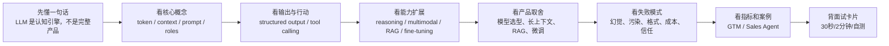
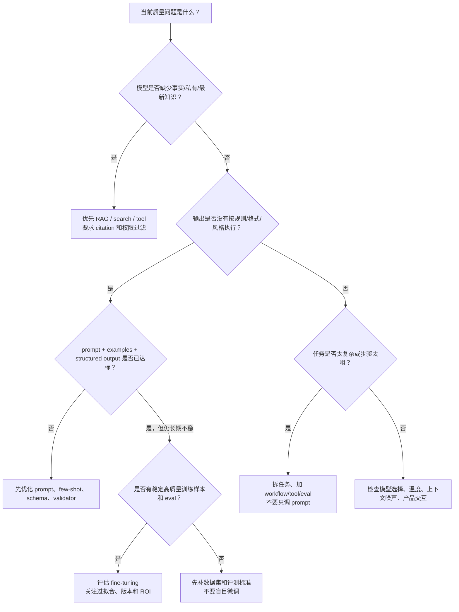
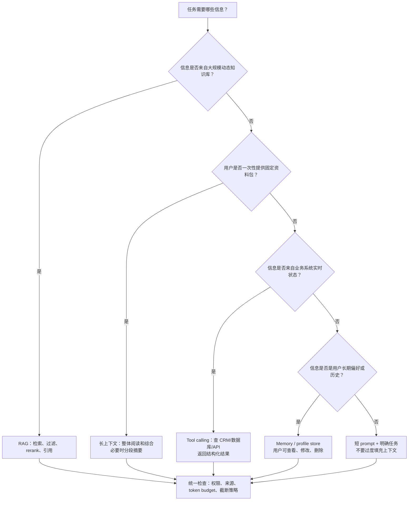

# 01-LLM 基础

## 0. 先读这一页

这份文档写给强技术型 Agent 产品经理 / AI Native PM / Agent Builder PM。你不需要成为训练大模型的算法工程师，但要能把 LLM 的能力边界翻译成产品范围、技术取舍、上线指标和面试表达。

一句话：

> LLM 是 Agent 产品的认知引擎，但 PM 真正要掌握的是它的上下文边界、输入输出控制、成本结构、失败模式和评估方法。

### 0.1 三分钟速读

如果你只用 3 分钟预习这篇，先记住下面 8 句话：

| 你要记住的点 | 面试里怎么说 |
|---|---|
| LLM 是能力底座，不是完整 Agent | Agent = LLM + 上下文 + 工具 + 状态 + 权限 + 工作流 + eval |
| Token 是成本和上下文的基本单位 | system prompt、历史、RAG、工具结果、输出都会消耗 token |
| 上下文窗口是模型一次能看的工作台 | 窗口越大不一定越好，关键信息质量比长度更重要 |
| Prompt 是产品配置 | 它定义任务、边界和输出，但不能替代权限、校验和审批 |
| Structured Output 解决格式，不解决事实 | JSON 合法不代表内容真实，事实要靠证据和验证 |
| Tool Calling 让模型请求外部能力 | 模型生成调用意图，应用层执行、鉴权、审计和兜底 |
| RAG、长上下文、微调解决的问题不同 | RAG 管知识，长上下文管资料包，微调管稳定行为和风格 |
| Eval 是上线门槛 | 不能只看 demo，要看准确率、幻觉率、采纳率、成本和端到端成功率 |

一句面试总括：

> 我会把 LLM 看成 Agent 的理解、推理和生成引擎。PM 的关键不是追最新模型名，而是判断任务需要什么上下文、是否需要 RAG 或工具、输出是否要结构化、哪些动作要人审、如何控制成本延迟，以及用什么 eval 证明它能上线。

### 0.2 本篇阅读路线



阅读建议：

- 面试前 15 分钟：读 `0. 先读这一页`、`13. 速记总结`、`14. 面试卡片与自测`。
- 做产品方案前：重点读 `3. 核心概念地图`、`6. 常见产品决策与取舍`、`8. 指标与评估方法`。
- 和工程师对齐前：重点读 `4. 工作原理`、`5. 产品经理需要懂到什么程度`、`9. 和工程师沟通关键词`。
- 准备案例题：重点读 `10. GTM / Sales Agent 案例` 和 `11. 高频面试问题与回答`。

### 0.3 PM 决策速查表

| 决策问题 | 快速判断 | 面试关键词 |
|---|---|---|
| 这个需求能不能只靠 LLM？ | 只涉及通用理解、总结、改写、低风险生成时可以先试；涉及事实、权限、动作就不能裸用 | model boundary |
| 需要 RAG 吗？ | 需要私有知识、最新信息、证据引用、权限过滤时需要 | grounding, retrieval, citation |
| 需要长上下文吗？ | 用户一次性给大资料包、需要整体综合时考虑；规模化知识问答不优先只靠长上下文 | context window |
| 需要微调吗？ | 有稳定样本、固定任务、风格/格式长期不稳时考虑；知识更新不优先微调 | fine-tuning, eval |
| 需要 structured output 吗？ | 输出要进 CRM、表格、数据库、自动化流程时需要 | JSON schema |
| 需要 tool calling 吗？ | 要查外部系统、读实时数据、写系统、创建草稿或执行动作时需要 | function calling |
| 用强模型还是小模型？ | 复杂高价值任务用强模型；高频低风险任务用小模型、规则或缓存 | model routing |
| 需要人工确认吗？ | 对外可见、不可逆、涉及钱/权限/合同/客户数据时需要 | HITL, approval |
| 怎么证明能上线？ | 离线 golden set + trace review + 在线产品指标，不只看主观 demo | eval, observability |

### 0.4 学完后你应该能做到

- 用 30 秒解释 LLM 是什么，以及它和 Agent 的关系。
- 说明 token、context window、prompt、message roles 对产品体验和成本的影响。
- 解释 structured output、tool calling、RAG、长上下文、fine-tuning 的边界。
- 给一个 Sales Agent 设计模型选型、上下文策略、输出 schema、证据要求和人工确认点。
- 判断“效果不好”到底是模型问题、上下文问题、检索问题、工具问题、流程问题还是评估问题。
- 回答“为什么不能所有任务都用最强模型 / 为什么不能一上来微调 / 为什么长上下文不能替代 RAG”。

## 1. 这个模块解决什么问题

LLM 基础解决的是一个 Agent PM 的底层判断问题：

> 这个需求到底是模型能直接做，还是需要 RAG、工具、工作流、人工确认、微调或产品降级？

如果你不懂 LLM 基础，你会容易犯四类错误：

1. 把模型当成万能黑盒。
2. 把所有效果问题都归因于 prompt。
3. 不知道什么时候该换模型、加工具、加知识库、加 eval。
4. 无法解释成本、延迟、稳定性和用户体验之间的取舍。

Agent 产品里，LLM 通常负责：

- 理解用户意图。
- 总结和抽取信息。
- 生成自然语言、结构化数据、代码或计划。
- 根据上下文做推理和判断。
- 决定是否调用工具。
- 对工具结果进行解释、整合和下一步决策。

但 LLM 不擅长：

- 保证事实绝对正确。
- 天然知道私有数据或实时数据。
- 稳定执行严格业务流程。
- 对高风险动作承担责任。
- 在没有评测和约束时长期保持一致行为。

所以 Agent PM 要学 LLM，不是为了讲模型论文，而是为了判断：

- 该让模型做什么？
- 不该让模型做什么？
- 该给模型什么上下文？
- 什么时候要接工具？
- 什么时候要人工确认？
- 什么时候要从产品形态上降低风险？

## 2. 为什么 Agent PM 必须懂

LLM 是 Agent 的核心能力来源，也是很多产品问题的源头。

### 2.1 你要定义能力边界

面试官可能会问：

> 你怎么判断这个 Agent 功能能不能做？

一个普通回答是：

> 看模型效果怎么样。

一个 Agent PM 的回答应该是：

> 我会先拆任务：哪些环节是语言理解和生成，哪些环节需要事实检索，哪些环节需要工具执行，哪些环节需要专家判断，哪些环节必须人工确认。LLM 适合做理解、抽取、生成和轻量推理，但对实时事实、高风险动作和严格流程，需要 RAG、tool calling、workflow、eval 和 human-in-the-loop 配合。

### 2.2 你要做模型选型

产品里常见的模型选型不是“最强模型全上”，而是：

- 哪些步骤用强推理模型？
- 哪些步骤用便宜快速模型？
- 哪些步骤可以缓存？
- 哪些步骤可以异步跑？
- 哪些步骤必须低延迟？
- 哪些步骤可以人工复核？

比如 Sales Agent：

- 线索初筛可以用便宜模型批量处理。
- 高价值客户的触达理由可以用更强模型生成。
- 最终发给客户的邮件需要人工确认。
- 公司资料和证据要通过检索或工具获得，而不是靠模型记忆。

### 2.3 你要解释效果不好到底坏在哪里

LLM 效果不好，不一定是模型弱。

可能是：

- 输入不清楚。
- 上下文太少。
- 上下文太多，信号被噪声淹没。
- 数据源不可靠。
- 输出格式没有约束。
- 任务拆分太粗。
- 没有工具或 RAG。
- eval 指标不对。
- 产品交互没有让用户纠错。

PM 要能把“AI 不好用”拆成可定位的问题。

## 3. 核心概念地图

### 3.1 LLM

LLM，Large Language Model，大语言模型。

它基于大量文本、代码、多模态数据训练，擅长根据上下文预测和生成后续内容。现代 LLM 不只是“补全文字”，还表现出指令理解、总结、分类、推理、代码生成、工具选择、多轮对话等能力。

产品视角：

> LLM 是一个概率型认知组件，不是确定性规则引擎。

### 3.2 Token

Token 是模型处理文本的基本单位，可以理解为文本被切成的小片段。

中文里，一个汉字、词的一部分、标点、空格都可能被编码成 token。不同模型的 tokenizer 不完全一样。

产品视角：

- Token 决定输入成本、输出成本和上下文容量。
- Prompt、用户输入、历史对话、工具结果、RAG 文档、模型输出都会消耗 token。
- 长上下文不是免费午餐，越长通常越贵、越慢，也更容易引入噪声。

Sales Agent 例子：

如果你一次塞入 50 家公司的官网、新闻、招聘信息和 CRM 历史，token 成本会快速上升，而且模型可能抓不住重点。更好的做法是先检索、过滤、摘要，再把高价值证据送入模型。

### 3.3 Context Window 上下文窗口

上下文窗口是模型一次请求中能看到的总信息量，包括：

- 系统/开发者指令。
- 用户输入。
- 历史对话。
- RAG 检索内容。
- 工具定义和工具结果。
- 图片、文件等多模态输入。
- 部分模型的推理或中间内容。

产品视角：

- 上下文窗口决定 Agent 能处理多长任务、多大文档、多少历史信息。
- 但“能塞进去”不等于“能用好”。
- 长上下文容易出现信息稀释、重要证据被忽略、成本和延迟上升。

PM 该问工程师：

- 这个任务需要多大上下文？
- 上下文里哪些是强相关信息？
- 是否需要摘要、检索、分段处理或记忆系统？
- 长上下文成本是否影响商业模型？

### 3.4 Prompt

Prompt 是给模型的输入和指令集合。

在现代 API 里，prompt 不只是用户一句话，而是由多种层级组成：

- 系统或开发者指令：产品规则、角色、边界、输出要求。
- 用户输入：用户当前问题或任务。
- 上下文：业务数据、文档、历史记录、工具结果。
- 示例：few-shot examples。
- 输出格式约束：JSON schema、字段要求。

产品视角：

> Prompt 是产品策略的一部分，不是临时文案。

一个好的 Agent prompt 要定义：

- Agent 的目标。
- 可用信息。
- 不确定时怎么处理。
- 何时调用工具。
- 何时要求人工确认。
- 输出格式。
- 安全边界。

### 3.5 Message Roles

常见角色包括：

- system / developer：应用方设定的高优先级规则。
- user：用户请求。
- assistant：模型输出。
- tool：工具调用结果。

产品视角：

PM 不需要记所有 API 细节，但要理解：

- 业务规则应该放在高优先级指令层。
- 用户不能通过普通输入覆盖安全边界。
- 工具结果要和用户输入区分开。
- 多轮对话要管理上下文，不是无限堆历史。

### 3.6 Temperature 与随机性

LLM 输出通常是概率生成。

Temperature 越高，输出越发散；越低，输出越稳定。不同平台还有 top_p、seed、reasoning effort 等参数。

产品视角：

- 创意生成可以更发散。
- 抽取、分类、评分、结构化输出要更稳定。
- 高风险业务不要只靠“低 temperature”保证正确。
- 一致性最终要靠 eval、结构化输出、规则校验和人工确认。

### 3.7 Structured Output 结构化输出

结构化输出是让模型按指定 schema 输出 JSON 或其他结构化结果。

产品价值：

- 方便前端展示。
- 方便进入数据库、CRM、工作流。
- 降低字段缺失、格式不合法、枚举乱填的风险。
- 方便后续评测和自动化。

Sales Agent 例子：

线索研究 Agent 不应该只输出一段散文，而应该输出：

```json
{
  "company": "Example Inc.",
  "fit_score": 82,
  "decision_maker": "VP Sales",
  "buying_signals": [
    {
      "signal": "recent hiring for outbound sales team",
      "evidence_url": "https://example.com/jobs",
      "confidence": "medium"
    }
  ],
  "outreach_reason": "..."
}
```

PM 要点：

- 结构化输出让 Agent 从“会说话”变成“能进入业务系统”。
- schema 设计本身就是产品设计。

### 3.8 Reasoning Model 推理模型

推理模型更适合复杂任务、多步规划、逻辑判断、代码和数学等场景，但通常更慢、更贵。

产品视角：

- 不要所有步骤都用推理模型。
- 需要拆分任务，把复杂判断交给强模型，把简单分类/改写交给快模型。
- 推理模型也会错，需要 eval 和证据约束。

Sales Agent 例子：

- 从网页抽取公司行业：小模型足够。
- 判断一个客户是否有近期购买意图：可能需要更强模型结合多证据推理。
- 生成最终个性化触达策略：可用强模型，但要人工确认。

### 3.9 Multimodal 多模态

多模态模型可以处理文本、图片、音频、视频、文件等输入或输出。

Agent PM 要理解多模态的产品意义：

- 销售 Agent 可以读官网截图、产品 PDF、会议录音、销售电话转写。
- 电商 Agent 可以看商品图、短视频脚本、评论截图。
- 办公 Agent 可以读表格、幻灯片、文档。

关键取舍：

- 多模态输入增加 token/计算成本。
- 图片和文件解析可能不稳定。
- 高价值场景才值得引入。

### 3.10 Hallucination 幻觉

幻觉是模型输出看似合理但不真实、不可靠或无依据的内容。

幻觉来源包括：

- 模型训练知识过时。
- 上下文缺失。
- 模型倾向生成完整答案。
- prompt 诱导它编造。
- 检索结果错误或不足。
- 输出没有要求证据。

产品视角：

幻觉不是一句“模型会胡说”就结束。PM 要定义：

- 哪些字段必须有证据。
- 哪些结论可以低置信度展示。
- 哪些动作必须人工确认。
- 发现幻觉后怎么反馈和改进。

Sales Agent 例子：

如果 Agent 编造了客户融资新闻或关键人职位，销售拿去触达会直接伤害信任。因此线索研究 Agent 必须把事实、推断和建议分开，并提供证据链接。

### 3.11 Fine-tuning 微调

微调是用特定数据继续训练模型，让模型更适应某类任务、格式、风格或领域。

PM 需要知道：

- 微调通常不是第一选择。
- 如果问题是缺少事实知识，优先 RAG。
- 如果问题是输出格式不稳定，优先结构化输出和 prompt/eval。
- 如果问题是风格、固定任务模式、领域语言或大量标注数据，才考虑微调。

面试表达：

> 我不会一上来就说微调。通常先做 prompt、RAG、工具、工作流和 eval。如果已有稳定数据集，而且问题是模型在某类任务上长期表现不稳定，再评估微调 ROI。

### 3.12 Embedding

Embedding 是把文本、图片等内容转成向量，用于相似度检索、聚类、推荐、去重等。

产品视角：

- RAG 常用 embedding 找相关文档。
- 线索去重、相似客户推荐、话术匹配也可能用 embedding。
- embedding 不是最终答案，它只是召回候选信息的一种方式。

### 3.13 RAG

RAG，Retrieval-Augmented Generation，检索增强生成。

它先从外部知识源检索相关信息，再把检索结果放入 prompt，让 LLM 基于证据回答。

产品价值：

- 接入私有数据。
- 接入最新信息。
- 降低幻觉。
- 支持证据追溯。

但 RAG 不能自动解决所有问题：

- 检索不到，模型仍然可能答错。
- 检索到错误信息，输出也会错。
- chunk、metadata、权限、rerank、eval 都影响效果。

### 3.14 Long Context 长上下文

长上下文让模型一次看到更多信息，但它和 RAG 不是替代关系。

长上下文适合：

- 用户上传一份长文档让模型分析。
- 需要跨文档整体理解。
- 任务规模可控、价值高。

RAG 适合：

- 大规模知识库。
- 高频查询。
- 权限过滤。
- 需要证据链接。
- 成本要可控。

PM 判断：

> 小规模高价值任务可以用长上下文；规模化产品通常要结合 RAG、摘要、缓存和工作流。

### 3.15 Prompt Caching

Prompt caching 是把重复的上下文片段缓存起来，减少重复输入带来的成本和延迟。

适合：

- 固定系统提示词。
- 固定工具定义。
- 长文档反复查询。
- 多轮任务里共享的大量背景信息。

PM 要点：

- 缓存能改善成本和延迟，但会受缓存失效规则影响。
- 动态内容太多会降低缓存收益。
- 工作流设计会影响缓存命中率。

### 3.16 Model Routing 模型路由

模型路由是根据任务类型、成本、延迟、风险，把不同步骤交给不同模型。

常见策略：

- 简单任务用小模型。
- 复杂推理用强模型。
- 高风险输出二次校验。
- 失败时 fallback 到更强模型。
- 批处理任务用便宜模型异步跑。

PM 价值：

> 模型路由是 Agent 产品商业化的关键，因为它决定单位任务成本和用户体验。

## 4. 工作原理

从产品视角看，LLM 一次请求大概经历这些步骤：

1. 应用把系统规则、用户输入、上下文、工具定义等组装成请求。
2. 文本和其他输入被编码成 token。
3. 模型基于上下文生成输出 token。
4. 如果启用工具调用，模型可能生成工具调用参数。
5. 应用执行工具，把结果返回模型或进入后续流程。
6. 模型生成最终答案或结构化结果。
7. 应用校验输出、展示给用户、记录日志和指标。

Agent 产品里，这不是一次性问答，而是循环：

```text
用户目标
  -> LLM 理解任务
  -> 检索上下文 / 调用工具
  -> LLM 整合结果
  -> 输出建议或执行动作
  -> 用户确认或系统评测
  -> 进入下一步
```

PM 要特别注意：

- 模型只看到请求里的上下文，不会天然知道系统外的信息。
- 模型输出不是事实数据库，而是概率生成。
- 工具、RAG、记忆、工作流和评测是把概率能力产品化的关键。

## 5. 产品经理需要懂到什么程度

### 必须会讲

- LLM 是什么，它适合和不适合做什么。
- token、上下文窗口、prompt 的产品意义。
- 幻觉为什么发生，如何降低风险。
- 结构化输出为什么重要。
- RAG、微调、长上下文分别解决什么问题。
- 模型选择如何影响成本、延迟和效果。
- 为什么 Agent 需要 eval。

### 必须能和工程师讨论

- 这个任务是否需要强推理模型。
- 上下文如何构造。
- 输出 schema 如何设计。
- 哪些字段需要证据。
- 哪些动作需要人工确认。
- 成本和延迟预算是多少。
- 指标如何埋点和评测。

### 可以不深挖

- Transformer 的数学细节。
- 训练集构造和预训练过程。
- GPU 分布式训练。
- 推理引擎底层优化。
- embedding 算法细节。

面试时要给人的感觉是：

> 我不训练模型，但我知道如何把模型能力变成可控、可评估、可上线、可商业化的产品能力。

## 6. 常见产品决策与取舍

### 6.1 用强模型还是小模型

强模型适合：

- 高价值任务。
- 多步推理。
- 复杂判断。
- 输出质量要求高。
- 用户愿意等待。

小模型适合：

- 批量处理。
- 分类、摘要、改写。
- 低风险任务。
- 成本敏感场景。

产品决策：

> 不按“模型排名”选模型，而按任务价值、风险、延迟和单位经济模型选模型。

### 6.2 用 prompt 还是 RAG

用 prompt：

- 规则清楚。
- 任务通用。
- 不依赖外部事实。

用 RAG：

- 需要私有知识。
- 需要最新信息。
- 需要证据追溯。
- 知识规模大。

### 6.3 用 RAG 还是微调

RAG 解决“知道什么”。

微调更适合解决“怎么表达、怎么执行某类固定任务模式”。

Sales Agent：

- 公司最新新闻、CRM 记录、客户资料：RAG/工具。
- 固定行业话术风格：可能 prompt + few-shot，后期再考虑微调。

### 6.4 长上下文还是检索

长上下文更简单，但成本高、噪声大。

检索更工程化，但更可控、可扩展、可做权限。

PM 可以这样判断：

- 内部 demo：长上下文快。
- 企业产品：RAG + 权限 + eval 更稳。

### 6.5 自动执行还是人工确认

低风险动作可以自动：

- 生成草稿。
- 分类标签。
- 推荐线索。
- 总结会议。

高风险动作要确认：

- 自动发邮件。
- 改 CRM 关键状态。
- 删除数据。
- 对外承诺价格或合同条款。

### 6.6 模型选型决策树

模型选型不要从“哪个模型最强”开始，而要从任务价值、复杂度、风险和规模开始。

```mermaid
flowchart TD
  A["这个 LLM 步骤要解决什么任务？"] --> B{"是否需要复杂推理/规划/多证据综合？"}
  B -- "是" --> C{"业务价值高或错误成本高？"}
  C -- "是" --> D["优先强推理模型<br/>加证据、eval、人工确认"]
  C -- "否" --> E["先用中等模型验证<br/>必要时拆任务或降级输出"]
  B -- "否" --> F{"是否是高频批量任务？"}
  F -- "是" --> G["小模型/规则/批处理<br/>关注单位成本和吞吐"]
  F -- "否" --> H{"是否强依赖低延迟？"}
  H -- "是" --> I["快模型 + 短上下文 + 缓存<br/>复杂部分异步"]
  H -- "否" --> J["用中等或强模型打质量基线<br/>再优化成本"]
  D --> K["上线前：golden set + trace + 成本预算"]
  G --> K
  I --> K
  J --> K
```



PM 面试表达：

> 我会先用强模型建立质量上限，再根据任务频率、延迟和成本做 model routing。比如 Sales Agent 中，批量公司分类用小模型，关键账户 buying signal 综合用强模型，最终对外触达前加人工确认。

### 6.7 Prompt / RAG / 微调决策树

这三个能力经常被混用。一个简单判断是：prompt 管“怎么做当前任务”，RAG 管“从哪里拿事实”，微调管“长期稳定某种行为模式”。



速记：

| 问题类型 | 优先方案 | 不要误用 |
|---|---|---|
| 不知道最新政策/客户数据 | RAG / tool | 不要靠微调记知识 |
| 输出字段乱、格式不稳 | structured output + schema | 不要只靠“请输出 JSON” |
| 品牌语气不一致 | prompt + examples，后期微调 | 不要用 RAG 解决风格 |
| 多步任务失败 | workflow + tool + trace | 不要把长 prompt 越写越厚 |
| 成本太高 | routing + caching + 压缩 | 不要直接换更弱模型牺牲质量 |

### 6.8 上下文策略决策树

上下文策略决定了模型“看什么”，也决定成本、延迟、幻觉和隐私边界。



PM 该追问：

- 这份上下文有没有权限边界？
- 哪些内容必须原文引用，哪些只需摘要？
- RAG 证据和工具结果是否有来源、时间戳和置信度？
- 如果超出 context window，系统怎么截断、压缩或分步处理？

## 7. 常见失败模式

### 7.1 幻觉

表现：

- 编造事实。
- 编造引用。
- 把推断说成事实。

产品解法：

- 要求证据链接。
- 区分事实、推断、建议。
- 引入 RAG 或工具。
- 对关键字段做校验。
- 设置人工确认。

### 7.2 上下文污染

表现：

- 模型被无关信息带偏。
- 用户输入覆盖业务规则。
- 外部网页中的恶意内容影响输出。

产品解法：

- 分离用户输入、工具结果、系统指令。
- 做 prompt injection 防护。
- 对外部内容降权。
- 高风险工具调用必须确认。

### 7.3 输出格式不稳定

表现：

- 少字段。
- 多废话。
- 枚举乱填。
- JSON 无法解析。

产品解法：

- 结构化输出。
- schema 校验。
- 失败重试。
- 字段级置信度。

### 7.4 成本失控

表现：

- 每次任务塞太多上下文。
- 批量任务全用强模型。
- 多 Agent 反复互相对话。
- 工具结果太长。

产品解法：

- 模型路由。
- prompt caching。
- 摘要和检索。
- 限制迭代次数。
- 异步处理。

### 7.5 用户不信任

表现：

- 输出看起来对，但用户不敢用。
- 用户不知道依据是什么。
- 错一次后再也不用。

产品解法：

- 展示证据。
- 提供置信度。
- 显示可编辑草稿。
- 保留人工确认。
- 记录用户拒绝原因。

## 8. 指标与评估方法

LLM 基础能力不能只看“感觉聪明”。

### 8.1 技术指标

- 准确率。
- 幻觉率。
- 结构化输出成功率。
- 工具调用参数正确率。
- 上下文命中率。
- 延迟。
- token 成本。
- 重试率。
- 拒答率。

### 8.2 产品指标

- 任务完成率。
- 用户采纳率。
- 人工修改率。
- 节省时间。
- 留存。
- 业务转化。
- 用户信任度。

### 8.3 Sales Agent 指标示例

线索研究 Agent 的 LLM 相关指标：

- 每 20 条线索生成成本。
- 每条线索平均延迟。
- 关键字段结构化成功率。
- 公司事实准确率。
- 触达理由采纳率。
- 销售人工修改率。
- 有证据支持的推荐比例。

MVP 成功标准可以是：

- 线索研究时间减少 50%。
- 销售采纳率达到 30%-40%。
- 关键证据准确率达到 85% 以上。
- 所有高置信推荐都有可追溯来源。

## 9. 和工程师沟通关键词

你需要熟悉这些词：

- model capability：模型能力。
- context window：上下文窗口。
- token budget：token 预算。
- prompt template：提示词模板。
- system / developer instruction：高优先级指令。
- structured output / JSON schema：结构化输出。
- tool calling / function calling：工具调用。
- RAG：检索增强生成。
- embedding：向量表示。
- fine-tuning：微调。
- inference latency：推理延迟。
- model routing：模型路由。
- prompt caching：提示词缓存。
- hallucination rate：幻觉率。
- eval dataset：评测数据集。
- LLM-as-judge：用模型做评审。
- fallback：降级。
- guardrail：护栏。
- human-in-the-loop：人机协同。

沟通时避免说：

- “让 AI 更准一点。”
- “模型应该懂这个吧。”
- “全自动就行。”
- “换最强模型应该可以。”

更好的表达：

- “这个字段是否需要证据约束？”
- “这一步是生成问题、检索问题、工具问题，还是流程问题？”
- “我们是否需要结构化输出和 schema 校验？”
- “这一步的失败边界是什么？”
- “能否用小模型批量初筛，强模型只处理高价值线索？”
- “这个版本的 eval 集覆盖哪些失败 case？”

## 10. GTM / Sales Agent 案例

假设你要做一个销售线索研究 Agent。

目标：

> 帮销售团队自动研究目标客户，输出公司背景、关键人、近期购买信号、痛点、触达理由和证据来源。

### 10.1 LLM 在其中负责什么

LLM 负责：

- 理解 ICP 条件。
- 从网页和 CRM 文本中抽取关键信息。
- 总结公司业务和痛点。
- 判断购买信号是否强。
- 生成个性化触达理由。
- 把结果整理成结构化输出。

LLM 不应该单独负责：

- 编造公司事实。
- 判断最终是否成交。
- 自动发送对外邮件。
- 覆盖销售负责人的策略。

### 10.2 需要哪些配套能力

- RAG / 搜索工具：拿最新资料和证据。
- Tool calling：查官网、招聘、新闻、CRM。
- Structured output：输出可进入 CRM 的字段。
- Eval：评估事实准确率、线索采纳率、触达理由质量。
- Human-in-the-loop：销售确认是否值得跟进。
- Model routing：批量初筛便宜，重点线索精修。
- Safety：客户隐私、对外发送确认、证据追溯。

### 10.3 MVP 设计

4 周 MVP 不做：

- 自动发邮件。
- 深度 CRM 集成。
- 全行业覆盖。
- 全网实时爬取。
- 完全自动判断。

只做：

- 输入 ICP 和目标行业。
- Agent 输出 20 个高匹配公司。
- 每家公司包含关键人、购买信号、触达理由、证据链接。
- 销售人工确认采纳或拒绝。

核心指标：

- 节省线索研究时间。
- 线索采纳率。
- 证据准确率。

LLM 基础在这里的作用：

- 决定上下文怎么喂。
- 决定输出 schema。
- 决定模型路由。
- 决定哪些地方需要证据和人工确认。
- 决定如何评测幻觉和采纳率。

## 11. 高频面试问题与回答

### Q1：LLM 和传统 NLP 模型有什么区别？

推荐回答：

> 传统 NLP 往往针对单一任务训练，比如分类、命名实体识别、摘要。LLM 是更通用的生成式模型，能通过上下文和指令完成多种任务，包括理解、生成、推理、代码和工具调用。对 Agent 产品来说，LLM 的价值是把自然语言理解、计划和生成能力统一起来，但它是概率模型，所以需要 RAG、工具、结构化输出、eval 和人工确认来产品化。

加分点：

- 强调通用能力和不确定性并存。
- 讲到产品化约束。

### Q2：什么是 token？为什么 PM 要关心？

推荐回答：

> Token 是模型处理输入输出的基本单位。PM 要关心 token，因为它直接影响上下文容量、成本和延迟。Agent 产品里，系统提示词、历史对话、工具结果、RAG 文档和模型输出都会占 token。一个设计不好的 Agent 可能不是模型不行，而是上下文太长、噪声太多、成本不可控。

### Q3：上下文窗口越大越好吗？

推荐回答：

> 不一定。大上下文让模型能看到更多信息，适合长文档和复杂任务，但也会带来成本、延迟和噪声问题。产品上要判断哪些信息值得进入上下文，哪些应该通过 RAG 检索，哪些应该摘要，哪些应该存在 memory 或业务数据库里。对企业 Agent，我更倾向用长上下文解决高价值单次任务，用 RAG 和工作流解决规模化场景。

### Q4：如何降低幻觉？

推荐回答：

> 我会先区分幻觉发生在哪类输出：事实、推断、建议还是格式。事实类输出要用 RAG 或工具获取证据，要求引用来源；推断类输出要给置信度和理由；高风险建议要人工确认；结构化字段要 schema 校验；最后用 eval 跟踪幻觉率。不能只靠 prompt 说“不要编造”。

### Q5：RAG 和微调怎么选？

推荐回答：

> 如果问题是模型缺少私有或最新知识，优先 RAG；如果问题是固定任务上的风格、格式或模式长期不稳定，并且有足够高质量数据，才考虑微调。Agent PM 不应该一上来就微调，因为 prompt、RAG、工具、workflow 和 eval 往往更快、更可控。

### Q6：为什么结构化输出对 Agent 很重要？

推荐回答：

> 因为 Agent 产品通常不只是聊天，而是要进入业务流程。结构化输出可以让模型结果进入 CRM、任务系统、数据库和前端组件，也方便校验、评测和自动化。比如销售线索 Agent 输出公司、评分、证据、关键人和触达理由，如果只是自然语言段落，就很难规模化。

### Q7：你怎么做模型选型？

推荐回答：

> 我会按任务价值、复杂度、风险、延迟和成本来选。简单抽取、分类、摘要可以用小模型；复杂推理和高价值输出用强模型；关键动作加人工确认；批量任务考虑异步和缓存；线上要通过 eval 和 A/B 测试验证，而不是只看主观效果。

### Q8：LLM 什么时候不适合直接用？

推荐回答：

> 当任务需要严格确定性、强合规、高风险执行、实时事实、复杂权限或可审计流程时，LLM 不适合裸用。应该把它放进受控系统里，用规则、工具、RAG、权限、审计、人工确认和回滚机制来约束。

### Q9：prompt engineering 在产品里是什么位置？

推荐回答：

> Prompt engineering 是 Agent 产品设计的一部分，但不是全部。它定义目标、上下文、边界和输出方式。真正产品化还需要结构化输出、工具、RAG、workflow、eval、日志和反馈闭环。只调 prompt 的 Agent 通常很难稳定上线。

### Q10：如果用户说 AI 输出没用，你怎么排查？

推荐回答：

> 我会先把问题拆开：输入是否清楚、上下文是否足够、检索证据是否正确、模型是否选错、输出格式是否适合工作流、指标是否定义正确、用户是否信任。比如 Sales Agent 如果事实准确但采纳率低，问题可能不是 LLM 基础能力，而是 ICP 或购买意图信号没建好。

## 12. 面试中怎么说

### 12.1 自我定位表达

> 我不会把 LLM 当成万能黑盒。我更关注它在产品系统中的位置：哪些任务交给模型，哪些交给检索和工具，哪些用工作流约束，哪些必须人工确认，最后用任务完成率、采纳率、准确率、成本和延迟来判断是否成立。

### 12.2 讲技术理解

> LLM 的优势是理解、生成、总结和一定程度的推理；短板是事实可靠性、确定性和可控性。所以 Agent 产品要把 LLM 放进一个有上下文、有工具、有评测、有安全边界的系统里，而不是只做一个聊天框。

### 12.3 讲 MVP

> 我做 Agent MVP 时不会一开始追求全自动。我会先让 LLM 处理低风险、高耗时、可人工复核的环节，比如线索研究、信息抽取和触达理由生成；然后用采纳率、节省时间和证据准确率验证价值，再逐步提高自动化程度。

### 12.4 讲模型选型

> 模型选型不是越强越好，而是任务分层。简单批量任务用快模型，复杂判断用强模型，高风险输出加人工确认，重复上下文做缓存，最终看单位任务成本和用户体验是否可接受。

## 13. 速记总结

- LLM 是 Agent 的认知引擎，但不是事实数据库和确定性执行器。
- Token 决定成本、延迟和上下文容量。
- 上下文窗口越大不一定越好，关键信息质量比长度更重要。
- Prompt 是产品策略，不是临时文案。
- 结构化输出让 Agent 进入业务系统。
- 幻觉要靠证据、工具、RAG、eval 和人工确认治理。
- RAG 解决知识问题，微调解决模式和风格问题，不能混用概念。
- 推理模型适合复杂判断，但更贵更慢。
- 多模态是能力扩展，但要看场景 ROI。
- 模型路由、缓存和降级决定 Agent 产品能否规模化。
- Agent PM 要会把“模型效果不好”拆成上下文、数据、工具、流程、评测和产品交互问题。

## 14. 面试卡片与自测

### 14.1 面试官想考什么

面试官问 LLM 基础，通常不是想听你背模型论文，而是在判断 6 件事：

| 面试官想看 | 你要证明 |
|---|---|
| 是否知道 LLM 的边界 | 能说清它擅长理解/生成/推理，不擅长事实保证和确定性执行 |
| 是否懂 Agent 架构 | 能把 LLM、RAG、tool calling、workflow、eval 放到一张图里 |
| 是否能做产品取舍 | 能解释何时用强模型、小模型、RAG、长上下文、微调、人审 |
| 是否有风险意识 | 能讲幻觉、prompt injection、隐私、成本、过度自主 |
| 是否能定义指标 | 能从输出质量、链路质量、业务指标三层评估 |
| 是否能落到案例 | 能用 Sales / GTM Agent 讲清证据、CRM、触达、审批和采纳率 |

最容易拉开差距的点：

- 不只说“LLM 会生成文本”，而是说“LLM 在 Agent 里负责理解、推理、生成和工具选择”。
- 不只说“加 RAG 降低幻觉”，而是说“RAG 需要 chunk、metadata、权限、rerank、citation 和 eval”。
- 不只说“用更强模型”，而是说“先达质量上限，再通过 routing、caching、异步和小模型优化单位经济模型”。

### 14.2 30 秒回答模板

面试题：你怎么理解 LLM 基础，以及它对 Agent PM 为什么重要？

模板：

> LLM 是 Agent 的核心认知引擎，负责理解用户目标、处理上下文、生成文本或结构化结果，并在需要时选择工具。但它不是完整产品，因为它会受 token、context window、prompt、训练知识、幻觉和成本延迟限制。Agent PM 要懂 LLM 基础，是为了判断什么时候只用模型，什么时候加 RAG、tool calling、workflow、human-in-the-loop 和 eval。我的关注点是把模型能力变成可控、可评估、可上线的产品能力。

### 14.3 2 分钟回答模板

面试题：如果让你设计一个基于 LLM 的 Sales Agent，你会如何从基础能力出发做技术和产品取舍？

模板：

> 我会先把任务拆成几类。第一类是语言理解和生成，比如理解 ICP、总结公司信息、生成 outreach reason，这部分由 LLM 做。第二类是事实和证据，比如公司新闻、招聘、CRM 历史和内部 playbook，这部分不能靠模型记忆，要用 RAG、search 或 CRM tool。第三类是结构化业务输出，比如公司名、关键人、buying signal、证据链接和 fit score，要用 structured output 和 schema 校验。第四类是动作，比如写 CRM、创建任务、发送邮件，这部分要用 tool calling，但写入和对外发送必须有人审和审计。  
>  
> 模型选型上，我会用强模型建立高价值账户研究的质量上限，但批量初筛、去重、简单分类可以用小模型或规则。上下文策略上，最新和私有知识用 RAG，固定资料包可以用长上下文，长期偏好放 memory 或业务数据库。上线前我会做 eval：事实准确率、引用支持率、结构化输出成功率、工具调用正确率、销售采纳率、每条合格线索成本和延迟。这样设计的核心是：LLM 提供认知能力，产品系统负责证据、权限、工作流和信任。

### 14.4 容易踩坑

| 坑 | 为什么错 | 更好的说法 |
|---|---|---|
| “换最强模型就好了” | 很多问题来自上下文、检索、工具、流程和指标 | 先定位失败环节，再决定模型升级还是系统改造 |
| “长上下文可以替代 RAG” | 长上下文不负责知识更新、权限过滤、引用治理和成本控制 | 长上下文适合资料包综合，RAG 适合规模化知识和证据 |
| “微调能让模型记住公司知识” | 知识会过期，也难删除和引用 | 最新/私有知识优先 RAG 或 tool |
| “结构化输出就可靠了” | schema 合法不代表事实正确 | 格式靠 schema，事实靠 grounding 和 validation |
| “prompt 可以做安全边界” | 用户输入和外部内容可能攻击 prompt，权限必须在系统层 | prompt 是指导，权限、审批和审计是控制 |
| “幻觉是模型 bug” | 幻觉是概率生成系统的产品风险 | 用证据、拒答、校验、人审、eval 降低影响 |
| “Agent 越自动越好” | 自动化提高效率，也放大错误和责任 | 按风险分层，从 draft/approval 逐步到自动执行 |

### 14.5 读完自测题

闭卷自测，能答出 80% 就基本达到面试可用：

1. 用一句话解释 LLM 是什么，以及它和 Agent 的关系。
2. Token 为什么会影响成本、延迟和产品体验？
3. 上下文窗口为什么不是越大越好？
4. System / developer / user message 的产品意义是什么？
5. Prompt engineering 在产品化里有什么边界？
6. Structured output 和 tool calling 有什么区别？
7. 什么场景应该用 RAG，而不是只靠模型已有知识？
8. 什么场景可以用长上下文，而不是复杂 RAG？
9. 什么时候考虑 fine-tuning？什么时候不应该微调？
10. Reasoning model 适合哪些 Agent 任务？为什么不能全量使用？
11. 多模态模型对 Sales / Marketing Agent 有什么产品价值？
12. 幻觉有哪些类型？如何降低事实类幻觉？
13. 如果 Sales Agent 生成了错误 buying signal，你会怎么定位原因？
14. 如何设计一个线索研究 Agent 的输出 schema？
15. 哪些动作必须 human-in-the-loop？
16. 如何做模型路由来平衡质量、成本和延迟？
17. LLM 产品 eval 应该分哪几层？
18. 如何向工程师描述“AI 输出没用”的排查路径？

### 14.6 掌握标准

| 掌握等级 | 你能做到什么 | 判断标准 |
|---|---|---|
| 入门 | 能解释 LLM、token、context、prompt、RAG、微调 | 术语解释基本准确 |
| 面试可用 | 能把概念连接到 Agent 产品决策 | 能讲取舍、失败模式、指标和案例 |
| 强技术 PM | 能和工程师共同拆解系统边界 | 能区分模型问题、检索问题、工具问题、流程问题 |
| 可上线负责人 | 能定义 MVP、eval、风控和成本模型 | 能说清上线门槛、回归集、监控和人工接管 |

读完本篇，最低掌握标准是：

- 能画出 LLM 在 Agent 架构里的位置。
- 能用决策树判断 prompt、RAG、长上下文、微调、tool calling 的适用边界。
- 能用 Sales Agent 案例讲清模型、上下文、工具、结构化输出、人工确认和 eval。
- 能把“模型效果不好”拆成可行动的产品和工程问题。

## 15. 参考来源

- OpenAI Prompt Engineering Guide: https://platform.openai.com/docs/guides/prompt-engineering
- OpenAI Prompting Guide: https://platform.openai.com/docs/guides/prompting
- OpenAI Structured Outputs Guide: https://platform.openai.com/docs/guides/structured-outputs
- OpenAI Responses API Reference: https://platform.openai.com/docs/api-reference/responses
- OpenAI Tools Guide: https://platform.openai.com/docs/guides/tools
- OpenAI Model Optimization Guide: https://platform.openai.com/docs/guides/model-optimization
- OpenAI Evals Guide: https://platform.openai.com/docs/guides/evals
- OpenAI Pricing: https://platform.openai.com/docs/pricing
- Anthropic Prompt Caching: https://docs.claude.com/en/docs/build-with-claude/prompt-caching
- Anthropic Context Windows: https://platform.claude.com/docs/en/build-with-claude/context-windows
- Claude Code Agent Loop: https://code.claude.com/docs/en/agent-sdk/agent-loop
