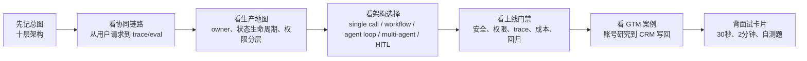
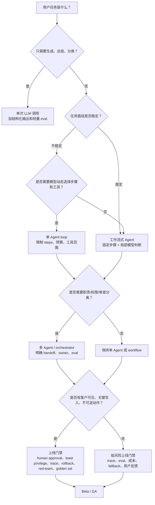
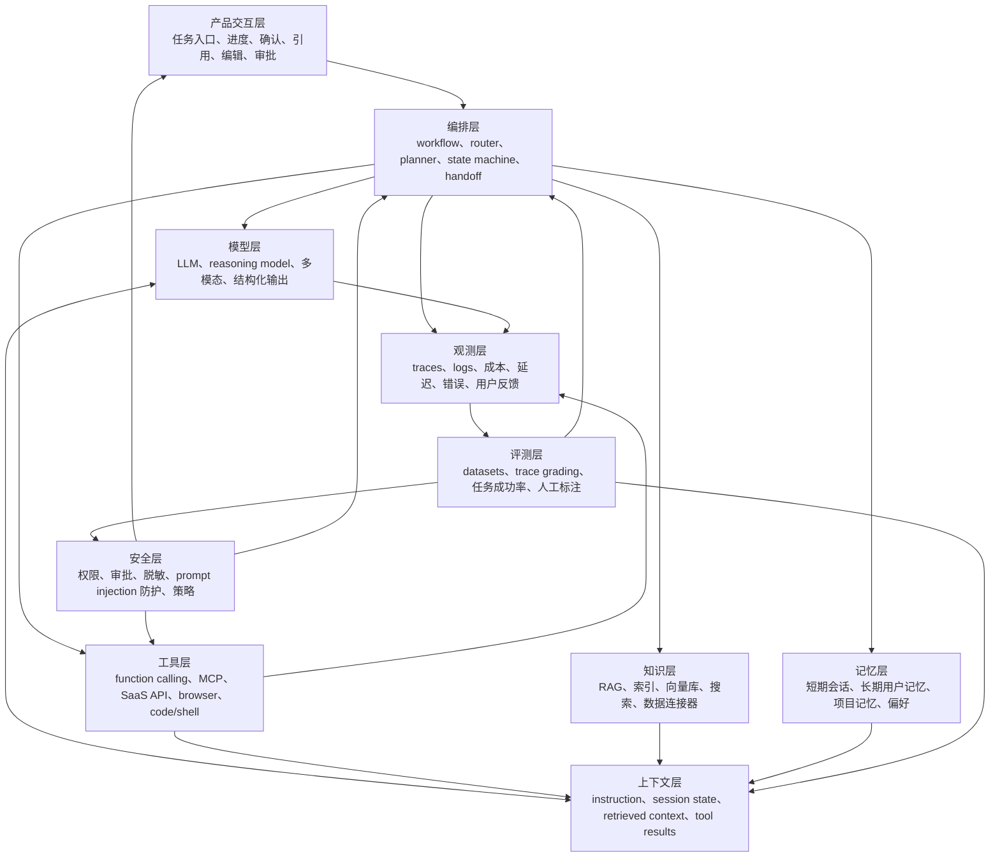
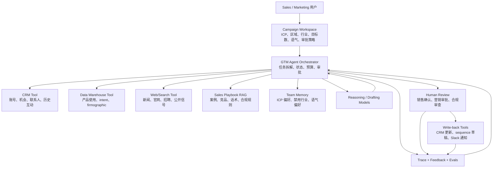

# Agent 架构总览

资料校验时间：2026-06-04

目标读者：强技术型 Agent 产品经理、AI Native PM、Agent Builder PM。本文目标不是把你训练成 Agent 基础设施工程师，而是让你能在面试、方案评审和 MVP 定义中讲清：一个可上线的 Agent 产品由哪些模块组成、模块之间如何协同、什么时候该用简单工作流、什么时候才需要真正的 Agent 或多 Agent。

---

## 0. 先读这一页

### 0.1 三分钟速读

如果你只用 3 分钟预习这篇，记住下面 8 句话：

| 你要记住的点 | 面试里怎么说 |
|---|---|
| Agent 不是一个模型 | Agent 是模型、上下文、工具、知识、记忆、编排、安全、观测、评测和产品交互组成的任务系统 |
| 架构的核心问题是自主性和可控性 | 自主性越高，越能处理开放任务，但成本、延迟、安全、评测和信任难度越高 |
| workflow 是生产默认起点 | 稳定、可预测、可审计的业务流程优先用 workflow，不要一开始就上复杂多 Agent |
| 单 Agent 适合开放式任务 | 研究、排障、复杂分析这类路径不固定的任务，才更需要 agent loop |
| 多 Agent 的价值是职责分离 | 多 Agent 应服务于权限、工具、专业能力、审查和评测边界，不是角色扮演 |
| RAG 和 memory 不是一回事 | RAG 取证据，memory 保连续性和偏好，两者都必须受权限和 freshness 约束 |
| 工具层决定 Agent 是否能行动 | 读、草稿、写入、外发、删除等工具要按风险分层，并配 human-in-the-loop |
| 上线 Agent 必须有 trace 和 eval | 没有观测和回归评测，就无法定位错误，也无法证明版本变好 |

一句面试总括：

> Agent 架构的本质是把 LLM 放进一个可控任务系统：模型负责推理，context 决定它看见什么，tools 让它行动，knowledge 和 memory 提供证据与连续性，orchestration 管状态和流程，safety 限制风险，observability 和 eval 把线上反馈变成改进闭环。PM 的关键判断是：这个任务需要多少自主性、哪些动作能自动、哪些必须审批、如何证明它安全有效。

### 0.2 本篇阅读路线

阅读建议：

- 第一次读：先看 0、3、6、11、14，形成可讲述的架构地图。
- 面试前复习：重点背 0.3、0.4、10、12、14。
- 做产品方案：重点看 3.3、3.4、4.3、6、8、11.5。

### 0.3 PM 决策速查表

| 决策问题 | 推荐判断 |
|---|---|
| 要不要做成 Agent？ | 如果任务只需要总结、分类、改写，普通 LLM 调用就够；如果需要多步决策、工具、状态和反馈，才考虑 Agent |
| 用 workflow 还是 agent loop？ | 路径稳定、风险高、要审计，用 workflow；路径开放、需要动态探索，用 agent loop |
| 什么时候用多 Agent？ | 只有当职责、工具权限、专业能力或审查边界需要拆开时才用 |
| RAG 还是数据库/API？ | 非结构化证据用 RAG；精确字段和业务对象优先结构化查询/API |
| 记忆要不要做？ | 只有当跨会话偏好、项目连续性或团队规则能明显提升任务成功率时才做，并要求可见可删 |
| 哪些工具能自动执行？ | 只读和低风险可撤销动作可自动；客户可见、关键写入、删除、付款、权限变更必须审批 |
| 上线前最重要的门禁是什么？ | 价值、质量、安全、权限、trace、成本、延迟、fallback、回归评测 |
| 怎么证明 Agent 有用？ | 不看聊天量，看任务成功率、采纳率、编辑率、时间节省、证据准确率和 cost per successful task |

### 0.4 架构选择 / 上线门禁决策图

这张图的面试用法：

> 我会先判断任务是否真的需要 Agent，再判断流程是否稳定。稳定任务优先 workflow，开放任务才用 agent loop。多 Agent 只在职责和权限需要拆分时引入。任何涉及客户可见或系统写入的动作，都必须过 human approval、权限、trace、red-team 和回归 eval 门禁。

### 0.5 学完后你应该能做到

- 用 30 秒解释 Agent 产品的十层架构。
- 画出一个从用户请求到工具调用、审批、trace、eval 的运行链路。
- 判断一个需求应该用单次 LLM、workflow、单 Agent、多 Agent 还是人机协同。
- 给 GTM / Sales / Marketing Agent 设计模型、上下文、工具、知识、记忆、编排、评测和安全方案。
- 说明所有权地图：PM、后端、AI platform、data、security、analytics 各自负责什么。
- 说明状态生命周期：run state、workflow state、conversation state、task state、memory、audit、eval case。
- 设计工具权限分层和上线门禁。
- 回答“Agent 如何上线、如何观测、如何评测、如何防止误操作”。

---

## 1. What this module solves

Agent 架构解决的是：如何把一个大模型从“会回答问题的模型调用”变成“能在真实业务环境里理解目标、使用工具、读取知识、记住状态、接受人类监督、可评测、可观测、可持续改进的产品系统”。

一个典型 Agent 产品不是单一 LLM，而是一套围绕 LLM 的系统：

| 层 | 解决的问题 | PM 需要关心的产品含义 |
|---|---|---|
| 模型层 | 推理、生成、规划、结构化输出、多模态能力 | 能力上限、成本、延迟、稳定性、供应商风险 |
| 上下文层 | 把当前任务所需信息组织进模型可用输入 | 准确率、可解释性、token 成本、长任务连续性 |
| 工具层 | 让 Agent 调 API、查网页、写 CRM、发邮件、跑脚本 | Agent 是否真正能完成任务，以及误操作风险 |
| 知识层 | 连接企业数据、文档、网页、CRM、产品库、历史记录 | 回答是否有依据，是否能使用业务私有数据 |
| 记忆层 | 保留用户偏好、会话状态、长期项目上下文 | 个性化、连续任务、但也带来隐私和过期风险 |
| 编排层 | 决定步骤、路由、状态机、重试、人类审批、多 Agent 协作 | 产品是否可控、可恢复、可规模化 |
| 评测层 | 用数据集、trace、人工标注和线上反馈衡量质量 | 版本迭代是否可证明变好 |
| 安全层 | 防 prompt injection、越权工具调用、数据泄露、幻觉输出 | 上线边界、权限策略、合规、品牌风险 |
| 观测层 | 记录模型调用、工具调用、路径、成本、延迟、错误 | 能不能定位生产问题和运营飞轮 |
| 产品交互层 | 任务入口、确认、进度、引用、改写、审批、兜底 | 用户是否信任、是否愿意把工作交给 Agent |

一句话：Agent 架构的本质是“模型 + 上下文 + 工具 + 状态 + 控制面 + 反馈闭环”。

---

## 2. Why an Agent PM must understand it

Agent PM 必须理解架构，不是为了亲手实现每个组件，而是为了做四类关键判断。

第一，判断产品边界。用户说“做一个销售 Agent”，PM 需要拆成：它是只生成 outreach 文案，还是能查账号、找联系人、读 CRM、写入 Salesforce、安排 follow-up？每增加一个动作层级，架构复杂度、安全风险和评测难度都会上升。

第二，判断 MVP 应该多简单。Anthropic 在 Agent 实践中强调：优先选择最简单可行方案，只有当任务需要灵活决策和多步工具使用时才提高 agentic 复杂度。PM 的成熟度体现在能说“不需要多 Agent，先用工作流 + RAG + 人类确认”。

第三，判断可上线性。Demo 能跑不代表产品可上线。可上线 Agent 要能处理权限、失败、重试、审计、成本峰值、用户撤销、人类审批、线上反馈和版本回归。

第四，判断组织协作。PM 要能和工程、数据、安全、法务、运营、GTM 团队使用同一套词：tool schema、RAG、checkpoint、trace、handoff、guardrail、eval set、human-in-the-loop、least privilege、fallback。

---

## 3. Core concept map

### 3.1 Agent 产品的十层架构地图

### 3.2 从用户请求到产出的运行链路

一个 Agent run 通常经历这些步骤：

1. 用户在产品交互层提出目标，例如“帮我找 20 个适合本季度 ABM campaign 的制造业账号，并生成 outreach 理由”。
2. 编排层识别任务类型、权限、风险级别和完成标准。
3. 上下文层组装系统指令、用户目标、当前 workspace、历史状态、可用工具说明、知识检索结果。
4. 模型层判断下一步：直接回答、调用工具、请求用户补充、交给子 Agent、或暂停等待审批。
5. 工具层执行外部动作，例如查 CRM、搜索网页、调用 enrichment API、写入表格。
6. 知识层提供依据，例如公司简介、新闻、财报、产品使用记录、行业标签。
7. 记忆层提供长期偏好，例如“该销售团队只面向北美中端制造业，避免金融行业”。
8. 安全层检查权限、敏感数据、风险动作和输出合规。
9. 观测层记录 trace：每一步模型决策、检索、工具调用、错误、成本、延迟。
10. 评测层把线上结果和人工反馈沉淀为 eval cases，推动 prompt、工具、知识和编排迭代。

PM 面试里可以把它总结成：Agent 不是“模型一次回答”，而是“围绕任务目标运行的一条可追踪状态机”。

---

### 3.3 生产所有权地图

Agent 架构不是一张纯技术图，也是一张协作地图。强技术型 PM 要能说明每一层通常由谁负责、自己要和谁对齐。

| 架构层 | 常见 owner | PM 需要对齐的决策 |
|---|---|---|
| 产品交互层 | Product + Frontend | 任务入口、进度展示、证据展示、编辑、审批、失败恢复 |
| 应用后端 | Product Engineering / Backend | 业务对象、任务状态、API 聚合、写回规则、幂等性 |
| 编排层 | Backend / Agent Platform | workflow vs agent loop、checkpoint、interrupt、重试、handoff |
| 模型层 | AI Platform / Vendor Owner | 模型选型、版本、成本、延迟、fallback、供应商风险 |
| 工具层 | Integration / Backend | tool schema、权限、错误合同、审计、回滚 |
| 知识层 | Data / Search / ML Platform | 数据源、索引、ACL、freshness、引用、tenant isolation |
| 记忆层 | Backend / Data / Privacy | 记忆范围、TTL、可见可删、来源、权限继承 |
| 安全层 | Security / IAM / Legal | 最小权限、DLP、prompt injection 防护、合规策略 |
| 评测与观测 | Platform + Product Analytics | trace 覆盖、golden set、线上指标、回归、告警 |
| 管理后台 | Product + Enterprise Admin | 工具开关、角色权限、数据源配置、审计导出 |

面试表达：

> 我会把 Agent 架构拆成 product app、agent runtime、tools、knowledge、IAM、安全和 observability 几个责任面。PM 的价值不是替工程师实现，而是定义每个责任面的产品边界、风险等级、验收指标和上线门禁。

### 3.4 状态生命周期

生产 Agent 的状态比普通聊天复杂。PM 至少要区分：

| State 类型 | 例子 | 产品要求 |
|---|---|---|
| Run state | 当前 step、上次模型输出、工具返回 | traceable、replayable、便于 debug |
| Workflow state | 待审批、已批准、失败、重试中 | durable、可恢复、可审计 |
| Conversation state | 本轮用户目标和上下文 | session-scoped，不能自动当长期记忆 |
| Task state | 20 个账号中哪些已研究、哪些待确认 | 可展示进度，可部分完成 |
| User memory | 用户偏好、语气、常用模板 | 可见、可编辑、可删除 |
| Team / org memory | ICP、playbook、禁用话术 | 权限隔离、版本化、管理员可控 |
| Audit events | 谁批准外发、谁触发写 CRM | 可导出、可追责、不可随意篡改 |
| Eval cases | 线上失败 trace 转成回归样本 | 可复现、可分类、可用于发布门禁 |

这也是为什么 LangGraph 这类显式状态编排框架、provider-native tracing、应用侧任务状态表、审计日志和 eval 数据集经常要同时存在。它们解决的不是同一个问题。

---

## 4. How it works

### 4.1 模型层：能力上限与成本中心

模型层负责理解、推理、生成、计划、工具选择和结构化输出。OpenAI 的 Responses API 把输入、工具、状态、流式输出、并行工具调用等放在统一响应对象中；Agents SDK 则适合应用自己拥有编排、工具执行、审批和状态的场景。

PM 需要关注的不是模型内部实现，而是模型选择如何影响产品：

| 决策 | 适合选择 | 风险 |
|---|---|---|
| 强推理模型 | 多步规划、复杂决策、需要解释 tradeoff | 成本高、延迟高 |
| 快速低价模型 | 分类、抽取、改写、简单路由 | 复杂任务失败率高 |
| 多模型路由 | 不同任务用不同模型控成本 | 路由评测复杂 |
| 结构化输出 | 后续要写数据库、触发工作流、做 UI 渲染 | schema 变化会影响下游 |
| 多模态模型 | 截图理解、文档图片、销售 deck、网站分析 | 数据处理和引用更难 |

PM 常见误区：以为“换更强模型”能解决所有问题。实际生产中，很多问题来自错误上下文、坏工具设计、知识过期、权限缺失、评测不完整，而不是模型不够强。

### 4.2 上下文层：Agent 的工作台

上下文层决定模型在每一步“看见什么”。它通常包含：

- 指令：系统角色、任务边界、输出格式、禁止行为。
- 用户输入：当前问题、上传文件、选择的对象、UI 状态。
- 会话状态：之前的问题、已完成步骤、未决审批。
- 检索上下文：从知识库、CRM、网页、文件搜索来的证据。
- 工具结果：API 返回、搜索结果、表格行、失败信息。
- 记忆：用户偏好、团队规则、历史项目背景。

PM 要理解的关键是：上下文不是越多越好，而是要做到相关、充分、隔离、经济、可追溯。上下文过多会带来成本、延迟、噪声、过期信息和 prompt injection 风险。

### 4.3 工具层：Agent 从“会说”变成“会做”

工具层让模型访问外部能力。常见工具类型包括：

- Function calling：调用自家后端能力，如查订单、建 lead、更新 CRM。
- 内置工具：网页搜索、文件搜索、代码解释、图像生成、计算机操作等。
- MCP 工具：通过 Model Context Protocol 连接外部数据源、工具和工作流。
- SaaS API：Salesforce、HubSpot、Marketo、Gong、Slack、Notion、Google Drive。
- Browser / computer use：当没有稳定 API 时，用浏览器或桌面 UI 完成操作，通常风险更高。

PM 应该把每个工具当成一个产品能力面，而不是工程细节。工具设计要回答：

- 这个工具是否真的完成用户任务？
- 输入 schema 是否足够窄，避免模型乱填？
- 是否需要用户确认？
- 工具是否有幂等性、重试和撤销？
- 成功和失败是否能被模型理解？
- 是否需要基于用户身份做权限检查？

工具权限可以按风险分层设计：

| 权限层级 | 例子 | 默认策略 |
|---|---|---|
| Read-only | 查询 CRM、读取文档、搜索网页 | 可自动，但要按用户身份和租户过滤 |
| Draft / suggest | 生成邮件草稿、生成 CRM note、推荐 next step | 可自动生成，但不直接对外或写关键字段 |
| Low-risk write | 创建内部 task、保存草稿、写入临时表 | 可在明确上下文内执行，必须 trace |
| High-risk write / send | 更新 opportunity stage、外发邮件、批量建联系人 | 必须 preview + human approval |
| Destructive / sensitive | 删除数据、改权限、付款、合同/价格承诺 | MVP 阶段通常禁止或只允许管理员审批 |

工具可靠性还要考虑：

- Idempotency：重试不会重复发邮件、重复创建任务。
- Dry run：先展示将要写入或发送的内容。
- Error contract：工具失败要返回结构化错误，让模型和 UI 都能理解。
- Conflict handling：CRM 字段已被人改过时不能直接覆盖。
- Compensation：误写后有撤销、修复任务或人工处理路径。
- Budget limit：限制工具调用次数、运行时长和外部 API 成本。

### 4.4 知识层：RAG 和企业数据连接

知识层负责把模型训练数据之外的信息带入任务。对 Agent 产品，知识层不只是“文档问答”，而是支撑行动决策的证据系统。

常见知识来源：

- 静态文档：产品资料、销售 playbook、政策、合同模板。
- 业务系统：CRM、营销自动化、工单、数据仓库。
- 外部网络：官网、新闻、招聘、财报、社媒、行业数据库。
- 用户上传：PDF、表格、会议纪要、邮件线程。
- 运行中产生的数据：Agent 的输出、人工反馈、已验证信号。

产品决策点：

| 决策 | 何时选择 | PM 关注点 |
|---|---|---|
| 关键词搜索 | 精确字段、名称、ID、短文本 | 可解释、便宜，但语义弱 |
| 向量检索 | 语义相似、长文档、自然语言问题 | 召回强，但可能引入不相关证据 |
| 混合检索 | 企业搜索、销售情报、复杂文档 | 通常更稳，但调参和评测更复杂 |
| 知识图谱/结构化查询 | 强实体关系，如账号-联系人-机会 | 准确、可控，但建设成本高 |
| 实时搜索 | 新闻、招聘、近期购买信号 | 新鲜，但噪声、合规和引用要求更高 |

PM 面试表达：RAG 不是“把文档塞给模型”，而是“把可追溯证据按任务需要检索、筛选、压缩并交给模型决策”。

### 4.5 记忆层：连续性与个性化

记忆层分为短期记忆和长期记忆。

短期记忆是当前 run 或当前会话的状态，例如“已经查了 12 个账号，还有 8 个待处理”。长期记忆是跨会话保存的信息，例如用户偏好、团队规则、项目背景、历史已确认事实。

LangGraph 的 persistence / checkpoint 能保存图状态，支持 human-in-the-loop、会话记忆、时间旅行调试和失败恢复。PM 不需要实现 checkpointer，但要知道：没有持久状态的 Agent 很难承担长任务、审批中断和故障恢复。

记忆层的产品风险很高：

- 记住错误偏好会持续污染输出。
- 记住敏感信息会带来隐私风险。
- 不区分用户级、团队级、组织级记忆会导致权限泄露。
- 长期记忆没有过期机制会让 Agent 使用旧策略。

PM 应要求记忆有来源、时间、作用范围、可编辑/可删除入口和评测机制。

### 4.6 编排层：工作流、Agent loop 与多 Agent 的控制面

编排层决定系统如何推进任务。它可以很简单，也可以很复杂。

| 架构类型 | 控制权在哪里 | 适合任务 | PM 评价 |
|---|---|---|---|
| 单次模型调用 | 应用代码 | 摘要、改写、分类、单轮问答 | 最简单，优先考虑 |
| 工作流式 Agent | 预定义流程/状态机 | lead enrichment、审批流、报告生成 | 可控、可测、适合生产 |
| 单 Agent loop | 模型动态决定步骤和工具 | 开放式研究、排障、复杂问答 | 灵活，但成本和不可预测性更高 |
| 多 Agent | 多个专家角色协作或 handoff | 研究+写作+审查、销售+合规+数据分析 | 适合复杂职责分离，但容易过度设计 |
| 人机协同 Agent | 系统在关键点暂停给人 | 高风险动作、专业判断、客户外发内容 | 信任与合规核心能力 |

Anthropic 对 workflows 和 agents 的区分很适合 PM 记忆：workflow 是 LLM 和工具沿预定义代码路径被编排；agent 是 LLM 动态决定自己的流程和工具使用。

### 4.7 评测层：从“感觉不错”到“可证明变好”

Agent 的评测不应只看最终文本。OpenAI 的 agent evals 和 trace grading 强调用 traces、graders、datasets 和 eval runs 改进 agent workflow。对 Agent，PM 至少要要求三类评测：

- 结果评测：最终答案/任务是否正确、有用、符合格式。
- 过程评测：是否选对工具、是否遵守审批、是否引用证据、是否越权。
- 线上评测：用户是否采纳、编辑多少、重跑多少、是否投诉、是否节省时间。

Agent 评测样本应来自：

- 人工设计的 golden tasks。
- 历史真实任务。
- 线上失败 trace。
- 边界和攻击样本。
- 高价值客户场景。

### 4.8 安全层：限制 Agent 的错误行动半径

Agent 安全不是只做内容审核。因为 Agent 能调工具、读数据、写系统，核心风险是“错误行动”和“越权行动”。

参考 OWASP LLM Top 10，PM 至少要理解这些风险：

- Prompt injection：外部网页、文档、邮件中嵌入恶意指令，诱导 Agent 忽略规则。
- Sensitive information disclosure：输出或工具结果泄露敏感信息。
- Excessive agency：Agent 权限过大，可执行超出需要的操作。
- Improper output handling：模型输出被下游系统当成可信代码或指令执行。
- Vector / embedding weaknesses：知识库被污染、检索到恶意内容或错误内容。
- Unbounded consumption：长循环、工具滥用、成本失控。

安全层常见控制：

- 最小权限：工具按用户身份和任务范围授权。
- 高风险动作审批：外发邮件、写 CRM、删除数据、付款、改权限必须确认。
- 工具 allowlist：只暴露完成任务所需工具。
- 输入/输出隔离：把外部内容标记为不可信证据，不允许它覆盖系统指令。
- 引用和证据：关键结论必须给来源。
- 速率和预算限制：限制 tool calls、tokens、循环次数和并行调用。
- 审计日志：记录谁让 Agent 做了什么、用了哪些数据、写入了什么系统。

### 4.9 观测层：生产 Agent 的黑匣子记录仪

观测层要记录一次 Agent run 的完整故事：

- 用户目标、入口、租户、权限范围。
- 模型版本、prompt 版本、上下文摘要。
- 检索 query、命中文档、引用证据。
- 工具调用参数、返回结果、错误、重试。
- handoff、interrupt、审批结果。
- token、成本、延迟、工具耗时。
- 最终输出、用户编辑、采纳、撤销、差评。

没有 trace 的 Agent 很难运营。PM 应把 trace 当作产品迭代资产：每个失败都应该能变成一个新的 eval case 或规则改进。

### 4.10 产品交互层：让用户信任 Agent

Agent UX 的核心不是“聊天框”，而是让用户知道：

- Agent 正在做什么。
- 为什么需要这些权限。
- 当前进行到哪一步。
- 哪些结论有证据。
- 哪些动作需要确认。
- 如何编辑、撤销、重跑、跳过。
- 失败时如何恢复。

对 GTM / Sales / Marketing Agent，产品交互层通常包括：任务配置页、账号列表、证据面板、生成内容编辑器、审批队列、CRM 写回预览、运行历史和质量反馈。

---

## 5. What depth a PM needs

PM 不需要掌握的深度：

- 不需要手写 graph runtime。
- 不需要实现向量索引底层算法。
- 不需要调优模型训练。
- 不需要写所有 tool adapter。
- 不需要实现完整 tracing 后端。

PM 需要掌握的深度：

- 能把用户任务拆成“输入、知识、工具、状态、审批、输出、指标”。
- 能判断单次 LLM、工作流、单 Agent、多 Agent、人机协同的取舍。
- 能定义每个工具的产品边界和权限边界。
- 能设计 MVP 的成功指标和失败样本。
- 能要求 trace、eval、反馈闭环，而不是只看 demo。
- 能和工程讨论 checkpoint、tool schema、RAG、handoff、guardrails、observability。

面试里的好答案通常不是“我会用某框架”，而是“我知道这个任务为什么需要或不需要 Agent，以及上线后如何证明它有效且可控”。

---

## 6. Common product decisions and tradeoffs

### 6.1 单 Agent vs 工作流式 Agent

工作流式 Agent 更适合生产早期。它把路径固定下来，例如“选账号 -> 查数据 -> 评分 -> 生成理由 -> 人类确认 -> 写回 CRM”。优点是可控、可测、失败边界清楚；缺点是不够灵活。

单 Agent 更适合开放式任务，例如“研究这个市场并给我行动建议”。优点是能动态探索；缺点是成本、延迟和不可预测性更高。

PM 判断标准：

- 任务路径是否稳定？稳定就用工作流。
- 是否需要模型自行决定下一步？需要才用 Agent loop。
- 用户是否能接受慢一点但更灵活？不能就收敛流程。
- 是否涉及外部写操作？涉及就加审批和权限限制。

### 6.2 单 Agent vs 多 Agent

多 Agent 的价值是职责分离，不是角色扮演热闹。LlamaIndex 对多 Agent 模式给出几种常见选择：内置 AgentWorkflow 让 agent handoff；orchestrator 把子 Agent 当工具调用；自定义 planner 明确计划和调用顺序。

多 Agent 适合：

- 任务天然有不同专业角色，如 researcher、writer、reviewer、compliance checker。
- 需要不同工具权限，如 sales agent 可读 CRM，compliance agent 只能审查输出。
- 需要把复杂任务拆成可观测子任务。
- 需要多轮校验和交叉审查。

不适合：

- 单个工作流就能完成。
- 只是为了听起来更 AI native。
- 没有清晰 handoff 协议。
- 无法评测每个 agent 的贡献。

### 6.3 RAG vs 直接工具查询

如果问题需要从大量非结构化文档中找证据，用 RAG。若问题是“这个账号 ARR 是多少”“这个联系人 title 是什么”，优先用结构化 API 或数据库查询。很多 Agent 产品失败是因为把结构化数据也塞进向量库，导致可解释性和准确率下降。

### 6.4 长上下文 vs 检索

长上下文适合一次性分析完整材料，例如合同、长报告、完整会议记录。检索适合知识库、多账号、多文档、多轮任务。PM 要关注 context cost、引用粒度、更新频率和错误召回。

### 6.5 自动执行 vs 人类确认

可逆、低风险动作可以自动执行，例如创建草稿、生成表格、打标签。不可逆、高风险、客户可见或合规敏感动作必须确认，例如外发邮件、修改 CRM stage、删除记录、承诺价格、发送合同。

### 6.6 内置工具 vs 自建工具 vs MCP

内置工具适合快速获得通用能力，如 web search、file search。自建工具适合核心业务系统和强权限控制。MCP 适合连接异构工具生态、复用外部 server，但 PM 仍要要求认证、权限、审计、工具 allowlist 和风险分级。

### 6.7 成本优化 vs 质量优化

Agent 成本来自模型 tokens、工具调用、检索、外部 API、重试、人工审核。PM 的成本策略不是单纯换便宜模型，而是：

- 简单步骤用小模型。
- 高价值决策用强模型。
- 减少无效上下文。
- 缓存稳定信息。
- 对工具调用设预算。
- 对低价值任务降低自动化深度。

---

## 7. Common failure modes

| 失败模式 | 用户表现 | 常见根因 | PM 应推动的修复 |
|---|---|---|---|
| 幻觉结论 | 编造账号信号或联系人事实 | 无证据约束、RAG 召回差 | 强制引用、证据不足时拒答、优化检索 |
| 工具误调用 | 写错 CRM 字段、查错账号 | tool schema 模糊、实体消歧差 | 缩窄工具、加预览、加确认 |
| 循环调用 | 一直搜索、一直重试 | 缺少 stop condition 和预算 | 设置 max steps、max tool calls、超时兜底 |
| 上下文污染 | 被网页或 PDF 指令诱导 | prompt injection | 外部内容隔离、权限限制、攻击 eval |
| 记忆污染 | 长期沿用错误偏好 | 无记忆审查和过期 | 记忆来源、可编辑、TTL、人工确认 |
| 多 Agent 扯皮 | 反复 handoff、无人负责最终输出 | 职责不清、handoff 条件不明 | 明确 owner、handoff contract、终止条件 |
| 评测失真 | 离线分数高，线上没人用 | eval 集不代表真实任务 | 用真实 trace、采纳率、编辑率校准 |
| 成本失控 | 单任务成本远超价值 | 长上下文、强模型滥用、工具过多 | 模型路由、预算、缓存、分层执行 |
| 用户不信任 | 不敢采纳、不敢授权 | 无进度、无证据、不可撤销 | 透明步骤、引用、预览、撤销 |
| 线上不可定位 | 工程无法复现 bug | 没有 trace 或 prompt 版本 | 全链路观测、版本化、run replay |

---

## 8. Metrics and evaluation methods

### 8.1 North Star metrics

Agent 产品的北极星指标应和“完成用户任务”相关，而不是只看聊天量。

GTM / Sales Agent 可选：

- Qualified account created per seller per week。
- Evidence-backed outreach accepted rate。
- Sales research time saved。
- CRM data enrichment accuracy。
- Pipeline influenced by Agent-assisted workflows。
- Rep adoption and weekly active sellers。

### 8.2 质量指标

- Task success rate：任务是否完成。
- Evidence accuracy：关键结论是否有正确证据。
- Tool success rate：工具调用是否成功。
- Tool selection accuracy：是否选对工具。
- Structured output validity：输出是否符合 schema。
- Human approval pass rate：需审批内容一次通过率。
- Edit distance / rewrite rate：用户改了多少。
- Citation coverage：关键判断是否有来源。
- Hallucination rate：无依据或错误陈述比例。

### 8.3 效率指标

- End-to-end latency。
- Time to first useful output。
- Token cost per successful task。
- Tool calls per task。
- Retry rate。
- Human review time。
- Automation coverage：可自动完成的步骤占比。

### 8.4 安全和可靠性指标

- Policy violation rate。
- Unauthorized tool attempt rate。
- Prompt injection attack pass rate。
- Sensitive data exposure incidents。
- Failed write rollback rate。
- Trace completeness。
- Regression rate after prompt/model/tool changes。

### 8.5 评测方法组合

| 方法 | 适合回答的问题 | 注意点 |
|---|---|---|
| Golden set 离线评测 | 新版本是否比旧版本好 | 样本要覆盖真实任务和边界 |
| Trace grading | 哪一步错了 | 需要记录完整决策和工具调用 |
| 人工标注 | 输出是否符合业务标准 | 标注指南要清晰 |
| A/B test | 用户是否更愿意采纳 | 要控制用户和任务差异 |
| Red teaming | 能否被攻击或越权 | 要覆盖 prompt injection 和工具风险 |
| Shadow mode | 自动建议但不实际执行 | 适合高风险 Agent 上线前 |
| Online feedback loop | 线上失败是否进入迭代 | 反馈要能回流 eval 集 |

---

## 9. Keywords for engineering communication

- Agent loop：模型观察状态、决定动作、调用工具、读取结果、继续决策的循环。
- Workflow：预定义步骤和条件分支，模型只在节点中承担判断或生成。
- Router：根据任务类型选择模型、工具、子 Agent 或流程。
- Planner / Executor：planner 生成计划，executor 执行步骤。
- Handoff：一个 Agent 把控制权交给另一个 Agent。
- Tool schema：工具的名称、描述、输入输出结构、错误格式。
- Function calling：模型以结构化参数请求调用函数。
- MCP：连接 AI 应用与外部工具、数据源、工作流的开放协议。
- RAG：检索增强生成，把外部知识检索后交给模型。
- Retriever：负责从知识源取回相关内容。
- Reranker：对检索结果重新排序，提高相关性。
- Context window：模型一次可处理的上下文长度。
- Context compaction：压缩历史上下文，保留关键信息。
- Memory：跨步骤或跨会话保存状态、事实、偏好。
- Checkpoint：保存工作流状态，便于恢复、回放、人工介入。
- Interrupt：在流程中暂停，等待人类输入或审批。
- Guardrail：输入、输出、工具、权限、策略层的保护机制。
- Trace：一次 run 的完整执行记录。
- Eval set：用于回归测试的任务样本集。
- Grader：对输出或 trace 打分的人工或模型评审器。
- Human-in-the-loop：人在关键点审批、纠错、补充信息或接管。
- Least privilege：工具和数据权限最小化。
- Idempotency：重复执行不会造成重复副作用。

---

## 10. High-frequency interview questions and answers

### Q1: 你怎么解释一个 Agent 产品的基本架构？

可以回答：

一个 Agent 产品通常不是单个模型，而是由模型层、上下文层、工具层、知识层、记忆层、编排层、评测层、安全层、观测层和产品交互层组成。模型负责推理和生成；上下文层决定模型看见什么；工具层让它执行外部动作；知识层提供事实依据；记忆层保证连续性；编排层控制步骤、状态和 handoff；安全层限制权限和风险；观测层记录每次运行；评测层把 trace 和反馈转成可复现的质量改进；交互层让用户能理解、确认、编辑和信任结果。

### Q2: workflow 和 agent 有什么区别？

可以回答：

workflow 是预定义路径，LLM 在固定节点里做判断或生成；agent 是模型动态决定下一步和工具使用。稳定、可预测、可审计的业务流程优先用 workflow；开放式研究、排障、多步不确定任务才需要更自由的 agent loop。生产早期我通常建议从 workflow + 局部 LLM 决策开始，等证明确实需要灵活性，再增加 agentic 自主度。

### Q3: 什么时候需要多 Agent？

可以回答：

多 Agent 的合理性来自职责分离，而不是为了复杂。比如 GTM Agent 可以有 account research agent、contact enrichment agent、message drafting agent、compliance review agent。它们有不同工具权限、成功标准和审查逻辑。若一个工作流或单 Agent 就能完成，就不应该上多 Agent，因为多 Agent 会带来 handoff、状态一致性、成本和评测复杂度。

### Q4: Agent 为什么需要 memory？memory 和 RAG 有什么不同？

可以回答：

RAG 是从外部知识源检索事实，解决“这个任务需要哪些证据”。Memory 是保存用户、会话或项目的历史状态和偏好，解决“这个 Agent 如何连续工作并个性化”。例如 RAG 查公司新闻，memory 记住这个销售团队只做北美制造业。Memory 必须有权限、来源、过期、可删除机制，否则容易污染输出或泄露隐私。

### Q5: 怎么评测 Agent？

可以回答：

我会分三层评测：结果、过程、线上。结果看最终任务成功率、事实准确率、格式有效性；过程看是否选对工具、是否遵守审批、是否引用证据、是否越权；线上看采纳率、编辑率、重跑率、节省时间、投诉和成本。对 Agent，trace grading 很关键，因为只看最终答案不知道是检索错、工具错、路由错还是模型判断错。

### Q6: 如何防止 Agent 工具误操作？

可以回答：

首先按最小权限暴露工具，只给完成任务所需的动作。其次把工具 schema 做窄，避免自由文本触发高风险操作。第三，对外发、写入、删除、付款等高风险动作加人类确认和预览。第四，要求幂等性、撤销、审计日志和预算限制。最后，把工具误调用 trace 加入 eval 和 red-team 集。

### Q7: RAG 在 Agent 架构里起什么作用？

可以回答：

RAG 是 Agent 的证据供应层，让模型基于最新或私有知识做判断。它不只是文档问答，而是服务于任务决策：检索候选账号的新闻、CRM 记录、产品使用、行业信号，再让 Agent 生成行动建议。PM 要关注检索召回、引用、更新频率、权限过滤和知识污染。

### Q8: 怎么设计 human-in-the-loop？

可以回答：

human-in-the-loop 不只是最后放一个 approve 按钮，而是在不确定、高风险或需要业务判断的节点暂停。比如 Agent 自动研究账号和生成邮件，但在外发前让销售确认；若发现证据冲突，则请人选择可信来源；若要改 CRM stage，则显示字段 diff 和撤销入口。底层需要可持久化状态，才能暂停后恢复同一任务。

### Q9: 线上 Agent 出错了，你怎么定位？

可以回答：

我会看 trace：用户输入、prompt 版本、模型版本、检索结果、工具调用参数、返回结果、handoff、审批、最终输出和用户反馈。然后判断错误属于知识、上下文、工具、编排、模型还是权限问题。修复后把这条失败样本加入 eval set，防止下次 prompt 或模型升级时回归。

### Q10: 一个 Agent MVP 应该怎么做？

可以回答：

先选高频、高痛、低风险、可评测的任务。比如 sales account research，不要一开始就自动外发和改 CRM。MVP 可以做：输入目标账号 -> 检索 CRM 和公开信号 -> 生成带引用的 account brief 和 outreach reason -> 用户编辑采纳 -> 记录反馈。先跑通质量、引用、采纳率和时间节省，再逐步加入写回 CRM、follow-up、自动触发和多 Agent 协作。

### Q11: Agent 架构中最容易被低估的模块是什么？

可以回答：

评测和观测。很多团队只优化 prompt，但没有 trace、没有 eval set、没有线上反馈闭环，就无法知道失败发生在哪里，也无法证明版本变好。生产 Agent 的改进飞轮应该是：上线 trace -> 用户反馈 -> 失败归因 -> 新 eval case -> 改 prompt / 工具 / RAG / workflow -> 回归评测 -> 再上线。

### Q12: 如何判断 Agent 是否真的创造业务价值？

可以回答：

不要只看对话量或生成次数，要看任务结果。对 GTM Agent，我会看销售研究时间是否下降、合格账号数量是否上升、生成理由是否被销售采纳、CRM 数据是否更完整、outreach 回复率或 pipeline influence 是否改善。同时用成本 per successful task 约束自动化深度。

---

## 11. GTM / Sales / Marketing Agent example

### 11.1 场景定义

GTM / Sales Agent 帮销售或营销团队研究目标账号、发现关键联系人、识别购买信号、生成有证据的 outreach reason，并支持 follow-up 工作流。

典型用户故事：

销售想要在下周 campaign 前找到 50 个可能对“AI customer support automation”感兴趣的中型 B2B SaaS 公司。Agent 需要从 CRM、产品使用数据、官网、新闻、招聘和 LinkedIn-like 人员数据中找信号，输出账号优先级、关键人、推荐切入点、邮件草稿，并在销售确认后写回 CRM 或创建 sequence。

### 11.2 案例架构图

### 11.3 模块拆解

模型层：

- 强推理模型用于账号评分、信号解释、联系人优先级判断。
- 快速模型用于字段抽取、去重、标签分类、邮件语气改写。
- 结构化输出用于 account score、reason codes、evidence list、next action。

上下文层：

- 当前 campaign 目标：ICP、区域、行业、目标 personas、产品卖点。
- 用户偏好：语气、禁用词、竞争对手提法、过往采纳记录。
- 每个账号的证据包：CRM 状态、产品使用、公开新闻、招聘、技术栈。
- 工具结果压缩：只保留关键字段、证据 URL、时间和置信度。

工具层：

- CRM read：读取账号、联系人、opportunity、activity。
- CRM write：创建 task、更新 enrichment fields、保存 note，默认需要预览确认。
- Web search：找近期新闻、官网定位、招聘信号。
- Enrichment API：补全行业、规模、技术栈、联系人信息。
- Email/sequence tool：创建草稿，不默认直接发送。
- Slack/Teams tool：通知 AE 或 SDR 审批。

知识层：

- Sales playbook：行业痛点、案例、常见 objection、合规话术。
- Product docs：产品能力和限制，避免虚假承诺。
- Case studies：按行业和公司规模匹配证据。
- Competitive intelligence：竞品定位和安全表述。

记忆层：

- 团队级 ICP：优先北美、100-1000 人、使用 Zendesk/Intercom 的 B2B SaaS。
- 用户级偏好：喜欢短邮件、强调 operational ROI、避免夸张营销语言。
- campaign 级状态：已处理账号、已拒绝账号、已确认联系人。

编排层：

1. 接收 campaign 配置。
2. 从 CRM / warehouse 拉候选账号。
3. 对账号做去重、权限过滤、基础打分。
4. 并行查公开信号和内部使用信号。
5. 生成 evidence-backed account brief。
6. 选择联系人和切入点。
7. 生成 outreach reason 和邮件草稿。
8. 人类确认或编辑。
9. 写回 CRM / sequence。
10. 记录采纳、编辑、回复和后续结果。

安全层：

- 未经确认不外发客户邮件。
- 未经授权不读取敏感账号。
- PII 字段按租户和角色过滤。
- 引用公开信号时保留来源和日期。
- 禁止生成无法证实的客户承诺。
- 对 prompt injection 风险高的网页内容做不可信隔离。

评测层：

- 账号推荐是否符合 ICP。
- buying signal 是否真实且有来源。
- outreach reason 是否和证据一致。
- 邮件是否符合品牌和合规要求。
- CRM 写回字段是否正确。
- 销售采纳率、编辑率、回复率、pipeline influence。

### 11.4 MVP 边界建议

第一版不要让 Agent 全自动外发，也不要直接改关键 CRM 字段。建议 MVP 做“研究 + 证据 + 草稿 + 人类确认”：

- 输入：目标行业、区域、产品、账号列表或 ICP。
- 输出：账号排序、关键证据、推荐联系人、outreach reason、邮件草稿。
- 自动动作：保存草稿、生成 CRM note。
- 人类动作：确认外发、确认写回字段。
- 指标：研究时间节省、采纳率、证据准确率、邮件编辑率。

成熟后再加入：

- 自动创建 follow-up task。
- 自动更新低风险 enrichment fields。
- 多 Agent 分工研究、写作、合规审查。
- 线上回复和 pipeline 结果回流模型评测。

### 11.5 GTM Agent MVP 上线门禁

对企业级 GTM Agent，PM 可以定义“不过这些门禁就不上 beta”：

| Gate | 示例标准 |
|---|---|
| 价值 gate | 账号研究时间节省达到约定目标，例如 50% 以上 |
| 质量 gate | 关键事实准确率、证据相关性、结构化字段完整率达到阈值 |
| 采纳 gate | 销售采纳率或愿意进入下一步触达的比例达到阈值 |
| 安全 gate | red-team 中 0 个 critical unauthorized action |
| 权限 gate | CRM、邮件、文档读取全部按用户身份和租户过滤 |
| 审批 gate | 外发邮件、关键 CRM 写入、批量动作全部 human approval |
| Trace gate | 模型调用、检索、工具调用、审批、失败全部有 trace |
| 成本 gate | cost per successful account brief 低于业务可接受上限 |
| 延迟 gate | p95 完成时间符合销售工作流，长任务支持异步通知 |
| Fallback gate | CRM、搜索、RAG、模型任一失败时有安全降级或人工接管 |
| 回归 gate | prompt、模型、tool schema、RAG index 改动前跑 golden set |

面试里可以这样说：

> 我不会把 demo 跑通当成上线标准。对 GTM Agent，我会设置价值、质量、安全、权限、trace、成本、延迟和回归门禁。尤其是客户可见内容和 CRM 关键写入，MVP 必须 human-in-the-loop。

### 11.6 面试讲法

可以这样讲：

“我会把 GTM Agent 设计成一个以工作流为主、局部 agentic 决策的系统。它先从 CRM 和数据仓库拿候选账号，再通过 RAG 和 web search 找证据，模型负责解释 buying signal、生成账号 brief 和 outreach reason。高风险动作如外发邮件和写 CRM 需要 human-in-the-loop。所有检索、工具调用、生成和审批都进入 trace，用采纳率、编辑率、证据准确率、回复率和成本 per successful account 做评测。等流程稳定后，再把研究、写作、合规拆成多 Agent 或 orchestrator 模式。”

---

## 12. How to say it in interviews

### 12.1 30 秒版

Agent 产品不是一个 LLM，而是一套任务执行系统。核心层包括模型、上下文、工具、知识、记忆、编排、评测、安全、观测和交互。PM 要决定任务是否需要 agentic 自主度，还是 workflow 就够；要定义工具权限、人类审批、证据引用和成功指标；还要用 trace 和 eval 把线上反馈变成持续改进闭环。

### 12.2 2 分钟版

我会先从用户任务倒推架构。比如销售账号研究 Agent，用户真正要的是更快找到高优先级账号和可信 outreach reason。架构上，模型层负责推理和生成；知识层通过 CRM、销售 playbook、网页和数据仓库提供证据；上下文层把当前 campaign、检索结果和历史偏好组织给模型；工具层负责查 CRM、搜索、补全联系人和写回草稿；编排层控制步骤、状态、重试和审批；安全层限制权限、外发和敏感数据；观测层记录每一步 trace；评测层用任务成功率、证据准确率、采纳率和成本衡量效果。

我不会一开始就做完全自主多 Agent。生产 MVP 会优先用可控 workflow，在不确定节点使用模型判断，在高风险动作加 human-in-the-loop。等数据证明研究、写作、合规审查需要职责分离，再引入多 Agent 或 orchestrator。

### 12.3 高级版：体现产品判断

“Agent 架构的核心取舍是自主性和可控性。自主性越高，越能处理开放任务，但成本、延迟、评测、安全和用户信任难度都会上升。所以我会按任务风险分层：低风险生成可自动化；需要证据的判断必须引用；客户可见和系统写操作必须审批；所有步骤必须有 trace。上线后，用真实失败样本扩充 eval set，让 prompt、RAG、工具 schema、路由和 guardrails 形成改进飞轮。”

---

## 13. Quick memory summary

- Agent = 模型 + 上下文 + 工具 + 知识 + 记忆 + 编排 + 安全 + 观测 + 评测 + 产品交互。
- 单次 LLM 调用能解决的问题，不要急着做 Agent。
- workflow 适合稳定流程；agent loop 适合开放式动态决策。
- 多 Agent 的理由是职责、权限、工具和评测边界分离。
- RAG 提供证据，memory 提供连续性和个性化。
- 工具让 Agent 能行动，也带来最大生产风险。
- human-in-the-loop 应放在不确定、高风险、客户可见或不可逆动作前。
- 生产 Agent 必须有 trace，否则无法定位和迭代。
- Agent eval 要看结果和过程：是否完成任务，也要看是否选对工具、引用证据、遵守审批。
- GTM Agent 的合理 MVP 是“研究 + 证据 + 草稿 + 人类确认”，再逐步写回系统和自动 follow-up。

---

## 14. 面试卡片与自测

### 14.1 面试官想考什么

面试官问“Agent 架构”时，通常不是想听你背框架名，而是在考 6 件事：

| 考点 | 好答案应该体现 |
|---|---|
| 系统视角 | 你知道 Agent 是多层产品系统，不是一次模型调用 |
| 架构取舍 | 你能解释 single call、workflow、agent loop、多 Agent、HITL 的边界 |
| 产品判断 | 你能从用户任务、风险、价值和指标倒推 MVP |
| 上线意识 | 你知道权限、审批、trace、eval、fallback、成本和审计是上线门禁 |
| 失败归因 | 你能把问题拆到模型、上下文、工具、知识、记忆、编排、安全或 UX |
| 业务落地 | 你能用 GTM / Sales / Marketing Agent 讲一个完整案例 |

### 14.2 30 秒回答模板

> Agent 产品不是一个 LLM，而是一个围绕任务运行的系统。它通常包括模型层、上下文层、工具层、知识层、记忆层、编排层、安全层、观测层、评测层和产品交互层。PM 要判断任务需要多少自主性：简单任务用单次调用，稳定流程用 workflow，开放任务用 agent loop，职责和权限需要拆分时才用多 Agent。上线时必须有工具权限、人类审批、trace、eval、fallback 和成本门禁。

### 14.3 2 分钟回答模板

> 我会从用户任务倒推 Agent 架构。第一步看它是不是只需要生成或总结，如果是，单次 LLM 调用就够；如果要查数据、用工具、保状态、写系统，就进入 Agent 架构。架构上，模型层负责推理和生成；上下文层组织当前任务、工具结果、检索证据和状态；知识层通过 RAG、搜索或结构化数据提供事实；工具层连接 CRM、邮件、浏览器或内部 API；记忆层保存会话、项目和用户偏好；编排层决定 workflow、agent loop、handoff、checkpoint 和 human-in-the-loop；安全层控制权限、审批、数据泄露和 prompt injection；观测与评测层记录 trace、成本、错误和用户反馈，并沉淀成 eval set。
>
> 以 GTM Agent 为例，我不会第一版做全自动多 Agent，而会先做可控 workflow：读取 CRM 和公开信号，生成带引用的 account brief 和 outreach reason，让销售确认后再写回 CRM 或创建 sequence。上线门禁包括事实准确率、销售采纳率、权限过滤、外发审批、trace 覆盖、成本上限、fallback 和回归评测。这样既能证明业务价值，也能控制 Agent 的错误行动半径。

### 14.4 容易踩坑

| 坑 | 为什么危险 | 更好的说法 |
|---|---|---|
| 一上来就说多 Agent | 显得为了复杂而复杂 | 先判断 workflow 是否足够，再看是否需要职责/权限拆分 |
| 把 RAG 当成万能知识层 | 结构化字段用 RAG 会降低准确性 | 非结构化证据用 RAG，精确业务字段用 API/DB |
| 只谈 prompt 不谈工具和状态 | 无法解释真实任务执行 | 讲清工具 schema、state、checkpoint、审批和 trace |
| 只看最终答案评测 | 无法定位中间步骤错误 | 同时评测结果、过程和线上反馈 |
| 忽略权限和审计 | 企业 Agent 难以上线 | least privilege、tenant isolation、audit log、HITL |
| 没有成本意识 | Agent 可能单位经济性不成立 | 关注 cost per successful task 和模型路由 |
| 把聊天框当成全部 UX | 用户不信任黑箱动作 | 展示进度、证据、预览、审批、撤销、失败恢复 |

### 14.5 读完自测题

1. 用一句话解释 Agent 和普通 LLM 调用的区别。
2. 画出 Agent 产品的十层架构，并说明每层解决什么产品问题。
3. workflow 和 agent loop 的区别是什么？各适合什么任务？
4. 一个需求什么时候应该引入多 Agent？什么时候不该引入？
5. RAG、tool calling、memory 在 Agent 架构中分别解决什么问题？
6. 为什么说 human-in-the-loop 是产品能力，而不是临时补丁？
7. GTM Agent 如果要写回 CRM，你会设置哪些权限和审批门禁？
8. Agent 线上出错时，你会如何通过 trace 做失败归因？
9. 你会如何设计 Agent 的 eval set？哪些样本必须进入回归？
10. 如果老板要求“全自动发 1000 封销售邮件”，你会如何拆风险和 MVP？

参考答案要点：

- 第 1 题：Agent 是有工具、状态、编排、观测和反馈闭环的任务执行系统。
- 第 3 题：workflow 路径预定义，agent loop 动态决策；生产优先 workflow。
- 第 4 题：多 Agent 为职责、权限、工具和审查边界服务。
- 第 7 题：只读按身份过滤，草稿可自动，外发和关键字段写入必须审批，全部 trace。
- 第 8 题：按模型、上下文、知识、工具、编排、安全、UX 分层定位。
- 第 10 题：先 shadow/draft 模式，用采纳率、回复率、投诉率和安全门禁证明价值，再逐步自动化。

### 14.6 掌握标准

达到 80% 面试可用理解，至少要满足下面标准：

| 掌握层级 | 你应该能做到 |
|---|---|
| 基础合格 | 说清 Agent 十层架构和每层产品价值 |
| 面试可用 | 用 GTM Agent 举例讲清从用户任务到工具、知识、审批、trace、eval 的链路 |
| 产品方案可用 | 能选择 single call、workflow、agent loop、多 Agent 或 HITL，并解释 tradeoff |
| 上线意识合格 | 能定义权限、审批、观测、评测、成本、fallback 和回归门禁 |
| 高级表达 | 能把失败归因到具体架构层，并提出可评测的修复方案 |

最后自检一句话：

> 如果你能把“销售账号研究 Agent”从 MVP、架构层、工具权限、状态生命周期、上线门禁、指标和面试表达完整讲一遍，这篇就掌握到可面试水平了。

---

## 15. References

- OpenAI Agents SDK documentation: https://openai.github.io/openai-agents-python/
- OpenAI Agents SDK tracing: https://openai.github.io/openai-agents-python/tracing/
- OpenAI API tools guide: https://platform.openai.com/docs/guides/tools
- OpenAI structured outputs guide: https://platform.openai.com/docs/guides/structured-outputs
- OpenAI evals guide: https://platform.openai.com/docs/guides/evals
- Anthropic Engineering, Building effective agents: https://www.anthropic.com/engineering/building-effective-agents
- Model Context Protocol documentation, What is MCP: https://modelcontextprotocol.io/docs/getting-started/intro
- LangGraph documentation, Persistence: https://docs.langchain.com/oss/python/langgraph/persistence
- LangGraph documentation, Human-in-the-loop / interrupts: https://docs.langchain.com/oss/python/langgraph/interrupts
- LlamaIndex documentation, Building an agent: https://developers.llamaindex.ai/python/framework/understanding/agent/
- LlamaIndex documentation, Multi-agent patterns: https://developers.llamaindex.ai/python/framework/understanding/agent/multi_agent/
- OWASP, Top 10 for LLM Applications 2025 PDF: https://owasp.org/www-project-top-10-for-large-language-model-applications/assets/PDF/OWASP-Top-10-for-LLMs-v2025.pdf
