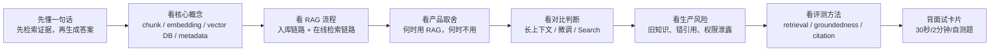
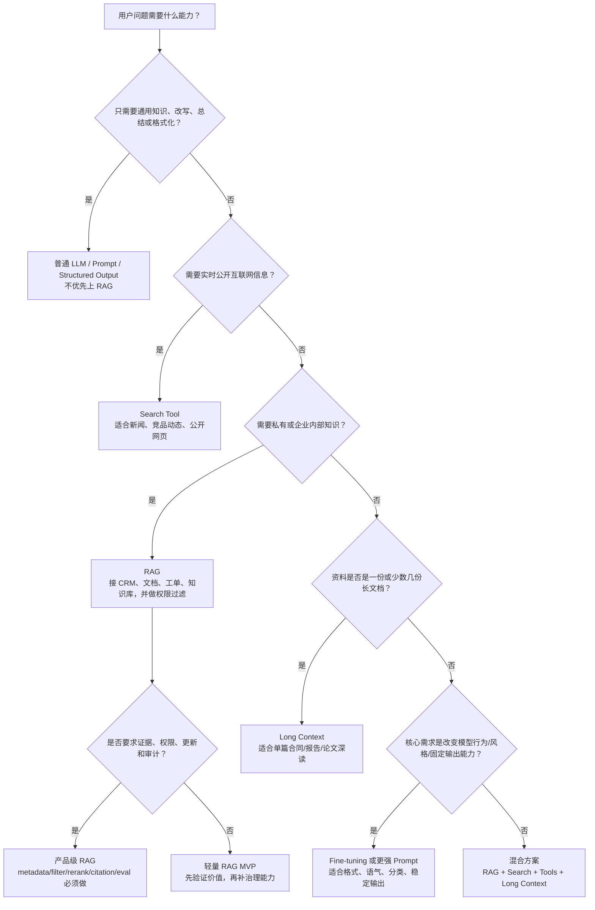
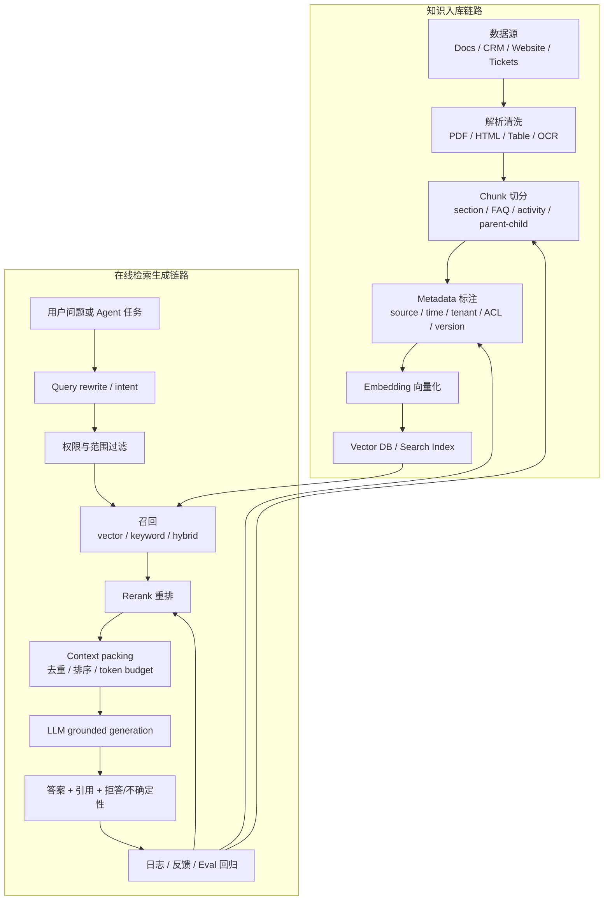

# 05 - RAG 知识库与检索增强

RAG, Retrieval-Augmented Generation, 是把外部知识检索结果放进模型上下文，让 LLM 基于可追溯证据回答问题的一类架构。对 Agent PM 来说，RAG 不是“给模型接一个向量库”这么窄，而是一个完整的产品能力：接入私有/最新知识、降低幻觉、提供引用证据、控制权限边界、持续更新知识，并通过评测证明答案可信。

本文目标：读完后，你应该能在面试和产品讨论里解释 RAG 是什么、什么时候该用、怎么设计知识库、如何看懂 embedding/chunk/向量库/召回/rerank/metadata/权限过滤/评测这些关键词，以及如何把它落到 GTM / Sales / Marketing Agent 的证据可追溯线索研究场景里。

## 0. 先读这一页

### 0.1 三分钟速读

如果你只用 3 分钟预习这篇，记住下面 8 句话：

| 你要记住的点 | 面试里怎么说 |
|---|---|
| RAG 是“先找证据，再让模型回答” | 它把外部知识检索结果放进上下文，让 LLM 基于证据生成 |
| RAG 主要解决私有知识、最新知识、可引用答案 | 企业 Agent 不能只靠模型训练知识，需要连接 CRM、文档、官网、工单和内部知识 |
| RAG 不能消灭幻觉，但能让幻觉可治理 | 可以评测检索是否命中、答案是否 grounded、引用是否真实支撑 |
| Chunk 决定知识颗粒度 | 切太小缺上下文，切太大噪声多，要根据任务和评测调 |
| Embedding 解决语义相似，不解决权限和事实真伪 | 日期、客户、权限、版本这类条件要靠 metadata/filter |
| 生产 RAG 常用 hybrid search + rerank | 向量负责语义，关键词负责精确词，rerank 负责把最有用证据排前面 |
| Metadata 是企业 RAG 的骨架 | 来源、时间、客户、权限、版本、可信等级都影响过滤、引用和治理 |
| PM 要把 RAG 设计成产品能力 | 定义知识源、更新 SLA、引用体验、拒答策略、权限边界和评测指标 |

一句面试总括：

> RAG 是 Agent 的知识访问层。它把企业私有/最新知识通过检索、过滤、rerank 和引用机制接入 LLM，让答案更可信、更可审计。Agent PM 的关键不是会不会接向量库，而是能不能判断哪些知识该进来、谁能看、多久更新、证据怎么展示、失败怎么处理、如何证明它真的减少幻觉并提升业务结果。

### 0.2 本篇阅读路线



建议阅读顺序：

1. 先读本节，建立面试可用的骨架。
2. 再读第 3-4 节，理解 RAG 的完整链路。
3. 重点读第 6-8 节，掌握 PM 决策、失败模式和评测。
4. 最后读第 10-14 节，用问答、案例和自测把内容练成可说出口的答案。

### 0.3 PM 决策速查表

| 决策问题 | 推荐判断 | PM 要追问 |
|---|---|---|
| 要不要用 RAG？ | 需要私有/最新/大量/可引用知识时用 | 知识是否超出模型训练知识？是否需要引用？是否频繁更新？ |
| 哪些知识进库？ | 只收可信、可维护、可授权的数据源 | source of truth 是谁？是否有过期和删除机制？ |
| Chunk 怎么切？ | 先按文档结构切，再用评测调大小和 overlap | 用户问题需要精确条款还是综合总结？ |
| 只用向量检索够吗？ | 有专有名词、ID、日期、价格时优先 hybrid search | 是否需要关键词/BM25？是否需要精确过滤？ |
| 要不要 rerank？ | 大知识库、相似文档多、引用要求高时加 | 质量收益是否大于延迟和成本？ |
| Metadata 要设计到什么粒度？ | 至少包含来源、时间、文档类型、客户/租户、权限、版本 | 未来怎么过滤、引用、审计和删除？ |
| 知识多久更新？ | 按业务风险定 SLA，CRM/政策类通常要更快 | 用户是否会基于旧答案做高风险决策？ |
| 引用怎么展示？ | 每个关键 claim 关联具体 source/chunk/page/URL | 引用是否真实支持答案，而不是装饰？ |
| 权限怎么做？ | 检索前过滤，不能只靠 prompt 或生成后删除 | ACL/tenant/role 是否同步到索引？ |
| 怎么上线？ | 小场景 MVP + golden eval set + 日志闭环 | 是否有拒答、反馈、人工纠错和回归评测？ |

### 0.4 RAG vs 长上下文 vs 微调 vs Search 决策树



记忆口诀：

| 方案 | 适合解决 | 不适合解决 |
|---|---|---|
| RAG | 私有知识、最新知识、大规模知识库、引用证据、权限过滤 | 改变模型行为风格、纯通用问答、数据源质量很差 |
| 长上下文 | 单篇或少量长文档深读、全局分析 | 大规模企业知识库、复杂权限、重复查询成本控制 |
| 微调 | 稳定格式、语气、分类、任务模式 | 频繁变化的事实、可引用知识、权限过滤 |
| Search | 实时公开网页、新闻、竞品、市场资料 | 内部知识、强权限、可控可信来源 |

### 0.5 RAG 流程图



看这张图时抓 3 个关键点：

- **入库质量决定上限**：解析、chunk、metadata 做差了，后面模型很难补救。
- **检索前权限过滤是底线**：不能先把无权限内容交给模型，再指望它不泄露。
- **Eval 是闭环**：RAG 不是一次性功能，而是持续调优的知识产品系统。

### 0.6 学完后你应该能做到

- 用 30 秒解释 RAG 的定义和价值。
- 画出一条 RAG 入库链路和一条在线检索链路。
- 解释 embedding、chunk、vector database、retrieval、rerank、metadata、citation。
- 判断什么时候用 RAG，什么时候用长上下文、微调或 Search。
- 为 GTM / Sales Agent 设计证据可追溯的账户研究知识库。
- 说清 RAG 的常见失败模式：检索失败、噪声、旧知识、错引用、越权。
- 设计一套评测指标：Recall@k、Context Precision、Faithfulness、Citation Accuracy、Latency、Cost、业务采纳率。
- 在面试里回答“RAG 如何降低幻觉”“如何防止权限泄露”“RAG 错了怎么排查”。

## 1. What this module solves

LLM 本身有几个天然限制：

- 训练知识是静态的：模型不知道你公司昨天更新的 pricing policy、客户刚发来的邮件、CRM 里的历史拜访记录。
- 不知道私有知识：内部 SOP、产品文档、销售话术、客户合同、工单、Notion/Confluence/Google Drive/Slack 记录不会自动进入模型。
- 可能幻觉：当模型缺少证据时，会用“听起来合理”的语言补全。
- 上下文窗口有限且昂贵：即使模型支持长上下文，也不代表每次都应该把所有资料塞进去。
- 企业产品需要可审计：用户通常不只要答案，还要知道“依据是什么、来自哪个文档、是否有权限看”。

RAG 解决的是：在用户提问或 Agent 执行任务时，先从可信知识源里找到相关证据，再把证据和任务一起交给模型生成答案。它把“模型会说话”变成“模型能基于企业知识说有依据的话”。

一句面试表达：

> RAG 是在生成前动态检索外部知识，把相关片段作为上下文提供给 LLM，从而让模型回答私有、最新、可引用的问题；它不能消灭幻觉，但能把幻觉问题转化为可评测的检索、引用和 grounding 问题。

## 2. Why an Agent PM must understand it

Agent PM 很容易遇到这些需求：

- 客服 Agent：回答政策、订单、售后、工单知识。
- Sales Agent：研究账户、找购买信号、生成 outreach reason。
- Marketing Agent：基于品牌手册、历史活动、竞品资料生成内容。
- Internal Copilot：查询内部文档、流程、代码、会议纪要。
- Legal/Finance/HR Agent：基于制度、合同、报表给出带证据的解释。

如果 PM 不懂 RAG，就容易把问题误判成“模型不够强”或“prompt 没写好”。很多生产问题其实发生在 RAG 链路：

- 文档没进库。
- chunk 切错。
- embedding 模型不适合语言/领域。
- metadata 不全，无法按客户/时间/权限过滤。
- 召回 top-k 太少，证据没取到。
- rerank 缺失，相关性排序差。
- 上下文塞太多，模型被噪声干扰。
- 引用不是答案真实依据。
- 知识库更新延迟，答案引用旧政策。
- 权限过滤在检索后做，导致越权风险。

Agent PM 不需要会写向量索引算法，但必须能定义产品边界：什么知识进来、如何更新、怎么引用、谁能看、怎么评测、失败时怎么提示用户。

## 3. Core concept map

一个典型 RAG 系统可以拆成两条链路。

离线或准实时的知识入库链路：

```text
数据源
  -> 文档抓取/同步
  -> 解析与清洗
  -> Chunk 切分
  -> Metadata 标注
  -> Embedding 向量化
  -> 向量库/搜索索引存储
  -> 更新、删除、版本管理、权限同步
```

在线问答或 Agent 执行链路：

```text
用户问题/Agent 任务
  -> 查询改写/意图识别
  -> 权限与范围过滤
  -> 召回候选文档
  -> Rerank 重排
  -> 上下文组装
  -> LLM 生成答案
  -> 引用证据/置信度/拒答
  -> 日志、反馈、评测与迭代
```

核心术语速览：

| 术语 | PM 需要理解的意思 | 产品问题 |
|---|---|---|
| Knowledge base | 可被检索的知识集合 | 哪些资料可信、可用、需要更新 |
| Chunk | 从文档切出的最小检索片段 | 切太小没上下文，切太大召回不准 |
| Embedding | 把文本变成可比较语义相似度的向量 | 能否按“意思相近”找到资料 |
| Vector database | 存储向量和 metadata，并支持相似度搜索的数据库 | 搜索速度、过滤、扩展、权限 |
| Retriever | 根据 query 找候选证据的模块 | 能不能把正确证据找出来 |
| Hybrid search | 向量搜索 + 关键词/BM25 搜索结合 | 兼顾语义和精确词 |
| Rerank | 对召回候选重新排序 | 把真正最相关的证据放进上下文 |
| Metadata | 文档来源、时间、客户、权限、类型等结构化属性 | 过滤、引用、更新、治理 |
| Citation | 答案引用到具体来源 | 用户信任、审计、纠错 |
| Grounding | 答案是否被检索证据支持 | 降低幻觉、评测可信度 |

## 4. How it works

### 4.1 数据源：先定义“可信知识”而不是先接工具

RAG 的质量上限往往由数据源决定。常见来源包括：

- 产品文档、帮助中心、FAQ、API docs。
- CRM：账户、联系人、机会、活动记录、邮件摘要、销售阶段。
- 官网、新闻稿、招聘页、财报、公开资料。
- 内部知识：Notion、Confluence、Google Drive、SharePoint、Slack、工单系统。
- 结构化数据：客户属性、订阅计划、合同状态、订单、权限表。

PM 要问：

- 哪些知识是事实来源，哪些只是参考？
- 哪些内容会频繁更新？
- 哪些内容有权限边界？
- 哪些内容需要引用到原文？
- 哪些内容过期后必须从检索结果里消失？

不要把所有资料无差别塞进 RAG。知识库不是垃圾桶，它更像一个可检索、可审计、可运营的产品数据层。

### 4.2 文档解析：PDF、表格、网页不是纯文本

很多 RAG 失败不是因为 LLM 差，而是解析阶段丢了结构：

- PDF 的标题、页码、表格、脚注丢失。
- Excel/CSV 的列名和行上下文断开。
- 网页导航、广告、cookie banner 混进正文。
- Markdown 层级被压平成普通段落。
- 图片、图表、截图没有 OCR 或多模态描述。
- CRM 记录没有把账户、联系人、时间线关联起来。

PM 不必指定解析库，但要提出验收标准：被索引内容应该保留标题层级、来源 URL、页码、更新时间、表格字段、客户 ID、权限标签等关键信息。否则后面引用和过滤都会不可靠。

### 4.3 Chunk：把文档切成“可检索的语义单元”

Chunk 是检索系统里的基本颗粒度。一个 chunk 通常是几百到一两千 token 的文本片段，也可能是一个段落、一个表格、一个 FAQ、一个 CRM activity、一个网页 section。

Chunk 设计的核心矛盾：

- 太小：召回精确，但上下文不足。例如只取到“支持 Enterprise plan”，却没取到限制条件。
- 太大：上下文完整，但向量语义变模糊，噪声增多，成本升高。
- overlap 太少：跨段信息断裂。
- overlap 太多：重复内容多，召回结果冗余。

PM 需要知道常见策略：

- 固定长度切分：简单快，适合早期 MVP，但容易切断语义。
- 结构化切分：按标题、段落、FAQ、表格行、CRM 记录切，更适合企业知识。
- Parent-child retrieval：小 chunk 用来检索，大段 parent 文档用于生成，兼顾召回精度和上下文完整性。
- Semantic chunking：按语义边界切分，适合复杂长文档，但实现和成本更高。
- 多粒度索引：同时建 paragraph、section、document 级别索引，应对不同问题类型。

面试里可以这样说：

> Chunk size 不是越大越好，也不是越小越好。PM 需要和工程一起根据任务类型调参：如果用户问精确政策条款，chunk 要更聚焦；如果用户要账户研究总结，可能需要 parent document 或多源上下文组合。

### 4.4 Embedding：让机器按“语义相似”检索

Embedding 是把文本转成向量的模型。相似语义的文本，向量距离通常更近。OpenAI 文档把 embedding 描述为文本的数值表示，可用于搜索、聚类、推荐、分类等任务；OpenAI 当前 embedding 文档也强调 `text-embedding-3-small` 和 `text-embedding-3-large` 等模型在成本、性能和维度控制上的差异。

PM 需要理解的不是数学，而是选择维度：

- 语言：是否支持中文、英文、多语言。
- 领域：通用 embedding 是否能理解专业术语、SKU、药品、金融产品、内部缩写。
- 成本：入库要为所有 chunk 生成 embedding，更新频繁会产生持续成本。
- 延迟：在线 query 也要生成 query embedding。
- 维度和存储：维度越高通常存储和检索成本越高，但不必由 PM 深挖算法。
- 一致性：同一知识库最好保持 embedding 模型一致，换模型通常意味着重建索引。

常见误区：

- 以为 embedding 能理解所有精确条件。价格、日期、权限、客户 ID 这类结构化条件最好用 metadata 过滤，不要指望向量相似度自动解决。
- 以为向量相似就是事实正确。向量检索找“相关”，不保证“真实、最新、授权可见”。
- 以为换更强 LLM 能修复 embedding 召回失败。没检索到证据，生成模型再强也只能猜。

### 4.5 向量库：不只是存向量，还要支持过滤、更新和治理

向量库或 vector store 用来存储：

- chunk 文本。
- embedding 向量。
- document ID / chunk ID。
- metadata，如来源、标题、时间、客户、权限、语言、产品线、版本。
- 有时还会存原文、摘要、稀疏向量、全文索引。

常见选择：

- 托管式：OpenAI vector stores / File Search、Pinecone、Weaviate Cloud、Qdrant Cloud 等，上手快，适合 MVP 和中等复杂度产品。
- 开源/自托管：Weaviate、Qdrant、Milvus、FAISS、Chroma 等，适合数据控制、成本、定制需求更强的场景。
- 现有数据库扩展：Postgres + pgvector、Elasticsearch/OpenSearch hybrid search，适合已有数据平台和强结构化过滤。

PM 要关心：

- 支持 metadata filter 吗？过滤是在向量检索前还是之后？
- 支持 hybrid search 吗？
- 删除和更新是否及时？是否最终一致？
- 是否能按 tenant/customer/user 做隔离？
- 是否有引用所需的 source 信息？
- 是否能观察召回日志？
- 成本是按存储、查询、向量维度、调用次数还是节点算？

Pinecone、Qdrant、Milvus、Weaviate 等官方文档都强调 metadata/payload/filter 在向量搜索里的重要性。对企业 Agent 来说，这不是锦上添花，而是权限控制、客户分区、时间过滤、产品线过滤的基础。

### 4.6 召回：先把可能相关的证据找出来

召回是从知识库里找到候选证据。常见方法：

- Dense vector search：用 embedding 做语义相似度搜索，适合“意思相近但词不完全一样”的问题。
- Sparse / keyword search：用关键词、BM25、倒排索引，适合专有名词、ID、错误码、报价编号、法规条款。
- Hybrid search：结合向量和关键词，常见于生产 RAG。Weaviate 官方文档把 hybrid search 描述为结合 vector search 和 keyword/BM25 搜索；OpenAI Retrieval 文档也提到 hybrid search 和权重调节。
- Metadata filtering：按客户、部门、权限、日期、文档类型、地区等先缩小范围。
- Query rewriting：把用户口语化问题改写成更适合检索的查询，或拆成多个子查询。
- Multi-query retrieval：生成多个不同角度的 query，提高召回覆盖。

产品上，召回的目标不是“找很多内容”，而是“找足够且准确的证据”。如果召回不到，后面生成就会变成幻觉风险；如果召回太多噪声，模型会被干扰，答案也会变差。

### 4.7 Rerank：把候选证据重新排优先级

第一阶段召回通常快但粗。Rerank 是第二阶段：拿用户 query 和候选 chunks 做更细的相关性判断，再重新排序。Cohere 的 Rerank 文档把 rerank 描述为把一组 documents 按与 query 的语义相关性从高到低排序；它常被用在 RAG 里提升搜索质量。

为什么需要 rerank：

- 向量搜索可能把“语义接近但不回答问题”的 chunk 排前面。
- 关键词搜索可能命中大量包含同一术语的噪声文档。
- 多源召回后，需要统一排序。
- top-k 上下文有限，必须把最有用证据放进去。

代价：

- 增加延迟。
- 增加成本。
- 需要评测证明收益。
- 对特别长或特别多候选需要截断。

PM 判断：

- 如果 RAG MVP 只回答小型 FAQ，可以先不加 rerank。
- 如果知识库大、文档相似、问题复杂、引用质量要求高，rerank 往往值得加入。
- 如果用户体验对实时性极敏感，可以把 rerank 作为高级模式、异步补充，或只对高风险问题启用。

### 4.8 上下文组装：不是把 top-k 原样塞给模型

检索结果进入 LLM 前，需要做 context packing：

- 去重，避免多个相似 chunk 浪费上下文。
- 保留来源标题、URL、页码、更新时间。
- 按相关性、时间、文档层级排序。
- 对冲突证据做标记，而不是让模型自行混合。
- 控制 token budget，给系统 prompt、工具结果、对话历史留空间。
- 必要时做摘要压缩，但要避免把引用证据压没。

好的上下文组装应该让模型容易回答：

- 我看到了哪些证据？
- 哪些证据最相关？
- 证据来自哪里？
- 证据是否新旧冲突？
- 哪些内容不能作为答案依据？

### 4.9 生成与引用：把“答案”变成“有证据的答案”

RAG 的输出层要设计成证据可追溯，而不是只给自然语言结论。

常见设计：

- 答案正文 + 引用编号。
- 每个关键 claim 关联来源。
- 引用显示文档标题、时间、页码/section、URL。
- 对证据不足的问题明确拒答或提示“未在知识库中找到依据”。
- 对冲突证据给出冲突提示，而不是强行合并。
- 对高风险场景提示人工复核。

OpenAI File Search 文档展示了文件引用 annotation 的能力，这类机制对企业 RAG 很重要：用户能看到答案来自哪个文件，而产品团队能检查 citation 是否真实支撑答案。

PM 要特别警惕“装饰性引用”：答案里放了引用，但引用并不支持对应句子。引用准确率应该被单独评测。

### 4.10 知识更新：RAG 是一个持续运营系统

知识库更新包括：

- 新增文档：新政策、新官网、新客户记录。
- 修改文档：更新 pricing、合同、SOP。
- 删除文档：过期资料、撤回内容、权限变更。
- 重建索引：换 embedding 模型、换 chunk 策略、换 metadata schema。
- 版本管理：旧政策是否还能被引用？是否只在历史问题中可见？

PM 要定义：

- 同步频率：实时、分钟级、小时级、每日。
- 更新 SLA：例如 CRM 更新后 5 分钟内可检索。
- 过期策略：超过发布日期多久降权或不再引用。
- 删除策略：用户无权限或文档删除后，检索结果中必须消失。
- 数据质量监控：多少文档同步失败、多少 chunk 无 metadata、多少引用指向旧版本。

OpenAI Retrieval 文档提醒，向量存储删除可能存在最终一致性窗口；这类细节对高合规产品很关键。PM 不必设计底层一致性，但必须在需求里写清楚风险和用户承诺。

### 4.11 权限过滤：企业 RAG 的生死线

企业场景里，RAG 最大风险之一是越权检索。模型不能看到用户无权访问的证据，即使最后答案没有直接引用，也可能泄露信息。

权限过滤原则：

- 最好在检索前过滤，而不是生成后再删。
- metadata 必须包含 tenant、workspace、department、role、user/group ACL、customer owner、document sensitivity 等。
- 权限变化要同步到索引。
- 搜索日志要能审计“谁问了什么、检索到了什么、引用了什么”。
- 对多租户 SaaS，tenant isolation 是底线。
- 对 Sales Agent，客户资料、合同、邮件、CRM notes 必须按 account/team/owner 权限控制。

错误做法：

- 把所有文档放一个向量库，只靠 prompt 说“不要泄露”。
- 检索后才让 LLM 判断用户是否有权限。
- 只过滤答案，不过滤上下文。
- metadata 没有记录来源和权限，导致后期无法补救。

## 5. What depth a PM needs

PM 需要掌握到这个深度：

- 能画出 RAG 入库和在线检索链路。
- 能解释 embedding、chunk、向量库、召回、rerank、metadata、citation。
- 能判断何时用 RAG、何时用长上下文、何时用搜索工具、何时用微调。
- 能定义 MVP：先接哪些知识源、回答哪些问题、引用怎么展示、失败怎么处理。
- 能提出评测集和指标：retrieval recall、faithfulness、citation accuracy、latency、cost。
- 能识别高风险：权限、过期知识、冲突证据、引用不实。
- 能和工程讨论 top-k、chunk size、hybrid search、rerank、metadata schema，但不需要手写 ANN 算法。

不需要深挖：

- 向量索引内部算法，如 HNSW、IVF、PQ 的实现细节。
- embedding 训练数学。
- reranker cross-encoder 训练方法。
- 数据库分片、压缩、内存管理的底层优化。

PM 的核心贡献是把 RAG 变成可靠产品能力：知识范围清晰、证据可见、权限正确、失败可解释、指标可追踪。

## 6. Common product decisions and tradeoffs

### 6.1 什么时候用 RAG

适合用 RAG：

- 用户问题需要私有知识：内部文档、CRM、合同、工单、客户邮件。
- 用户问题需要最新知识：价格、政策、发布说明、市场新闻。
- 需要引用证据：法律、销售、金融、客服、内部决策支持。
- 知识经常更新，不能通过微调维护。
- 需要按用户、客户、部门、地区做权限过滤。
- 需要让 Agent 在执行任务时动态查资料。
- 知识库规模大，无法每次全量放进上下文。

不适合或不优先用 RAG：

- 问题主要是通用常识或语言改写，模型自身足够。
- 任务是固定格式生成、分类、抽取，规则或少量 prompt examples 更简单。
- 知识很少且稳定，可以直接放系统 prompt 或配置里。
- 用户需要实时网页结果，而不是内部知识库，搜索工具可能更合适。
- 需要改变模型风格、稳定遵循格式、学习特定输出分布，微调可能更合适。
- 所有相关资料只有一份短文档，长上下文直接读取可能更可靠。
- 无法保证数据源质量、权限 metadata 或更新机制，贸然做 RAG 会放大风险。

### 6.2 RAG vs 长上下文

| 维度 | RAG | 长上下文 |
|---|---|---|
| 基本思路 | 先检索相关片段，再放入上下文 | 把大量原文直接放入上下文 |
| 适合 | 大规模知识库、重复查询、权限过滤、引用证据 | 单个长文档深读、全局分析、避免检索遗漏 |
| 风险 | 检索不到就答不好 | 信息太多时模型可能忽略关键细节，成本和延迟高 |
| 成本 | 需要入库和检索系统，但单次上下文更省 | 每次输入大量 token，可能贵 |
| 更新 | 可增量更新索引 | 通常每次重新提供上下文 |
| 权限 | 可在检索前过滤 | 需要先决定能放哪些内容 |

面试表达：

> 长上下文降低了 RAG 的必要性，但没有替代 RAG。对单篇合同或一次性深读，长上下文很好；对企业知识库、CRM、权限过滤、引用审计、持续更新，RAG 仍然更像产品级知识访问层。很多成熟方案会混合使用：先 RAG 找相关文档，再把 parent section 或完整文档放进长上下文。

### 6.3 RAG vs 微调

| 维度 | RAG | 微调 |
|---|---|---|
| 解决问题 | 给模型动态提供知识 | 改变模型行为、风格、格式、任务能力 |
| 知识更新 | 快，更新索引即可 | 慢，需要重新训练/部署 |
| 引用证据 | 天然适合 | 不天然提供证据 |
| 私有事实 | 适合 | 不适合频繁变动事实 |
| 成本结构 | 检索、存储、embedding、上下文 token | 训练成本、推理成本、数据集维护 |

常见判断：

- “让 Agent 知道最新政策”用 RAG。
- “让 Agent 用公司标准话术和输出格式”可能用 prompt 或微调。
- “让 Agent 基于客户资料生成带引用的销售洞察”用 RAG + 工具。
- “让模型更擅长特定分类任务”可以考虑微调。

### 6.4 RAG vs 搜索工具

| 维度 | RAG 知识库 | 搜索工具 |
|---|---|---|
| 数据范围 | 已入库的可信私有/公开资料 | 外部实时网页或系统搜索 |
| 控制 | 强，可控来源、metadata、权限 | 弱，依赖搜索结果质量 |
| 引用 | 可设计到 chunk/source 级别 | 通常引用网页或搜索结果 |
| 最新性 | 取决于同步频率 | 通常更实时 |
| 适合 | 企业知识、内部资料、可审计问答 | 开放互联网研究、新闻、竞品动态 |

Agent 产品里常常二者并用：RAG 查内部知识，搜索工具查外部最新网页，CRM/API 工具查结构化实时状态。

### 6.5 Build vs buy

PM 常见选型：

- 平台内置文件搜索：最快做 MVP，适合上传文档问答、原型、轻量内部工具。
- LlamaIndex/LangChain 组合：适合需要灵活构建 ingestion、retrieval、agentic RAG、eval 的团队。
- 托管向量数据库：适合生产规模和 SLA，但要评估成本、权限、数据驻留。
- 自托管向量库或现有数据库扩展：适合强合规、已有数据平台、成本控制，但工程负担更高。

选择时不要只问“哪个向量库最好”，要问：

- 数据在哪里？
- 谁能访问？
- 多久更新？
- 需要什么引用粒度？
- 规模和 QPS 多大？
- 是否要 hybrid search/rerank？
- 是否要多租户隔离？
- 工程团队能维护多复杂的系统？

## 7. Common failure modes

### 7.1 检索失败

表现：答案看似流畅，但没有引用到真正相关资料。

原因：

- chunk 切分错误。
- query 改写不当。
- top-k 太小。
- embedding 不理解领域术语。
- 只用向量检索，错过精确关键词。
- metadata 过滤过严或过松。

产品处理：

- 提供“未找到足够证据”的拒答。
- 记录 failed queries，进入评测集。
- 用 hybrid search、query rewrite、rerank、metadata 改善。

### 7.2 召回噪声太多

表现：答案夹杂无关信息，引用看起来多但不支撑结论。

原因：

- top-k 太大。
- 过期文档未降权。
- 相似文档重复。
- 没有 rerank。
- 文档源质量差。

产品处理：

- 先提高 precision，再追求覆盖。
- 对过期、低可信来源降权。
- 做去重和 citation accuracy 评测。

### 7.3 Chunk 缺上下文

表现：模型拿到一句话，但不知道适用条件。

例子：chunk 只有“Enterprise customers can request custom limits”，但缺少“only after security review and annual contract approval”。

产品处理：

- parent-child retrieval。
- chunk metadata 带标题、章节、产品线。
- 在生成上下文中附上前后段或 parent section。

### 7.4 过期知识

表现：Agent 引用旧价格、旧政策、旧客户状态。

产品处理：

- metadata 记录 effective_date、updated_at、version、status。
- 检索时按时间降权或过滤。
- 展示引用日期。
- 对冲突版本提示用户。
- 对高风险答案要求人工确认。

### 7.5 引用不真实

表现：答案后面有引用，但引用只相关不支持。

产品处理：

- 要求每个关键 claim 对应 citation。
- 做 citation support 评测。
- 引用到具体页码/section/chunk，而不是只引用文档名。
- 前端允许用户展开原文核查。

### 7.6 权限泄露

表现：用户问 A 客户，检索到了 B 客户资料；或普通用户看到管理层文档。

产品处理：

- 检索前使用 metadata/ACL 过滤。
- 多租户隔离。
- 权限变更同步。
- 审计检索日志。
- 对敏感源做红队测试。

### 7.7 数据源污染

表现：Agent 引用低质量网页、用户上传的错误材料、营销口径旧版本。

产品处理：

- 定义 source trust level。
- 区分 official、internal draft、external web、user uploaded。
- 低可信来源只做参考，不作为结论依据。
- 建立知识库运营流程。

### 7.8 成本和延迟失控

原因：

- 每次检索太多 chunk。
- rerank 候选过多。
- 上下文太长。
- 频繁重建 embedding。
- 多源检索串行执行。

产品处理：

- 对问题类型做路由：简单问题少检索，高风险问题深检索。
- 缓存常见 query。
- 设置 token budget。
- 记录 p50/p95 延迟和每次回答成本。

## 8. Metrics and evaluation methods

RAG 评测要分层看，不能只看“最终答案满意度”。

### 8.1 离线评测集

PM 应推动建立一组代表性问题：

- 高频真实用户问题。
- 容易幻觉的问题。
- 需要最新知识的问题。
- 需要权限过滤的问题。
- 多文档组合问题。
- 应该拒答的问题。
- 有冲突证据的问题。
- GTM 场景里的账户研究、客户异动、竞品提及、历史互动总结。

每个问题最好有：

- 期望答案或评分标准。
- 应该召回的 gold documents/chunks。
- 不应召回的敏感或无关文档。
- 是否允许使用外部搜索。
- 是否必须引用。

### 8.2 检索指标

| 指标 | 说明 | PM 解读 |
|---|---|---|
| Recall@k | 前 k 个结果里是否包含应有证据 | 找不找得到关键资料 |
| Precision@k | 前 k 个结果有多少相关 | 噪声是否太多 |
| MRR | 第一个正确结果排第几 | 好证据是否靠前 |
| NDCG | 排序质量 | 排名前几是否最有用 |
| Filter accuracy | 权限/时间/客户过滤是否正确 | 企业安全底线 |
| Coverage | 知识源覆盖率 | 哪些资料还没入库 |

### 8.3 生成指标

RAGAS、TruLens、LangSmith、LlamaIndex eval 等工具都把 RAG 评测拆成多个维度。常见指标包括：

- Faithfulness / Groundedness：答案是否只陈述检索证据支持的内容。
- Answer relevancy：答案是否回答了用户问题。
- Context precision：检索到的上下文是否相关。
- Context recall：必要上下文是否被检索到。
- Answer correctness：相对标准答案是否正确。
- Citation accuracy：引用是否真实支持对应 claim。
- Refusal accuracy：证据不足或无权限时是否正确拒答。

TruLens 的 RAG triad 是一个好记框架：context relevance、groundedness、answer relevance。面试时可以说：先评估取回来的上下文是否相关，再评估答案是否被上下文支持，最后评估答案是否满足用户问题。

### 8.4 系统指标

- p50/p95 latency。
- 每次回答成本。
- embedding 入库成本。
- 检索 QPS。
- 索引更新延迟。
- 文档同步失败率。
- chunk 数量和存储增长。
- rerank 成本和收益。

### 8.5 产品指标

按场景定义：

- 客服：自助解决率、转人工率、错误答案率、用户满意度。
- Sales：账户研究时间节省、outreach 采纳率、引用证据点击率、销售接受率。
- Marketing：内容事实错误率、品牌合规通过率、编辑节省时间。
- Internal Copilot：搜索成功率、重复提问率、知识缺口反馈数。

### 8.6 评测流程

一个实用评测流程：

1. 从真实日志和业务专家处收集 100-300 个问题。
2. 标注每个问题的正确答案、关键证据、权限范围。
3. 跑 baseline：无 RAG、简单向量 RAG、hybrid、rerank 等版本。
4. 分别记录 retrieval、generation、citation、latency、cost。
5. 对失败案例归因：数据源、chunk、embedding、filter、rerank、prompt、模型。
6. 每次改 chunk/top-k/rerank/prompt，都在同一评测集上回归。
7. 上线后把低置信、用户踩、人工纠错样本加入 eval set。

PM 关键点：不要靠 demo 里几个漂亮问题判断 RAG 好坏。RAG 产品化的分水岭是持续评测和失败归因。

## 9. Keywords for engineering communication

和工程沟通时，你应该听得懂并能使用这些词：

- RAG / Retrieval-Augmented Generation
- Knowledge base / corpus
- Ingestion pipeline
- Document loader
- Parser / OCR / table extraction
- Chunk / node / text splitter
- Chunk size / overlap
- Parent-child retrieval
- Semantic chunking
- Embedding model
- Dense vector / sparse vector
- Vector database / vector store
- ANN search
- Similarity score
- Top-k
- Retriever
- BM25 / keyword search
- Hybrid search
- Query rewriting
- Multi-query retrieval
- Metadata / payload
- Metadata filter / ACL filter
- Tenant isolation
- Reranker / cross-encoder
- Context packing
- Prompt grounding
- Citation / source attribution
- Faithfulness / groundedness
- Context precision / context recall
- Recall@k / Precision@k / MRR / NDCG
- Index freshness
- Re-indexing
- Eventual consistency
- Observability / tracing
- Golden dataset / eval set

## 10. High-frequency interview questions and answers

### Q1: RAG 是什么？

RAG 是 Retrieval-Augmented Generation，检索增强生成。它在 LLM 生成答案前，先从外部知识库检索相关内容，再把这些内容作为上下文交给模型回答。它常用于接入私有知识、最新知识和需要引用证据的企业场景。

### Q2: RAG 为什么能降低幻觉？

它不能彻底消灭幻觉，但能降低“模型凭空猜”的概率，因为答案有外部证据作为上下文。同时，RAG 让幻觉变得可观测：可以检查是否召回了正确证据、答案是否忠实于证据、引用是否支持 claim。

### Q3: 一个 RAG 系统的主要组件是什么？

离线侧有数据源、解析、chunk、metadata、embedding、向量库和更新机制；在线侧有 query rewrite、权限过滤、召回、rerank、上下文组装、生成、引用和评测日志。

### Q4: Embedding 是什么？

Embedding 是文本的向量表示，用来衡量语义相似度。RAG 会把文档 chunk 和用户 query 都转成 embedding，然后找向量空间里最相近的内容。PM 要关注语言、领域、成本、延迟和模型更换后是否需要重建索引。

### Q5: Chunk size 怎么选？

取决于任务。精确问答需要更小、更聚焦的 chunk；综合总结需要更完整的上下文。常见做法是先用结构化切分，再通过评测调 chunk size、overlap、top-k，并在复杂场景用 parent-child retrieval。

### Q6: 为什么只用向量搜索不够？

向量搜索擅长语义相似，但对专有名词、编号、错误码、价格、日期、法律条款可能不如关键词搜索。生产 RAG 常用 hybrid search，把向量搜索和 BM25/关键词结合，再用 rerank 排序。

### Q7: Rerank 有什么作用？

Rerank 会对第一阶段召回的候选证据做更精细的 query-document 相关性排序，把真正最能回答问题的证据放到上下文前面。它通常提升质量，但会增加延迟和成本，需要用评测证明收益。

### Q8: Metadata 在 RAG 里为什么重要？

Metadata 是文档的结构化属性，如来源、更新时间、客户 ID、地区、产品线、权限、版本。它用于过滤、排序、引用、审计和更新。没有 metadata，企业 RAG 很难做权限控制和可信引用。

### Q9: RAG 和长上下文有什么区别？

长上下文是把大量内容直接放给模型；RAG 是先检索相关内容再放进去。单篇长文档深读适合长上下文；企业知识库、权限过滤、持续更新和证据引用更适合 RAG。很多产品会混合使用。

### Q10: RAG 和微调有什么区别？

RAG 用来提供动态外部知识，微调用来改变模型行为、风格或任务能力。最新政策、客户资料、内部文档应该用 RAG；稳定输出格式、特定分类能力、品牌语气可以考虑 prompt 或微调。

### Q11: 什么时候不该用 RAG？

当任务不需要外部知识、知识很少且稳定、只是格式化/改写、或者数据源权限和质量无法保证时，不应该为了“看起来高级”上 RAG。RAG 增加系统复杂度，只有当知识动态、私有、规模大或需要引用时才值得。

### Q12: 如何评估 RAG 是否有效？

分层评估：检索看 Recall@k、Precision@k、MRR、filter accuracy；生成看 faithfulness、answer relevancy、answer correctness、citation accuracy；系统看延迟、成本、更新延迟；产品看任务成功率和人工纠错率。

### Q13: 如何处理 RAG 答案里的引用？

引用应该绑定到具体来源、页面、section 或 chunk，并且能支持答案中的关键 claim。PM 要避免装饰性引用，应该评测 citation accuracy，并允许用户展开原文核查。

### Q14: 如何防止 RAG 泄露权限外信息？

权限必须在检索前生效。索引 metadata 要包含 tenant、workspace、用户/角色/组权限、客户归属、敏感等级等字段。检索日志要能审计，权限变化要同步到索引，不能只靠 prompt 要求模型不要泄露。

### Q15: 如果 RAG 回答错了，怎么排查？

先看检索：正确证据有没有被召回？排序是否靠前？metadata filter 是否正确？再看上下文：是否有噪声、旧版本、冲突证据？最后看生成：模型是否忠实引用证据、是否过度推断。不要一上来就怪 LLM。

### Q16: Agentic RAG 是什么？

普通 RAG 通常是固定检索一次再回答。Agentic RAG 让 Agent 根据任务动态决定是否检索、检索哪些源、是否拆分问题、是否调用 CRM/网页搜索/API、是否反思证据不足后继续检索。它更灵活，但更难评测和控制成本。

### Q17: 如何设计一个 RAG MVP？

选择一个高价值、边界清晰的场景；接入 1-3 个可信知识源；定义 metadata 和权限；先做基础 chunk + embedding + vector search；加引用和拒答；建立 50-100 个评测问题；上线小流量后根据失败日志迭代 hybrid search、rerank 和更新机制。

## 11. GTM / Sales / Marketing Agent example

### 场景：证据可追溯的线索研究 Agent

产品目标：

帮助销售或增长团队研究目标账户，基于客户资料、官网、CRM 历史记录、公开新闻、招聘动态、产品使用记录，生成可引用的账户洞察和 outreach reason。

用户问题示例：

- “帮我研究 Acme Corp 最近是否有扩张信号，适合推荐我们的 Enterprise plan 吗？”
- “这个账户过去 6 个月和我们有哪些互动？下一封邮件应该提什么？”
- “给我 3 个有证据支持的购买触发点，不要编造。”
- “这个客户是否提过竞品 X？引用 CRM 或邮件记录。”

### 知识源

内部：

- CRM account profile：行业、规模、地区、阶段、owner、ARR、renewal date。
- CRM activities：通话记录、邮件摘要、会议纪要、上次 follow-up。
- Opportunity history：阶段变化、流失原因、竞品、预算、决策人。
- Product usage：活跃度、功能使用、试用到期、扩容趋势。
- Sales enablement：行业话术、case study、battlecard、pricing policy。

外部：

- 公司官网：产品、客户、新闻、职位。
- 新闻稿和博客。
- 招聘页面：团队扩张和技术栈信号。
- 财报/融资/公告。
- LinkedIn 或公开人员信息。

### RAG 设计

入库：

- 官网和新闻按 URL、发布日期、页面标题切分。
- CRM activity 按 account_id、contact_id、activity_date、owner、type 做 metadata。
- Sales enablement 按行业、产品线、版本、有效日期做 metadata。
- 每个 chunk 保留 source_url 或 CRM record link，便于引用。
- 对 account-specific 数据做严格权限过滤：只有账户 owner、团队成员或授权角色可检索。

在线流程：

1. Agent 识别用户要研究的 account。
2. 查询 CRM/API 获取账户基本信息和权限。
3. 根据 account_id 过滤内部 CRM chunks。
4. 对官网、新闻、招聘等外部资料做 RAG 或搜索工具检索。
5. 对销售话术库按行业、产品线、客户阶段检索。
6. Hybrid search 召回候选证据。
7. Rerank 得到最相关的购买信号、历史互动和推荐话术。
8. LLM 生成结构化输出：
   - 账户摘要。
   - 购买信号。
   - 风险/反信号。
   - 推荐 outreach reason。
   - 下一步行动。
   - 每条结论后的引用。
9. 如果证据不足，明确写“未找到足够证据”，不要凭空生成。

输出示例结构：

```text
Account research: Acme Corp

1. Buying signal
   Acme 最近在招聘 12 个 RevOps / Data Platform 相关岗位，说明其 GTM 数据基础设施可能在扩张。[官网招聘页，2026-05-28]

2. Existing relationship
   CRM 显示该账户 2026-04-12 与 AE 讨论过 pipeline reporting pain，但当时因预算未确认暂停。[CRM activity #48291]

3. Recommended outreach reason
   建议从“扩张期的 pipeline visibility 和销售预测一致性”切入，并附上同类客户 case study。[Sales enablement: Enterprise RevOps playbook v3]

4. Caveat
   未找到 Acme 近期公开融资或财报信息，不能把预算增长作为确定结论。
```

### 产品决策

MVP 范围：

- 先支持单账户研究，而不是全量自动 prospecting。
- 先接 CRM + 官网 + sales enablement，不一开始接所有外部数据源。
- 输出必须带引用。
- 用户可以点开每条证据。
- 低证据结论必须标注“不确定”。

高级能力：

- 自动发现 buying signal。
- 对多账户打分排序。
- 定期刷新账户研究。
- 把用户反馈写回 CRM。
- 对 outreach draft 做品牌和合规检查。
- 支持多语言市场资料。

风险：

- 错把旧 CRM note 当当前状态。
- 引用竞争对手信息但来源不可靠。
- 越权访问其他 sales team 的账户。
- 过度推断购买意向。
- 生成过于自信的 outreach reason。

评测：

- 是否召回正确 account 的记录。
- 是否过滤掉无权限 account。
- 每个 buying signal 是否有引用。
- 引用是否支持结论。
- 销售是否采纳建议。
- 账户研究时间是否缩短。
- 生成内容是否减少手工事实核查。

面试表达：

> 我会把 Sales Agent 的 RAG 设计成证据优先，而不是文案优先。它先基于 account_id 和权限过滤 CRM 历史，再结合官网、新闻和 enablement 文档做 hybrid retrieval 和 rerank，最后生成每条洞察都能点开来源的账户研究。这样销售可以快速行动，同时 PM 能用 citation accuracy、retrieval recall、采纳率和研究时间节省来评估产品价值。

## 12. How to say it in interviews

### 12.1 30 秒版本

RAG 是让 LLM 在回答前先检索外部知识，再基于检索证据生成答案。它适合私有知识、最新知识、企业知识库和需要引用的场景。一个好的 RAG 产品不只是向量库，还包括文档解析、chunk、embedding、metadata、权限过滤、召回、rerank、上下文组装、引用和评测。PM 的重点是定义知识范围、用户体验、失败边界和指标。

### 12.2 2 分钟版本

我会把 RAG 看成 Agent 的知识访问层。离线侧，我们从 CRM、文档、官网或工单系统同步数据，解析清洗后按语义单元 chunk，补充来源、时间、权限、客户等 metadata，再用 embedding 建索引。在线侧，用户提问后，系统先做权限过滤和 query rewrite，通过向量/关键词/hybrid search 召回候选证据，再 rerank，把最相关证据放进 LLM 上下文，让模型生成带引用的答案。

RAG 的价值是接入私有和最新知识，降低幻觉，并让答案可追溯。但它也有风险：检索失败、旧知识、噪声、引用不实、权限泄露、成本延迟。PM 应该用分层指标评估：retrieval recall/precision、faithfulness、citation accuracy、latency、cost，以及业务指标，比如销售研究时间节省和采纳率。RAG 不总是最佳方案；单篇长文档可用长上下文，行为风格可考虑微调，实时公开网页可用搜索工具。

### 12.3 产品设计题答法

如果面试官问“设计一个基于企业知识库的 Agent”，可以按这个顺序回答：

1. 明确场景和知识源：用户问什么，可信数据在哪里。
2. 定义权限和引用要求：谁能看，引用到什么粒度。
3. 设计入库链路：解析、chunk、metadata、embedding、更新。
4. 设计检索链路：query rewrite、filter、hybrid search、rerank。
5. 设计输出体验：答案、引用、拒答、不确定性、原文展开。
6. 设计评测：retrieval、grounding、citation、latency、业务指标。
7. 说明 tradeoff：RAG vs 长上下文 vs 微调 vs 搜索工具。

## 13. Quick memory summary

- RAG = 检索外部知识 + 放入上下文 + 基于证据生成。
- 主要价值：私有知识、最新知识、降低幻觉、引用证据、权限可控。
- RAG 链路：ingestion -> parse -> chunk -> metadata -> embedding -> vector store -> retrieve -> rerank -> context packing -> generate -> cite -> eval。
- Embedding 解决语义相似，不解决事实真伪、权限和时间。
- Chunk 是质量关键：太小丢上下文，太大噪声多。
- Metadata 是企业 RAG 的骨架：过滤、权限、引用、更新都靠它。
- Hybrid search 常比纯向量更稳，尤其有专有名词、编号、日期、产品名。
- Rerank 提升相关性，但增加延迟和成本。
- 引用必须真实支持 claim，不能只是装饰。
- 权限过滤要在检索前做。
- RAG 适合动态、大规模、私有、需引用知识；不适合纯通用问答、简单格式生成、很小稳定知识。
- 长上下文适合单个长文档深读；RAG 适合企业知识访问层；微调适合行为和格式；搜索工具适合开放实时网页。
- 评测要分层：召回、排序、grounding、引用、延迟、成本、业务效果。

## 14. 面试卡片与自测

### 14.1 面试官想考什么

面试官问 RAG，通常不是只想听“向量数据库 + embedding”。更深层是在考你能不能把一个 demo 级知识问答，设计成可上线、可评估、可治理的 Agent 产品能力。

| 面试官问题 | 实际考点 | 好答案要覆盖 |
|---|---|---|
| RAG 是什么？ | 基础定义是否清楚 | 检索增强生成、外部知识、grounding、citation |
| 为什么 RAG 能降低幻觉？ | 是否知道边界 | 降低但不消灭；用检索、引用和评测治理 |
| 怎么设计知识库？ | 是否懂产品化链路 | 数据源、解析、chunk、metadata、embedding、更新 |
| RAG 和长上下文怎么选？ | 是否能做架构取舍 | 单文档深读 vs 企业知识访问层 |
| RAG 和微调怎么选？ | 是否知道知识和行为的区别 | 动态事实用 RAG，行为/格式用 prompt 或 fine-tune |
| 怎么防止越权？ | 是否有企业安全意识 | 检索前 ACL/tenant/role filter，审计日志 |
| 怎么评估 RAG？ | 是否能定义指标 | Retrieval metrics + generation metrics + citation + business metrics |
| Sales Agent 里怎么用？ | 是否能落到业务 | CRM/官网/enablement 检索，证据可追溯账户研究 |

### 14.2 30 秒回答模板

如果面试官让你“简单解释 RAG”，可以直接套这个结构：

> RAG 是 Retrieval-Augmented Generation，也就是让模型回答前先去外部知识库检索相关证据，再把证据放进上下文生成答案。它适合企业私有知识、最新知识和需要引用的场景，比如基于 CRM、官网、内部文档做 Sales Agent 账户研究。一个生产级 RAG 不只是向量库，还包括文档解析、chunk、metadata、权限过滤、召回、rerank、引用和评测。它不能彻底消灭幻觉，但能通过 grounding、citation accuracy 和 retrieval recall 把幻觉变成可发现、可优化的问题。

### 14.3 2 分钟回答模板

如果面试官问“你会怎么设计一个 RAG 系统”，可以按下面说：

> 我会先从产品场景和知识源开始，而不是先选向量库。比如做 GTM Sales Agent，知识源包括 CRM account、历史活动、官网、新闻、招聘页和 sales enablement 文档。离线侧要做数据同步、解析清洗、结构化 chunk、metadata 标注和 embedding 入库；metadata 至少要有 source、updated_at、account_id、tenant、ACL、版本和可信等级。
>
> 在线侧，用户问一个账户问题时，系统先识别 account 和权限范围，再做 query rewrite，通过 metadata filter、hybrid search 和 rerank 找到最相关证据，最后把证据和来源信息组装进上下文，让 LLM 生成带引用的答案。输出层要支持每条关键结论点开来源；证据不足时要拒答或标注不确定。
>
> 我会重点评估四层指标：检索层看 Recall@k、Precision@k、MRR；生成层看 faithfulness、answer relevancy、citation accuracy；系统层看延迟、成本、索引更新延迟；业务层看销售研究时间节省、采纳率和人工纠错率。风险上最重要的是旧知识、错引用和权限泄露，所以权限必须在检索前过滤，知识更新要有 SLA，引用要能真实支持 claim。

### 14.4 容易踩坑

| 坑 | 为什么危险 | 面试里怎么修正 |
|---|---|---|
| 把 RAG 说成“向量库问答” | 忽略解析、metadata、权限、引用、评测 | RAG 是完整知识访问层，不是单个数据库组件 |
| 说 RAG 可以解决幻觉 | 过度承诺 | RAG 降低幻觉，并让 hallucination 可评测、可归因 |
| 只讲 embedding，不讲 chunk | 无法解释质量问题 | Chunk 是检索颗粒度，决定召回和上下文质量 |
| 忽略 metadata | 企业场景无法过滤、引用、更新、审计 | Metadata 是生产 RAG 的骨架 |
| 检索后再做权限 | 已经把敏感内容暴露给模型 | 权限要在检索前生效 |
| 所有问题都上 RAG | 系统复杂度、成本、延迟变高 | 通用问答、固定格式、单篇长文档可以不用 RAG |
| 引用只到文档名 | 用户无法核验证据 | 引用最好到 URL、页码、section 或 chunk |
| 只用最终满意度评估 | 无法定位失败原因 | 分层评估 retrieval、rerank、generation、citation |
| 忘记知识更新 | 旧政策/旧价格会造成业务风险 | 定义 freshness SLA、版本和删除机制 |
| 忽略拒答体验 | 证据不足时模型会硬答 | 设计“不知道/证据不足/需人工确认”的产品状态 |

### 14.5 读完自测题

用下面问题检查自己是否真的掌握。建议不要看正文，先口头回答一遍。

1. 用一句话解释 RAG 是什么。
2. 为什么 RAG 能降低幻觉，但不能消灭幻觉？
3. RAG 入库链路有哪些步骤？
4. 在线 RAG 链路有哪些步骤？
5. Chunk 太小和太大分别会带来什么问题？
6. Embedding 适合解决什么，不适合解决什么？
7. 为什么 metadata 对企业 RAG 很关键？
8. Vector search、keyword search、hybrid search 的区别是什么？
9. Rerank 什么时候值得加，什么时候可以先不加？
10. RAG 和长上下文怎么选？
11. RAG 和微调怎么选？
12. RAG 和 Search tool 怎么选？
13. 如何设计 RAG 的引用体验？
14. 如何防止 RAG 检索到用户无权访问的资料？
15. RAG 答错了，你会如何排查？
16. 你会用哪些指标评估 retrieval？
17. 你会用哪些指标评估 generation 和 grounding？
18. Sales Agent 如何基于 CRM、官网和 sales enablement 做证据可追溯的账户研究？
19. RAG MVP 应该先做哪些能力，哪些能力可以后置？
20. 什么情况下你会明确建议不要做 RAG？

参考答案要点：

| 题号 | 答案要点 |
|---|---|
| 1-4 | 先检索证据再生成；入库包括 parse/chunk/metadata/embedding/index；在线包括 query/filter/retrieve/rerank/context/generate/cite/eval |
| 5-9 | Chunk 影响颗粒度；embedding 是语义相似；metadata 管过滤和治理；hybrid 兼顾语义和精确词；rerank 提升排序但增加成本 |
| 10-12 | 长上下文适合少量长文档；微调适合行为/格式；Search 适合实时公开网页；RAG 适合企业私有/最新/可引用知识 |
| 13-15 | 引用要支撑 claim；权限检索前过滤；排查从 retrieval 到 context 到 generation |
| 16-20 | Retrieval 看 Recall/Precision/MRR/NDCG/filter；generation 看 faithfulness/citation/answer correctness；MVP 先小知识源和评测闭环 |

### 14.6 掌握标准

你可以用这张表判断自己是否达到“80% 面试可用理解”。

| 掌握层级 | 你能做到什么 | 是否达标 |
|---|---|---|
| L1 概念认识 | 能解释 RAG 是检索增强生成，知道 embedding 和向量库 | 不够，只能应付浅问 |
| L2 链路理解 | 能画出入库和在线检索链路，解释 chunk、metadata、rerank、citation | 基本达标 |
| L3 产品判断 | 能判断何时用/不用 RAG，能和长上下文、微调、Search 对比 | 面试可用 |
| L4 生产意识 | 能讲清权限过滤、知识更新、旧知识、错引用、拒答和审计 | 强技术 PM 水平 |
| L5 评测闭环 | 能定义 golden set、retrieval/generation/citation/business 指标，并根据失败归因迭代 | 高质量候选人水平 |

最低掌握标准：

- 能用 30 秒和 2 分钟各讲一版 RAG。
- 能画出“数据源 -> chunk -> embedding -> vector DB -> retrieve -> rerank -> generate -> cite”的流程。
- 能解释 RAG vs 长上下文 vs 微调 vs Search。
- 能说出至少 5 个生产失败模式和对应产品策略。
- 能为 GTM / Sales Agent 设计一个证据可追溯账户研究方案。
- 能定义一组 RAG eval 指标，而不是只说“看用户满意度”。

## 15. References

官方与高质量资料：

- OpenAI Help Center: Retrieval Augmented Generation and Semantic Search for GPTs  
  https://help.openai.com/en/articles/8868588-retrieval-augmented-generation-rag-and-semantic-search-for-gpts
- OpenAI API Docs: Retrieval  
  https://platform.openai.com/docs/guides/retrieval
- OpenAI API Docs: File Search  
  https://platform.openai.com/docs/guides/tools-file-search/
- OpenAI API Docs: Vector embeddings  
  https://platform.openai.com/docs/guides/embeddings
- OpenAI model page: text-embedding-3-large  
  https://developers.openai.com/api/docs/models/text-embedding-3-large
- LangChain Docs: Retrieval  
  https://docs.langchain.com/oss/python/langchain/retrieval
- LangChain Docs: Build a RAG agent with LangChain  
  https://docs.langchain.com/oss/python/langchain/rag
- LangChain Docs: Document loaders  
  https://docs.langchain.com/oss/python/integrations/document_loaders/
- LangChain / LangSmith Docs: Evaluate a RAG application  
  https://docs.langchain.com/langsmith/evaluate-rag-tutorial
- LlamaIndex Docs: Introduction to RAG  
  https://docs.llamaindex.ai/en/stable/understanding/rag/
- LlamaIndex Docs: Evaluation usage pattern  
  https://docs.llamaindex.ai/en/v0.12.15/module_guides/evaluating/usage_pattern/
- Pinecone Docs: Filter by metadata  
  https://docs.pinecone.io/guides/search/filter-by-metadata
- Qdrant Docs: Filtering  
  https://qdrant.tech/documentation/concepts/filtering/
- Weaviate Docs: Search concepts  
  https://docs.weaviate.io/weaviate/concepts/search
- Weaviate Docs: Hybrid search  
  https://weaviate.io/developers/weaviate/search/hybrid
- Milvus Docs: Filtered search  
  https://milvus.io/docs/id/v2.5.x/filtered-search.md
- Cohere Docs: Reranking  
  https://docs.cohere.com/docs/reranking
- Ragas Docs: Available metrics  
  https://docs.ragas.io/en/stable/concepts/metrics/available_metrics/
- TruLens Docs: RAG Triad  
  https://www.trulens.org/getting_started/core_concepts/rag_triad/
- OpenAI Cookbook: Evaluate RAG with LlamaIndex  
  https://cookbook.openai.com/examples/evaluation/evaluate_rag_with_llamaindex
- Lewis et al., Retrieval-Augmented Generation for Knowledge-Intensive NLP Tasks, 2020  
  https://arxiv.org/abs/2005.11401
- RAGAS: Automated Evaluation of Retrieval Augmented Generation, 2023  
  https://arxiv.org/abs/2309.15217
- Long Context vs. RAG for LLMs: An Evaluation and Revisits  
  https://openreview.net/pdf?id=7k6X2GzJft
