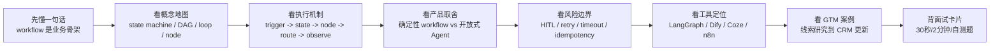
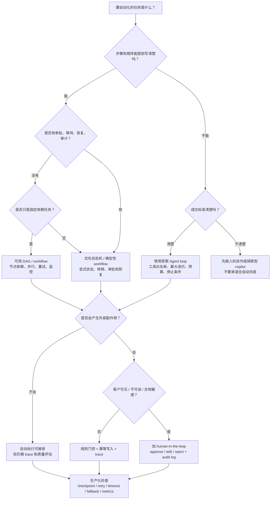
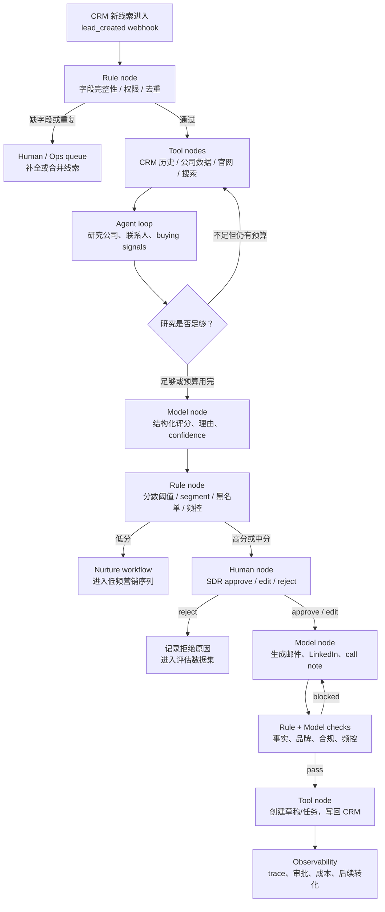

# 07 - Workflow 编排与自动化

> 面向强技术型 Agent PM：理解 workflow、状态机、DAG、Agent loop、human-in-the-loop、节点类型、异常处理、可观测性，以及 LangGraph、Dify、Coze、n8n 等工具在产品架构中的定位。本文最后更新于 2026-06-05。

## 0. 先读这一页

### 0.1 三分钟速读

如果你只用 3 分钟预习这篇，先记住下面 8 句话：

| 你要记住的点 | 面试里怎么说 |
|---|---|
| Workflow 是业务流程骨架 | 它把触发、状态、节点、分支、重试、审批和交付组织起来 |
| LLM 不是 workflow 本身 | LLM 通常只是模型节点，负责理解、抽取、生成、判断或评估 |
| Agent loop 是开放式执行方式 | 模型在观察、规划、调用工具、读结果中循环，适合路径不确定的任务 |
| 状态机管生命周期 | 它让多步流程可恢复、可审计、可运营 |
| DAG 管任务依赖 | 它适合固定依赖、可并行、无环的任务图 |
| Human-in-the-loop 是信任机制 | 高风险、低置信度、不可逆动作前要暂停，让人 approve、edit、reject |
| 生产化关键是异常和观测 | 没有 checkpoint、retry、timeout、idempotency、trace 的 Agent 只能算 demo |
| 最常见架构是混合模式 | 外层确定性 workflow 控制风险，内层受限 Agent loop 处理开放式研究 |

一句面试总括：

> Workflow 编排是把 Agent 从“单次智能回答”变成“可上线业务系统”的关键。我的设计原则是：可预测的步骤用确定性 workflow 和状态机，不确定的认知任务用受限 Agent loop，高风险动作加 human-in-the-loop，并用状态持久化、幂等、重试、失败分支和 trace 保证生产可控。

### 0.2 本篇阅读路线



建议阅读顺序：

1. 第 0 节先建立全局判断。
2. 第 3-4 节理解状态机、DAG、Agent loop 的差异。
3. 第 5-8 节学习 PM 要做的产品取舍、失败处理和指标。
4. 第 10-12 节直接练面试表达。
5. 最后用“面试卡片与自测”检查自己是否能脱稿讲清。

### 0.3 PM 决策速查表

| 决策问题 | 推荐判断 | PM 要追问 |
|---|---|---|
| 这个流程要不要 workflow？ | 只要跨多步、跨系统、跨人工或有副作用，就要显式 workflow | 触发器、状态、节点、终止条件是什么？ |
| 用确定性 workflow 还是 Agent loop？ | 步骤稳定用 workflow，路径不确定用 Agent loop | 下一步能不能提前写清楚？ |
| 何时混合？ | 外层业务流程稳定，但某个节点需要开放式研究或诊断 | 哪些节点允许模型探索？探索预算是多少？ |
| 何时用状态机？ | 有审批、等待、恢复、业务生命周期时 | 用户和运营分别需要看到哪些状态？ |
| 何时用 DAG？ | 有清楚依赖、可并行、无环任务时 | 哪些节点可并行？哪些下游依赖上游输出？ |
| 何时放 human-in-the-loop？ | 高风险、客户可见、不可逆、低置信度、合规敏感时 | 人类要看哪些证据才能快速批准？ |
| 失败后重试吗？ | 临时网络/限流可重试，权限/业务拒绝/状态不明不要盲重试 | 重试是否会重复写 CRM 或重复发消息？ |
| 如何证明它有效？ | 同时看流程指标、模型指标、人工指标和业务结果 | 完成率、耗时、成本、批准率、转化率如何变化？ |
| 工具平台怎么选？ | 看团队能力、集成需求、状态复杂度、可观测性和治理 | 是要代码级控制，还是要低代码快速上线？ |

### 0.4 Workflow vs Agent loop 决策树



这棵树可以直接用于面试。核心不是背工具名，而是表达你的产品判断：

> 能确定就确定，不能确定才开放；能只读就先只读，外部副作用要审批；能用状态恢复就不要靠一次 prompt 硬扛。

### 0.5 学完后你应该能做到

- 用 30 秒解释 workflow、状态机、DAG、Agent loop 的区别。
- 判断一个 Agent 需求应该用确定性 workflow、开放式 Agent，还是混合架构。
- 画出 GTM / Sales Agent 从线索进入到 CRM 更新的流程图。
- 说明规则节点、模型节点、工具节点、人工节点分别负责什么。
- 设计异常处理：重试、超时、失败分支、幂等、防重复写入。
- 说清可观测性要记录哪些 trace 和 metrics。
- 大致解释 LangGraph、Dify、Coze、n8n 的产品定位。
- 回答“如何把一个 Agent workflow 从 demo 推到生产”。

## 1. What this module solves

Workflow 编排解决的是：当一个 Agent 产品不再只是“问一句、答一句”，而是要跨多个步骤、多个系统、多个责任边界完成真实业务动作时，产品如何把过程设计得可控、可解释、可恢复、可评估。

典型场景：

- Sales Agent 先研究账号，再给线索评分，再让销售确认，再生成触达内容，再写回 CRM。
- Marketing Agent 先生成内容 brief，再查品牌规范，再生成多版本文案，再过合规检查，再排期发布。
- Support Agent 先识别问题类型，再检索知识库，再判断是否能自动解决，再必要时升级人工，再更新工单。
- Ops Agent 先读告警，再查日志，再判断影响范围，再执行只读诊断工具，再提交修复建议，最后等待工程师批准。

这些场景的共同点是：LLM 只是其中一个能力节点。真正的产品体验来自“如何组织步骤、控制风险、处理失败、保留证据、让人类在关键点介入”。

## 2. Why an Agent PM must understand it

Agent PM 如果不懂 workflow 编排，很容易把需求写成“让 AI 自动完成整个流程”，但工程落地时会出现四类问题：

- 不知道哪些步骤必须确定性执行，哪些步骤可以交给模型判断。
- 不知道哪里需要人工确认，导致自动化越权或用户不信任。
- 不知道失败后如何恢复，导致 demo 可用、生产不可用。
- 不知道如何定义指标，最后只能看“生成质量好不好”这种模糊评价。

一个成熟的 Agent PM 应该能把需求拆成：

- 触发器：什么事件启动流程？
- 状态：流程当前处在哪一步？有哪些已知事实？
- 节点：每一步由规则、模型、工具、人工、子流程中的哪一种完成？
- 路由：下一步由固定规则、条件分支、模型判断还是人工决定？
- 异常：超时、限流、工具失败、模型输出不合规、人工未响应时怎么办？
- 观测：每一步输入输出、耗时、成本、错误、审批记录如何查看？

面试中，这代表你能从“AI 能力想象”进入“AI 产品工程化”。

## 3. Core concept map

| 概念 | 简明解释 | PM 要关心什么 |
|---|---|---|
| Workflow | 一组被编排的步骤，用来完成业务目标 | 用户目标、步骤边界、成功条件、失败恢复 |
| Orchestration | 决定步骤执行顺序、条件、状态、重试、分支和人工介入 | 产品是否可控、可解释、可上线 |
| State machine | 用有限状态和状态转移描述流程 | 哪些状态用户可见，哪些状态需要恢复 |
| DAG | Directed Acyclic Graph，有向无环图；节点表示任务，边表示依赖 | 适合批处理、审批链、固定依赖流程 |
| Agent loop | 模型在“观察-思考-调用工具-观察结果”中循环，直到完成或停止 | 适合开放式任务，但成本和风险更高 |
| Node | 工作流中的一个执行单元 | 节点类型、输入输出契约、失败策略 |
| Rule node | 用 if/else、阈值、正则、业务规则做确定性判断 | 稳定、便宜、可审计 |
| Model node | 调用 LLM 做理解、生成、分类、抽取、评估 | 处理非结构化任务，但要评估质量 |
| Tool node | 调用外部 API、数据库、CRM、搜索、邮件、表格等工具 | 权限、幂等性、超时、审计 |
| Human-in-the-loop | 在流程中暂停，等待人类审批、编辑、补充信息 | 风险控制、信任建立、运营效率 |
| Retry | 节点失败后再次尝试 | 只对可恢复错误重试，避免重复写入 |
| Observability | 追踪每次运行的步骤、输入输出、工具调用、成本和错误 | Debug、评估、归因、合规 |

一句话：workflow 是业务流程骨架，LLM 是其中的智能节点，Agent loop 是让模型动态决定下一步的运行方式。

## 4. How it works

### 4.1 一个 Agent workflow 的基本结构

可以把大多数 Agent 产品拆成这条链路：

1. Trigger：用户消息、Webhook、定时任务、CRM 事件、表单提交、数据变更。
2. State 初始化：创建 run_id，记录用户、任务、上下文、权限、初始输入。
3. 节点执行：规则节点、模型节点、工具节点、人工节点按图执行。
4. 路由判断：根据状态、模型输出、工具结果或人工决策进入下一步。
5. 异常处理：重试、降级、跳过、终止、进入人工队列。
6. 结果交付：给用户返回答案，或写入 CRM / 工单 / 数据库 / 内容系统。
7. 观测与评估：记录 trace、指标、错误类型、人工修改、最终业务结果。

PM 要把每一步都写清楚：谁触发、谁负责、何时停止、失败后谁知道、用户看到什么。

### 4.2 状态机：适合“状态清晰”的业务

状态机把流程表示为一组状态和转移条件。例如 Sales Outreach：

```text
new_lead
  -> research_running
  -> research_complete
  -> score_ready
  -> waiting_sales_approval
  -> approved
  -> outreach_generated
  -> sent
  -> crm_updated
```

状态机的价值：

- 可恢复：系统重启后知道流程停在哪里。
- 可审计：知道是谁在什么时候把状态从 A 推到 B。
- 可控：只有满足条件才能进入下一状态。
- 可运营：可以统计每个状态卡住多少任务。

适合状态机的产品：

- 审批流、订单流、工单流、内容发布流、合规审查流、线索处理流。

PM 深度够用标准：

- 能定义核心状态和状态转移。
- 能说明哪些状态用户可见，哪些状态只给运营或工程看。
- 能说出“不可逆动作”前必须有显式状态和审批记录。

### 4.3 DAG：适合“依赖关系清楚”的任务图

DAG 是有向无环图：A 完成后 B/C 才能执行，B/C 都完成后 D 才能执行。传统数据管道、ETL、自动化任务、审批依赖都常用 DAG。

例如 Marketing Campaign Agent：

```text
Campaign Brief
  -> Audience Research
  -> Competitor Research
  -> Brand Policy Retrieval
Audience Research + Competitor Research + Brand Policy Retrieval
  -> Message Angle Generation
  -> Compliance Check
  -> Human Review
  -> Schedule Publish
```

DAG 的特点：

- 强依赖：上游输出是下游输入。
- 可并行：独立任务可同时执行。
- 无环：通常不适合无限迭代；需要迭代时要显式设计 loop 或 evaluator-optimizer。
- 易观测：每个节点是否成功、耗时、失败原因都能展示。

PM 要注意：很多 Agent workflow 并不是纯 DAG，因为 Agent 可能会循环搜索、反思、重试、请求人类输入。此时要么用状态机表达循环，要么用图编排框架支持环和暂停。

### 4.4 Agent loop：适合“下一步难以预先写死”的任务

Agent loop 的典型模式是：

```text
目标 -> LLM 规划/判断 -> 调用工具 -> 读取工具结果 -> 再判断 -> 再调用工具 -> 完成或停止
```

它适合：

- 任务路径不固定，例如“研究这家公司近期是否有采购信号”。
- 需要多轮工具调用，例如搜索网页、读官网、查新闻、比对 CRM 记录。
- 成功标准清楚但步骤不可预知，例如“找出最有证据的 3 个触达理由”。

它不适合：

- 每一步都有严格业务规则的流程。
- 有强合规要求且不能让模型自由决定动作。
- 需要低成本、低延迟、大批量稳定执行的简单任务。

Agent loop 的产品风险：

- 可能工具调用过多，成本和延迟失控。
- 可能在错误信息上继续推理，导致复合错误。
- 可能选择不该用的工具，或漏掉必须用的工具。
- 如果没有最大迭代次数、预算、超时和审批点，会变成不可控自动化。

## 5. What depth a PM needs

PM 不需要实现底层调度器，但要能和工程讨论这些问题：

### 5.1 节点契约

每个节点至少要定义：

- 输入：需要哪些字段、格式、上下文和权限。
- 输出：产出什么结构化结果，哪些字段必填。
- 副作用：是否会写库、发邮件、改 CRM、创建任务。
- 失败类型：可重试、不可重试、需人工、需降级。
- 观测字段：耗时、token、模型、工具、错误码、置信度。

### 5.2 状态与持久化

只要流程可能跨多步、跨分钟、跨人工审批，就必须考虑持久化：

- run_id / thread_id：每次流程运行的唯一标识。
- state：当前累计上下文和中间结果。
- checkpoint：每一步执行后的可恢复快照。
- audit log：审批、工具调用、写入动作的记录。

没有持久化的 Agent 只能算“临时脚本”；有持久化和恢复能力的 Agent 才接近生产系统。

### 5.3 确定性与非确定性的边界

PM 最重要的判断是：哪里用规则，哪里用模型。

适合规则：

- 权限校验、额度判断、字段校验、状态转移、审批门槛、发送频控、黑名单。

适合模型：

- 非结构化理解、摘要、分类、信息抽取、意图识别、文案生成、证据归纳、候选方案排序。

适合人工：

- 高价值客户触达、不可逆外部动作、合规敏感内容、模型低置信度、异常分支。

### 5.4 工具定位

不同工具大致定位：

| 工具 | 大致定位 | 适合谁 | 主要优势 | 主要限制 |
|---|---|---|---|---|
| LangGraph | 代码优先、低层图编排、状态化 Agent runtime | 工程团队、强技术 PM 原型 | 支持状态、持久化、human-in-the-loop、复杂循环和可控图结构 | 需要写代码，产品配置门槛高 |
| Dify | AI 应用与 workflow 可视化搭建平台 | PM、解决方案、应用团队 | LLM、知识库、工具、条件、代码、异常处理等节点集成度高 | 复杂工程定制会受平台抽象限制 |
| Coze | Bot/Agent 与可视化 workflow 平台，偏快速构建和发布 | 业务团队、运营、轻技术 PM | bot、插件、知识库、workflow、发布渠道整合快 | 深度控制、私有化、复杂可观测性需评估版本和平台能力 |
| n8n | 通用自动化与集成平台，AI Agent 是其中一种节点能力 | 自动化工程、RevOps、Growth Ops | 连接器多、Webhook/定时/CRM/Slack 等集成强，适合业务系统自动化 | 大型复杂 Agent 逻辑容易变成节点过多，需要工程治理 |
| OpenAI Agents SDK | 代码优先 Agent 构建，支持工具、handoff、guardrail、tracing | 应用工程团队 | 与 OpenAI 模型、工具、追踪集成紧 | 偏 SDK，不是业务可视化编排平台 |
| Anthropic patterns / Claude Agent SDK | 强调简单可组合模式、工具接口、工作流与 Agent 区分 | 设计 Agent 架构的团队 | 对“何时用 workflow / agent”判断很清晰 | 具体落地仍依赖应用侧框架和平台 |

## 6. Common product decisions and tradeoffs

### 6.1 何时用确定性 workflow

用确定性 workflow，当：

- 业务步骤稳定，顺序基本可预期。
- 有明确合规、审批、审计要求。
- 需要稳定 SLA、低成本、低延迟。
- 每一步输出格式清楚，失败处理清楚。
- 用户需要知道流程进度，例如“待审批、已发送、已更新 CRM”。

例子：

- “新线索进入后固定做字段校验、公司 enrichment、打分、分配销售、发送 Slack 通知。”
- “内容发布前必须经过品牌规范检查和负责人审批。”

产品表达：

> 对可预测、高频、可审计的业务流程，我会优先用确定性 workflow，把 LLM 放在某些节点里做分类、抽取或生成，而不是让 Agent 自由决定所有步骤。

### 6.2 何时用开放式 Agent

用开放式 Agent，当：

- 用户目标明确，但路径不固定。
- 需要模型根据环境反馈动态选择工具。
- 子任务数量无法预先确定。
- 需要探索、研究、诊断、迭代。
- 可以接受更高成本和更长延迟。

例子：

- “研究这个目标账号是否近期有扩张、融资、招聘、技术迁移等购买信号。”
- “帮我分析这个客户为什么没有转化，并提出下一步行动。”

产品表达：

> 对开放式研究和诊断任务，我会允许 Agent loop 存在，但会限制工具集合、最大迭代、预算、超时和可执行动作，并把高风险动作放到人工确认后。

### 6.3 何时混合

真实生产系统通常是混合模式：

- 外层是确定性 workflow：保证业务状态、权限、审批和交付。
- 内层是 Agent loop：处理开放式研究、诊断、候选方案生成。
- 关键出口是人工确认或规则校验：控制风险。

GTM Agent 的典型混合架构：

```text
Webhook: 新线索进入
  -> Rule: 字段完整性和权限校验
  -> Tool: CRM / Clearbit / 官网 / 搜索数据读取
  -> Agent loop: 研究公司、找 buying signals、生成证据
  -> Model: 结构化线索评分和理由
  -> Rule: 分数阈值与客户等级判断
  -> Human: 销售确认是否触达
  -> Model: 生成个性化邮件 / LinkedIn 文案
  -> Rule: 品牌、合规、频控检查
  -> Tool: 创建任务或发送草稿到 Salesloft / HubSpot / Salesforce
  -> Tool: 更新 CRM 字段和活动记录
  -> Observability: 记录 trace、审批、结果、后续转化
```

混合架构是面试中最值得讲的答案，因为它说明你既懂 Agent 的弹性，也懂业务流程的控制。

## 7. Common failure modes

### 7.1 Workflow 层失败

- 状态丢失：流程暂停后无法恢复，不知道下一步是谁。
- 分支爆炸：节点越加越多，没人能解释完整流程。
- 循环失控：Agent 不断搜索或重试，成本飙升。
- 幂等性缺失：重试导致重复发邮件、重复创建 CRM task。
- 超时未设计：人工审批或第三方 API 长时间无响应。
- 版本不可控：workflow 改版后，旧运行实例使用新逻辑导致状态不兼容。

### 7.2 LLM 节点失败

- 输出不符合 JSON schema。
- 抽取字段看似合理但无证据。
- 分类边界模糊，导致错误路由。
- 生成内容过度自信或不符合品牌语气。
- 对工具结果误读，形成错误结论。

### 7.3 Tool 节点失败

- API 限流、超时、鉴权失败。
- CRM 字段映射变更。
- 搜索结果为空或质量差。
- 工具返回 200 但业务语义是失败。
- 权限过宽，模型可触发不该触发的动作。

### 7.4 Human-in-the-loop 失败

- 审批请求信息不足，人类无法判断。
- 审批 SLA 不清楚，流程长期卡住。
- 人类编辑后没有回写到状态，后续节点还用旧内容。
- 审批点太多，自动化价值被抵消。
- 审批点太少，用户不信任或风险过高。

### 7.5 可观测性失败

- 只记录最终输出，不记录中间步骤。
- 只看模型回答，不看工具调用参数和返回。
- 没有错误分类，无法知道是模型错、工具错还是规则错。
- 没有人工修改记录，无法沉淀评估数据。

## 8. Metrics and evaluation methods

### 8.1 Workflow 运行指标

- Completion rate：流程成功完成率。
- Step success rate：每个节点成功率。
- Retry rate：重试率，按节点和错误类型拆分。
- Time to complete：端到端耗时。
- Time in state：每个状态停留时间，尤其是人工审批等待。
- Cost per run：单次运行模型与工具成本。
- Tool call count：每次运行平均工具调用次数。
- Escalation rate：进入人工或失败队列比例。

### 8.2 LLM 节点评估

- 结构化输出合法率：JSON/schema 通过率。
- 抽取准确率：字段与人工标注的一致性。
- 分类准确率：路由是否进入正确分支。
- 事实引用率：关键结论是否有证据来源。
- 内容可用率：销售或运营直接采纳比例。
- 人工编辑距离：人工修改越少，生成越接近可用。

### 8.3 业务指标

Sales / GTM 场景：

- 研究覆盖率：有多少线索被自动补全研究。
- 合格线索识别准确率：模型评分与销售接受度或转化结果的相关性。
- SDR 节省时间：每条线索研究与撰写节省分钟数。
- 触达接受率：销售点击“批准发送”或“使用草稿”的比例。
- 回复率 / 会议转化率：最终业务结果。
- CRM 更新完整率：关键字段是否被正确写回。

### 8.4 评估方法

- Golden set：抽样一批线索或任务，人工标注正确研究结论、评分和文案质量。
- Trace review：定期看完整执行轨迹，而不是只看最终答案。
- Shadow mode：先不自动写回或发送，只生成建议，与人工操作对比。
- A/B test：比较使用 Agent 草稿和人工草稿的回复率、耗时和转化。
- Human review dataset：把人工审批、拒绝、编辑原因沉淀为训练和评估数据。
- Failure taxonomy：把错误分成模型、工具、数据、权限、流程、人工等待等类型。

## 9. Keywords for engineering communication

面试和与工程沟通时建议掌握这些词：

- Orchestration：编排。
- State machine：状态机。
- DAG：有向无环图。
- Node / Edge：节点 / 边。
- Trigger：触发器。
- Run / Execution：一次流程运行。
- State / Context：状态 / 上下文。
- Checkpoint：检查点，可恢复快照。
- Durable execution：持久化执行。
- Idempotency：幂等性，重复执行不会产生重复副作用。
- Retry / Backoff：重试 / 退避。
- Timeout：超时。
- Fallback：降级方案。
- Fail branch：失败分支。
- Human-in-the-loop / HITL：人工介入。
- Approval gate：审批门。
- Tool call：工具调用。
- Guardrail：护栏。
- Trace / Span：执行追踪 / 单步跨度。
- Observability：可观测性。
- Evaluation：评估。
- Rate limit：限流。
- Structured output：结构化输出。
- Schema validation：结构校验。

## 10. High-frequency interview questions and answers

### Q1: Workflow 和 Agent 的区别是什么？

Workflow 是预定义路径：系统知道大致步骤和顺序，LLM 只是其中一个或多个节点。Agent 是模型动态决定步骤和工具使用：系统给目标、工具和约束，模型在反馈循环中推进任务。生产中常用混合模式：外层 workflow 控制状态和风险，内层 Agent 处理开放式研究或诊断。

### Q2: 什么时候不该用 Agent？

当任务路径稳定、规则清楚、需要低延迟低成本、强审计或强合规时，不应让 Agent 自由规划。比如 CRM 字段校验、审批状态流转、发送频控、权限判断都应该是确定性逻辑。Agent 应该用于不确定的认知工作，而不是替代所有业务规则。

### Q3: 状态机在 Agent 产品里有什么价值？

状态机让多步流程可恢复、可审计、可运营。它记录流程处于哪个状态、为什么转移、谁批准、下一步是什么。对跨人工审批、跨系统写入、跨时间运行的 Agent，状态机比单次 prompt 更重要，因为它决定生产系统能不能稳定运行。

### Q4: DAG 和状态机有什么区别？

DAG 强调任务依赖和执行顺序，适合批处理、并行任务和固定依赖。状态机强调状态和转移，适合业务生命周期、审批流和可恢复流程。DAG 通常不允许环；状态机可以表达循环、等待、终止和异常状态。很多 Agent workflow 会同时用到两者。

### Q5: Human-in-the-loop 应该放在哪里？

放在高风险、低置信度或不可逆动作之前。例如发送外部邮件、更新重要 CRM 字段、删除数据、提交报价、发布内容。审批请求必须展示模型建议、证据、工具参数、风险原因和可编辑内容。初期可以多放审批点，随着指标稳定再逐步自动化。

### Q6: 如何设计 Agent 的重试？

先区分错误类型。429、超时、临时 5xx 可以重试，并设置最大次数和 backoff。结构化输出错误可以让模型修复一次或两次。权限错误、字段缺失、业务规则拒绝通常不应盲目重试。对有副作用的工具，必须先保证幂等性，例如 request_id、去重键或“先查再写”。

### Q7: 如何避免 Agent loop 失控？

设置最大迭代次数、最大工具调用次数、最大成本、总超时、允许工具白名单、停止条件和失败出口。对高风险工具加审批，对低价值任务做模型路由，必要时先用较小模型或规则过滤。观测上要看每次 run 的工具调用链和 token 成本。

### Q8: 规则节点和模型节点怎么分工？

规则节点负责稳定、可审计、可测试的判断，例如阈值、权限、频控、状态转移。模型节点负责非结构化理解和生成，例如总结网页、抽取 buying signal、生成个性化邮件。好的架构不是“模型替代规则”，而是“规则保护模型，模型扩展规则覆盖不到的语义空间”。

### Q9: Agent workflow 的可观测性应该看什么？

至少看 run_id、用户输入、每个节点输入输出、模型版本、prompt 版本、工具调用参数、工具返回、耗时、token、成本、错误类型、审批记录和最终业务结果。只看最终答案无法 debug，因为错误可能来自检索、工具、路由、模型或人工等待。

### Q10: LangGraph、Dify、Coze、n8n 怎么选？

如果团队要代码级控制、复杂状态、循环和审批，LangGraph 更适合。如果要快速做 AI 应用和可视化 workflow，Dify 更快。如果要快速构建 Bot/Agent 并发布到渠道，Coze 上手快。如果核心是跨 SaaS 自动化、Webhook、CRM、Slack、邮件和业务系统连接，n8n 很强。选型不是谁更“Agent”，而是谁更符合团队能力、集成需求、治理要求和上线速度。

### Q11: 如何把 workflow 从 demo 推到生产？

先 shadow mode，不自动执行高风险动作；记录 trace 和人工反馈；建立 golden set；定义错误分类；加 schema validation、重试、timeout、fallback、审批；再逐步开放自动写入或自动触达。生产化的关键不是 prompt 更长，而是状态、权限、恢复、观测和评估齐全。

### Q12: 怎么解释“Agentic workflow”？

Agentic workflow 是把 LLM 的推理、工具调用、记忆和生成能力嵌入到流程编排中。它既不是纯固定脚本，也不是完全自治机器人。成熟设计通常把确定性 workflow 和开放式 Agent loop 组合起来：流程保证业务可控，Agent 处理语义和探索。

## 11. GTM / Sales / Marketing Agent example

### 11.1 场景

目标：当一个新线索进入 CRM 后，Agent 自动完成账号研究、线索评分、触达建议生成，并在销售确认后写回 CRM 和创建后续任务。

### 11.2 角色

- SDR：最终使用者，关心节省研究和写作时间。
- Sales Manager：关心线索质量、触达一致性和团队效率。
- RevOps：关心 CRM 字段、自动化稳定性、权限和审计。
- Legal / Brand：关心合规、品牌语气、禁用表达。

### 11.3 流程设计

先看整体流程图，再看节点表：



这个图在面试里可以讲成三层：

- **确定性外壳**：Webhook、字段校验、阈值、审批、CRM 写回。
- **智能内核**：账号研究、buying signal 归纳、评分理由、个性化文案生成。
- **治理闭环**：人工确认、事实校验、幂等写入、trace、后续转化评估。

| 步骤 | 节点类型 | 输入 | 输出 | 失败策略 |
|---|---|---|---|---|
| 新线索触发 | Trigger | CRM lead_created | run_id、lead_id | 触发失败进入错误 workflow |
| 字段校验 | Rule node | email、company、domain、region | pass / missing_fields | 缺字段则创建人工补全任务 |
| 数据补全 | Tool node | company domain | 公司规模、行业、官网、CRM 历史 | API 限流重试，仍失败则降级 |
| 账号研究 | Agent loop | 公司信息、工具白名单 | buying signals、证据链接 | 限制 5 次工具调用和总超时 |
| 线索评分 | Model + Rule | firmographic、intent、CRM 历史 | score、reason、confidence | schema 不合法则修复一次 |
| 分支判断 | Rule node | score、confidence、segment | high / medium / low | 低分进入 nurture，不触达 |
| 人工确认 | Human node | 评分、证据、建议动作 | approve / edit / reject | 超过 SLA 提醒负责人 |
| 触达生成 | Model node | persona、signals、品牌规范 | 邮件、LinkedIn、call note | 过品牌和事实校验 |
| 合规/频控 | Rule + Model | 文案、历史触达 | pass / blocked | blocked 时返回修改建议 |
| CRM 更新 | Tool node | score、reason、draft、task | CRM fields、activity | 使用幂等 key，避免重复写 |
| 结果追踪 | Observability | run trace、后续状态 | dashboard metrics | 进入评估数据集 |

### 11.4 关键产品决策

- 账号研究用 Agent loop，因为需要动态搜索、读网页、归纳信号。
- 评分输出必须结构化，因为后续分支依赖 score、confidence、reason。
- 是否触达用规则 + 人工，不让模型直接发送。
- CRM 写入用工具节点且必须幂等，避免重试导致重复 activity。
- 文案生成后要过事实校验：每个触达理由必须能追溯到证据。
- 初期所有外部触达都走人工确认；当批准率高、编辑距离低、投诉率低时，再考虑部分自动化。

### 11.5 用户体验

销售看到的不是“AI 运行中”，而是一个可操作卡片：

- 公司摘要：一句话说明业务和规模。
- Buying signals：3 条证据，每条带来源。
- 推荐评分：例如 82/100，解释为什么。
- 推荐动作：立即触达 / nurture / 暂不处理。
- 草稿内容：邮件标题、首段个性化理由、CTA。
- 操作按钮：批准、编辑后批准、拒绝、要求重新研究。

### 11.6 指标

- 每条线索节省研究时间。
- 销售批准率。
- 人工编辑距离。
- 评分与实际转化的相关性。
- 邮件回复率和会议转化率。
- CRM 字段完整率。
- 错误率、重试率、平均成本、人工等待时间。

## 12. How to say it in interviews

可以这样回答：

> 我会把 Agent 产品里的 workflow 理解成“业务过程的可控骨架”。不是所有步骤都应该交给 LLM。对状态转移、权限、频控、审批、CRM 写入这类可预测环节，我会用确定性 workflow 或状态机；对账号研究、信息抽取、内容生成这类非结构化认知任务，我会用模型节点或受限 Agent loop；对高风险动作，比如发送外部触达或更新关键客户字段，我会加 human-in-the-loop。

如果面试官追问“怎么落地”，可以继续说：

> 以 Sales Agent 为例，新线索触发后先做规则校验和数据补全，再让 Agent loop 在限定工具和预算内研究 buying signals，然后用结构化模型节点输出评分、理由和置信度。高分线索进入人工确认，销售批准后生成触达内容，再经过品牌、事实和频控检查，最后用幂等工具节点写回 CRM。整个过程要有 run_id、状态持久化、checkpoint、trace、重试、失败分支和人工修改记录，指标上看完成率、节点失败率、批准率、编辑距离、回复率和转化率。

如果面试官问工具选型：

> 我会按团队能力和控制需求选。工程团队做复杂状态化 Agent，我会看 LangGraph 或 OpenAI/Claude SDK；PM 和解决方案团队快速搭 AI workflow，可以看 Dify、Coze；RevOps 或 Growth Ops 做跨系统自动化，可以看 n8n。选型重点不是“哪个最智能”，而是状态、集成、权限、可观测性、评估和上线治理是否满足业务要求。

## 13. Quick memory summary

- Workflow 是多步业务流程的骨架，Agent 是动态决策和工具使用的执行方式。
- 能固定就固定，不能固定才让模型规划。
- 状态机管状态生命周期，DAG 管任务依赖，Agent loop 管开放式探索。
- 规则节点做可审计判断，模型节点做语义理解和生成，工具节点连接外部系统，人工节点控制风险。
- 生产 Agent 必须有状态持久化、checkpoint、幂等、重试、timeout、fallback、审批和 trace。
- Human-in-the-loop 不只是“让人看一眼”，而是产品信任、合规和渐进自动化机制。
- LangGraph 偏代码级复杂编排，Dify / Coze 偏可视化 AI 应用搭建，n8n 偏业务系统自动化和集成。
- GTM Agent 的最佳面试例子：线索进入 -> 研究 -> 评分 -> 人工确认 -> 生成触达 -> 合规检查 -> CRM 更新 -> 追踪转化。
- 最成熟的答案通常是混合架构：外层确定性 workflow，内层受限 Agent loop，关键动作人工确认。

## 14. 面试卡片与自测

### 14.1 面试官想考什么

面试官通常不是想听你背“LangGraph 是什么”或“DAG 是什么”。更常见的考点是：

| 面试官问题背后 | 他真正想确认 |
|---|---|
| 你说 Agent 能自动完成任务，怎么编排？ | 你是否能把 AI 能力变成可上线业务流程 |
| Workflow 和 Agent 有什么区别？ | 你是否知道确定性控制和开放式推理的边界 |
| 什么时候需要 human-in-the-loop？ | 你是否理解风险、信任、合规和渐进自动化 |
| 出错了怎么办？ | 你是否会设计 retry、timeout、fallback、idempotency |
| 怎么评估？ | 你是否能从最终答案扩展到 trace、节点质量和业务结果 |
| 用什么工具？ | 你是否能按团队和场景选型，而不是追工具热度 |

### 14.2 30 秒回答模板

> Workflow 编排是把 Agent 的多步业务动作组织起来，包括触发器、状态、节点、分支、异常处理、人工审批和可观测性。我的原则是：规则清楚、需要审计的步骤用确定性 workflow；路径不确定的研究或诊断任务用受限 Agent loop；有外部副作用或高风险动作就加 human-in-the-loop。生产上还要有 checkpoint、retry、timeout、idempotency 和 trace，否则只是 demo。

### 14.3 2 分钟回答模板

> 我会先把 Agent 需求拆成 workflow，而不是直接写成“让 AI 自动做”。第一步定义 trigger，比如 CRM 新线索、用户请求或定时任务；第二步定义 state，包括 run_id、当前状态、中间结果和权限；第三步定义节点，包括 rule node、model node、tool node、human node；第四步定义路由、失败分支和终止条件。
>
> 设计取舍上，可预测、高频、需要审计的环节用确定性 workflow 或状态机，比如字段校验、审批状态、频控、CRM 写回；非结构化认知任务用模型节点或 Agent loop，比如研究公司 buying signals、总结证据、生成触达文案；不可逆或客户可见动作前加 human-in-the-loop。
>
> 以 Sales Agent 为例，新线索进入后先做字段校验和数据补全，再让 Agent loop 在工具白名单和预算内研究账号，然后模型输出结构化评分、理由和置信度，规则节点判断是否进入人工确认。销售批准后生成触达草稿，过事实、品牌和频控检查，再幂等写回 CRM。上线评估不只看生成质量，还看 completion rate、step success rate、retry rate、人工批准率、编辑距离、CRM 更新完整率、回复率和会议转化率。

### 14.4 容易踩坑

| 坑 | 为什么危险 | 更好的说法 |
|---|---|---|
| “全交给 Agent 自己规划” | 成本、延迟、风险和审计不可控 | 外层 workflow 固定，内层 loop 受限 |
| “Human-in-the-loop 就是最后让人看一下” | 人类没有证据和上下文，审批质量低 | 在高风险节点暂停，展示证据、参数、风险和可编辑草稿 |
| “失败就重试” | 可能重复写 CRM、重复发送消息 | 先分类错误，有副作用动作必须幂等 |
| “只看最终回答质量” | 无法定位是路由错、工具错、模型错还是数据错 | 看完整 trace 和 step-level metrics |
| “Dify / Coze / n8n / LangGraph 谁最好？” | 工具选型变成品牌比较 | 按控制深度、集成、团队能力、治理和上线速度选择 |
| “状态只是工程细节” | 没有状态就无法恢复、审计和运营 | PM 要定义用户可见状态和业务状态转移 |

### 14.5 读完自测题

1. 用一句话解释 workflow、DAG、状态机、Agent loop 的区别。
2. 一个“自动生成并发送销售邮件”的需求，哪些步骤必须确定性，哪些步骤可以用模型？
3. 为什么 CRM 写回工具需要 idempotency？请举一个重复写入的事故例子。
4. Human-in-the-loop 放在“生成文案前”和“发送前”有什么体验和风险差异？
5. 如果 Agent loop 一次线索研究平均调用 20 次搜索工具，你会如何限制成本和延迟？
6. 一个 workflow completion rate 下降，你会看哪些 trace 和节点指标？
7. LangGraph、Dify、Coze、n8n 分别适合什么团队和场景？
8. 如何用 shadow mode 推进 Sales Agent 从建议型产品到半自动化产品？
9. 如果模型输出的 lead score 很高但没有证据链接，workflow 应该怎么处理？
10. 面试中如何解释“规则保护模型，模型扩展规则覆盖不到的语义空间”？

### 14.6 掌握标准

你可以用下面清单判断自己是否达到 80% 面试可用理解：

| 掌握层级 | 你应该能做到 |
|---|---|
| 基础概念 | 清楚解释 workflow、orchestration、state machine、DAG、Agent loop、HITL |
| 架构判断 | 能判断确定性 workflow、开放式 Agent、混合架构分别适合什么场景 |
| 节点设计 | 能定义 rule/model/tool/human node 的输入、输出、失败策略和观测字段 |
| 风险控制 | 能讲清 retry、timeout、fallback、idempotency、审批、权限和审计 |
| 产品指标 | 能把节点质量、人工反馈、成本耗时和业务转化连起来 |
| 工具选型 | 能大致定位 LangGraph、Dify、Coze、n8n、OpenAI Agents SDK |
| 案例表达 | 能完整讲出 GTM workflow：线索进入、研究、评分、确认、生成、检查、CRM 更新 |
| 面试表达 | 能给出 30 秒总括和 2 分钟案例，不只停留在工具名和术语 |

## 15. References

- Anthropic, [Building effective agents](https://www.anthropic.com/engineering/building-effective-agents). 用于 workflow 与 agent 的架构区分、何时增加复杂度、prompt chaining / routing / parallelization / orchestrator-workers / evaluator-optimizer / agents 等模式。
- LangChain / LangGraph, [LangGraph overview](https://docs.langchain.com/oss/python/langgraph/overview). 用于 LangGraph 的定位：低层 agent orchestration runtime，关注 durable execution、streaming、human-in-the-loop、persistence。
- LangChain / LangGraph, [Workflows and agents](https://docs.langchain.com/oss/python/langgraph/workflows-agents). 用于 workflow 与 agent pattern、prompt chaining、routing、parallelization、evaluator-optimizer、agent loop 的说明。
- LangChain / LangGraph, [Persistence](https://docs.langchain.com/oss/python/langgraph/persistence). 用于 checkpoint、thread、human-in-the-loop、fault-tolerant execution 的说明。
- LangChain / LangGraph, [Interrupts](https://docs.langchain.com/oss/python/langgraph/interrupts). 用于 human-in-the-loop 暂停、恢复、审批、状态检查和工具调用 review 的说明。
- OpenAI, [Agents SDK guide](https://developers.openai.com/api/docs/guides/agents). 用于 OpenAI Agents SDK 的定位：tools、handoffs、guardrails、state、approvals、observability。
- OpenAI Agents SDK, [Guardrails](https://openai.github.io/openai-agents-python/guardrails/). 用于 input / output / tool guardrails 与 workflow boundary 的说明。
- OpenAI Agents SDK, [Tracing](https://openai.github.io/openai-agents-js/guides/tracing/). 用于 agent run 中 LLM generation、tool call、handoff、guardrail 等事件追踪说明。
- Dify, [LLM node](https://docs.dify.ai/en/use-dify/nodes/llm). 用于 Dify LLM 节点、变量引用、上下文、结构化输出、Jinja2 模板的说明。
- Dify, [Handle Errors](https://docs.dify.ai/en/use-dify/build/predefined-error-handling-logic). 用于 Dify LLM / HTTP / Code / Tool 节点的错误处理、默认值、失败分支、iteration 错误策略说明。
- Dify legacy docs, [Workflow Node Description](https://legacy-docs.dify.ai/guides/workflow/node). 用于 Dify workflow 常见节点类型概览：Start、End、LLM、Knowledge Retrieval、IF/ELSE、Code、Template、Parameter Extractor、Iteration、HTTP Request、Tools 等。
- n8n Docs, [What's an agent in AI?](https://docs.n8n.io/advanced-ai/examples/understand-agents/). 用于 n8n 对 chain 与 agent 的区分，以及 agent 多轮运行和工具决策说明。
- n8n Docs, [Human-in-the-loop for AI tool calls](https://docs.n8n.io/advanced-ai/human-in-the-loop-tools/). 用于 n8n AI Agent 工具调用审批、批准/拒绝、审批渠道和高风险工具控制说明。
- n8n Docs, [Error handling](https://docs.n8n.io/flow-logic/error-handling/). 用于 n8n error workflow、failed execution 调查和错误数据说明。
- n8n Docs, [Handling API rate limits](https://docs.n8n.io/integrations/builtin/rate-limits/). 用于 Retry On Fail、Loop Over Items、Wait、HTTP Request batching 等限流处理说明。
- Coze Studio Wiki, [Add new workflow node types - backend](https://github.com/coze-dev/coze-studio/wiki/11.-Add-new-workflow-node-types-%28backend%29). 用于 Coze Studio workflow 节点、DAG、control flow、data flow、branch 机制的说明。
- Coze, [Plugin node docs](https://www.coze.com/open/docs/guides/plugin_node). 用于 Coze workflow 中插件节点定位的官方文档入口。
- AWS Step Functions, [Learn about state machines](https://docs.aws.amazon.com/step-functions/latest/dg/concepts-statemachines.html). 用于状态机、状态、Choice / Wait / Map / Parallel / Task 等 workflow 概念的参考。
- AWS Step Functions, [Handling errors in Step Functions workflows](https://docs.aws.amazon.com/step-functions/latest/dg/concepts-error-handling.html). 用于 retry、catch、错误处理协议的通用 workflow 参考。
- Apache Airflow, [DAGs](https://airflow.apache.org/docs/apache-airflow/2.4.3/concepts/dags.html). 用于 DAG、task dependency、执行顺序和 retry / timeout 等基础概念参考。
