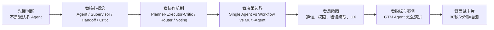
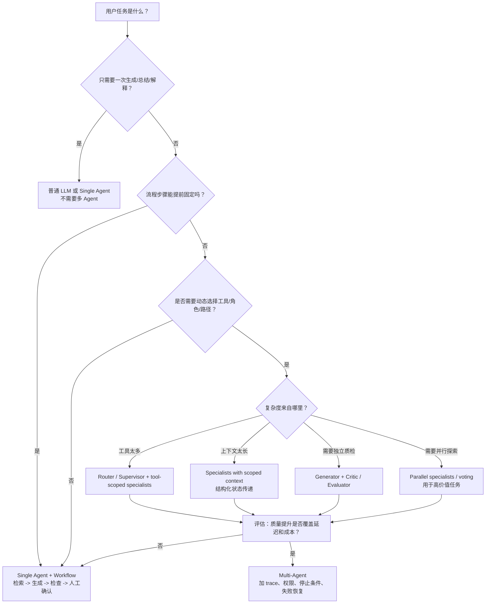
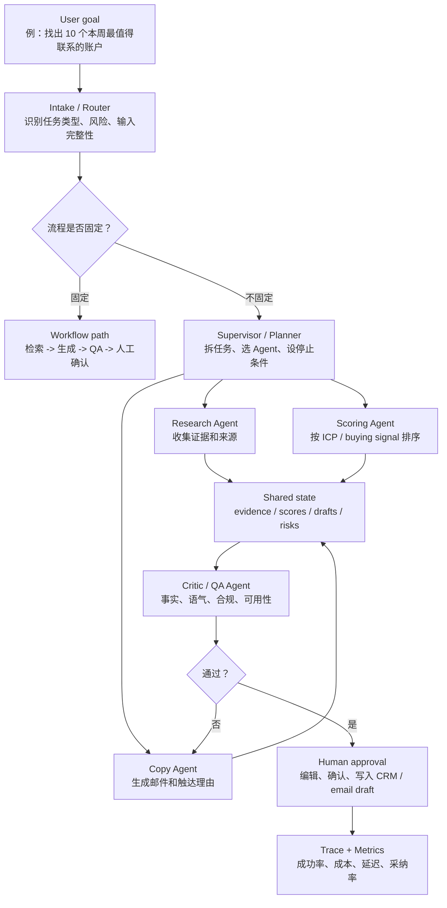
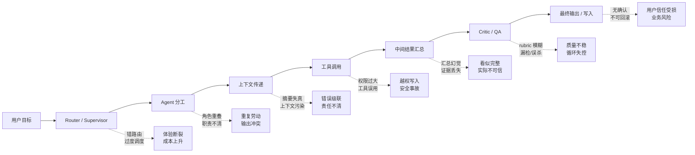

# 08. Multi-Agent 多智能体

> 面向强技术型 Agent 产品经理。目标不是把 CrewAI、AutoGen、LangGraph 名词背熟，而是能判断什么时候该用多 Agent，什么时候单 Agent + workflow 更好；能解释 planner / executor / critic、supervisor、handoff、协作与竞争；能在 GTM / Sales / Marketing Agent 场景里讲清产品价值、风险、指标和 MVP 取舍。

## 0. 先读这一页

### 0.1 三分钟速读

如果你只用 3 分钟预习这篇，记住下面 7 句话：

| 你要记住的点 | 面试里怎么说 |
|---|---|
| Multi-Agent 不是“多几个 prompt” | 它是把复杂任务拆给多个职责、工具、上下文和评价标准不同的 Agent |
| 多 Agent 的价值来自分工 | 专业化、并行、独立复核、权限隔离、上下文隔离是核心收益 |
| Workflow 通常是默认起点 | 如果流程可预测，用固定 workflow 更便宜、更快、更可控 |
| Supervisor 适合动态调度 | 如果只是固定顺序调用 A/B/C，就不该让 LLM 当 supervisor |
| Handoff 是控制权转移 | 交接的不只是文本，而是状态、上下文、权限和用户体验 |
| Critic 需要 rubric | 没有明确质量标准的 critic 只会产生泛泛建议和额外成本 |
| 多 Agent 的最大风险是复杂度 | 延迟、成本、通信损耗、错误级联、权限扩散和 debug 难度都会上升 |

一句面试总括：

> Multi-Agent 是复杂 Agent 产品的一种架构选择，用多个 specialist Agent 通过 router、workflow、supervisor 或 handoff 协同完成任务。它适合多领域、长上下文、工具多、路径不可预测、需要并行或独立质检的场景；但 MVP 阶段我通常先用单 Agent + workflow 验证价值，再根据失败数据拆出 researcher、scorer、writer、critic 或 supervisor。

### 0.2 本篇阅读路线



### 0.3 PM 决策速查表

| 决策问题 | 推荐判断 |
|---|---|
| 第一版 MVP 要不要上多 Agent？ | 默认不要。先用单 Agent + workflow 跑通核心任务、日志、人工确认和评估 |
| 什么时候拆 specialist Agent？ | 当失败数据指向明确瓶颈，如研究质量、评分一致性、文案幻觉、质检漏检 |
| 什么时候用 supervisor？ | 当任务路径需要动态选择子 Agent，而不是固定顺序执行 |
| 什么时候用 handoff？ | 当后续对话或执行应由另一个 specialist 接管，例如销售转安全、客服转退款 |
| 什么时候用 critic？ | 当有明确 rubric，且抓错收益高于额外延迟和成本 |
| 多 Agent 能否提高准确率？ | 不保证。只有在分工、独立证据、结构化评价或并行探索有效时才提升 |
| 如何控制多 Agent 成本？ | 小模型处理低风险子任务、结构化摘要传递、最大轮数、trace 分析、A/B 对比 |
| 高风险动作怎么设计？ | 最小权限、读写分离、human-in-the-loop、审计日志、回滚或撤销机制 |

### 0.4 单 Agent vs Workflow vs Multi-Agent 决策树



这棵树的重点是：

> 只要任务路径稳定，workflow 通常优先；只有当动态分工、上下文隔离、独立复核或并行探索带来可衡量收益时，多 Agent 才值得。

### 0.5 学完后你应该能做到

- 用 30 秒解释 Multi-Agent 和 workflow 的区别。
- 画出一个 GTM 多 Agent 协作流程。
- 判断什么时候需要 researcher / scorer / copywriter / critic。
- 解释 planner / executor / critic、supervisor、handoff、voting 的适用边界。
- 说清多 Agent 的通信成本、错误级联、权限扩散和 UX 风险。
- 给出一套评估指标：成功率、采纳率、事实准确率、handoff 成功率、critic 抓错率、延迟和单位成功成本。
- 在面试中讲清“为什么第一版 MVP 可能不该上多 Agent”。

## 1. What this module solves

Multi-Agent 多智能体解决的是：当一个 Agent 面对任务范围过大、工具过多、上下文过长、质量要求多维、执行路径不可提前穷举时，如何把工作拆给多个具备不同职责、提示词、工具权限、模型能力和评价标准的 Agent 协同完成。

对 Agent PM 来说，重点不是会不会说“让多个智能体协作”，而是能判断：

- 多 Agent 解决的是职责边界、上下文管理、并行处理、质量复核、动态分工还是组织协作问题。
- 它相比单 Agent + workflow 多带来了哪些成本：延迟、token、观测难度、错误传播、权限风险、用户体验不确定性。
- 什么时候用 supervisor、planner/executor/critic、handoff、router、parallel voting，什么时候只需要一个 Agent 加明确流程。
- 如何用指标证明多 Agent 值得，而不是只因为 demo 看起来更“智能”。

一句话定义：多 Agent 是一种把复杂 Agent 产品拆成多个可协调角色的架构，而不是“多调几次 LLM”的营销词。

## 2. Why an Agent PM must understand it

多 Agent 是 Agent 产品面试和实际落地里最容易被追问的主题之一，因为它处在产品价值、工程复杂度和风险控制的交界处。

PM 需要理解它，主要有六个原因：

- **MVP 范围判断**：很多团队一上来想做“研究 Agent + 写作 Agent + 审核 Agent + 管理 Agent”，但第一版往往应该是单 Agent + 明确 workflow，否则验证周期会变慢。
- **用户体验设计**：多 Agent 会改变用户看到的进度、解释、等待、确认和失败恢复方式。用户不关心有几个 Agent，只关心结果是否可信、过程是否可控。
- **成本和延迟控制**：多个 Agent 通常意味着更多模型调用、更多上下文传递和更多工具调用。PM 必须能回答“准确率提升是否值得多等 20 秒、多花 5 倍成本”。
- **权限和安全边界**：不同 Agent 可以有不同工具权限。研究 Agent 可以读网页，发送 Agent 可能不能直接发邮件，质检 Agent 只能审查不能执行。
- **评估体系设计**：多 Agent 不是只评估最终答案，还要评估任务分解是否正确、handoff 是否合理、critic 是否抓住问题、supervisor 是否过度调度。
- **组织协作映射**：GTM、Sales、Marketing、Support 等业务天然有研究、判断、生成、审批、执行等角色，多 Agent 能把业务角色映射为产品模块，但不能照搬人类组织复杂度。

面试里，一个成熟回答通常会说：多 Agent 是提高复杂任务可靠性的一种手段，但它不是默认选项；我会先用最简单的可控 workflow 验证任务价值，再在明确瓶颈处引入专门 Agent。

## 3. Core concept map

### 3.1 核心组成

| 概念 | 含义 | PM 应该关注什么 |
| --- | --- | --- |
| Agent | 带目标、上下文、工具、记忆和策略的执行单元 | 它对用户价值的职责是否清晰 |
| Role / Persona | Agent 的角色设定，如 researcher、writer、critic | 是否真的影响输出质量，而不是换名字 |
| Tool scope | 每个 Agent 可用的工具和权限 | 是否最小权限、是否有高风险动作 |
| Context | Agent 可见的信息、历史、任务状态 | 是否传太多导致混乱，传太少导致失真 |
| Supervisor | 负责路由、分配、汇总、停止的上级 Agent 或控制逻辑 | 是否可解释、可观测、可限制 |
| Planner | 把目标拆成步骤或子任务 | 计划是否稳定、是否过度规划 |
| Executor | 执行搜索、调用 API、写入、生成等动作 | 工具调用是否准确、是否可回滚 |
| Critic / Evaluator | 审查输出、提出修改或判定是否通过 | 标准是否明确，是否会空泛批评 |
| Handoff | 一个 Agent 把控制权转交给另一个 Agent | 转交条件、上下文摘要、用户体验 |
| Router | 根据输入类型选择下游 Agent 或 workflow | 分类准确率、错误路由恢复 |
| Memory / State | 跨步骤保存任务状态、用户偏好、证据和中间结果 | 哪些状态应该持久化，哪些只在一次任务内使用 |
| Trace | 记录每一步模型调用、工具调用、handoff、guardrail | 用于 debug、评估、审计和成本分析 |

### 3.2 常见架构模式

| 模式 | 工作方式 | 适合场景 | 主要风险 |
| --- | --- | --- | --- |
| Single Agent + tools | 一个 Agent 自己决定何时用工具 | 任务边界清晰、工具数量少 | 工具过多后选择混乱 |
| Single Agent + workflow | 固定步骤：检索、生成、校验、输出 | MVP、合规流程、可预测任务 | 灵活性低 |
| Router + specialists | 先分类，再交给专业 Agent | 输入类型差异明显，如售前/售后/技术支持 | 路由错导致体验断裂 |
| Supervisor + subagents | supervisor 调用多个子 Agent，再汇总 | 多领域任务、跨工具任务、并行研究 | supervisor 成为单点瓶颈 |
| Planner / Executor | planner 拆任务，executor 执行 | 长任务、工具执行、代码或研究任务 | 计划错后执行越跑越偏 |
| Evaluator / Optimizer | 一个生成，一个评价并反馈迭代 | 有明确质量标准的写作、翻译、质检 | 循环次数失控 |
| Handoff | 当前 Agent 把对话控制权交给另一个 Agent | 多阶段对话、客服升级、销售转技术 | 上下文丢失或用户困惑 |
| Debate / voting | 多个 Agent 独立回答，再投票或仲裁 | 高风险判断、内容审核、候选方案比较 | 成本高，可能制造虚假信心 |

### 3.3 一张文字版架构图

```text
User goal
  |
  v
Intake / Router
  |
  +--> Single workflow path, if task is predictable
  |
  +--> Supervisor, if task needs dynamic decomposition
          |
          +--> Research Agent: gather evidence
          +--> Scoring Agent: rank / qualify
          +--> Copy Agent: generate user-facing output
          +--> Critic Agent: check accuracy, policy, tone
          |
          v
      Synthesis / Final response / Human approval
          |
          v
      Trace, metrics, eval, cost log
```

### 3.4 Multi-Agent 协作流程图



这张图可以直接用于面试：先说明“入口判断是否需要多 Agent”，再说明“多 Agent 不是每个节点都自治，而是由 state、trace、权限和停止条件约束”。

### 3.5 单 Agent、Workflow、多 Agent 对比速查

| 方案 | 本质 | 适合 | 不适合 | PM 面试表达 |
|---|---|---|---|---|
| 普通 LLM / 单 Agent | 一个模型或 Agent 完成理解、生成和少量工具调用 | 简单问答、摘要、少量工具 | 工具太多、任务太长、需要独立质检 | “先用最小复杂度验证核心价值” |
| Single Agent + workflow | 固定步骤，代码或编排框架控制流程 | MVP、合规流程、可预测任务 | 每次路径都不同的开放任务 | “可预测流程优先 workflow，而不是 LLM supervisor” |
| Router + specialists | 先分类，再交给不同 specialist | 输入类型差异明显 | 分类边界模糊、路由错误成本高 | “router 要有测试集和 fallback” |
| Supervisor + subagents | supervisor 动态调用 specialist | 多工具、多领域、路径不可预测 | 低延迟、高频、低价值任务 | “supervisor 是动态调度，不是固定脚本换名字” |
| Planner / Executor / Critic | 计划、执行、评价分离 | 长任务、工具任务、质量复核 | rubric 不清、循环失控 | “critic 必须绑定业务检查项” |
| Parallel / voting | 多个 Agent 独立探索再仲裁 | 高价值策略、候选方案比较 | 高频任务、事实弱验证 | “投票不是事实证明，证据链仍然重要” |

## 4. How it works

### 4.1 多 Agent 的本质：分工 + 协调 + 状态

一个真正有用的多 Agent 系统不只是“多个 prompt 连起来”，它至少要回答三个问题：

- **谁负责什么**：每个 Agent 的输入、输出、工具权限、成功标准是什么。
- **谁决定下一步**：由固定代码、router、supervisor、planner，还是当前 Agent 自己 handoff。
- **共享什么状态**：原始对话、用户目标、证据、任务列表、草稿、评分、错误、审批记录如何传递。

工程上，多 Agent 可以实现为多个 LLM 调用、多个 graph 节点、多个可调用工具、多个服务，甚至多个团队维护的独立模块。产品上，它应该表现为更可靠的任务完成，而不是把内部复杂度暴露给用户。

### 4.2 Planner / Executor / Critic

这是最常见的三角色模式。

**Planner** 负责理解目标、拆解步骤、决定需要哪些信息和工具。例如用户说“帮我找 20 个适合 outbound 的 SaaS 账户并写邮件理由”，planner 会拆成行业筛选、账号研究、触发信号查找、ICP 匹配、优先级评分、文案生成、质检。

**Executor** 负责执行具体动作。它可能调用搜索、CRM、LinkedIn 数据源、公司数据库、邮件草稿 API。Executor 的关键不是“聪明”，而是工具调用准确、可追踪、失败能重试。

**Critic** 负责评估中间结果和最终结果。它可以检查证据是否支持结论、公司信息是否过期、评分理由是否空泛、邮件是否违反品牌语气或合规限制。

PM 要注意：critic 不是神奇保险丝。如果评价标准模糊，它只会输出“需要更具体”“可以更自然”这类低价值建议。critic 最好绑定明确 rubrics，例如：

- 账号评分是否包含可验证证据。
- outreach reason 是否引用最近 90 天内的业务信号。
- 文案是否避免虚构客户、虚构融资、虚构岗位变动。
- 是否输出了可被销售代表快速修改的草稿。

### 4.3 Supervisor

Supervisor 是一个协调者。它可以是 LLM，也可以是代码逻辑，也可以是两者组合。

常见职责：

- 读取用户目标和当前状态。
- 判断应该调用哪个子 Agent。
- 给子 Agent 传递任务说明和必要上下文。
- 汇总多个子 Agent 的结果。
- 决定是否继续迭代、停止、请求用户确认或升级人工。

Supervisor 模式适合“不同子任务需要不同工具和提示词”的场景。例如一个 Sales Assistant 同时需要日历工具、邮件工具、CRM 工具、网页研究工具。把所有工具交给一个 Agent 容易让模型选错工具、污染上下文、产生权限风险。Supervisor 可以把日历和邮件分给不同 specialist。

但 supervisor 也有明显成本：

- 它会增加至少一次模型调用。
- 它可能错误分配任务。
- 它可能把不完整或错误的中间结果汇总成看似完整的答案。
- 它本身也需要评估和 tracing。

产品判断：如果 supervisor 只是机械地按固定顺序调用 A、B、C，那通常应该写成 workflow；只有当任务路径需要动态判断时，supervisor 才更有价值。

### 4.4 Handoff

Handoff 是控制权转移。一个 Agent 不只是把结果交给另一个步骤，而是让另一个 Agent 接管后续对话或执行。

典型例子：

- 客服 triage Agent 发现是退款问题，handoff 给 refund Agent。
- Sales Agent 发现用户问安全审计，handoff 给 security specialist。
- Marketing Agent 完成初稿后，handoff 给 legal review Agent，再返回用户确认。

handoff 设计的关键是：

- **触发条件**：什么时候转交，什么时候继续留在当前 Agent。
- **上下文摘要**：交给下一个 Agent 的不是所有聊天记录，而是目标、已知事实、未解决问题、证据和约束。
- **用户提示**：用户是否需要知道“正在转给安全专家”？很多业务场景里透明切换能提升信任。
- **回退机制**：如果新 Agent 无法处理，是否能返回 supervisor 或请求人工。
- **权限变化**：handoff 后工具权限是否变化。例如文案 Agent 不能发送邮件，发送 Agent 必须经过 human approval。

LangGraph 和 OpenAI Agents SDK 都把 handoff 看作重要的多 Agent 原语：它通常表现为一个可被模型调用的 transfer 工具，同时更新状态和后续路由。

### 4.5 协作、竞争和投票

多 Agent 可以协作，也可以竞争。

协作模式是分工互补：研究 Agent 找证据，评分 Agent 排优先级，文案 Agent 写内容，质检 Agent 审核。

竞争模式是多个 Agent 解决同一问题，再比较输出：例如三个策略 Agent 分别提出 outbound campaign 方案，critic 用同一 rubric 打分，supervisor 选择最佳方案或合成混合方案。

竞争适合高价值、低频、质量要求高的任务；不适合高频、低价值、低延迟任务。它会显著增加成本，而且多个 Agent 达成一致并不等于事实正确。PM 应该把 voting 当作提升鲁棒性的技术，而不是可信度证明本身。

### 4.6 通信成本和上下文管理

多 Agent 最大的隐藏成本是通信。

每次 Agent 之间传递信息，都可能出现四类问题：

- **Token 成本**：传全文会贵，传摘要会丢细节。
- **信息失真**：上一个 Agent 的摘要可能省略关键证据。
- **上下文污染**：把内部推理、无关历史、失败尝试都传给下游，会让下游混乱。
- **责任不清**：最终答案错了，不知道是研究错、评分错、汇总错，还是 handoff 传错。

实用原则：

- 子 Agent 输出结构化结果，而不是长篇散文。
- 传递 evidence、decision、confidence、open_questions，而不是只传最终结论。
- 对下游 Agent 只暴露它需要的上下文。
- 关键证据保留原始链接或记录 ID，避免“摘要引用摘要”。
- trace 每一次调用、handoff、工具结果和最终引用。

## 5. What depth a PM needs

Agent PM 不需要自己实现完整多 Agent 框架，但需要能和工程师对齐这些问题：

### 5.1 必须懂到可以做产品决策

- 多 Agent 和 workflow 的区别。
- supervisor、router、handoff、planner/executor/critic 的适用边界。
- 每个 Agent 的职责、输入、输出、工具权限、失败恢复。
- 为什么多 Agent 会带来延迟、成本和评估复杂度。
- 如何用 trace、eval、人工抽检和业务指标评估。
- 如何设计 human-in-the-loop，尤其是外发邮件、CRM 写入、合同、价格承诺等高风险动作。

### 5.2 可以交给工程深挖

- LangGraph state graph 的具体节点和边实现。
- OpenAI Agents SDK 或 AutoGen AgentChat 的 API 细节。
- 分布式执行、队列、幂等、事务、并发控制。
- 模型调用缓存、上下文压缩、trace processor、日志采样。
- 安全沙箱、密钥隔离、工具权限系统。

### 5.3 PM 的关键问题清单

在评审多 Agent 方案时，PM 应该问：

- 用户任务是否真的不可预测，还是可以拆成固定 workflow？
- 每个 Agent 的存在是否带来可衡量质量提升？
- 哪些 Agent 可以并行，哪些必须串行？
- 哪些结果需要用户确认后才能执行？
- 如果一个 Agent 错了，系统如何发现、停止、回滚或提示用户？
- 新增一个 Agent 后，成功率、延迟、成本、可解释性分别如何变化？

## 6. Common product decisions and tradeoffs

### 6.1 什么时候真的需要多 Agent

应该考虑多 Agent 的典型信号：

- **任务天然多领域**：例如 GTM agent 同时需要市场研究、CRM 分析、文案、合规审查。
- **工具集合太大**：一个 Agent 面对 30 个相似工具时容易误用，把工具按职责拆给 specialist 更稳定。
- **上下文太长**：不同 Agent 只看相关上下文，可以减少噪音。
- **需要并行提高速度**：同时研究多个账户、多个竞品、多个候选方案。
- **需要独立复核**：生成和评估分离，降低同一个模型自我确认的风险。
- **任务路径不可提前确定**：每个输入需要不同调查路径，planner 或 supervisor 可以动态拆解。
- **组织上需要模块化维护**：不同团队维护 sales、support、security、billing Agent。

### 6.2 什么时候单 Agent + workflow 更好

不要为了“高级”而上多 Agent。以下情况更适合单 Agent + workflow：

- **流程稳定**：如“检索知识库 -> 生成回答 -> 引用来源 -> 安全检查”。
- **MVP 阶段主要验证需求**：还不知道用户是否愿意用、是否愿意付费时，多 Agent 会拖慢迭代。
- **任务低价值高频**：例如简单 FAQ、固定格式摘要，额外模型调用不划算。
- **实时交互要求高**：用户期望 1-3 秒响应，多 Agent 串行可能不可接受。
- **评估标准还不清楚**：不知道好坏怎么定义时，加 critic 也很难提升质量。
- **权限风险大但控制系统不成熟**：多个 Agent 共享高权限工具会放大事故面。
- **只是角色扮演差异**：如果 researcher、writer、reviewer 都用同一模型、同一上下文、同一工具、无独立标准，那多数时候只是 prompt chaining。

一个好判断：如果你能画出固定流程图，并且每一步的输入输出都稳定，优先 workflow；如果流程图每次都不同，且需要模型动态决定下一步，再考虑 Agent 或多 Agent。

### 6.3 多 Agent vs 微服务

多 Agent 很容易被类比成微服务，但两者不同。

- 微服务强调确定性接口、稳定契约、可独立部署。
- Agent 强调自然语言理解、动态决策、工具使用和不确定输出。

好的多 Agent 产品应该吸收微服务的边界思想：清晰职责、最小权限、结构化接口、可观测日志。但不能假设 Agent 会像微服务一样稳定执行。

### 6.4 成本、质量、速度的权衡

多 Agent 的收益通常来自质量，成本通常体现在速度和费用。

| 决策 | 好处 | 代价 | PM 判断 |
| --- | --- | --- | --- |
| 增加 research Agent | 事实更充分 | 搜索成本和等待增加 | 是否减少销售手动研究时间 |
| 增加 critic Agent | 错误和低质输出减少 | 多一次模型调用 | 是否降低人工返工率 |
| 并行多个候选生成 | 创意更多 | token 成本上升 | 是否用于高价值 campaign |
| supervisor 动态调度 | 更灵活 | debug 更难 | 是否存在多种不可预知路径 |
| handoff 给 specialist | 对话更专业 | 用户可能感到割裂 | 是否需要清晰状态提示 |

## 7. Common failure modes

### 7.0 多 Agent 协作风险图



读这张图时，PM 要抓住一个核心：多 Agent 的失败往往不是某个 Agent “不聪明”，而是分工、状态、权限、证据和停止条件没有设计清楚。

### 7.1 过度工程

最常见失败是 MVP 还没证明业务价值，就做了 5 个 Agent、复杂 supervisor、漂亮 trace UI。结果是 demo 很炫，真实用户只想要一个可靠的“帮我找账户并写邮件理由”。

缓解方法：第一版先做单 Agent + workflow + 人工确认；记录失败案例，只有在明确瓶颈处新增 Agent。

### 7.2 角色重叠

多个 Agent 名字不同，实际都在做分析和写作，输出互相覆盖。用户看到的是更慢、更长、更不一致的结果。

缓解方法：给每个 Agent 定义不可重叠职责和结构化输出。例如 researcher 只产 evidence table，不产最终邮件；copy Agent 只基于 evidence 写草稿，不编造事实。

### 7.3 Supervisor 错误路由

用户需要安全审查，supervisor 却路由给销售文案 Agent；或者本该结束却继续调用工具。

缓解方法：为路由建立测试集，记录路由置信度，低置信度走澄清或人工；对高风险路由设置规则优先级。

### 7.4 Handoff 上下文丢失

转交后，新 Agent 不知道用户已经提供了预算、地区、目标行业，导致重复提问或输出不一致。

缓解方法：定义 handoff packet，至少包含 user_goal、known_facts、constraints、completed_steps、open_questions、evidence_refs。

### 7.5 通信膨胀

每个 Agent 都把完整上下文、完整中间推理、完整搜索结果传给下一个 Agent，成本和延迟迅速失控。

缓解方法：只传结构化摘要和必要证据；长研究结果用引用 ID；定期压缩上下文。

### 7.6 错误级联

研究 Agent 找到错误信息，评分 Agent 基于错误信息打高分，文案 Agent 写出虚假理由，critic 又没有检查来源。

缓解方法：把事实核验作为独立标准；保留原始来源；critic 不只看最终文案，也检查证据链。

### 7.7 多 Agent 互相“礼貌认同”

多个 LLM Agent 在讨论中倾向达成表面共识，未必真正发现问题。尤其是 debate 模式，如果没有外部事实和明确 rubric，会制造虚假可靠感。

缓解方法：让 evaluator 按检查项打分；要求引用证据；对关键判断引入 deterministic checks 或人工抽检。

### 7.8 权限扩散

为了方便，每个 Agent 都能读 CRM、发邮件、改 Salesforce 字段、访问内部文档。prompt injection 或错误路由会放大损害。

缓解方法：最小权限、工具分层、敏感动作确认、审计日志、沙箱、允许列表、速率限制。

### 7.9 用户体验不可解释

用户等待很久，只看到“多个 Agent 正在协作”，但不知道卡在哪里、为什么结果可信、如何纠正。

缓解方法：展示面向用户的阶段进度，如“正在研究账户”“正在检查证据”“等待你确认是否写入 CRM”；不要展示无意义的内部角色戏剧化对话。

## 8. Metrics and evaluation methods

多 Agent 评估要覆盖三层：最终结果、中间过程、业务影响。

### 8.1 最终结果指标

- Task success rate：任务是否完成。
- Output accuracy：事实是否正确。
- Evidence coverage：关键结论是否有证据支持。
- User acceptance rate：用户是否采纳结果，如发送邮件、保存账户、接受评分。
- Human edit distance：用户对文案或研究结果的修改幅度。
- Rework rate：用户是否要求重做。

### 8.2 中间过程指标

- Routing accuracy：router / supervisor 是否选对 Agent。
- Handoff success rate：handoff 后是否顺利完成，不重复、不丢上下文。
- Tool call success rate：工具调用参数、权限、返回结果是否正确。
- Critic catch rate：critic 抓住真实问题的比例。
- False rejection rate：critic 错误拦截好结果的比例。
- Iteration count：平均循环次数，是否出现无意义往返。
- Context size per step：每步 token 和上下文增长。

### 8.3 成本和体验指标

- End-to-end latency：用户等待总时长。
- Cost per successful task：每个成功任务的模型和工具成本。
- Cost per accepted output：每个被用户采纳输出的成本。
- Escalation rate：需要人工介入比例。
- Time saved：销售或营销人员节省的研究、写作、审核时间。
- Conversion proxy：如高质量账户命中率、回复率、会议创建率，但要注意归因。

### 8.4 评估方法

- **Golden set**：准备一组真实业务任务和标准答案，覆盖常见、边界、高风险场景。
- **Trace grading**：逐条 trace 评分，分析是哪个 Agent、工具或 handoff 出错。
- **A/B test**：单 Agent workflow 与多 Agent 版本对比，不只看主观质量，也看延迟和采纳率。
- **Human review rubric**：让销售、营销、RevOps 用统一标准抽检。
- **Red team**：测试 prompt injection、错误权限、伪造来源、越权写入。
- **Cost sensitivity test**：模拟高并发和高频使用，观察单位经济性。

### 8.5 一个可用的质量 rubric

| 维度 | 1 分 | 3 分 | 5 分 |
| --- | --- | --- | --- |
| 事实准确性 | 明显编造 | 大体正确但证据弱 | 关键结论均有来源 |
| 任务分解 | 漏掉关键步骤 | 分解合理但冗余 | 步骤清晰且最小化 |
| 协作质量 | Agent 重复工作 | 偶有重复 | 职责清晰无重复 |
| 输出可用性 | 用户需大改 | 可作为初稿 | 可直接使用或轻改 |
| 风险控制 | 高权限无确认 | 部分动作确认 | 权限最小化且可审计 |
| 成本效率 | 明显不划算 | 可接受 | 质量提升覆盖成本 |

## 9. Keywords for engineering communication

PM 和工程师讨论多 Agent 时，常用关键词包括：

- Multi-agent system：多智能体系统。
- Orchestration：编排，决定 Agent 如何调用、路由、并行、停止。
- Supervisor：监督者或协调者 Agent。
- Subagent / specialist：子 Agent / 专家 Agent。
- Planner / executor / critic：计划、执行、评估角色。
- Router：输入分类和路由。
- Handoff：控制权转交。
- Tool calling / function calling：工具调用。
- Tool scope / permission boundary：工具权限范围。
- State graph：状态图，常见于 LangGraph。
- Shared state：共享状态。
- Context engineering：上下文工程，决定传什么给哪个 Agent。
- Trace：执行轨迹。
- Guardrail：护栏，如策略检查、格式检查、权限检查。
- Human-in-the-loop：人在回路中审批、编辑或确认。
- Termination condition：停止条件，如最大轮数、成功判定、失败判定。
- Retry / fallback：重试和降级。
- Evaluator-optimizer：评价者-优化者循环。
- Parallelization / voting：并行生成或投票。
- Least privilege：最小权限。
- Excessive agency：过度代理权限，安全风险关键词。

## 10. High-frequency interview questions and answers

### Q1: 什么是多 Agent？

多 Agent 是把一个复杂 Agent 产品拆成多个职责明确的 Agent 或 LLM 组件，由 router、workflow、supervisor 或 handoff 机制协调完成任务。每个 Agent 可以有不同提示词、工具、权限、上下文和评价标准。它的价值不是“更多角色”，而是更好的上下文管理、专业化、并行、复核和权限隔离。

### Q2: 多 Agent 和普通 workflow 有什么区别？

Workflow 是预定义路径，LLM 和工具按固定步骤执行；多 Agent 更强调多个可独立决策或专业化的角色协同。很多所谓多 Agent 其实只是 workflow。我的判断标准是：如果步骤可提前固定，优先 workflow；如果任务路径需要模型动态拆解、路由、复核或 handoff，再考虑多 Agent。

### Q3: 什么时候真的需要多 Agent？

当任务多领域、工具太多、上下文太长、需要并行研究、需要独立质检、执行路径不可预测，或组织上需要模块化维护时，可以考虑多 Agent。比如 GTM Agent 同时要研究账户、评分、生成文案、做合规检查，多 Agent 可以把职责和权限拆开。

### Q4: 什么时候不该用多 Agent？

MVP 早期、流程稳定、低价值高频任务、实时响应要求强、评估标准不清、权限系统不成熟时，不该默认上多 Agent。此时单 Agent + RAG + 工具调用 + 固定 workflow 往往更快、更便宜、更可控。

### Q5: Supervisor 的作用是什么？

Supervisor 负责理解任务状态，决定调用哪个子 Agent，给它传递上下文，汇总结果，并判断是否继续、停止或请求人工。它适合动态调度，但会增加成本和 debug 难度。如果 supervisor 只是固定顺序调用子任务，就应该用代码 workflow。

### Q6: Planner / Executor / Critic 怎么分工？

Planner 拆解任务，Executor 调工具或生成结果，Critic 根据 rubric 检查事实、质量、安全和格式。关键是 critic 要有明确检查标准，而不是泛泛地“看看哪里可以改进”。在产品上，这个模式适合长任务、研究任务、写作质检和工具执行。

### Q7: Handoff 和 router 有什么区别？

Router 通常是在入口或某个节点分类，把任务发到对应路径；handoff 是当前 Agent 在对话或执行过程中决定把控制权交给另一个 Agent。Handoff 更像“转接专家继续服务”，需要处理上下文摘要、用户体验和权限变化。

### Q8: 多 Agent 如何控制成本？

先做最小可行流程，只在瓶颈处加 Agent；能并行的并行，能用小模型的用小模型；传递结构化摘要而不是完整历史；设置最大轮数和停止条件；用 trace 找出无效调用；用 cost per accepted output 衡量是否值得。

### Q9: 多 Agent 最大风险是什么？

最大风险是复杂度失控：延迟变长、token 成本上升、错误级联、上下文丢失、权限扩散、评估困难。安全上尤其要关注 prompt injection、过度工具权限、敏感信息泄露和高风险动作无确认。

### Q10: 如何评估多 Agent 是否有效？

和单 Agent workflow 做 A/B 对比，指标包括任务成功率、事实准确率、用户采纳率、人工修改幅度、critic 抓错率、handoff 成功率、单位成功成本和端到端延迟。还要看 trace，定位是分解、工具、上下文、路由还是评价环节出错。

### Q11: 多 Agent 是否一定更准确？

不一定。多个 Agent 可能重复同样偏见，也可能互相确认错误。只有当分工能降低任务难度、增加独立证据、引入明确评价标准或并行探索时，多 Agent 才可能提升准确率。

### Q12: 面试中如何讲“第一版 MVP 为什么不上多 Agent”？

我会说：第一版目标是验证用户价值和核心任务闭环，而不是验证复杂架构。先用单 Agent + workflow 跑通研究、生成、人工确认和日志评估；如果数据证明瓶颈在事实研究、评分一致性或质检，再把对应环节拆成 specialist Agent。这样能更快学习，也能避免一开始就承担高成本和不可观测复杂度。

### Q13: 多 Agent 怎么处理安全和权限？

每个 Agent 只拿完成职责所需的最小工具权限。读工具和写工具分开，高风险动作要人工确认；外部网页、邮件、CRM 备注等不可信内容要隔离；所有工具调用、handoff 和写操作要 trace；对 prompt injection、敏感信息泄露、过度代理权限做红队测试。

### Q14: 多 Agent 与人类团队协作有什么关系？

它可以借鉴人类团队的分工，如研究员、AE、营销文案、法务审核，但不能照搬组织结构。Agent 之间沟通有 token 成本和信息损失，过多人设会让系统更慢更难控。产品上应该从任务瓶颈出发，而不是从组织图出发。

## 11. GTM / Sales / Marketing Agent example

### 11.1 业务目标

假设我们要做一个 GTM / Sales / Marketing Agent，帮助销售团队从目标账户列表中找出高优先级账户，生成有证据支持的 outreach reason，并写出可发送的个性化邮件草稿。

用户任务：

> “从这 50 个 SaaS 账户里找出最值得本周联系的 10 个，说明原因，并为每个账户写一封 outbound 邮件草稿。”

### 11.2 多 Agent 版本设计

可以拆成四个 Agent：

| Agent | 主要职责 | 工具 | 输出 |
| --- | --- | --- | --- |
| Research Agent | 搜集公司信息、近期新闻、招聘、技术栈、融资、领导层变化 | Web search、company DB、CRM、news API | 结构化 evidence table |
| Scoring Agent | 根据 ICP、触发信号、客户画像、销售优先级打分 | CRM、评分规则、历史 win/loss 数据 | account score、reason codes |
| Copy Agent | 基于证据和评分生成个性化邮件 | 品牌语气库、邮件模板、用户偏好 | subject、email body、CTA |
| QA / Critic Agent | 检查事实、引用、语气、合规、幻觉 | evidence table、policy、rubric | pass/fail、修改建议、风险标记 |

Supervisor 可以这样协调：

```text
Input account list
  -> Research Agent 并行研究 50 个账户
  -> Scoring Agent 根据证据和 ICP 排名前 10
  -> Copy Agent 为前 10 生成邮件
  -> QA Agent 检查事实和语气
  -> 如果 QA fail，返回 Copy Agent 修改
  -> Human approval
  -> Draft saved to CRM or email tool
```

### 11.3 这个设计的产品价值

- 销售代表不再手动研究账户，节省前期准备时间。
- 评分 Agent 让团队优先联系更可能转化的账户。
- 文案 Agent 把研究结果转成可执行邮件。
- QA Agent 降低虚构事实、冒犯语气、错误引用的风险。
- 分工后权限更清晰：Research Agent 只读，Copy Agent 只写草稿，发送动作必须人工确认。

### 11.4 为什么第一版 MVP 可能不该上多 Agent

第一版 MVP 的核心假设可能只是：

- 销售是否愿意使用 AI 生成的账户研究？
- AI 生成的 outreach reason 是否比现有模板更有用？
- 销售是否会采纳邮件草稿？

这些假设不需要一开始就做完整多 Agent。更稳的 MVP 可能是：

```text
Account input
  -> Fixed workflow:
       1. retrieve CRM/account context
       2. web research with constrained sources
       3. generate structured account brief
       4. generate email draft
       5. run deterministic checks + simple LLM QA
       6. human approval
```

这样可以更快上线、收集真实任务和失败案例。等数据表明：

- 研究质量不稳定，需要独立 Research Agent。
- 账户评分主观不一致，需要 Scoring Agent。
- 文案经常虚构或不符合语气，需要 QA Agent。
- 不同客户行业需要不同 specialist。

再逐步拆成多 Agent。

### 11.5 MVP 到多 Agent 的演进路径

| 阶段 | 架构 | 目标 |
| --- | --- | --- |
| V0 | 手动 prompt + 人工审查 | 验证任务有价值 |
| V1 | 单 Agent + fixed workflow | 跑通研究到草稿闭环 |
| V2 | 加 QA Agent | 降低事实和语气风险 |
| V3 | 拆 Research / Scoring / Copy | 提升专业化和可评估性 |
| V4 | Supervisor + parallel research | 支持大批量、动态调度 |
| V5 | CRM/email 写入 + human approval | 进入真实工作流 |

### 11.6 具体失败例子

如果 Research Agent 找到一篇旧新闻，说目标公司正在扩张欧洲市场，但实际上新闻来自两年前；Scoring Agent 因“欧洲扩张”打高分；Copy Agent 写“看到你们最近扩张欧洲市场”；QA Agent 没检查时间，最终邮件发出。这个错误会直接损害销售可信度。

改进方式：

- Research Agent 输出 evidence_date。
- Scoring Agent 对超过 180 天的信号降权。
- Copy Agent 只能使用 fresh_evidence=true 的证据。
- QA Agent 必须检查每个个性化句子是否有来源和时间。
- 发送前 human approval 显示证据链接。

这就是多 Agent 产品价值和风险的真实边界：它能把复杂任务拆清楚，但不能替代证据、权限和评估系统。

## 12. How to say it in interviews

### 12.1 30 秒版本

Multi-Agent 是把复杂 Agent 任务拆给多个具备不同职责、工具和上下文的 Agent 协作完成。它适合多领域、长上下文、动态分工、并行研究和独立质检的场景。但它会增加延迟、成本、错误传播和评估复杂度，所以我不会默认在 MVP 上用。我的原则是：先用单 Agent + workflow 验证核心闭环，再根据失败数据拆出 researcher、scorer、writer、critic 或 supervisor。

### 12.2 2 分钟版本

我会把多 Agent 看成一种产品架构选择，而不是概念炫技。它的价值在于职责分离、上下文管理、工具权限隔离、并行执行和质量复核。例如在 GTM Agent 中，researcher 负责找证据，scorer 负责根据 ICP 评分，copywriter 负责写邮件，critic 负责检查事实和合规，supervisor 负责调度和汇总。

但我会非常谨慎地上多 Agent。因为多一个 Agent 就多一次模型调用、多一段上下文传递、多一个失败点。很多任务用固定 workflow 更好，比如检索、生成、审核、人工确认。只有当任务路径不可预测、工具太多、上下文太长或需要独立评价时，我才会引入多 Agent。评估上我会看任务成功率、用户采纳率、事实准确率、handoff 成功率、critic 抓错率、端到端延迟和单位成功成本。

### 12.3 面试加分表达

- “多 Agent 的第一原则是降低复杂任务的认知负荷，不是增加角色数量。”
- “如果 supervisor 的决策是固定的，我会把它写成 workflow，而不是让 LLM 调度。”
- “Handoff 不是传一句话给下游，而是控制权、状态、上下文和权限一起变化。”
- “Critic 要绑定业务 rubric，否则只是多花钱买泛泛建议。”
- “多 Agent 的 trace 是产品能力，不只是工程日志，因为它决定了我们能不能评估、debug 和审计。”
- “GTM 场景里，第一版 MVP 我会保留 human approval，尤其是 CRM 写入和邮件发送。”

## 13. Quick memory summary

- 多 Agent = 多个职责明确的 Agent 通过协调机制完成复杂任务。
- 核心价值：专业化、上下文管理、并行、复核、权限隔离、模块化。
- 核心代价：延迟、成本、通信损耗、错误级联、观测难度、权限风险。
- 常见模式：router、supervisor、planner/executor/critic、handoff、evaluator-optimizer、parallel voting。
- 需要多 Agent：多领域、工具多、上下文长、路径不可预测、需要独立质检。
- 不需要多 Agent：MVP 早期、流程固定、低价值高频、低延迟要求、评估标准不清。
- PM 关键判断：新增 Agent 是否带来可衡量质量提升，是否值得成本和复杂度。
- GTM 案例：research Agent 找证据，scoring Agent 排优先级，copy Agent 写邮件，QA Agent 查事实和语气。
- MVP 建议：先单 Agent + workflow + 人工确认，再用失败数据决定拆分。
- 面试金句：多 Agent 是复杂任务的产品架构选择，不是默认答案。

## 14. 面试卡片与自测

### 14.1 面试官想考什么

面试官问 Multi-Agent，通常不是想听你列框架，而是在考 6 件事：

| 面试官的问题 | 实际想考 |
|---|---|
| Multi-Agent 是什么？ | 你是否理解职责分工、状态传递和协调机制 |
| 为什么不用单 Agent？ | 你是否能基于任务复杂度做架构取舍 |
| Supervisor / handoff / critic 有什么区别？ | 你是否理解多 Agent 的关键控制原语 |
| MVP 要不要上多 Agent？ | 你是否能控制范围，不被概念带跑 |
| 多 Agent 怎么评估？ | 你是否能看最终结果、中间过程和业务指标 |
| 最大风险是什么？ | 你是否有成本、延迟、权限、错误级联和可观测性意识 |

### 14.2 30 秒回答模板

> Multi-Agent 是把一个复杂 Agent 任务拆给多个职责明确的 specialist Agent，通过 workflow、router、supervisor 或 handoff 协作完成。它适合多领域、工具多、上下文长、路径不可预测、需要并行或独立质检的任务。但它不是默认选项，因为会增加延迟、成本、通信损耗、错误级联和权限风险。我的产品原则是先用单 Agent + workflow 验证核心闭环，再基于失败数据逐步拆出 researcher、scorer、writer、critic 或 supervisor。

### 14.3 2 分钟回答模板

> 我会把 Multi-Agent 当成一种架构选择，而不是 Agent 产品的默认形态。它的核心是分工、协调和状态：每个 Agent 有明确职责、工具权限、上下文和评价标准；协调层决定是固定 workflow、router、supervisor，还是由 Agent handoff；共享状态要记录证据、草稿、评分、风险和 trace。
>
> 在 GTM Agent 里，第一版我可能不会直接做完整多 Agent，而是先用单 Agent + workflow 完成账户研究、邮件草稿和人工确认。等真实数据证明研究质量不稳定、评分不一致、文案幻觉或质检漏检，再拆出 Research Agent、Scoring Agent、Copy Agent 和 QA Agent。这样做的好处是专业化、并行和独立复核，风险是成本、延迟、上下文失真、权限扩散和 debug 难度。所以我会用任务成功率、用户采纳率、事实准确率、handoff 成功率、critic 抓错率、端到端延迟和单位成功成本来判断它是否值得。

### 14.4 容易踩坑

| 踩坑说法 | 更好的说法 |
|---|---|
| “多 Agent 一定比单 Agent 强。” | “只有分工、证据、评价和权限设计正确时，多 Agent 才可能更强。” |
| “先做一个 manager Agent 管所有事。” | “如果路径固定，用 workflow；supervisor 只用于动态调度。” |
| “让 critic 看看就安全了。” | “critic 必须有明确 rubric，且不能替代工具权限和人工确认。” |
| “几个 Agent 辩论后达成一致就可信。” | “一致不等于真实，关键结论仍要证据和事实核验。” |
| “把所有上下文都传给下一个 Agent。” | “只传必要状态和证据引用，避免 token 膨胀和上下文污染。” |
| “多 Agent 的过程不用给用户看。” | “用户至少要看到阶段进度、证据、确认点和失败恢复路径。” |

### 14.5 读完自测题

不看原文，试着回答这些问题：

1. Multi-Agent 和 prompt chaining 的区别是什么？
2. Single Agent + workflow 和 Supervisor + subagents 的核心差异是什么？
3. 为什么说第一版 GTM Agent MVP 可能不该上多 Agent？
4. Planner、Executor、Critic 各自负责什么？分别怎么评估？
5. Handoff 和 router 有什么区别？handoff packet 应该包含哪些信息？
6. 多 Agent 通信成本包括哪几类？如何降低？
7. 多 Agent 为什么可能制造“虚假可靠感”？
8. GTM Agent 中 Research Agent、Scoring Agent、Copy Agent、QA Agent 的输入输出分别是什么？
9. 如果 QA Agent 漏掉一条过期新闻导致邮件写错，系统应该如何改进？
10. 你会用哪些指标证明多 Agent 版本比单 Agent workflow 更值得？

### 14.6 掌握标准

达到 80% 面试可用理解，你应该能独立完成这件事：

> 设计一个 GTM / Sales Agent 的架构演进方案：先说明为什么 V1 用单 Agent + workflow；再说明什么时候拆出 Research / Scoring / Copy / QA Agent；画出 supervisor 或 workflow 的协作路径；定义每个 Agent 的职责、工具权限、输入输出、handoff/state 设计、人工确认点、失败模式和评估指标。

如果你能用 3-5 分钟讲清这套方案，并能主动补一句“多 Agent 不是默认答案，必须用数据证明质量收益覆盖复杂度成本”，这篇就算真正吸收了。

## 15. References

- [LangChain docs: Multi-agent](https://docs.langchain.com/oss/javascript/langchain/multi-agent) - 多 Agent 模式、subagents、handoffs、skills、router，以及“并非所有复杂任务都需要多 Agent”的判断。
- [LangChain docs: Handoffs](https://docs.langchain.com/oss/javascript/langchain/multi-agent/handoffs) - handoff 的状态驱动、工具触发、上下文工程和实现考虑。
- [LangChain docs: Supervisor tutorial](https://docs.langchain.com/oss/javascript/langchain/supervisor) - supervisor pattern 如何协调专业子 Agent，并说明 direct user interaction 更适合 handoff。
- [OpenAI Agents SDK guide](https://platform.openai.com/docs/guides/agents-sdk/) - Agents SDK 支持工具、handoff、streaming 和 trace。
- [OpenAI Agents SDK: Handoffs](https://openai.github.io/openai-agents-python/handoffs/) - handoff 作为 transfer tool 的设计、输入过滤和专业 Agent 转交。
- [OpenAI Agents SDK: Tracing](https://openai.github.io/openai-agents-python/tracing/) - trace 如何记录 LLM generation、tool call、handoff、guardrail 等生产调试信息。
- [OpenAI API docs: Agents](https://platform.openai.com/docs/guides/agents) - AgentKit、Agent Builder、工具、guardrails、memory、logic nodes 和 Agents SDK 的整体定位。
- [OpenAI API docs: Using tools](https://platform.openai.com/docs/guides/tools) - tool use、built-in tools、function calling、MCP、file search、web search 等能力。
- [Anthropic: Building effective agents](https://www.anthropic.com/research/building-effective-agents) - workflow 与 agent 的区别、优先简单组合模式、orchestrator-workers、evaluator-optimizer、什么时候使用 agents。
- [Anthropic: New capabilities for building agents on the Anthropic API](https://www.anthropic.com/news/agent-capabilities-api) - code execution、MCP connector、Files API、prompt caching 等 agent 能力。
- [CrewAI docs: Processes](https://docs.crewai.com/en/concepts/processes) - sequential、hierarchical、manager Agent / manager LLM 的多 Agent task orchestration。
- [CrewAI introduction](https://docs.crewai.com/introduction) - Crews 与 Flows 的定位，以及在 Flow 中触发 Crew 处理复杂自治任务。
- [Microsoft AutoGen: Agent and Multi-Agent Applications](https://microsoft.github.io/autogen/dev/user-guide/core-user-guide/core-concepts/agent-and-multi-agent-application.html) - Agent 作为消息通信、自带状态和动作的实体，多 Agent 应用的基本特征。
- [Microsoft AutoGen: Multi-agent Conversation Framework](https://microsoft.github.io/autogen/docs/Use-Cases/agent_chat/) - conversable agents、human/tool/LLM 组合、多 Agent 对话协作。
- [OWASP Top 10 for LLM Applications 2025 PDF](https://owasp.org/www-project-top-10-for-large-language-model-applications/assets/PDF/OWASP-Top-10-for-LLMs-v2025.pdf) - prompt injection、sensitive information disclosure、excessive agency、unbounded consumption 等 Agent 产品安全风险。
