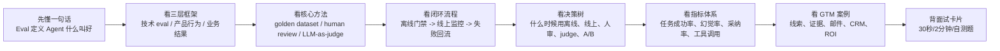
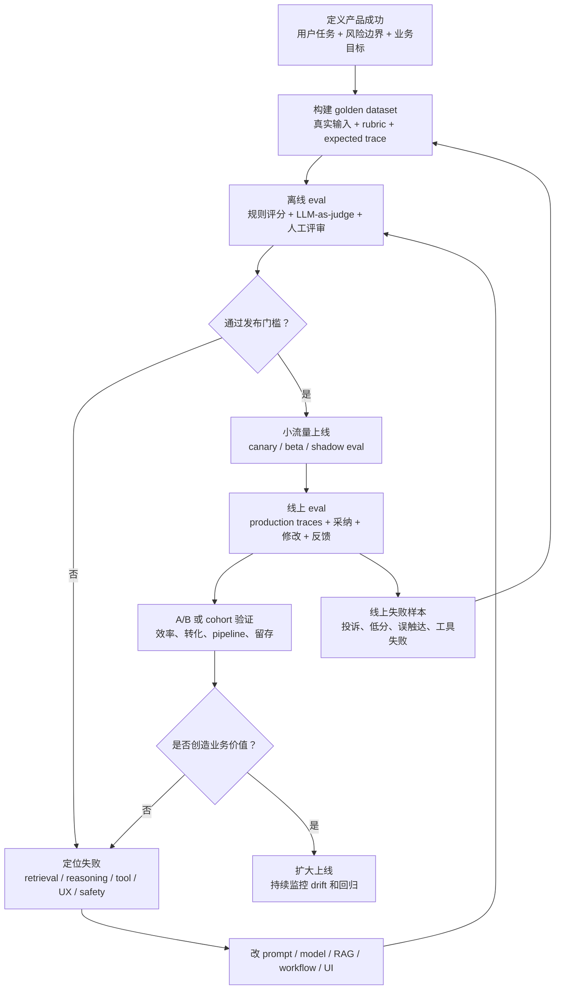
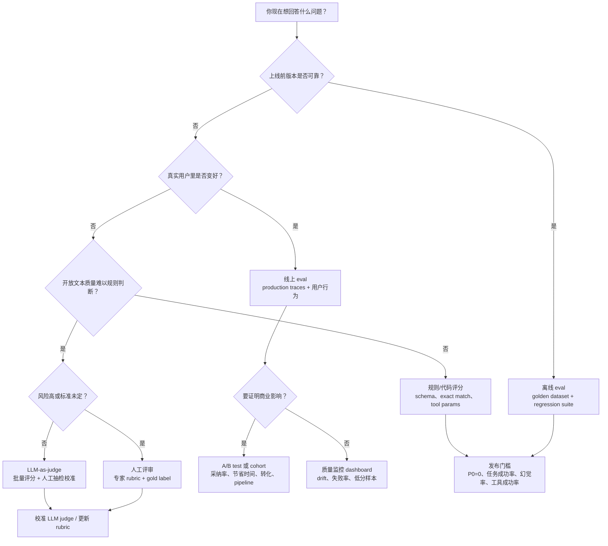

# 09. Eval 评测体系

> 目标读者：强技术型 Agent 产品经理 / AI Native PM / Agent Builder PM。
> 目标：读完后能在面试中解释 Agent 产品如何定义“效果好”，能区分离线评测、线上评测、golden dataset、人工评审、LLM-as-judge、任务成功率、准确率、采纳率、幻觉率、工具调用成功率、回归测试、A/B 测试和业务指标，并能用 GTM / Sales / Marketing Agent 讲清楚完整评测闭环。

## 0. 先读这一页

### 0.1 三分钟速读

如果你只用 3 分钟预习这篇，记住下面 7 句话：

| 你要记住的点 | 面试里怎么说 |
|---|---|
| Eval 不是“测模型聪不聪明” | 它是判断 Agent 是否可靠完成用户任务、能否上线和迭代的质量系统 |
| “效果好”要拆三层 | 技术 eval 看正确性和可控性，产品指标看用户是否采纳，业务指标看是否创造价值 |
| Golden dataset 是质量标尺 | 它把真实任务、参考答案、rubric、预期工具调用和风险场景固定下来 |
| Agent 要评 trace，不只评 final answer | 因为错误常发生在检索、工具选择、参数、审批和中间决策里 |
| LLM-as-judge 可扩展但要校准 | 它适合批量评开放文本，但必须用人工 gold set 校准，不能当绝对真理 |
| 离线 eval 是发布门禁，线上 eval 是质量雷达 | 离线防回归，线上发现真实长尾和漂移，A/B test 验证业务影响 |
| 指标要连成因果链 | 证据准确率提升 -> 人工修改率下降 -> 采纳率提升 -> 节省时间/转化提升 |

一句面试总括：

> Agent Eval 的本质，是把“好不好用”拆成可复现、可监控、可回归的质量标准。PM 要把离线技术评测、线上用户行为和业务指标连成闭环：先用 golden dataset、trace grading、人工评审和 LLM-as-judge 保证任务可靠，再用采纳率、修改率、A/B test 和 ROI 指标证明它真的创造价值。

### 0.2 本篇阅读路线



### 0.3 PM 决策速查表

| 决策问题 | 推荐判断 |
|---|---|
| 第一版 Agent 要先看什么指标？ | 先看任务成功率、严重幻觉率、工具调用成功率、人工评审通过率，再看采纳率 |
| 什么时候必须建 golden dataset？ | 只要要上线、换模型、改 prompt、改工具或承诺企业客户质量，就必须建 |
| 什么时候用人工评审？ | 冷启动定义标准、高风险输出、复杂事实核验、校准 LLM judge 时必须用 |
| 什么时候用 LLM-as-judge？ | 开放文本量大、人审成本高、需要持续监控趋势时用，但要抽样校准 |
| 什么时候看线上 eval？ | 上线后持续看真实 traces、采纳、修改、重试、工具失败和质量漂移 |
| 什么时候做 A/B test？ | 离线质量过门槛后，用真实用户验证采纳率、效率和业务结果是否提升 |
| 技术指标和业务指标冲突怎么办？ | 先守住安全和事实红线，再用用户行为指标判断质量提升是否转化为价值 |
| Sales Agent 最该盯什么？ | 线索采纳率、证据准确率、人工修改率、节省时间、触达转化率、CRM 成功率 |

### 0.4 学完后你应该能做到

- 用 30 秒解释 Agent Eval 的三层框架。
- 画出离线 eval、线上 eval、A/B test 和失败回流的闭环。
- 给一个 GTM / Sales Agent 设计 golden dataset 和上线门槛。
- 区分任务成功率、准确率、采纳率、幻觉率、工具调用成功率和业务指标。
- 判断什么时候用人工评审，什么时候用 LLM-as-judge，什么时候必须 A/B。
- 回答“离线分数提升但线上采纳下降怎么办”。
- 用证据准确率、人工修改率、线索采纳率、节省时间和触达转化率讲清 Sales Agent ROI。

## 1. What this module solves

Eval 评测体系解决的核心问题是：**我们如何知道一个 Agent 真的变好了，而不是只是 demo 看起来更顺了？**

传统软件可以用单元测试、接口测试、线上漏斗和稳定性指标来判断质量。Agent 产品更麻烦，因为它的输出通常是开放文本、多步推理、工具调用、检索、记忆、规划和人工协作的组合。一次“成功”不是简单返回 200，也不只是模型答对一道题，而是用户是否愿意把它产生的结果用于真实工作。

对 Agent PM 来说，Eval 不是工程团队的附属测试项，而是产品定义的一部分。它回答这些问题：

- 这个 Agent 到底要完成什么用户任务？
- 哪些结果算好，哪些结果算危险？
- 质量、速度、成本、稳定性、可控性之间怎么取舍？
- 模型、prompt、RAG、工具调用、workflow 改动后，是否真的提升？
- 离线评测分数提升，是否能转化为线上采纳率、转化率、节省时间、收入或留存提升？
- 当线上反馈变差时，如何定位是检索坏了、工具坏了、prompt 坏了、模型变了，还是用户场景分布变了？

一句话：**Eval 是 Agent 产品从“感觉不错”走向“可迭代、可上线、可销售、可负责”的质量系统。**

## 2. Why an Agent PM must understand it

Agent PM 不需要亲自写完整 eval infra，但必须能定义“好”的标准，并和工程、数据、GTM、客户成功团队对齐。

你必须理解 Eval，因为：

- Agent 的质量无法只靠主观试用判断。开放式输出很容易让团队被几个漂亮案例误导。
- 模型能力不是产品效果。模型 benchmark 高，不等于你的客户场景完成率高。
- Agent 的失败常常发生在中间步骤。最终答案看似还行，但可能检索错来源、调用错工具、跳过审批、捏造证据。
- 每次 prompt、模型、RAG、工具、工作流、权限和 UI 变化都可能引入回归。
- 企业客户会问：上线前怎么验收？上线后怎么监控？如何证明 ROI？如何防止幻觉和错误自动化？
- 面试中，Eval 是判断你是否懂 AI Native 产品化的高频分水岭。

一个成熟回答通常不是“我们看准确率”，而是：

> 我会把 Agent 效果拆成离线技术 eval、线上产品行为指标和业务结果指标三层。离线 eval 用 golden dataset、人工评审、LLM-as-judge 和 trace grading 保证核心任务、工具调用、证据引用和安全策略不过线；线上 eval 用真实 traces、用户反馈、采纳率、人工修改率和失败原因采样监控质量漂移；最终看是否提升销售触达效率、线索转化、节省时间或降低人工成本。技术指标是因，业务指标是果，中间用用户采纳行为连接。

## 3. Core concept map

### 3.1 Eval 的三层

| 层级 | 关注问题 | 常见对象 | 常见指标 | PM 关注点 |
|---|---|---|---|---|
| 技术 eval | Agent 输出是否正确、稳定、可控 | 模型输出、RAG、tool call、workflow trace | accuracy、faithfulness、context precision、tool call success、schema pass、latency、cost | 上线前能否过质量门槛，改动是否回归 |
| 产品行为指标 | 用户是否真的使用和信任 | 点击、采纳、编辑、重试、反馈、人工接管 | adoption、acceptance rate、edit rate、retry rate、thumbs up/down、human override | 用户是否愿意把 Agent 结果用于真实工作 |
| 业务指标 | 是否创造业务价值 | 销售、营销、客服、运营、研发流程结果 | conversion、time saved、pipeline influenced、成本下降、留存、NPS | Agent 是否值得买、值得续费、值得扩展 |

### 3.2 Eval 的常见类型

| 类型 | 中文解释 | 适合回答什么问题 |
|---|---|---|
| Offline evaluation | 离线评测，用固定测试集在上线前或 CI 中跑 | 新版本是否比旧版本好？是否引入回归？ |
| Online evaluation | 线上评测，用生产 traffic / traces 持续监控 | 真实用户场景里是否变差？是否出现新 failure mode？ |
| Golden dataset | 高质量黄金测试集，包含真实输入、参考答案、rubric、元数据 | 我们是否有稳定标准判断 Agent 好坏？ |
| Human review | 人工评审，由专家按 rubric 标注 | 开放式质量、事实正确性、品牌语气、复杂业务判断是否可靠？ |
| LLM-as-judge | 用另一个 LLM 按评分规则评审输出 | 能否规模化评审主观或复杂输出？ |
| Trace grading | 对 Agent 端到端轨迹评分 | Agent 是否选对工具、按顺序执行、遵守策略？ |
| Regression test | 回归测试，固定 cases 检测改动破坏 | prompt / model / workflow 改动是否把旧能力弄坏？ |
| A/B test | 线上实验，不同用户或流量看到不同版本 | 新 Agent 版本是否提升用户行为和业务结果？ |

### 3.3 Agent 产品的“好”不是一个数

Agent 产品通常至少有 7 个维度：

1. **任务完成**：用户要的结果是否完成，比如找到合适线索、生成可用邮件、更新 CRM。
2. **事实与证据**：结论是否基于可靠来源，引用是否准确，是否幻觉。
3. **工具与流程**：是否调用正确工具，参数是否正确，是否遵守权限、审批和顺序。
4. **用户可用性**：输出是否清晰、可编辑、符合工作流，不需要大量返工。
5. **效率**：是否节省时间，是否降低人工搜索、整理、写作、录入成本。
6. **风险控制**：是否泄露数据、越权操作、错误触达客户、违反品牌或合规要求。
7. **商业结果**：是否提升转化、响应、销售 pipeline、留存、毛利或客户满意度。

### 3.4 Eval 闭环图



这张图是 Eval 面试回答的骨架：

- **先定义好**：没有产品成功标准，就没有好 eval。
- **离线做门禁**：上线前证明不回归、不越线。
- **线上做雷达**：生产中发现真实长尾、漂移和用户不信任。
- **业务做验证**：最终要证明节省时间、提升转化或降低成本。
- **失败要回流**：线上失败进入 golden dataset，下一次发布不再重犯。

### 3.5 离线 / 线上 / 人工 / LLM-as-judge / 业务指标决策树



快速记忆：

- **问“能不能发版”**：用离线 eval + 回归测试。
- **问“用户是否信任”**：看线上 eval + 采纳/修改/重试。
- **问“开放式答案好不好”**：用 LLM-as-judge，但要人工校准。
- **问“高风险是否安全”**：用人工评审和强规则。
- **问“是否赚钱/省钱”**：用 A/B、cohort 和业务指标。

## 4. How it works

### 4.1 从“定义好”开始，而不是从“选工具”开始

Agent eval 的第一步不是问“用 LangSmith 还是 RAGAS”，而是定义成功标准。

一个好的成功标准应该具体、可测量、贴近用户任务，并能被评审者复现。例如：

- 差的定义：销售 Agent 输出要“高质量”。
- 好的定义：对 100 个目标账户，Agent 生成的 outreach reason 中，至少 85% 必须包含一个可验证的近期业务信号；证据链接准确率不低于 95%；销售人工修改少于 30%；被销售采纳用于邮件或 LinkedIn 的比例不低于 40%；单个账户研究时间从 12 分钟降到 3 分钟以内。

这里可以看到，技术 eval 和产品指标已经连在一起了：

- “证据链接准确率”是技术质量。
- “人工修改率”和“采纳率”是用户行为。
- “节省时间”和“触达转化率”是业务价值。

### 4.2 拆解 Agent 工作流

以 GTM / Sales Agent 为例，它可能做这些步骤：

1. 输入：销售给出目标公司、ICP、产品、行业、地区。
2. 检索：搜索公司官网、新闻、财报、招聘、技术栈、社媒动态。
3. 识别信号：判断公司是否有扩张、融资、招聘、技术迁移、合规压力、竞争替换等 buying signals。
4. 找人：找到目标账号里的关键角色，如 VP Sales、RevOps、Marketing Ops、Data Lead。
5. 生成观点：把 buying signal 连接到产品价值主张。
6. 输出：生成 evidence-backed outreach reason、邮件草稿、CRM notes。
7. 工具调用：写入 CRM、创建任务、排期 follow-up、同步到 Salesloft / Outreach。
8. 人工确认：销售编辑、采纳、发送或驳回。

每一步都可以评测：

| 步骤 | 技术 eval | 产品指标 |
|---|---|---|
| 检索 | context precision、context recall、source freshness | 销售是否打开/引用来源 |
| 信号识别 | buying signal classification accuracy | 销售是否认为 signal 有用 |
| 找人 | contact match accuracy、role accuracy | 是否被加入 prospect list |
| 生成观点 | factual correctness、faithfulness、tone fit | 邮件采纳率、人工修改率 |
| 工具调用 | tool call accuracy、schema pass、API success | CRM 更新成功率、人工接管率 |
| 整体任务 | task success rate、goal accuracy | 节省时间、触达转化率、pipeline influenced |

### 4.3 构建 golden dataset

Golden dataset 是一组高质量、可复用的评测样本。它不是随便攒一些聊天记录，而是产品质量的“标尺”。

一个 Agent golden dataset 通常包含：

- `input`：用户任务、上下文、约束，例如“为 Snowflake 账户生成 3 个 outbound 理由”。
- `reference output`：理想答案或关键要点，不一定是一段唯一文本。
- `rubric`：评分规则，例如事实准确、证据充分、角色匹配、语气适合、是否允许发送。
- `expected tool calls`：应该调用哪些工具、参数是否正确、是否需要审批。
- `metadata`：行业、地区、账户规模、难度、来源、是否边界 case。
- `negative examples`：常见错误答案，例如捏造融资、引用旧新闻、联系人角色不匹配。
- `risk label`：是否涉及 PII、合规、客户承诺、品牌敏感话术。

PM 要推动 golden dataset 覆盖真实分布，而不是只覆盖 demo cases：

- 高频正常场景：常见行业、常见销售动作。
- 高价值场景：大客户、复杂账户、多联系人。
- 高风险场景：证据不足、同名公司、过期新闻、竞争对手敏感信息、监管行业。
- 历史失败场景：线上出现过的投诉、误发、严重幻觉。
- 新功能场景：新工具、新数据源、新工作流对应的 cases。

数据集可以从三类来源来：

1. **人工设计**：PM、销售专家、解决方案工程师根据目标 workflow 设计 cases。
2. **生产采样**：从真实 traces 中抽取成功、失败、边界和高价值样本。
3. **合成扩展**：用 LLM 根据种子样本生成更多变体，但需要人工抽检，不能直接当 gold。

### 4.4 选择评分方式

评分方式没有银弹。成熟团队会组合使用。

| 评分方式 | 适合场景 | 优点 | 风险 |
|---|---|---|---|
| 代码/规则评分 | JSON schema、字段存在、工具参数、分类标签、精确答案 | 快、便宜、稳定、适合 CI | 不适合复杂开放式质量 |
| 传统 NLP/检索指标 | RAG、搜索、摘要相似度 | 可批量、可比较 | 不能完全代表业务可用性 |
| 人工评审 | 专业判断、品牌语气、复杂事实核验 | 质量最高、能发现新问题 | 慢、贵、一致性需要管理 |
| LLM-as-judge | 开放文本、rubric 评分、pairwise 比较 | 快、可扩展、能覆盖更多样本 | 会偏见、会误判、需要校准 |
| 线上用户反馈 | 采纳、编辑、删除、重试、投诉 | 最贴近真实价值 | 有延迟、受 UI 和用户习惯影响 |

一个常见模式是：

- 第一层：规则检查，保证格式、工具参数、权限、禁止项。
- 第二层：LLM-as-judge，按 rubric 评估事实、相关性、完整性、语气。
- 第三层：人工评审，校准 LLM judge，审核高风险和抽样 case。
- 第四层：线上指标，验证用户是否真的采纳和产生业务结果。

### 4.5 离线评测

离线评测是在上线前、发布前、PR 前、模型切换前，用固定数据集跑 Agent。

它适合回答：

- 新 prompt 是否比旧 prompt 好？
- 换模型后成本降了，质量是否还能接受？
- 新增 RAG 数据源后幻觉是否下降？
- 工具调用 schema 改了，Agent 是否还能正确调用？
- 加了新功能后，旧场景是否回归？

离线评测的基本流程：

1. 准备 golden dataset。
2. 固定 Agent 版本、模型、prompt、工具 mock 或沙箱环境。
3. 批量运行每个 case。
4. 记录最终输出和 trace。
5. 用规则、LLM-as-judge、人工评审打分。
6. 和 baseline 版本对比。
7. 设置发布门槛，例如 task success 不低于 85%，严重幻觉为 0，工具调用成功率不低于 98%，成本不超过 baseline 的 120%。

离线评测的关键价值是**可重复**。它像 Agent 产品的“质量刹车”，防止团队凭感觉上线。

### 4.6 线上评测

线上评测是在真实用户流量里持续监控质量。它通常没有 reference answer，所以更依赖 traces、用户反馈、启发式规则、LLM judge 和抽样人工评审。

它适合回答：

- 真实用户问的问题是否偏离了 golden dataset？
- 哪些行业、账户、用户角色失败率最高？
- 是否出现质量漂移，比如某个数据源变差、模型行为变化、工具 API 错误？
- 用户是否采纳 Agent 输出？是否大量修改？
- Agent 是否造成错误触达、CRM 脏数据、客户投诉？

线上评测的常见信号：

- 用户行为：采纳、编辑、复制、发送、撤回、删除、重试。
- 显式反馈：点赞/点踩、原因标签、评论。
- 工作流结果：CRM 是否成功更新、邮件是否发送、任务是否完成。
- trace 指标：工具失败、检索无结果、超时、重试、handoff、guardrail block。
- LLM judge：对生产样本打相关性、事实性、风险和语气分。
- 人工抽检：对高价值客户、高风险输出和低分样本进行专家审核。

线上 eval 的重点不是替代 A/B 测试，而是给产品团队一个质量雷达。它能告诉你“哪里坏了”和“为什么坏”，A/B 测试更擅长告诉你“新版本是否让用户行为更好”。

### 4.7 Trace grading：Agent eval 的关键能力

Agent 不只是输入到输出，中间的轨迹也很重要。Trace 包含模型调用、工具调用、检索、handoff、guardrail、重试和最终输出。

为什么要评测 trace？

- 最终答案正确，但过程可能危险。例如 Agent 用了未经授权的数据源。
- 最终答案错误，需要知道是检索失败、工具参数错、模型总结错还是用户输入不足。
- 有些任务的正确性在中间步骤。例如“必须先查 CRM 再写邮件”，如果跳过 CRM，就算邮件看起来合理也不合格。
- 多 Agent / workflow 系统需要评测路由和 handoff 是否正确。

Trace grading 可以评测：

- 是否选择了正确工具。
- 是否按正确顺序调用。
- 工具参数是否完整且安全。
- 是否使用了检索证据，而不是凭空生成。
- 是否触发了必要的人审或审批。
- 是否在不确定时澄清，而不是强行执行。
- 是否违反系统指令、权限或安全策略。

对 PM 来说，trace grading 是把“Agent 行为质量”从黑箱输出变成可诊断产品质量的关键。

## 5. What depth a PM needs

PM 不需要自己搭建整套 eval backend，但应该掌握以下深度。

### 5.1 必须能定义指标

你要能把一个模糊目标拆成可评测指标：

- “好用”拆成任务完成率、采纳率、人工修改率、重试率。
- “可信”拆成证据准确率、幻觉率、引用覆盖率、不确定性表达率。
- “自动化可靠”拆成工具调用成功率、参数准确率、审批命中率、回滚率。
- “有商业价值”拆成节省时间、转化率、pipeline influenced、人工成本下降。

### 5.2 必须能设计 golden dataset

你要能回答：

- 数据集来自哪里？
- 是否覆盖真实用户分布？
- 是否包含高风险和边界场景？
- 谁定义 reference answer 和 rubric？
- 数据集如何版本管理？
- 线上失败如何回流到离线数据集？

### 5.3 必须理解评分方式的边界

你要知道：

- exact match 很可靠，但只适合确定性答案。
- LLM-as-judge 可扩展，但不能不经校准就当真理。
- 人工评审质量高，但需要 rubric 和一致性检查。
- 线上采纳率很重要，但受 UI、用户权限、激励机制影响。
- 业务指标最有说服力，但受销售周期、市场活动、季节性影响，归因更难。

### 5.4 必须能推动发布门槛

例如一个 Sales Agent 的发布门槛可以是：

- P0 安全/合规失败：0。
- 工具调用 schema pass：>= 99%。
- CRM 写入成功率：>= 98%。
- 证据准确率：>= 95%。
- 严重幻觉率：<= 1%。
- 任务成功率：>= 85%。
- 人工评审平均分：>= 4/5。
- 延迟 P95：<= 20 秒。
- 每个账户处理成本：<= 目标人工成本节省的 20%。

这些门槛不是永远固定，而是随着产品成熟逐步提高。

## 6. Common product decisions and tradeoffs

### 6.1 技术 eval 还是业务指标优先？

产品早期不能只看业务指标，因为业务指标噪声大、反馈慢。比如销售邮件转化率可能受名单质量、销售能力、市场季节、品牌强弱影响。早期应该先用技术 eval 确保 Agent 输出可用，再用线上行为指标验证用户愿意使用，最后看业务指标。

成熟路径是：

1. 技术 eval：能否正确、安全、稳定地完成任务。
2. 产品指标：用户是否采纳，是否少改，是否少重试。
3. 业务指标：是否提升转化、节省时间、降低成本。

### 6.2 准确率还是任务成功率？

准确率通常衡量某个判断或答案是否正确。任务成功率衡量用户目标是否完成。

例如 Sales Agent：

- 联系人职位识别准确率：这个人是不是 VP Marketing。
- 证据准确率：引用的新闻是否真的支持 outreach reason。
- 任务成功率：Agent 是否完成“找到合适联系人 + 生成可发送的个性化邮件 + 写入 CRM”的完整目标。

Agent PM 应该更关心任务成功率，但不能忽略组件准确率。因为组件准确率能帮助定位失败。

### 6.3 LLM-as-judge 还是人工评审？

建议用组合，而不是二选一：

- 冷启动：人工评审 50-200 个样本，定义 rubric，形成 gold 标准。
- 扩展期：LLM-as-judge 批量评分，人工抽检 judge 的一致性。
- 高风险场景：人工评审或强规则优先。
- 线上监控：LLM judge 做筛查，人工看低分、高价值和随机样本。

LLM-as-judge 适合“扩大覆盖面”，人工评审适合“校准标准和处理风险”。

### 6.4 离线分数提升但线上没提升怎么办？

常见原因：

- Golden dataset 不代表真实用户分布。
- 离线指标没有覆盖用户真正关心的可用性。
- UI 或工作流摩擦太大，导致用户不采纳。
- Agent 输出质量提升，但节省时间不明显。
- 线上用户任务更复杂，多轮上下文更多。
- 业务指标受外部因素影响，需要更长实验周期。

PM 应该把线上失败样本回流到 dataset，重新检查 eval 是否评估了正确问题。

### 6.5 自动执行还是人审确认？

Agent 越接近真实业务动作，越需要分级自动化：

| 风险等级 | 示例 | 产品策略 | 评测重点 |
|---|---|---|---|
| 低风险 | 草稿、摘要、建议 | 自动生成，用户可编辑 | 采纳率、修改率、相关性 |
| 中风险 | CRM notes、内部任务 | 默认建议，用户确认后写入 | 工具调用成功率、字段准确率 |
| 高风险 | 对外邮件、报价、删除数据 | 人审或审批流 | 事实准确、权限、安全、误发率 |
| 极高风险 | 法务承诺、医疗/金融建议 | 避免自动化或强约束 | 合规、拒答、升级人工 |

### 6.6 成本、延迟和质量怎么权衡？

Eval 不能只看质量分。一个 Agent 如果准确率提升 2%，但成本翻 5 倍、延迟从 8 秒到 90 秒，产品上未必值得。

建议使用组合指标：

- Quality：任务成功率、证据准确率、幻觉率。
- Speed：平均延迟、P95、超时率。
- Cost：单任务 token 成本、工具成本、人审成本。
- UX：等待放弃率、重试率、编辑率。

面试表达可以说：

> 我不会单独追求模型分数。我会定义一个 product quality frontier：在满足最低质量和安全门槛的前提下，选择能带来最高用户采纳和业务价值的成本/延迟组合。

## 7. Common failure modes

### 7.1 只看 demo，不建 eval

几个漂亮样例很容易掩盖长尾失败。Agent 产品尤其容易被“流畅文本”欺骗，因为输出看起来专业，不代表事实正确。

### 7.2 Golden dataset 太干净

只用理想输入评测，会高估真实质量。真实用户会给模糊任务、缺字段、脏数据、同名公司、过期上下文和冲突指令。

### 7.3 把 LLM-as-judge 当绝对真理

LLM judge 会偏向流畅、长答案、自信语气，也可能漏掉细微事实错误。必须用人工 gold set 校准，并关注 judge 与人类的一致性。

### 7.4 技术指标和业务指标断裂

例如 RAG faithfulness 提升，但销售仍不用，因为输出太长、不可直接发、语气不符合品牌，或 CRM 操作太麻烦。

### 7.5 只评最终答案，不评中间 trace

Agent 的很多失败在中间步骤：工具选错、参数错、检索错、跳过审批、重复调用、隐藏失败。只看最终答案会漏掉系统性问题。

### 7.6 没有回归测试

团队改 prompt、换模型、更新工具描述后，旧场景悄悄变差。没有固定 eval suite，就只能等用户发现。

### 7.7 线上反馈没有回流

如果线上失败样本没有进入离线 dataset，团队会反复修同类问题。Eval 应该是闭环，不是一次性报告。

### 7.8 指标被优化坏了

如果只优化“邮件采纳率”，Agent 可能生成更短、更讨好销售但事实更弱的内容。如果只优化“幻觉率”，Agent 可能过度拒答，降低任务完成率。所以指标必须成组使用。

### 7.9 没有分层指标

整体任务成功率下降时，如果没有 retrieval、reasoning、tool、output、UX 分层指标，很难定位问题。

## 8. Metrics and evaluation methods

### 8.1 Agent 核心指标表

| 指标 | 中文解释 | 计算方式示例 | 适用场景 | 注意事项 |
|---|---|---|---|---|
| Task Success Rate | 任务成功率 | 成功完成目标的 case / 总 case | 端到端 Agent | 需要明确成功定义 |
| Accuracy | 准确率 | 正确判断 / 总判断 | 分类、抽取、问答、工具选择 | 开放任务要配 rubric |
| Adoption Rate | 采纳率 | 用户采纳 Agent 输出次数 / 输出次数 | 草稿、建议、推荐 | 受 UI 和用户习惯影响 |
| Acceptance Rate | 接受率 | 用户直接接受或轻微修改后接受 / 建议次数 | Copilot、推荐、自动补全 | 需要定义“轻微修改” |
| Edit Rate | 人工修改率 | 被修改输出 / 被采纳输出 | 文案、邮件、CRM notes | 高修改率说明可用性不足 |
| Hallucination Rate | 幻觉率 | 无依据或错误事实输出 / 总输出 | RAG、研究、对外内容 | 需要证据标准 |
| Faithfulness | 忠实度 | 输出是否被给定上下文支持 | RAG、摘要、研究 | 不等于答案完整 |
| Evidence Accuracy | 证据准确率 | 引用能正确支持 claim 的比例 | Sales research、分析报告 | 要查链接、时间、主体 |
| Context Precision | 检索精确率 | 检索结果中相关内容占比 | RAG 检索 | 低精确率会增加噪音 |
| Context Recall | 检索召回率 | 应检索证据中被取回的比例 | RAG 检索 | 低召回会漏关键信息 |
| Tool Call Success Rate | 工具调用成功率 | 成功工具调用 / 总工具调用 | Agent workflow | 区分 API 成功和语义正确 |
| Tool Call Accuracy | 工具调用准确率 | 正确工具+正确参数 / 总工具调用 | 多工具 Agent | 需要 trace 或 gold trajectory |
| Schema Pass Rate | 格式通过率 | 符合 JSON/schema 的输出 / 总输出 | 结构化输出 | 只能保证格式，不保证内容 |
| Latency P95 | P95 延迟 | 95% 请求完成时间 | 线上体验 | 多步 Agent 特别关键 |
| Cost per Task | 单任务成本 | token + 工具 + 人审成本 | 商业化 | 要和节省时间/价值比 |
| Human Escalation Rate | 人工接管率 | 需要人工处理 / 总任务 | 半自动 workflow | 高接管可能是质量或 UX 问题 |
| Regression Fail Rate | 回归失败率 | 新版本失败但旧版本通过的 case / 总 case | 发布前测试 | 应按严重性分级 |

### 8.2 离线评测方法

离线评测组合建议：

1. **Exact / string / regex / schema checks**：判断结构化输出、字段、格式、禁止词、工具参数。
2. **Reference-based scoring**：和参考答案比较，适合问答、抽取、分类。
3. **RAG metrics**：context precision、context recall、faithfulness、answer relevancy、response groundedness。
4. **Trajectory eval**：评估 Agent 是否走了正确路径、调用正确工具。
5. **LLM-as-judge rubric scoring**：对开放式输出按 1-5 分、pass/fail、标签分类评分。
6. **Pairwise evaluation**：A 输出和 B 输出哪个更好，适合 prompt/model 对比。
7. **Human expert review**：建立 gold labels、评估高风险和复杂质量。
8. **CI regression gate**：在 PR 或 nightly build 中跑核心 suite，低于阈值不发布。

### 8.3 线上评测方法

线上评测组合建议：

1. **Production tracing**：记录每次 run 的输入、输出、中间步骤、工具调用、延迟、成本。
2. **User feedback**：显式反馈和隐式行为都要收集。
3. **Sampling review**：按随机、低分、高价值客户、高风险动作抽样人工评审。
4. **Online LLM judge**：对生产样本做 reference-free 质量、安全、事实风险筛查。
5. **Drift detection**：监控用户意图、行业、输入长度、工具错误、检索失败率的变化。
6. **A/B testing**：验证新版本对采纳率、修改率、转化率、节省时间的真实影响。
7. **Incident review**：严重失败进入 case library，并回流到 golden dataset。

### 8.4 回归测试

回归测试的目标是防止“修了一个问题，坏了十个旧能力”。

Agent 回归 suite 应该包含：

- 核心 happy path。
- 高频用户任务。
- 历史线上失败。
- 安全/合规红线。
- 工具调用关键路径。
- RAG 关键知识点。
- 高价值客户场景。
- 竞品/敏感/不确定性场景。

常见发布门槛：

- P0/P1 cases 必须 100% 通过。
- 总体任务成功率不能低于 baseline。
- 新版本关键指标提升必须超过预设最小差异。
- 成本/延迟不能超过上限。
- 如果质量提升但风险指标变差，需要产品/工程/安全共同审批。

### 8.5 A/B 测试

A/B 测试用于验证新版本在线上是否真的更好。它和离线 eval 的区别是：

- 离线 eval 看“在标准测试集上是否更好”。
- A/B test 看“在真实用户行为和业务结果上是否更好”。

Sales Agent 可 A/B 的变量：

- 不同 prompt。
- 不同模型。
- 不同检索源。
- 不同输出格式。
- 自动写 CRM vs 用户确认后写入。
- 先展示证据再展示邮件 vs 先展示邮件再展开证据。

可观察指标：

- 线索采纳率。
- 邮件草稿采纳率。
- 人工修改率。
- 每个账户研究耗时。
- 邮件发送率。
- 回复率 / 会议预约率。
- 销售每周触达账户数。
- CRM 数据质量。

A/B 注意事项：

- 不要用高风险动作直接放量。
- 要先确保离线质量过门槛。
- 业务指标周期长时，先用 leading indicators，如采纳率、修改率、节省时间。
- 要避免用户间污染，例如同一销售同时看到多个版本会影响判断。
- 要分层看效果，不同行业、客户规模、销售成熟度可能不同。

### 8.6 技术 eval 与产品指标的连接

一条成熟的连接链路是：

```text
技术能力提升
  -> 更高事实准确率 / 更低幻觉 / 更好工具调用
  -> 更少人工修改 / 更高采纳 / 更少重试
  -> 更快完成工作 / 更高触达量 / 更高信任
  -> 更高回复率 / 转化率 / pipeline / 留存 / 续费
```

PM 最重要的能力是识别哪个技术指标是业务指标的 leading indicator。

例如：

- 对 Sales research Agent，证据准确率通常是采纳率的 leading indicator。
- 对 Email drafting Agent，人工修改率通常是发送率的 leading indicator。
- 对 CRM automation Agent，工具调用成功率和字段准确率通常是用户信任的 leading indicator。
- 对 Marketing content Agent，品牌语气一致性和合规通过率通常是发布效率的 leading indicator。

## 9. Keywords for engineering communication

| English keyword | 中文理解 | PM 应该怎么用 |
|---|---|---|
| eval / evaluation | 评测 | 统称质量测量体系 |
| golden dataset | 黄金测试集 | 高质量、可复用、带标准答案或 rubric 的测试集 |
| ground truth | 标准答案 / 真值 | 人工或权威数据确认的正确结果 |
| rubric | 评分规则 | 让人工和 LLM judge 按同一标准评分 |
| evaluator / grader | 评审器 / 打分器 | 规则、代码、LLM 或人工评审流程 |
| LLM-as-judge | 大模型评审 | 用 LLM 批量评估开放式输出 |
| human annotation | 人工标注 | 专家对样本打标签或评分 |
| inter-rater agreement | 标注一致性 | 多个人或人与 judge 是否一致 |
| trace | 轨迹 | Agent 一次运行的完整步骤记录 |
| trajectory evaluation | 轨迹评测 | 评估中间步骤和工具调用是否正确 |
| task success rate | 任务成功率 | 端到端目标完成比例 |
| faithfulness / groundedness | 忠实度 / 有依据性 | 输出是否被上下文或证据支持 |
| hallucination rate | 幻觉率 | 错误或无依据事实比例 |
| context precision / recall | 检索精确率 / 召回率 | RAG 检索质量 |
| tool call accuracy | 工具调用准确率 | 工具选择和参数是否正确 |
| regression test | 回归测试 | 检查新版本是否破坏旧能力 |
| canary | 金丝雀发布 | 小流量观察新版本 |
| A/B test | 线上实验 | 验证新版本对真实行为是否更好 |
| drift | 漂移 | 数据、用户行为或模型质量随时间变化 |
| eval gate | 评测门禁 | 发布前必须达到的质量阈值 |

## 10. High-frequency interview questions and answers

### Q1: 你如何定义一个 Agent 产品“效果好”？

**回答：**

我会把“效果好”拆成三层。第一层是技术质量：任务成功率、事实准确率、幻觉率、工具调用成功率、格式通过率、延迟和成本。第二层是产品行为：用户是否采纳、是否大量修改、是否重试、是否愿意把结果用于真实工作。第三层是业务结果：是否节省时间、提升转化、降低成本或增加收入。

对 Agent 来说，不能只看最终文本是否顺眼，还要看 trace：是否检索了正确证据、调用了正确工具、遵守了权限和审批。最终我会用离线 eval 保证上线门槛，用线上 eval 和 A/B test 验证真实价值。

### Q2: 离线评测和线上评测有什么区别？

**回答：**

离线评测是在上线前用固定 dataset 跑，主要用于 benchmark、回归测试和版本对比。它有 reference answer 或 rubric，因此可重复、可比较，适合做发布门禁。

线上评测是在真实生产流量中监控，通常没有标准答案，所以更多依赖 traces、用户反馈、行为指标、LLM judge 和人工抽样。它用于发现质量漂移、真实长尾问题和用户是否真的采纳。

成熟体系会把两者连起来：线上失败样本回流到 golden dataset，离线验证修复，线上再确认效果。

### Q3: 什么是 golden dataset？怎么构建？

**回答：**

Golden dataset 是产品核心任务的高质量评测样本集合，包含输入、参考答案或关键要点、评分 rubric、预期工具调用、元数据和风险标签。它的价值是让团队有稳定标准判断改动是否变好。

构建时我会从三类来源拿数据：PM 和领域专家设计的核心场景、真实生产 traces 中的成功/失败样本、以及少量 LLM 合成的边界变体。关键是覆盖真实任务分布、高价值客户、高风险场景和历史失败，而不是只覆盖 demo case。

### Q4: LLM-as-judge 可靠吗？

**回答：**

LLM-as-judge 适合规模化评估开放式输出，但不能无校准地当真理。它会受 rubric、模型偏见、答案长度、流畅度和上下文完整性影响。

我的做法是：先用人工专家标注一批 gold set；让 LLM judge 按明确 rubric 输出结构化分数和理由；对比 judge 与人工的一致性；对高风险、低置信度、分歧样本做人工复核；定期重新校准。它更适合作为筛查和趋势监控，而不是唯一的上线依据。

### Q5: 准确率、任务成功率、采纳率有什么区别？

**回答：**

准确率通常是某个子任务判断是否正确，比如联系人角色识别、公司行业分类、证据是否支持 claim。任务成功率是端到端目标是否完成，比如是否完成“研究账户、生成可发送邮件、写入 CRM”。采纳率是用户是否接受 Agent 输出，代表用户信任和工作流可用性。

Agent PM 应该同时看三者：准确率帮助定位组件质量，任务成功率衡量端到端能力，采纳率连接到产品价值。

### Q6: 幻觉率怎么评估？

**回答：**

先定义什么算幻觉：无来源事实、来源不支持的 claim、主体搞错、时间过期、数据捏造、引用错误等。然后用证据标准评估，例如输出中的每个事实 claim 是否能被检索上下文或权威来源支持。

方法上可以结合 RAG faithfulness、证据链接检查、LLM judge、人工抽检和线上用户反馈。对高风险业务，比如对外销售邮件，我会把严重事实错误设为发布红线，而不仅是平均分。

### Q7: Agent 的工具调用怎么 eval？

**回答：**

要分两层：API 是否调用成功，和语义上是否调用正确。API 200 只能说明工具没报错，不代表 Agent 选对工具或参数正确。

我会在 golden dataset 里定义 expected tool calls，包括应调用工具、调用顺序、关键参数、是否需要审批。然后通过 trace grading 检查工具选择、参数、顺序、重试、错误处理和最终结果。线上再监控工具失败率、人工接管率、回滚率和脏数据率。

### Q8: 回归测试在 Agent 产品里怎么做？

**回答：**

我会把核心 golden dataset 接入 CI 或发布流程。每次 prompt、模型、RAG、工具描述、workflow 改动，都跑一轮固定 eval。P0/P1 cases 必须通过，整体任务成功率、幻觉率、工具调用成功率、延迟和成本不能低于门槛。

特别重要的是把线上事故和失败样本加入回归 suite，确保同类问题不会反复出现。

### Q9: 如果离线 eval 变好，但线上采纳率下降，你怎么排查？

**回答：**

我会先确认数据分布是否一致：离线 dataset 是否代表真实用户任务。然后看产品行为：输出是否更长、更慢、更难编辑、CTA 是否不清晰、证据展示是否增加负担。再看 trace：是否因为新版本增加检索或人审导致延迟上升。最后分层看用户和场景：是不是某些行业或角色变差。

这说明离线指标可能没有覆盖用户真正的可用性指标，需要把线上低采纳样本回流到 dataset，并增加人工修改率、可发送率、时间节省等指标。

### Q10: 如何证明 Sales Agent 的 ROI？

**回答：**

我会用三类指标证明。第一是效率：每个账户研究时间从多少降到多少，销售每周能多处理多少账户。第二是质量和采纳：线索采纳率、证据准确率、邮件人工修改率、CRM 写入成功率。第三是业务结果：触达发送率、回复率、会议预约率、pipeline influenced。

早期可以用节省时间和采纳率作为 leading indicators；成熟后用 A/B test 或 cohort 分析证明对转化和 pipeline 的影响。

### Q11: 你会如何设置一个 Agent 发布门槛？

**回答：**

我会先按风险分级。对低风险草稿功能，门槛可以偏向采纳率、修改率、延迟和成本。对会写 CRM 或对外触达的功能，需要更严格：工具调用成功率、字段准确率、证据准确率、幻觉率、安全策略通过率和人工审批命中率。

例如 Sales Agent：P0 安全失败为 0，证据准确率 >= 95%，严重幻觉率 <= 1%，工具调用成功率 >= 98%，任务成功率 >= 85%，P95 延迟 <= 20 秒，人工修改率持续下降。具体阈值要根据场景风险和客户 SLA 调整。

### Q12: 技术 eval 和业务指标怎么连接？

**回答：**

技术 eval 是 leading indicators，业务指标是最终结果。连接方式是用户行为指标。

比如 Sales Agent：提升 context precision 和 evidence accuracy，应该降低幻觉和人工核查成本；这会提高销售对结果的采纳率，降低修改率，缩短账户研究时间；最终可能提升触达量、回复率和 pipeline。PM 的工作就是把这条因果链定义清楚，并用线上实验验证。

## 11. GTM / Sales / Marketing Agent example

### 11.1 场景设定

产品：一个 GTM Agent，帮助 B2B 销售和营销团队研究目标账户，发现 buying signals，生成 evidence-backed outreach reason，推荐联系人，产出邮件草稿，并写入 CRM。

目标用户：SDR、AE、GTM Ops、Demand Gen、RevOps。

核心承诺：

- 把单个账户研究时间从 10-15 分钟降到 2-4 分钟。
- 给出可验证的触达理由，而不是泛泛 personalization。
- 帮销售更快找到值得触达的人和理由。
- 让营销团队按账户信号生成更精准的 campaign segment。

### 11.2 “效果好”的定义

| 维度 | 指标 | 目标示例 |
|---|---|---|
| 线索质量 | 线索采纳率 | SDR 采纳 Agent 推荐线索比例 >= 40% |
| 证据质量 | 证据准确率 | claim 被来源支持比例 >= 95% |
| 事实风险 | 严重幻觉率 | 捏造融资、客户、职位等 P0 错误 <= 1% |
| 工作效率 | 节省时间 | 每账户研究时间减少 60%-75% |
| 文案可用性 | 人工修改率 | 被发送邮件中大改比例 <= 30% |
| 触达效果 | 触达转化率 | 回复率或会议预约率相对 baseline 提升 |
| 工具可靠性 | CRM 写入成功率 | 成功写入且字段正确 >= 98% |
| 用户信任 | 重试/撤回率 | 重试率下降，撤回率维持低位 |

### 11.3 Golden dataset 示例

一个 case 可以这样定义：

```yaml
id: gtm_sales_001
task: 为目标账户生成 3 个 outbound reasons 和一封首封邮件
account: Acme Cloud Security
icp: B2B SaaS, 500-5000 employees, recently hiring security/compliance roles
product: AI-powered compliance automation platform
expected_evidence:
  - 最近 90 天内的招聘或新闻信号
  - 公司官网或可信第三方来源
  - 信号必须和 compliance automation pain 相关
expected_tool_calls:
  - search_company_news(account)
  - search_jobs(account, keywords=["security", "compliance", "GRC"])
  - get_crm_account(account)
rubric:
  factual_accuracy: 0-5
  evidence_support: 0-5
  relevance_to_product: 0-5
  sales_usability: 0-5
  tone_and_brand: 0-5
failure_conditions:
  - 捏造融资、客户、职位或新闻
  - 使用 12 个月以前的信号却声称“recent”
  - 没有证据链接
  - 自动写入 CRM 前未经过用户确认
```

### 11.4 离线 eval suite

建议分成 6 组：

1. **账户研究**：检索是否找到正确公司、近期新闻、招聘、技术栈。
2. **信号识别**：是否正确判断 buying signal 和优先级。
3. **联系人推荐**：是否找到匹配角色，避免同名人和过期职位。
4. **邮件生成**：是否事实准确、个性化、可发送、符合品牌语气。
5. **工具调用**：是否正确读写 CRM、创建任务、记录 notes。
6. **风险控制**：是否拒绝无证据结论，是否触发人审。

每组都有 component metric 和端到端 metric。这样当整体任务成功率下降时，可以定位是哪一层坏了。

### 11.5 线上 dashboard

一个 PM 可以推动这样的 dashboard：

| 模块 | 指标 |
|---|---|
| Usage | 活跃销售数、每人每周账户研究数、功能入口点击率 |
| Quality | 证据准确率、LLM judge 质量分、人工抽检通过率 |
| Adoption | 线索采纳率、邮件采纳率、CRM note 采纳率 |
| Editing | 人工修改率、大改率、删除率、重试率 |
| Workflow | 工具调用成功率、CRM 写入失败、审批触发率 |
| Efficiency | 平均账户研究时间、节省时间估算、P95 延迟 |
| Business | 邮件发送率、回复率、会议预约率、pipeline influenced |
| Risk | 幻觉率、错误证据、客户投诉、误触达、合规拦截 |

### 11.6 典型迭代例子

问题：线上发现邮件采纳率低，销售反馈“理由看起来泛泛”。

排查：

1. 离线 evidence accuracy 还不错，但 `relevance_to_product` 分数低。
2. Trace 显示 Agent 检索到了新闻，但没有把 news signal 和产品 pain 连接起来。
3. 人工评审发现输出中“公司正在增长，所以可能需要自动化”这种弱推理太多。

改动：

- 在 rubric 中增加“signal-to-pain connection”评分项。
- Golden dataset 增加弱相关 negative examples。
- Prompt 要求每个 reason 包含 `signal -> likely pain -> product angle -> evidence`。
- UI 中把证据和推荐话术并排展示，降低销售核查成本。

验证：

- 离线 relevance_to_product 从 3.2/5 到 4.1/5。
- 人工大改率从 48% 降到 29%。
- 邮件采纳率从 22% 到 39%。
- A/B 中回复率观察到提升，但继续等待更长周期确认 pipeline 影响。

这就是技术 eval、产品指标和业务指标连接的完整故事。

## 12. How to say it in interviews

### 12.1 30 秒版本

> 我会把 Agent eval 分成离线技术评测、线上质量监控和业务指标三层。离线用 golden dataset、trace grading、人工评审和 LLM-as-judge 检查任务成功率、事实准确、工具调用和安全；线上用 production traces、采纳率、修改率、用户反馈和抽样人审监控真实表现；最终用 A/B test 或 cohort 看是否节省时间、提升转化或降低成本。技术指标不是终点，它要通过用户采纳行为连接到业务结果。

### 12.2 2 分钟版本

> 对 Agent 产品，我不会只看模型 benchmark 或几个 demo。第一步是定义“好”的产品标准，比如 Sales Agent 不是只要邮件写得顺，而是要找到正确账户信号、引用准确证据、推荐合适联系人、生成销售愿意发送的内容，并安全写入 CRM。
>
> 然后我会建立 golden dataset，覆盖高频场景、高价值账户、高风险边界和历史失败。离线评测中，我会分别看组件指标和端到端指标：检索 precision/recall、证据准确率、幻觉率、工具调用准确率、任务成功率、延迟和成本。开放式质量用 LLM-as-judge 扩大覆盖，但需要人工专家校准；高风险场景必须人工抽检。
>
> 上线后，我会看 production traces、用户采纳率、人工修改率、重试率、CRM 成功率和显式反馈，把失败样本回流到 dataset 做回归测试。最终业务上，看是否节省销售研究时间、提高触达量、回复率、会议预约或 pipeline。我的原则是：技术 eval 负责判断能力是否可靠，产品指标判断用户是否信任，业务指标判断是否创造价值。

### 12.3 面试中容易加分的表达

- “我会评估 trace，而不只是最终 answer，因为 Agent 的很多风险发生在工具调用和中间决策。”
- “LLM-as-judge 是扩展评审覆盖面的工具，不是替代人类 gold label 的真理机器。”
- “离线 eval 是发布门禁，线上 eval 是质量雷达，A/B test 是业务验证。”
- “我会把线上失败样本回流到 golden dataset，让 eval suite 随产品一起成长。”
- “Agent 的指标要有 leading indicator，例如证据准确率和人工修改率通常比收入指标更早反映质量。”

## 13. Quick memory summary

记住这套框架：

```text
Define good
  -> Build golden dataset
  -> Run offline eval
  -> Grade output and trace
  -> Set release gates
  -> Monitor online traces and user behavior
  -> A/B test product/business impact
  -> Feed failures back into dataset
```

最重要的 10 个概念：

1. **离线评测**：上线前用固定数据集测试，适合 benchmark 和回归。
2. **线上评测**：生产中用 traces、反馈和抽样监控真实质量。
3. **Golden dataset**：高质量测试样本，是 Agent 质量的标尺。
4. **人工评审**：最可靠但昂贵，用于 gold 标注和高风险审核。
5. **LLM-as-judge**：可扩展的评审方式，需要人工校准。
6. **任务成功率**：端到端目标完成，是 Agent 核心指标。
7. **准确率**：组件或判断是否正确，帮助定位问题。
8. **采纳率/修改率**：用户是否信任和可用，是技术质量到业务价值的桥。
9. **幻觉率/证据准确率**：研究、RAG、对外内容的红线指标。
10. **工具调用成功率**：Agent 自动化可靠性的关键，不只看 API 200，还要看语义正确。

一句面试背诵：

> Agent eval 的本质是把“好不好用”拆成可复现的质量标准，把离线可控评测、线上真实行为和业务结果连接成闭环。

## 14. 面试卡片与自测

### 14.1 面试官想考什么

面试官问 Eval，通常不是想听一串工具名，而是想判断你是否能把 AI 能力产品化：

| 面试官真实考点 | 高分信号 | 低分信号 |
|---|---|---|
| 你是否会定义“好” | 能把质量拆成任务、事实、工具、用户行为、业务结果 | 只说 accuracy 或“人工看看” |
| 你是否懂 Agent 特殊性 | 会评 trace、工具调用、审批、RAG 证据和回归 | 只评最终回答 |
| 你是否能上线 | 有 golden dataset、发布门槛、回归测试、线上监控 | 停留在 demo 和 prompt 调参 |
| 你是否能商业化 | 能把采纳率、修改率、节省时间连接到转化和 ROI | 只讲模型效果，不讲用户和业务 |
| 你是否知道评测边界 | 了解 LLM-as-judge、人审、A/B、业务归因的限制 | 把某个分数当绝对真理 |

最常见的追问路径：

1. “你怎么定义 Agent 做得好？”
2. “如果输出是开放文本，没有标准答案怎么办？”
3. “LLM-as-judge 靠谱吗？”
4. “怎么防止新 prompt 破坏旧能力？”
5. “离线 eval 提升但线上没提升怎么办？”
6. “怎么证明 Sales Agent 有 ROI？”

### 14.2 30 秒回答模板

> 我会把 Agent Eval 分成三层：技术 eval、产品行为指标和业务指标。技术 eval 用 golden dataset、trace grading、规则评分、人工评审和 LLM-as-judge，看任务成功率、事实准确、幻觉率、工具调用和安全门槛；产品指标看采纳率、人工修改率、重试率和用户反馈；业务指标看节省时间、转化率、pipeline 或成本下降。离线 eval 是发布门禁，线上 eval 是质量雷达，A/B test 是业务验证，线上失败要回流到 golden dataset 做回归。

### 14.3 2 分钟回答模板

> 对 Agent 产品，我会先从产品任务定义“好”，而不是先选评测工具。比如 Sales Agent 的好不是邮件写得流畅，而是能找到正确账户、识别真实 buying signal、引用准确证据、推荐合适联系人、生成销售愿意发送的内容，并在写入 CRM 或对外触达前遵守审批和权限。
>
> 然后我会建 golden dataset，覆盖高频场景、高价值客户、高风险边界和历史失败。每个 case 不只放输入和参考答案，还要有 rubric、expected tool calls、风险标签和元数据。离线阶段跑 regression suite，用规则检查 schema 和工具参数，用 RAG 指标看 faithfulness 和 context precision，用 LLM-as-judge 批量评开放式质量，再用人工评审校准 judge 和审核高风险样本。发布门槛包括 P0 安全失败为 0、证据准确率、严重幻觉率、工具调用成功率、任务成功率、延迟和成本。
>
> 上线后，我会看 production traces、采纳率、人工修改率、重试率、工具失败率和用户反馈，抽样做人工评审，并把线上失败回流到 golden dataset。最后用 A/B 或 cohort 看是否真的节省销售研究时间、提高邮件采纳率、回复率、会议预约或 pipeline。技术 eval 是因，用户行为是桥，业务指标是果。

### 14.4 容易踩坑

| 坑 | 为什么危险 | 更好的说法 |
|---|---|---|
| 只说“看准确率” | Agent 是端到端任务，不是单点分类器 | 同时看任务成功率、组件准确率、trace 和业务指标 |
| 只看最终回答 | 工具调用、检索、审批错误会被隐藏 | 要做 trace grading 和 workflow-level eval |
| 把 LLM-as-judge 当人审替代 | judge 会偏、会漏、会被 rubric 影响 | 用人工 gold set 校准，并抽样复核 |
| Golden dataset 只放 happy path | 上线后会被真实长尾击穿 | 覆盖高频、高价值、高风险、历史失败 |
| 离线分数当业务成功 | 离线数据可能不代表真实用户 | 用采纳率、修改率、A/B 和业务指标验证 |
| 只优化一个指标 | 会出现指标游戏化，比如低幻觉但过度拒答 | 质量、安全、效率、成本、业务成组权衡 |
| 不做回归 | 每次改 prompt/model 都可能破坏旧能力 | 核心 suite 接入发布流程 |

### 14.5 读完自测题

1. 用一句话解释：Eval 和普通软件测试最大的区别是什么？
2. 为什么 Agent 产品不能只评 final answer？
3. Golden dataset 至少应该包含哪些字段？
4. 离线 eval、线上 eval、A/B test 分别回答什么问题？
5. LLM-as-judge 的优点、风险和校准方法是什么？
6. 任务成功率、准确率、采纳率有什么区别？
7. 如何定义 Sales Agent 的幻觉率和证据准确率？
8. 工具调用成功率为什么不能只看 API 200？
9. 如果离线 task success 提升，但线上人工修改率上升，你会怎么排查？
10. 如何用线索采纳率、节省时间和触达转化率证明 GTM Agent 的价值？

参考答案要点：

1. Agent Eval 要评开放输出、多步 trace、工具调用和用户价值，不只是确定性代码路径。
2. 因为中间可能检索错、工具选错、参数错、跳过审批或使用无授权数据。
3. 输入、参考答案或关键要点、rubric、expected tool calls、metadata、negative examples、risk label。
4. 离线看发版和回归，线上看真实质量和漂移，A/B 看用户行为和业务结果。
5. 优点是规模化评开放文本；风险是偏见、误判、受 rubric 影响；校准靠人工 gold set、抽样复核、一致性检查。
6. 准确率看子判断是否正确，任务成功率看端到端目标是否完成，采纳率看用户是否愿意使用。
7. 幻觉率看无依据或错误事实比例；证据准确率看引用是否真实支持 claim。
8. API 成功不等于语义正确，仍可能工具选错、参数错、顺序错或缺少审批。
9. 查数据分布、输出长度和可编辑性、延迟、UI 摩擦、trace、分场景采纳，并把失败样本回流。
10. 先证明研究时间下降和销售采纳提升，再用 A/B 或 cohort 验证回复率、会议预约和 pipeline 影响。

### 14.6 掌握标准

你可以用下面标准判断自己是否真的掌握：

| 等级 | 你能做到什么 |
|---|---|
| 入门 | 能解释离线 eval、线上 eval、golden dataset、LLM-as-judge 和人工评审 |
| 合格 | 能给一个 Agent 定义任务成功率、幻觉率、工具调用成功率、采纳率和业务指标 |
| 面试可用 | 能画出 Eval 闭环，并讲清技术指标如何通过用户行为连接业务结果 |
| 强技术 PM | 能设计 Sales Agent golden dataset、trace grading、发布门槛和线上 dashboard |
| 高分候选人 | 能讨论 LLM-as-judge 校准、线上失败回流、A/B 归因、成本/延迟/质量 tradeoff |

最后用这句话自检：

> 如果我能用一个 GTM Agent 案例，把“定义好 -> 建 dataset -> 离线门禁 -> 线上监控 -> A/B 验证 -> 失败回流”讲完整，并说出每一步的指标和风险，我就达到 80% 面试可用理解。

## 15. References

以下资料主要用于校准当前主流 eval/observability 实践、术语和框架能力：

- OpenAI, **Evaluate agent workflows**：介绍用 traces、graders、datasets、eval runs 改进 Agent 工作流质量。https://platform.openai.com/docs/guides/agent-evals
- OpenAI, **Trace grading**：解释对 Agent trace 进行结构化评分，用于发现 workflow-level 问题、回归和行为改进。https://platform.openai.com/docs/guides/trace-grading
- OpenAI, **Graders**：介绍 string check、text similarity、score model grader、Python code execution 等 grader 类型。https://platform.openai.com/docs/guides/graders/
- OpenAI, **How evals drive the next chapter in AI for businesses**：强调企业需要针对具体业务 workflow 构建 contextual eval，并保持 human-in-the-loop。https://openai.com/index/evals-drive-next-chapter-of-ai/
- Anthropic, **Define success criteria and build evaluations**：强调先定义具体、可测量、相关的成功标准，再设计 task-specific eval，并比较 code grading、human grading、LLM-based grading。https://platform.claude.com/docs/en/test-and-evaluate/develop-tests
- Anthropic, **Using the Evaluation Tool**：介绍 Claude Console 中创建测试用例、导入 CSV、比较 prompt 版本、质量打分和 prompt versioning。https://platform.claude.com/docs/en/test-and-evaluate/eval-tool
- LangSmith, **Evaluation concepts**：区分 offline evaluations 和 online evaluations，说明 datasets、examples、runs、threads、evaluators、human/code/LLM-as-judge/pairwise 等概念。https://docs.langchain.com/langsmith/evaluation-concepts
- LangSmith, **LLM & AI Agent Evals Platform**：说明专家反馈、annotation queues、LLM-as-judge 校准、CI/CD eval、agent trajectory evaluation 等产品能力。https://www.langchain.com/langsmith/evaluation
- LlamaIndex, **Evaluating**：介绍 response evaluation、retrieval evaluation、faithfulness、context relevancy、answer relevancy、guideline adherence、retrieval precision/MRR/hit-rate 等。https://developers.llamaindex.ai/python/framework/module_guides/evaluating/
- Ragas, **List of available metrics**：列出 RAG 与 Agent/tool use 场景的评测指标，如 context precision、context recall、faithfulness、response relevancy、tool call accuracy、tool call F1、agent goal accuracy。https://docs.ragas.io/en/stable/concepts/metrics/available_metrics/
- Ragas paper, **RAGAS: Automated Evaluation of Retrieval Augmented Generation**：提出面向 RAG 系统的自动评测框架，用于更快评估检索与生成质量。https://arxiv.org/abs/2309.15217
