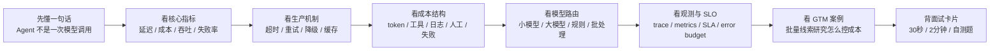
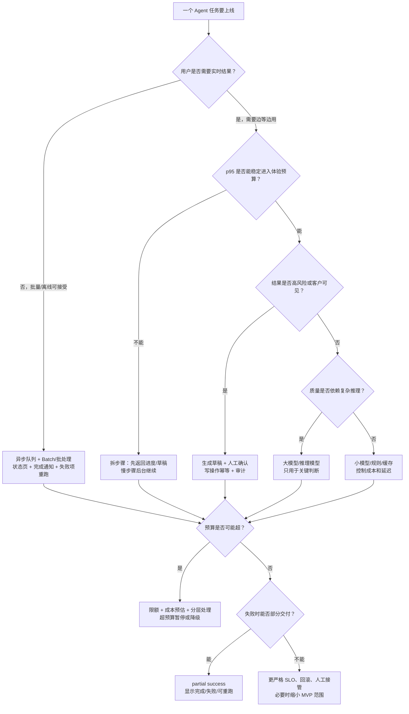
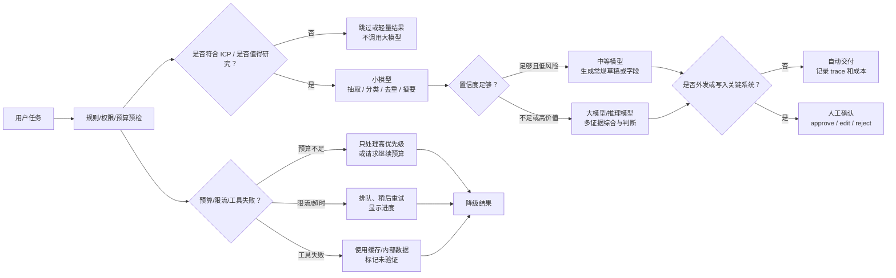

# 10-稳定性、成本与性能

> 面向强技术型 Agent 产品经理。目标不是把你训练成后端性能工程师，而是让你能解释 Agent 产品上线后最常见的稳定性、成本、性能问题，并能和工程团队一起定义体验目标、成本边界、降级策略和商业可行性。
>
> 本文参考资料检索时间：2026-06-04。模型价格、限流策略、缓存支持范围会变化，真实项目应以供应商最新文档和账单为准。

## 0. 先读这一页

### 0.1 三分钟速读

如果你只用 3 分钟预习这篇，记住下面 8 句话：

| 你要记住的点 | 面试里怎么说 |
|---|---|
| Agent 性能不是模型性能 | 用户感受到的是端到端任务完成时间，包括模型、工具、检索、队列、重试和人工确认 |
| 成本不是单次 API 价格 | 要按 workflow 算输入 token、输出 token、工具、缓存、重试、日志、人工和失败成本 |
| 多步骤会放大失败率 | 每一步 99% 成功，5 步串起来只有约 95.1% 端到端成功率 |
| 最后 20 分最难 | demo 证明模型能做，产品化要证明真实数据、真实规模、真实预算下反复稳定完成 |
| 重试不是可靠性的全部 | 可重试读操作和不可盲重试写操作要分开，发邮件、改 CRM、扣款必须考虑幂等和确认 |
| 降级是产品能力 | 搜索失败、模型不可用、预算不足、低置信度时，要交付部分结果、草稿或人工审核，而不是直接崩掉 |
| 模型路由决定毛利 | 小模型处理分类、抽取、摘要和格式化，大模型留给高价值、高不确定性、高风险判断 |
| SLO 要按用户价值定义 | 不只看 API uptime，还要看任务完成率、p95 延迟、成本、准确率、人工介入率和重复副作用 |

一句面试总括：

> 稳定性、成本与性能是 Agent 从 demo 到商业产品的生产化能力。PM 要把一次 Agent 任务拆成模型、工具、数据、队列、重试、降级、观测和人工确认，定义端到端 SLO 和成本预算，用缓存、批处理、模型路由和降级策略守住用户体验、毛利和信任。

### 0.2 本篇阅读路线



读法建议：

- 如果你在准备面试，先读 `0.1`、`0.3`、`0.4`、`10`、`11`、`面试卡片与自测`。
- 如果你在做产品方案，重点读 `4`、`6`、`8`、`11`。
- 如果你要和工程评审上线风险，重点读 `5`、`7`、`8`、`9`、`4.11`、`4.12`。
- 如果你要算商业可行性，重点读 `4.2`、`4.8`、`4.9`、`4.10`、`8.2`。

### 0.3 PM 决策速查表

| 决策问题 | 推荐判断 | 关键指标 |
|---|---|---|
| 这个任务要同步还是异步？ | 10-30 秒内能给可用结果才适合同步；批量、搜索多、工具多的任务优先异步 | p95 latency, timeout rate, queue wait |
| 是否要流式输出？ | 聊天、写作、解释类适合；结构化写入和批处理更需要状态页和最终校验 | TTFT, completion latency, user drop-off |
| 用大模型还是小模型？ | 大模型给复杂推理和高价值判断，小模型给抽取、分类、摘要、格式化和初筛 | cost per task, quality lift, acceptance rate |
| 是否需要缓存？ | 稳定上下文、重复查询、公开资料、RAG 片段适合缓存；实时权限和高 freshness 字段谨慎缓存 | cache hit rate, stale data error rate |
| 失败后是否重试？ | 临时 5xx、网络抖动、读操作可有限重试；高风险写操作必须幂等或人工确认 | retry rate, retry success rate, duplicate action rate |
| 什么时候降级？ | 模型不可用、搜索失败、限流、预算不足、低置信度、超时时都应有降级路径 | fallback rate, partial success rate, user recovery rate |
| 批量任务怎么控成本？ | 先过滤再研究，按账户价值分层，使用缓存、Batch API、队列、预算上限和失败项重跑 | cost per successful lead, batch completion time |
| SLO 应该怎么定？ | 围绕任务完成率、p95 时间、质量、写入安全和人工介入，而不是只看接口 uptime | task success rate, p95, accuracy, escalation rate |
| 什么时候人工确认？ | 外发、关键 CRM 写入、高价值账户、低置信度、合规敏感、不可逆动作 | HITL trigger precision, approval rate, incident rate |
| 是否可以开放免费批量功能？ | 必须先有额度、预算上限、速率限制和排队；否则容易账单失控 | cost by tenant, quota usage, gross margin |

### 0.4 成本 / 延迟 / 质量 / 可靠性取舍决策树

这棵树用于面试或方案评审时快速判断：一个 Agent workflow 应该实时跑、后台跑、降级跑，还是进入人工确认。



PM 使用方法：

- 先问体验预算：用户能等多久？
- 再问风险：结果是否会外发、写系统、影响客户？
- 再问质量：是否真的需要大模型？
- 最后问商业：每次任务和每个成功任务是否付得起？

### 0.5 降级与模型路由图



一句话记忆：

> 小模型负责“便宜地理解和整理”，大模型负责“昂贵但关键的判断”，降级负责“失败时仍然让用户知道完成了什么、缺了什么、下一步是什么”。

### 0.6 学完后你应该能做到

- 用 30 秒解释为什么 Agent 生产化的难点是稳定性、成本与性能。
- 画出一次 Agent 任务的端到端成本和延迟构成。
- 解释为什么多步骤 workflow 会放大失败率。
- 给 Sales Agent 设计同步、异步、批处理和人工确认边界。
- 判断哪些步骤用小模型、哪些步骤用大模型、哪些步骤不用 LLM。
- 说明超时、重试、幂等、降级、缓存、Batch API 的产品价值。
- 定义一个 Agent workflow 的 SLO / SLA / error budget。
- 说出上线前必须埋哪些 trace 和成本字段。
- 回答“如何控制批量线索研究成本”和“上线后账单暴涨怎么办”。

## 1. What this module solves

稳定性、成本与性能解决的是一个 Agent 从 demo 走向生产时最现实的问题：

- 用户会不会等太久？
- 结果会不会经常失败、卡住、重复执行或半途而废？
- 每次任务到底花多少钱？规模扩大后毛利是否成立？
- 同一个 Agent 在 10 个用户、1,000 个用户、100 万条线索上是否还能跑？
- 当模型、工具、检索、第三方 API 任意一环变慢或失败时，产品应该怎样表现？

Agent 产品尤其容易在这里翻车，因为一次用户请求通常不是一次 LLM 调用，而是一串动态链路：

```text
用户任务
-> 意图理解
-> 规划
-> RAG / 搜索 / 数据库查询
-> 多次工具调用
-> 多次模型判断
-> 输出生成
-> 可能写入 CRM / 邮件系统 / 工单系统
-> 日志、追踪、评测、人工审核
```

每多一步，就多一份延迟、成本、失败率和边界 case。PM 必须能把这些抽象技术问题翻译成产品体验和商业模型：

- 延迟影响转化、信任和工作流是否可用。
- token 成本影响定价、毛利和是否能开放批量功能。
- 吞吐影响大客户、批处理任务和峰值活动是否能承接。
- 失败率和超时影响用户是否敢把关键流程交给 Agent。
- 重试、降级、缓存、模型路由决定产品在真实世界是否稳得住。

## 2. Why an Agent PM must understand it

Agent PM 不需要亲自实现复杂的队列、限流、分布式追踪或多区域容灾，但必须能做这些判断：

1. 什么任务必须实时返回，什么任务可以异步完成？
2. 哪些步骤值得用大模型，哪些步骤应该用小模型、规则、缓存或传统代码？
3. 什么时候应该重试，什么时候不能重试，因为会造成重复发邮件、重复改 CRM、重复扣款？
4. 产品承诺应该写成“通常 2 分钟内完成”，还是“24 小时内批量完成”，还是“后台运行，完成后通知”？
5. 免费试用、批量导入、自动化触发是否会造成不可控成本？
6. 错误发生时，是告诉用户失败、部分完成、稍后重试，还是进入人工审核？
7. SLO 应该按“请求成功率”定义，还是按“任务完成率”“关键字段准确率”“人工介入率”定义？

面试里，很多强技术 PM 会被追问：“你的 Agent demo 看起来能跑，怎么产品化？”这时稳定性、成本和性能就是分水岭。一个成熟回答不只是说“加监控、加重试”，而是能说明：

- Agent 的不确定性来自哪里；
- 哪些体验指标最关键；
- 哪些成本项会随规模线性或超线性增长；
- 如何用产品约束、架构分层和运营策略把风险降到可控。

## 3. Core concept map

### 一张总图

```text
Agent 生产质量
├─ 性能 Performance
│  ├─ 延迟 latency：用户等多久
│  ├─ 吞吐 throughput：单位时间能处理多少任务
│  ├─ 并发 concurrency：同时能跑多少任务
│  └─ 资源效率 efficiency：每个任务消耗多少 token、工具调用和计算
├─ 成本 Cost
│  ├─ 输入 token
│  ├─ 输出 token
│  ├─ 推理模型单价
│  ├─ 工具费用：搜索、数据库、浏览器、第三方 API
│  ├─ 观测和日志费用
│  ├─ 人工审核费用
│  └─ 重试、失败、重复执行造成的隐藏成本
├─ 稳定性 Reliability
│  ├─ 成功率 / 失败率
│  ├─ 超时
│  ├─ 限流
│  ├─ 重试与幂等
│  ├─ 降级与兜底
│  ├─ SLA / SLO / error budget
│  └─ 可观测性：日志、指标、trace、告警
└─ 产品体验 Product Experience
   ├─ 等待感：同步、流式、后台任务
   ├─ 可解释性：进度、步骤、失败原因
   ├─ 可控性：确认、撤销、人工接管
   ├─ 信任：稳定、可预测、不乱操作
   └─ 商业可行性：价格、毛利、扩展能力
```

### 核心公式

**端到端延迟**

```text
总延迟 =
  排队时间
+ 模型输入处理时间
+ 模型输出生成时间
+ 工具调用时间
+ 检索 / 数据库时间
+ 编排开销
+ 重试时间
+ 人工审核时间（如果有）
```

**单次任务成本**

```text
单次任务成本 =
  Σ(输入 token / 1M × 输入单价)
+ Σ(缓存输入 token / 1M × 缓存单价)
+ Σ(输出 token / 1M × 输出单价)
+ 搜索 / 浏览 / API / 数据库 / 向量库成本
+ 日志和 trace 存储成本
+ 人工审核成本
+ 失败和重试成本
```

**工作流成功率**

如果一个 Agent 任务有 5 个必须成功的步骤，每一步成功率都是 99%，端到端成功率不是 99%，而是：

```text
0.99 ^ 5 = 95.1%
```

这就是为什么 Agent demo 单步看起来都不错，但串起来后生产稳定性明显下降。

## 4. How it works

### 4.1 延迟：用户感受到的不是模型速度，而是任务完成时间

LLM 延迟一般由几部分组成：

- **TTFT, time to first token**：从请求发出到第一个 token 出现的时间。影响“有没有反应”的感觉。
- **生成速度**：模型每秒生成多少 token。输出越长，越慢，越贵。
- **输入处理**：上下文越长，模型处理输入越耗时，但很多场景下减少输入 token 对延迟的收益没有想象中大；OpenAI 延迟优化文档也强调，除了超长上下文外，减少输入 token 往往只带来有限延迟收益。
- **工具和网络时间**：Agent 经常慢在网页搜索、CRM API、数据库、爬取、浏览器自动化，而不是慢在模型本身。
- **顺序依赖**：如果步骤必须 A 完成后才能做 B，就无法并行。

PM 要避免只问“模型每秒多少 token”。更好的问题是：

- 用户的关键路径是几步？
- 哪些步骤能并行？
- 哪些步骤必须等待？
- 输出是否必须一次性完整生成？
- 能否先给用户部分结果或进度？
- 能否把慢任务改成后台任务？

### 4.2 token 成本：Agent 的成本不是一次聊天，而是一条调用链

token 成本由输入和输出共同决定。常见误区是只看单次模型调用价格，忽略 Agent 的循环和工具：

- 规划一次；
- 搜索 N 次；
- 每个结果摘要一次；
- 合并判断一次；
- 生成报告一次；
- 失败后重试；
- 日志和 eval 可能再调用模型。

一个“研究 100 个销售线索”的任务，如果每个线索调用 5 次模型，就是 500 次调用。每次看起来很便宜，总账单可能不便宜。

PM 要建立“成本预算”思维：

```text
每个用户每月可用成本预算
= 产品价格 × 目标毛利率下可承受成本比例
```

例如一个 Sales Agent 每席每月收费 100 美元，希望模型、搜索、基础设施和人工审核总成本不超过收入的 20%，则每席每月 AI 相关成本预算大约 20 美元。再除以该用户每月任务量，才能得到“每条线索能花多少钱”。

### 4.3 吞吐：批量 Agent 的核心瓶颈

吞吐关注单位时间能处理多少任务，通常受这些约束影响：

- provider 的 RPM：requests per minute；
- provider 的 TPM / ITPM / OTPM：每分钟输入/输出 token 限制；
- 第三方工具 API 限流；
- 队列 worker 数；
- 数据库连接池；
- 人工审核队列；
- 观测和日志写入能力。

OpenAI 和 Anthropic 都有请求和 token 维度的 rate limit。PM 需要理解：批量功能不是简单把 1 条任务乘以 1,000。批量线索研究、批量内容生成、批量 enrichment 如果不加队列、限速、预算和批处理，很容易遇到 429、超时、账单失控。

### 4.4 失败率：Agent 的失败常常是链式失败

Agent 常见失败来源：

- 模型输出不符合 schema；
- 工具调用参数错误；
- 搜索结果为空或质量低；
- CRM / 邮件 / 数据库 API 超时；
- rate limit；
- 上游模型 5xx；
- 用户输入不完整；
- RAG 检索到旧数据；
- 多步骤中间状态丢失；
- 重试导致重复副作用。

PM 要区分三类失败：

1. **技术失败**：超时、API error、限流、解析失败。
2. **任务失败**：Agent 跑完了，但没有找到足够证据，或无法完成目标。
3. **产品失败**：结果在技术上完成了，但用户不信、不敢用、不愿等、不愿付钱。

优秀的产品设计会承认这些失败，而不是把所有失败包装成“AI 正在思考”。

### 4.5 超时：不是所有任务都应该等到完成

超时是产品体验和系统保护机制。没有超时的 Agent 可能无限等待、无限重试或无限烧钱。

常见超时层级：

- 单个模型调用超时；
- 单个工具调用超时；
- 单个步骤超时；
- 端到端任务超时；
- 后台 job 最大运行时间；
- 人工审核 SLA。

PM 决策重点：

- 实时交互通常需要短超时和可见进度。
- 后台批处理可以长超时，但必须有状态、通知和恢复能力。
- 写操作前的超时策略必须更谨慎，避免“其实写成功了，但客户端以为失败又重试”。

### 4.6 重试：可靠性工具，也可能是成本和安全风险

重试适合处理短暂网络抖动、上游 5xx、偶发 rate limit。但重试不是万能解：

- 每次重试都可能再次消耗 token。
- rate limit 下盲目重试会让限流更严重。
- 对有副作用的工具调用重试可能重复发邮件、重复改字段、重复创建记录。
- Agent 重新规划后重试，可能走出不同路径，导致状态不一致。

PM 应该要求工程区分：

- 可安全重试的读操作；
- 需要幂等键的写操作；
- 不能自动重试、必须人工确认的高风险操作；
- 重试上限和退避策略；
- 重试失败后的降级和解释。

OpenAI 错误文档和 rate limit 文档都建议对 rate limit、超时、5xx 等情况采用退避和节流；AWS 的可靠性最佳实践也强调控制重试、避免重试风暴。

### 4.7 降级：不要让系统只有“完美成功”和“完全失败”

降级是 Agent 产品化的关键。常见降级路径：

- 大模型不可用时切到小模型，但降低任务范围；
- 搜索 API 失败时只使用内部 CRM 数据，并标记“外部信号未更新”；
- 批量任务超时时先返回已完成部分；
- 高风险写操作失败时生成草稿，不自动发送；
- RAG 不确定时要求用户补充信息；
- 低置信度结果进入人工审核；
- 实时任务过载时转后台处理。

降级设计的重点是用户预期管理。不要假装结果完整，而要明确：

- 完成了什么；
- 没完成什么；
- 可靠性等级如何；
- 用户下一步能做什么。

### 4.8 缓存：降低成本和延迟，但要知道缓存什么

Agent 中有几类缓存：

- **Prompt caching**：复用相同的长系统提示词、工具定义、背景上下文。
- **RAG 缓存**：相同查询、相同文档片段、相同 embedding 结果复用。
- **工具结果缓存**：公司官网、公开新闻、CRM 只读查询短期复用。
- **最终结果缓存**：同一账户、同一线索、同一时间窗口内不重复研究。
- **中间步骤缓存**：比如网页抽取、公司简介、联系人摘要。

OpenAI prompt caching 对较长相同前缀自动生效，可降低延迟和输入成本；Anthropic prompt caching 也通过缓存 prompt prefix 降低成本和延迟，并有 5 分钟、1 小时等缓存策略。PM 不需要知道底层 KV cache 实现，但要知道产品设计如何影响命中率：

- 静态 system prompt、工具定义、示例放前面；
- 用户变量、RAG 结果、当前任务放后面；
- 不要每次动态改写前缀；
- 批量任务尽量共享同一模板；
- 记录缓存命中率和节省成本。

缓存的风险：

- 数据过期；
- 权限变化后仍返回旧结果；
- 用户以为是实时研究，实际用了旧缓存；
- 不同租户数据隔离不当；
- 缓存命中率不稳定，导致成本预估偏差。

PM 必须定义缓存 freshness：例如“公司基本信息 7 天内可复用，招聘和融资信号 24 小时内可复用，价格和职位变动必须实时查询”。

### 4.9 模型路由：把任务交给合适的模型，而不是默认最强模型

模型路由是控制成本和体验的核心手段。常见分工：

- **小模型 / 便宜模型**：分类、去重、字段抽取、简单摘要、格式化、低风险判断。
- **中等模型**：常规生成、邮件草稿、线索打分、轻量推理。
- **大模型 / 推理模型**：复杂规划、多证据综合、策略判断、高价值客户分析、高风险动作前的二次判断。
- **非 LLM 逻辑**：正则、数据库查询、规则引擎、排序、阈值过滤、权限校验。

一个好路由策略通常包含：

- 按任务类型路由；
- 按客户等级路由；
- 按置信度路由；
- 按失败后 fallback 路由；
- 按预算剩余路由；
- 按延迟要求路由。

示例：

```text
Sales Agent 研究线索
1. 小模型抽取公司名、职位、行业。
2. 规则过滤明显不匹配 ICP 的线索。
3. 小模型总结网页内容。
4. 中等模型生成 outreach reason。
5. 只有高价值账户或低置信度账户，才调用大模型做多证据判断。
6. 自动发送前必须经过人工确认或策略 guardrail。
```

### 4.10 批处理：牺牲实时性，换成本、吞吐和稳定性

批处理适合不需要立即返回的任务：

- 批量线索研究；
- 离线 enrichment；
- 大规模分类；
- embedding 文档库；
- nightly account refresh；
- 批量 eval；
- 报表生成。

OpenAI Batch API 官方文档说明，Batch 适合异步任务，通常有更低成本、更高批量处理 headroom 和 24 小时完成窗口；Anthropic pricing 文档也说明 Batch API 对输入和输出 token 有折扣。PM 的产品判断是：

- 用户是否真的需要实时？
- 结果能否晚一点通过通知、列表状态、CSV、CRM 字段回填交付？
- 任务能否拆分成小 job，失败后只重跑失败部分？
- 是否需要取消、暂停、预算上限？

批处理的产品体验不能只是“提交后消失”。至少要有：

- 任务状态：排队中、运行中、部分完成、失败、已完成；
- 进度：已处理数量、失败数量、预计完成时间；
- 错误导出：哪些线索失败，为什么失败；
- 成本保护：本次任务预计消耗、最大预算；
- 结果抽检：随机样本或高风险项人工确认。

### 4.11 日志、观测和 trace：没有可观测性，就无法产品化

传统日志只告诉你接口是否报错；Agent 观测还要回答：

- Agent 看到什么输入？
- 选了什么工具？
- 每一步用了哪个模型？
- 每一步花了多少 token、多少钱、多久？
- 哪一步失败？
- 模型输出为什么无法解析？
- 用户最后是否接受、编辑、撤销、投诉？

建议按四层看观测：

1. **业务日志**：用户、任务、租户、线索 ID、任务状态、最终结果。
2. **技术指标**：延迟、错误率、超时率、429、5xx、队列长度。
3. **LLM trace**：每次模型调用、prompt 版本、工具调用、token、cost、span。
4. **质量反馈**：用户采纳率、人工修改率、bad case 标签、eval 分数。

LangSmith 文档强调 trace 可以记录 Agent 执行中的输入、工具调用、模型交互和决策点，用于调试、评估和生产监控。OpenAI Agents SDK 也内置 tracing，可记录模型生成、工具调用、handoff、guardrails 等事件。PM 的责任不是选具体工具，而是定义“没有这些字段就不能上线”：

- request_id / run_id / trace_id；
- user_id / tenant_id；
- workflow_name；
- model name；
- prompt version；
- input_tokens / output_tokens / cached_tokens；
- tool name / latency / status；
- retry_count；
- final_status；
- error_type；
- user_feedback；
- cost_estimate。

同时要注意隐私和合规：trace 可能包含用户数据、CRM 数据、邮件内容和模型输出，生产环境要有脱敏、采样、权限和保留周期。

### 4.12 SLA / SLO：把“稳定”变成可管理承诺

几个术语要区分：

- **SLI, Service Level Indicator**：实际测量指标，如 p95 延迟、任务成功率、超时率。
- **SLO, Service Level Objective**：内部目标，如“95% 的线索研究任务在 10 分钟内完成”。
- **SLA, Service Level Agreement**：对客户的合同承诺，违约可能有赔付、声誉或法律后果。
- **Error budget**：允许失败的预算。Google Cloud SLO 文档解释，SLO 目标和 100% 之间的差额就是 error budget，用来管理发布和风险。

Agent 产品不要轻易承诺 100% 成功。SLO 应围绕用户价值定义，而不只是接口 uptime：

- 交互 Agent：p95 首 token < 2 秒，p95 完整回答 < 15 秒。
- 批量研究 Agent：95% 任务 1 小时内完成，99% 任务 24 小时内完成。
- CRM 写入 Agent：99.9% 写操作有明确成功/失败状态，无重复写入。
- 高风险 Agent：100% 外发动作前经过确认或策略校验。
- 质量 SLO：高价值账户研究结果中，关键字段准确率 > 95%，证据链接有效率 > 98%。

PM 要把 SLO 与产品承诺绑定：

- 免费版可以慢一点、批量额度小一点；
- 企业版要有更高吞吐、优先队列、审计和支持；
- 关键工作流要有更严格 SLO；
- 实验功能不要承诺正式 SLA。

## 5. What depth a PM needs

PM 需要掌握到“能定义问题、追问方案、做取舍、看指标”的深度。

### PM 必须理解

- latency、throughput、concurrency、timeout、retry、fallback、cache、rate limit、SLO/SLA 的含义。
- token 成本如何由输入、输出、缓存、重试和工具调用构成。
- Agent 多步骤会放大延迟、成本和失败率。
- 为什么批处理和异步任务是成本优化的重要产品形态。
- 为什么小模型/大模型分工影响毛利和体验。
- 为什么日志和 trace 是 Agent 产品化的必要条件。
- 为什么可靠性目标不能只看接口成功率，还要看任务完成率和业务质量。

### PM 不需要深挖

- 模型服务底层调度；
- GPU kernel 优化；
- 分布式队列内部实现；
- 数据库索引细节；
- 多区域容灾工程；
- provider SDK 的具体重试代码；
- observability backend 的存储架构。

### PM 应该能问工程的问题

- 这个 workflow 最坏情况下会调用多少次模型和工具？
- p50 / p95 / p99 延迟分别是多少？
- 失败最多发生在哪一步？
- 每个任务平均和 p95 成本是多少？
- 是否区分读操作和写操作重试？
- 写操作是否有 idempotency key？
- 是否能按 tenant / user / workflow 设置预算和速率限制？
- 降级策略是什么？用户看到什么？
- trace 是否能复盘一次失败任务的完整路径？
- 批量任务失败后能否只重跑失败项？

## 6. Common product decisions and tradeoffs

### 6.1 同步 vs 异步

同步适合：

- 用户正在等待；
- 任务很短；
- 结果影响当前决策；
- 失败可以立即修正。

异步适合：

- 批量任务；
- 外部搜索较多；
- 任务可能超过几十秒；
- 成本需要排队和预算控制；
- 结果可以稍后通知或回填。

产品取舍：

- 同步体验直接，但更容易超时和贵。
- 异步更稳、更便宜、更可扩展，但需要状态管理和通知体验。

### 6.2 流式输出 vs 完整输出

流式输出能降低等待焦虑，让用户觉得系统有反应。但它不等于任务完成更快。适合聊天、写作、解释类任务。

对于结构化任务，尤其是要写入 CRM 的任务，流式输出不一定合适。用户更关心最终字段是否正确、是否可审核。

### 6.3 大模型优先 vs 分层模型

大模型优先：

- 优点：实现简单，质量上限高。
- 缺点：成本高，延迟高，规模后毛利差。

分层模型：

- 优点：成本可控，可按价值分配智能。
- 缺点：路由复杂，需要 eval 和监控。

PM 判断标准：如果一个步骤不需要复杂推理，优先考虑小模型、规则或缓存。把大模型留给“高价值、高不确定性、高风险”的判断。

### 6.4 自动执行 vs 人工确认

自动执行适合：

- 低风险；
- 可撤销；
- 影响范围小；
- 置信度高；
- 有明确审计记录。

人工确认适合：

- 发邮件、改 CRM 关键字段、触达客户；
- 高价值账户；
- 低置信度；
- 合规敏感；
- 用户第一次使用自动化。

### 6.5 实时搜索 vs 缓存数据

实时搜索：

- 更准确、更新；
- 更慢、更贵、更不稳定。

缓存数据：

- 更快、更便宜、更稳定；
- 可能过期。

PM 应按字段定义 freshness，而不是笼统说“实时”。例如：

- 公司官网简介：7 天；
- 最近新闻：24 小时；
- 招聘信号：24 小时；
- CRM owner：实时；
- 联系人职位：7-30 天，外发前二次确认。

### 6.6 失败隐藏 vs 失败可解释

隐藏失败看起来“顺滑”，但会降低信任。Agent 产品更适合明确表达：

- “已完成 83/100 条，17 条因网页访问失败稍后重试。”
- “未找到可靠证据，因此没有自动生成 outreach reason。”
- “CRM 写入未执行；已生成草稿等待确认。”

## 7. Common failure modes

### 7.1 Demo 很好，上线后变慢

原因：

- demo 数据少；
- 上线后上下文变长；
- 用户并发增加；
- 第三方 API 变慢；
- trace 和日志增加开销；
- 批量任务挤占实时任务资源。

PM 应对：

- 区分实时队列和批量队列；
- 设置 p95 延迟 SLO；
- 高价值客户优先队列；
- 对长任务后台化；
- 限制输出长度和工具调用次数。

### 7.2 账单突然上涨

原因：

- 用户批量导入；
- Agent 循环重试；
- prompt 变长；
- 输出太长；
- eval 或监控也在调用模型；
- 缓存命中率下降；
- 大模型被用于低价值步骤。

PM 应对：

- 每 tenant / user / workflow 成本上限；
- 单任务 token budget；
- 模型路由；
- Batch API；
- 缓存；
- 成本仪表盘；
- 免费版批量额度限制。

### 7.3 429 限流导致任务失败

原因：

- 瞬时并发过高；
- 批处理没有限速；
- 输入或输出 token 超过 TPM；
- 多客户共享同一 provider quota；
- 重试没有退避。

PM 应对：

- 队列和速率限制；
- exponential backoff with jitter；
- 读取 provider rate limit headers；
- 大客户独立 project / key / capacity；
- 批量任务进入异步；
- UI 告知“排队中”而不是“失败”。

### 7.4 重试造成重复副作用

例子：

- 重复发送邮件；
- 重复创建 CRM note；
- 重复改 deal stage；
- 重复触发 Slack 通知。

PM 应对：

- 写操作必须幂等；
- 每次 tool action 有 action_id；
- 先生成草稿，确认后执行；
- 写入前检查是否已执行；
- 对外动作的重试必须受限；
- 提供撤销或审计。

### 7.5 部分完成但用户不知道

Agent 常会完成一半：找到公司信息，但没找到联系人；生成草稿，但 CRM 写入失败；100 条线索里 83 条成功。

PM 应对：

- 设计 partial success 状态；
- 显示已完成、失败、跳过；
- 支持只重跑失败项；
- 导出失败原因；
- 不把部分成功算成完全成功。

### 7.6 观测缺失，无法复盘

表现：

- 用户说“它乱写了”，团队不知道哪一步错；
- 只看到最终输出，没有中间工具调用；
- 不知道用了哪个 prompt 版本；
- 不知道成本来自哪里；
- eval 无法复现。

PM 应对：

- 上线前定义 trace 字段；
- prompt 版本化；
- 关键工具调用保存输入输出摘要；
- bad case 一键标注；
- 成本和质量按 workflow 拆分。

## 8. Metrics and evaluation methods

### 8.1 性能指标

- p50 / p95 / p99 end-to-end latency；
- time to first token；
- time to usable result；
- tool latency by tool；
- model latency by model；
- queue wait time；
- throughput：tasks/hour；
- concurrency；
- batch completion time；
- timeout rate。

PM 重点看 p95，而不是平均值。用户投诉通常来自长尾。

### 8.2 成本指标

- cost per task；
- cost per successful task；
- cost per accepted output；
- input tokens / output tokens；
- cached token ratio；
- average model calls per task；
- tool calls per task；
- retry cost ratio；
- batch vs realtime cost；
- cost by tenant / user / workflow；
- gross margin by plan。

“cost per successful task”比“cost per request”更重要，因为失败任务也烧钱。

### 8.3 稳定性指标

- task success rate；
- step success rate；
- failure rate by step；
- timeout rate；
- retry rate；
- retry success rate；
- 429 rate；
- 5xx rate；
- schema parse failure rate；
- tool failure rate；
- partial success rate；
- duplicate action rate；
- human escalation rate。

### 8.4 质量和业务指标

- 用户采纳率；
- 人工编辑率；
- 结果被撤销率；
- 用户投诉率；
- 错误线索率；
- outreach reply rate；
- CRM 字段准确率；
- sales rep saved time；
- 每条线索研究成本 vs pipeline value；
- 免费用户成本回收期；
- 企业客户 SLA 违约次数。

### 8.5 建议的评估方法

- **离线 eval**：固定样本集测试 prompt、模型、路由变化。
- **线上 shadow mode**：新策略先旁路运行，不影响用户结果。
- **A/B test**：比较小模型路由、大模型路由、缓存策略对质量和成本的影响。
- **canary release**：先给少量租户启用。
- **bad case review**：定期看失败 trace。
- **成本回放**：用历史任务模拟新模型价格和新路由策略。

## 9. Keywords for engineering communication

| 关键词 | PM 应理解的意思 | 典型追问 |
|---|---|---|
| Latency | 用户等待时间 | p95 是多少？慢在哪一步？ |
| TTFT | 第一个 token 出现时间 | 用户是否有即时反馈？ |
| Throughput | 单位时间处理能力 | 批量 10 万条能多久跑完？ |
| Concurrency | 同时运行任务数 | 峰值会不会互相挤占？ |
| RPM / TPM | 请求/Token 限流 | 当前 plan 的瓶颈是哪一个？ |
| Timeout | 超过时间就中止 | 超时后用户看到什么？ |
| Retry | 失败后重试 | 哪些操作不能自动重试？ |
| Backoff / jitter | 退避和随机抖动 | 是否避免重试风暴？ |
| Idempotency | 重复执行结果不变 | 写 CRM、发邮件是否幂等？ |
| Fallback | 失败后换路径 | 大模型不可用时怎么降级？ |
| Degradation | 降级服务 | 部分结果能否交付？ |
| Cache hit rate | 缓存命中率 | 成本节省是否真实？ |
| Model routing | 模型路由 | 什么任务用小模型？ |
| Queue | 队列 | 批量任务是否排队？ |
| Trace | 一次任务的完整轨迹 | 能否复盘每一步？ |
| SLI | 实测指标 | 选哪个指标代表用户体验？ |
| SLO | 内部服务目标 | 达不到时如何处理？ |
| SLA | 对外合同承诺 | 是否会赔付或影响续约？ |
| Error budget | 允许失败预算 | 预算耗尽是否暂停发布？ |

## 10. High-frequency interview questions and answers

### Q1：为什么 Agent 产品的“最后 20 分”常常卡在稳定性、成本和边界 case？

**回答：**

因为 Agent demo 的前 80 分通常证明“模型能完成任务”，但产品化的最后 20 分要证明“它能在真实用户、真实数据、真实并发、真实预算下反复完成任务”。Agent 是多步骤系统，每一步都有延迟、成本和失败概率；步骤串起来后，端到端失败率会被放大。真实世界还有脏数据、缺字段、网页不可访问、API 限流、用户输入模糊、权限限制和高风险写操作。所以最后 20 分不是把 UI polish 一下，而是补上超时、重试、降级、缓存、模型路由、人工确认、日志、trace、SLO 和成本控制。没有这些，demo 可以惊艳，但无法稳定交付商业价值。

### Q2：如何降低 Agent 延迟？

**回答：**

我会先拆端到端链路，而不是只看模型速度。优化手段包括：减少顺序模型调用、并行化独立工具、缩短输出、使用流式反馈、把长任务改成后台任务、缓存稳定上下文、减少不必要工具调用、为不同任务选择更快模型。对 PM 来说，关键是定义用户真正需要的等待体验：有些任务必须 5 秒内响应，有些批量任务可以 24 小时内完成但要有进度和通知。

### Q3：如何控制 token 成本？

**回答：**

先建立每个 workflow 的成本模型：输入 token、输出 token、模型调用次数、工具费用、重试费用、观测费用和人工审核费用。然后用模型路由、小模型承担低风险步骤、prompt caching、RAG 结果裁剪、输出长度控制、批处理、任务预算上限和失败重试上限来控制成本。最后看 cost per successful task 和 gross margin，而不是只看单次 API 单价。

### Q4：什么时候用大模型，什么时候用小模型？

**回答：**

大模型用于复杂推理、多证据综合、高价值客户分析、高风险动作前判断；小模型用于分类、抽取、去重、格式化、简单摘要和初筛。产品上可以按任务复杂度、客户价值、置信度和风险分层。理想状态不是“大模型替代一切”，而是“便宜模型处理大多数确定性任务，大模型处理少数关键判断”。

### Q5：Agent 为什么需要缓存？缓存有什么风险？

**回答：**

缓存可以降低延迟和成本，尤其适合复用长 system prompt、工具定义、RAG 结果、网页抽取和重复线索研究。风险是数据过期、权限变化、跨租户隔离、用户误以为实时。PM 要按数据类型定义 freshness，比如公司简介 7 天可缓存，招聘信号 24 小时，CRM owner 必须实时。还要监控 cache hit rate 和缓存导致的错误率。

### Q6：如何设计重试策略？

**回答：**

先区分读操作和写操作。读操作、临时 5xx、网络抖动可以有限重试，并使用 exponential backoff 和 jitter。写操作必须有幂等键和执行记录，不能盲目重试。对发邮件、改 CRM、扣款这类副作用动作，失败后通常应该进入确认或人工处理，而不是让 Agent 自己无限循环。还要设置最大重试次数和重试成本预算。

### Q7：如何定义 Agent 的 SLO？

**回答：**

不要只定义 API uptime，要围绕用户价值定义。比如 Sales Agent 可以定义：95% 的单条线索研究在 2 分钟内完成；99% 的批量任务在 24 小时内完成；CRM 写入 99.9% 有明确成功/失败状态；高风险外发动作 100% 经过确认；关键字段准确率大于 95%。SLO 要服务于产品承诺，SLA 则是对客户的正式合同承诺，要更谨慎。

### Q8：如果 Agent 上线后成本暴涨，你怎么排查？

**回答：**

我会按 workflow、tenant、model、prompt version、tool、retry 维度拆成本。重点看是否有批量导入、循环重试、输出过长、缓存命中率下降、低价值步骤用了大模型、eval/monitoring 额外调用模型、失败任务反复重跑。短期先加预算上限和限流，长期做模型路由、批处理、缓存、prompt 优化和任务拆分。

### Q9：如何处理批量线索研究的稳定性？

**回答：**

批量任务应该异步化，用队列、批处理、限速、状态页和失败重跑。用户提交任务时展示预计处理量和预算；运行中展示进度、成功数、失败数；完成后支持抽检和只重跑失败项。对外部搜索失败、公司信息不足、低置信度结果要标记，而不是假装全部完成。高价值账户可以用更强模型或人工确认，低价值账户用便宜模型和缓存。

### Q10：Agent 失败时，产品应该怎么展示？

**回答：**

要区分完全失败、部分成功和需要确认。好的失败体验会告诉用户：完成了什么、失败在哪、是否会自动重试、用户能否手动重跑、结果是否可靠。比如“已完成 83 条，12 条因官网无法访问进入稍后重试，5 条缺少公司域名需要你补充”。这比一句“出错了”更能建立信任。

## 11. GTM / Sales / Marketing Agent example

### 场景：批量线索研究 Agent

产品目标：

销售团队上传 5,000 条目标账户或联系人，Agent 自动研究公司、联系人、购买信号和个性化 outreach reason，并把结果回填 CRM 或导出 CSV。

### 典型工作流

```text
1. 导入 CSV / CRM list
2. 数据清洗：公司名、域名、职位、行业
3. ICP 过滤：是否值得研究
4. 外部信息获取：官网、新闻、招聘、融资、技术栈
5. 信息摘要：提取关键证据
6. 线索评分：匹配 ICP 和购买信号
7. 生成 outreach reason
8. 高风险或高价值项人工确认
9. 回填 CRM / 生成邮件草稿
10. 记录 trace、成本、质量反馈
```

### 成本控制设计

1. **先过滤，再研究**

不要对所有 5,000 条都调用大模型。先用规则和小模型过滤明显不符合 ICP 的公司，比如行业不匹配、规模太小、地区不服务。

2. **按价值分层**

- Tier A：高价值账户，允许更贵模型、多源证据、人工审核。
- Tier B：常规账户，中等模型生成结果。
- Tier C：低价值账户，只做轻量 enrichment 或不生成个性化邮件。

3. **小模型负责结构化和摘要**

小模型适合：

- 从网页抽取公司描述；
- 判断行业；
- 提取职位；
- 简单去重；
- 生成短摘要；
- 判断是否缺字段。

4. **大模型只用于高复杂度判断**

大模型适合：

- 多个购买信号综合；
- 判断“为什么现在适合触达”；
- 为战略账户生成高质量个性化 opening；
- 对低置信度或冲突信息做二次判断。

5. **缓存公开信息**

公司官网简介、行业、规模、公开新闻摘要可以按 freshness 缓存。今天已经研究过的公司，不应在同一批任务里重复搜索和总结。

6. **用批处理而不是实时全跑**

5,000 条线索不应该让用户盯着页面等。产品应承诺“后台处理，完成后通知”，并利用 Batch API 或内部 job queue 降低成本、提高吞吐。

7. **预算上限**

提交前展示：

```text
预计处理：5,000 条
预计 AI 成本区间：$X - $Y
最大预算：$Z
超过预算后：暂停并请求确认 / 只处理高优先级账户 / 降级到轻量研究
```

### 何时用便宜模型

- 清洗字段；
- 判断是否缺公司域名；
- 提取职位和部门；
- 把网页正文压缩成短摘要；
- 判断是否符合基础 ICP；
- 对低价值账户生成模板化 reason；
- 将输出改成 CRM schema。

### 何时用贵模型

- 高价值账户；
- 需要综合 3 个以上证据源；
- 需要解释复杂购买信号；
- 自动化结果会被客户直接看到；
- 小模型置信度低；
- 结果冲突，例如官网说 SMB，但招聘和融资显示 enterprise expansion。

### 何时人工确认

- 自动发送邮件前；
- 改 CRM 关键字段前；
- 高价值战略账户；
- 证据不足但模型想给强判断；
- 个人数据敏感；
- 用户首次启用自动化；
- 低置信度或高投诉风险。

### 如何降级

| 失败场景 | 降级策略 | 用户体验 |
|---|---|---|
| 搜索 API 限流 | 进入队列，稍后继续 | 显示“排队中，预计 X 分钟” |
| 官网无法访问 | 使用 CRM 现有数据和缓存 | 标记“外部信号未验证” |
| 大模型不可用 | 切到中等模型，只生成草稿 | 标记“轻量版结果” |
| 预算快用完 | 只处理 Tier A/B | 请求用户确认是否继续 |
| 低置信度 | 不自动写入 CRM | 进入人工审核 |
| 批量任务部分失败 | 交付成功项，失败项可重跑 | “4,732 成功，268 待重试” |

### 这个案例里的关键 SLO

- 95% 批量任务在 24 小时内完成；
- 单条线索实时研究 p95 < 2 分钟；
- 批量任务失败项可重跑率 100%；
- 重复 CRM 写入率 < 0.1%；
- 高价值账户人工审核覆盖率 100%；
- 每条成功线索成本低于目标毛利模型上限；
- outreach reason 有证据链接的比例 > 95%。

## 12. How to say it in interviews

### 30 秒版本

Agent 产品化的关键不是只让模型答对，而是让整个工作流在真实数据和真实规模下稳定、可控、付得起。我要同时看延迟、token 成本、吞吐、失败率、超时、重试、降级、缓存、模型路由和观测。尤其是 GTM Agent 这种批量任务，要用小模型做抽取和初筛，大模型做高价值判断，批处理降低成本，人工确认控制风险，并用 SLO 定义用户真正关心的任务完成率和交付时间。

### 2 分钟版本

我会把 Agent 看成一个多步骤生产系统，而不是一次模型调用。每个用户请求可能包含规划、检索、工具调用、多轮模型判断和写入系统，所以延迟、成本和失败率会被链路放大。PM 需要先定义关键体验：哪些任务必须实时，哪些可以后台跑；哪些动作可以自动执行，哪些需要确认；哪些结果必须完整，哪些可以部分交付。

成本上，我会按 workflow 建模：输入 token、输出 token、模型调用次数、搜索和工具费用、重试费用、观测费用和人工审核费用。优化上用模型路由、小模型/大模型分工、prompt caching、结果缓存、批处理、输出长度控制和预算上限。稳定性上，用超时、有限重试、幂等写操作、降级、队列和 trace。指标上，不只看 API 成功率，还看 task success rate、p95 延迟、cost per successful task、cache hit rate、human escalation rate 和用户采纳率。

如果是 Sales Agent 批量研究线索，我会先用规则和便宜模型过滤，再对高价值账户调用强模型，多数批量任务异步化，失败项可重跑，低置信度进人工审核。这样产品既能交付质量，也能守住毛利和客户信任。

### 一句话总结

Agent 的最后 20 分，是把“模型能做”变成“产品敢卖、用户敢用、公司赚得到钱”。

## 13. Quick memory summary

- Agent 性能看端到端任务，不只看模型速度。
- 延迟主要来自模型生成、工具调用、顺序依赖、排队和重试。
- 成本要看整个 workflow：输入、输出、工具、重试、日志、人工。
- 多步骤链路会放大失败率：每步 99% 不代表整体 99%。
- 超时保护系统和用户体验；没有超时的 Agent 容易无限烧钱。
- 重试要有限、退避、有 jitter；写操作必须幂等。
- 降级让产品从“失败”变成“部分可用”。
- 缓存可以降成本和延迟，但必须定义 freshness 和权限隔离。
- 模型路由是毛利关键：小模型做低风险任务，大模型做高价值判断。
- 批处理适合大规模、非实时任务，是 GTM Agent 控成本的重要形态。
- 观测必须有 trace：模型、工具、token、成本、错误、prompt 版本。
- SLO 是内部目标，SLA 是对外承诺，error budget 是可管理失败空间。
- PM 不需要做底层性能工程，但要会定义指标、边界、降级和商业约束。

## 面试卡片与自测

### 面试官想考什么

面试官问稳定性、成本与性能，通常不是想考你会不会写后端优化代码，而是在判断你是否真的懂 Agent 产品化：

| 面试官的问题 | 实际想考 | 高分回答要点 |
|---|---|---|
| 你的 Agent demo 怎么上线？ | 是否理解 demo 和生产的差距 | 多步骤链路、失败率放大、成本预算、SLO、trace、降级 |
| 为什么 Agent 会慢？ | 是否看端到端体验 | 模型、工具、检索、队列、重试、人工确认，不只看模型速度 |
| 怎么控成本？ | 是否能把 AI 能力放进商业模型 | cost per task、cost per successful task、模型路由、缓存、Batch、预算 |
| 什么时候用小模型？ | 是否有毛利意识 | 抽取、分类、摘要、格式化、初筛用小模型，复杂判断用大模型 |
| 失败怎么办？ | 是否懂可靠性产品设计 | 超时、重试、幂等、partial success、fallback、人工接管 |
| 批量线索研究怎么做？ | 是否能连接 GTM 场景 | 异步队列、分层账户、便宜模型、缓存、预算上限、人工确认 |
| 怎么定义 SLA / SLO？ | 是否会把技术指标转成用户承诺 | 按任务完成率、p95、质量、安全写入和人工介入定义 |
| 怎么排查账单暴涨？ | 是否会定位生产问题 | 按 tenant/workflow/model/tool/retry/prompt version 拆成本 |

### 30 秒回答模板

可以直接背这个版本：

> Agent 产品化不能只看模型能不能答对，而要看端到端任务是否稳定、够快、付得起。一次 Agent 任务可能包含规划、检索、工具调用、多次模型判断、写系统和人工确认，所以延迟、成本和失败率都会被链路放大。PM 要定义 p95 延迟、task success rate、cost per successful task、fallback rate 和 SLO，用模型路由、缓存、批处理、超时、重试、幂等、降级和 trace，把 demo 变成用户敢用、公司能卖、毛利成立的产品。

### 2 分钟回答模板

如果面试官追问“展开讲讲”，可以按这个结构回答：

1. **先拆链路**：Agent 不是一次 LLM 调用，而是模型、工具、数据、队列、重试和写操作组成的 workflow，所以我会先画出关键路径和最坏路径。
2. **再定体验目标**：实时任务看 TTFT 和 p95 完成时间；批量任务看状态、进度、完成通知和 24 小时内完成率；高风险任务看确认和审计。
3. **再算成本模型**：按输入 token、输出 token、工具调用、缓存、重试、日志、人工审核算 cost per task 和 cost per successful task，并和产品定价、毛利目标对齐。
4. **再做路由和降级**：小模型做分类、抽取、摘要、格式化，大模型做复杂推理和高价值判断；搜索失败用缓存或内部数据，预算不足只处理高优先级，低置信度进人工确认。
5. **最后做观测和 SLO**：每次 run 要有 trace_id、model、prompt version、tokens、cost、tool latency、error_type、retry_count、final_status 和 user feedback；SLO 按任务完成率、p95、质量、安全写入定义。

落到 GTM Agent，我会把批量线索研究做成异步任务：先用规则和便宜模型过滤，再缓存公开公司信息，对高价值账户调用强模型，低置信度和外发动作人工确认，失败项可重跑。这样既保护体验，也保护毛利和客户信任。

### 容易踩坑

| 坑 | 为什么危险 | 更好的说法 |
|---|---|---|
| 只说“换更快模型” | 忽略工具、队列、检索、重试和输出长度 | 先拆端到端关键路径，再决定模型、并行、缓存或后台化 |
| 只看平均延迟 | 用户投诉通常来自长尾 | 看 p95 / p99、timeout rate 和 queue wait |
| 只算 token 单价 | 忽略工具、失败、重试、日志、人工审核 | 算 cost per successful task |
| 所有步骤都用大模型 | 毛利差，延迟高 | 用小模型/规则处理确定性步骤，大模型只做关键判断 |
| 盲目重试 | 可能重复发邮件、改 CRM、触发通知 | 读操作可重试，写操作要幂等和审批 |
| 降级时不告诉用户 | 用户误以为结果完整 | 明确显示完成、缺失、未验证和下一步 |
| 缓存不设 freshness | 可能返回过期或越权数据 | 按字段定义缓存时间、权限隔离和失效策略 |
| SLO 只写 uptime | 不能代表 Agent 用户价值 | 定义 task success rate、p95、质量、安全和人工介入 |
| 批量任务用实时链路硬跑 | 限流、超时、账单失控 | 异步队列、Batch、进度页、预算上限、失败项重跑 |

### 读完自测题

不看正文，试着回答这些题。如果能清楚说出 80% 以上，你基本达到面试可用。

1. 为什么 Agent 的端到端成功率会低于单步成功率？
2. p50、p95、p99 延迟分别适合回答什么问题？
3. 一个 Sales Agent 研究 1,000 条线索，成本模型应该包含哪些项？
4. 什么情况下应该把任务改成异步或批处理？
5. 哪些步骤适合小模型？哪些步骤适合大模型？
6. prompt caching、工具结果缓存、RAG 缓存分别适合缓存什么？
7. 为什么写 CRM、发邮件、扣款这类动作不能盲目重试？
8. 降级和失败提示有什么区别？举一个 GTM Agent 例子。
9. 如果上线后账单突然涨了 3 倍，你按什么维度排查？
10. 为批量线索研究定义 5 个 SLO 或核心指标。
11. trace 里至少要记录哪些字段，才能复盘一次失败任务？
12. 为什么“最后 20 分”常常是稳定性、成本和边界 case？

### 掌握标准

读完这篇后，你应该达到下面标准：

| 掌握层级 | 你应该能做到 |
|---|---|
| 基础理解 | 解释 latency、throughput、token cost、timeout、retry、fallback、cache、SLO/SLA |
| 产品判断 | 判断任务同步/异步、是否人工确认、是否缓存、是否批处理、是否降级 |
| 商业意识 | 用 cost per successful task 和 gross margin 判断功能是否可卖 |
| 工程沟通 | 问清 p95、失败点、rate limit、幂等、trace 字段、重试策略和预算上限 |
| GTM 场景 | 设计批量线索研究的成本控制、模型路由、人工确认和失败重跑 |
| 面试表达 | 用 30 秒和 2 分钟讲清“Agent 从 demo 到生产”的稳定性、成本、性能框架 |

最后自检一句话：

> 如果你能把“用户等多久、每次花多少钱、失败怎么办、什么时候降级、怎么观测、SLO 怎么定”连成一个 GTM Agent 产品方案，就说明你真正掌握了本篇。

## 14. References

- OpenAI API Pricing: https://openai.com/api/pricing/
- OpenAI Prompt Caching: https://developers.openai.com/api/docs/guides/prompt-caching
- OpenAI Latency Optimization: https://developers.openai.com/api/docs/guides/latency-optimization
- OpenAI Rate Limits: https://developers.openai.com/api/docs/guides/rate-limits
- OpenAI Batch API: https://developers.openai.com/api/docs/guides/batch
- OpenAI Production Best Practices: https://developers.openai.com/api/docs/guides/production-best-practices
- OpenAI Error Codes: https://developers.openai.com/api/docs/guides/error-codes
- OpenAI Agents SDK Tracing: https://openai.github.io/openai-agents-python/tracing/
- Anthropic Claude API Pricing: https://platform.claude.com/docs/en/about-claude/pricing
- Anthropic Prompt Caching: https://platform.claude.com/docs/en/build-with-claude/prompt-caching
- Anthropic Rate Limits: https://platform.claude.com/docs/en/api/rate-limits
- LangSmith Observability: https://docs.langchain.com/oss/python/langchain/observability
- Google Cloud SLO Monitoring Concepts: https://docs.cloud.google.com/stackdriver/docs/solutions/slo-monitoring
- AWS Well-Architected Reliability Pillar: https://docs.aws.amazon.com/wellarchitected/latest/reliability-pillar/welcome.html
- AWS Builders' Library, Timeouts, retries, and backoff with jitter: https://aws.amazon.com/builders-library/timeouts-retries-and-backoff-with-jitter/
