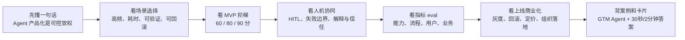
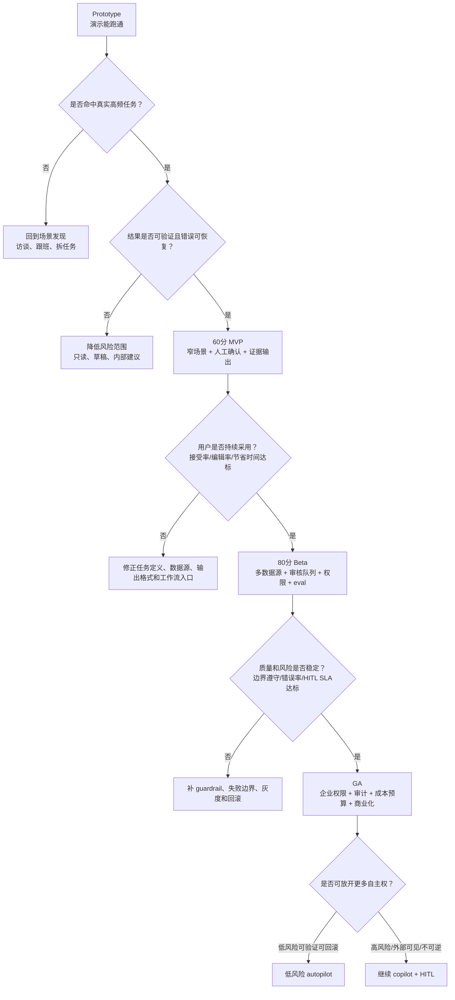
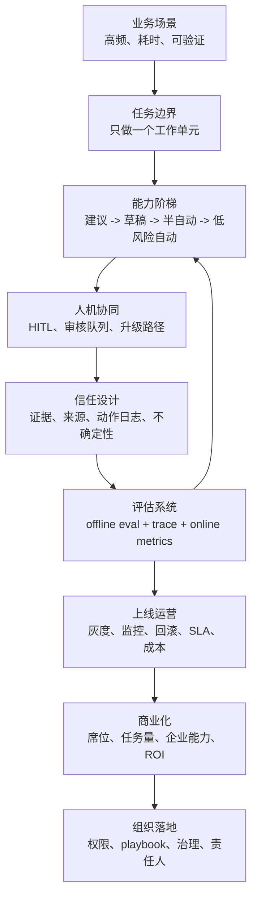

# 12. Agent 产品化方法

> 面向强技术型 Agent 产品经理。目标不是把你训练成 Agent infra 工程师，而是让你能把 Agent 从 demo / prototype 推进到 MVP、Beta、GA 和企业落地：会选场景、定边界、设计人机协同、定义 eval 和业务指标，并能在面试里讲清为什么 Agent 产品不能一开始追求全自动。

## 0. 先读这一页

### 0.1 三分钟速读

如果你只用 3 分钟预习这篇，记住下面 8 句话：

| 你要记住的点 | 面试里怎么说 |
| --- | --- |
| Agent 产品化不是“让 AI 全自动干活” | 它是把不确定的模型能力封装进可控、可评估、可运营的业务流程 |
| 第一个场景要高频、耗时、可验证、可回滚 | 优先让 Agent 接管岗位里的一个任务单元，而不是替代完整岗位 |
| 早期不要追求全自动 | 模型错误会被工具调用、CRM 写入、外部发送和业务流程放大 |
| 60 分 MVP 验证“用户要不要” | 窄场景、少数据源、人工确认、证据输出、轻量 eval |
| 80 分 MVP 验证“能不能进工作流” | 多数据源、审核队列、权限、质量面板、反馈闭环和灰度 |
| 90 分以上才谈规模化自动化 | 低风险动作自动，高风险动作 HITL，配套审计、回滚、预算和 SLA |
| 可信不是让模型解释思维链 | 用户需要证据来源、动作日志、不确定性、可编辑路径和失败边界 |
| 商业化卖业务结果，不卖模型调用 | GTM Agent 卖的是覆盖率、回复率、会议率、pipeline 和可管理产能 |

一句面试总括：

> Agent 产品化的核心，是先选择高频、耗时、可验证、错误可恢复的任务，让 Agent 在人工确认下完成研究、推荐、草稿和低风险动作；再用 eval、trace、接受率、编辑率、HITL 触发率和业务指标证明稳定，逐步把自主权从 assistant 推到 copilot，再推到低风险 autopilot。

### 0.2 本篇阅读路线



### 0.3 PM 决策速查表

| 决策问题 | 推荐判断 |
| --- | --- |
| 第一个 Agent 场景选什么？ | 选高频、耗时、自然语言密集、结果可验证、错误可恢复、业务指标明确的任务 |
| 什么时候不用 Agent？ | 流程完全固定、错误不可逆、数据质量极差、责任边界不清时优先不用 |
| MVP 要做到什么程度？ | 先做 60 分：窄任务、少数据源、人工确认、证据输出、可编辑结果 |
| 能不能自动执行？ | 看风险、可验证性、可逆性、用户信任和组织授权，不看模型“看起来聪不聪明” |
| 哪些动作必须 HITL？ | 对外发送、关键业务写入、高价值客户、低置信、信息冲突、敏感数据、不可逆动作 |
| 如何做可信 UX？ | 展示来源、证据、动作、限制、不确定性和可编辑字段，不展示完整思维链 |
| Agent 出错怎么办？ | 产品化失败边界：停、问、降级、转人工、拒绝、回滚、记录 trace |
| 如何证明值得买？ | 同时看节省时间、覆盖率、接受率、编辑率、业务转化、风险事件和人工成本 |

### 0.4 从 prototype 到 MVP / Beta / GA 的决策树



### 0.5 产品化阶段图

| 阶段 | 目标 | Agent 自主权 | PM 重点 | 进入下一阶段的门槛 |
| --- | --- | --- | --- | --- |
| Prototype | 证明技术可行和体验方向 | 低，通常是 demo 流程 | 找到真实任务，不被炫技带偏 | 用户承认这是现有痛点 |
| 60 分 MVP | 验证用户是否愿意用 | 建议、研究、草稿 | 场景收窄、证据、人工确认 | 用户持续采用，能节省真实时间 |
| 80 分 Beta | 验证能否进入工作流 | 半自动，关键动作暂停 | 多数据源、审核队列、eval、权限 | 质量稳定，错误可控，HITL 不堵 |
| GA | 验证可规模化交付 | 低风险自动，高风险协作 | 审计、SLA、预算、灰度、商业化 | 企业客户愿意部署和付费 |
| Scale | 扩大自动化和组织采用 | 分层自主权 | 组织流程、playbook、ROI、治理 | 自动化提升业务结果且风险可管理 |

### 0.6 学完后你应该能做到

- 用 30 秒解释 Agent 产品化为什么不是全自动。
- 画出从 prototype 到 MVP / Beta / GA 的决策树。
- 给一个 Agent 场景判断是否适合做 MVP。
- 设计 60 分、80 分、90 分 Agent 能力阶梯。
- 说明哪些动作能自动，哪些必须 human-in-the-loop。
- 解释可解释性、可信度、失败边界和 trace 的产品意义。
- 给 GTM / Sales / Marketing Agent 设计上线灰度、指标和商业化路径。
- 回答“如果 Agent 出错，你怎么让企业客户敢用”。

## 1. What this module solves

本模块解决一个强技术型 Agent PM 最容易在面试和实战中被追问的问题：

> Agent 不是一个更会聊天的 chatbot，也不是把所有流程交给模型自动跑。Agent 产品化的核心，是把不确定的模型能力，封装成用户愿意信任、企业敢于上线、团队能持续迭代的业务系统。

读完后，你应该能解释 Agent 产品从 0 到 1、从 MVP 到规模化的完整方法：

- 如何选择适合 Agent 的业务场景。
- 为什么一开始不能追求全自动。
- 如何设计 60 分、80 分、90 分 Agent 能力阶梯。
- 如何把人工确认、人机协同、失败边界、可解释性和可信度做进产品。
- 如何设计 eval、在线指标、反馈闭环和灰度上线。
- 如何把 Agent 从 demo 做成企业可买、可管、可审计、可扩展的产品。
- 如何用 GTM / Sales / Marketing Agent 讲清完整产品化故事。

一句话概括：

> Agent 产品化不是让模型替人做完所有事，而是先让模型稳定承担一个高频、可验证、可回滚的任务单元，再逐步扩大自主权。

## 2. Why an Agent PM must understand it

Agent PM 必须理解产品化方法，因为 Agent 的失败通常不是模型完全不会，而是产品把“不确定能力”放在了错误的流程位置。

传统 SaaS 功能的产品化逻辑常常是：

- 用户点击按钮。
- 系统执行确定逻辑。
- 输出可预期结果。
- PM 优化转化率、留存和效率。

Agent 产品的逻辑更复杂：

- 用户给出目标，而不是固定指令。
- Agent 需要拆解任务、选择工具、读取上下文、调用外部系统。
- 输出可能正确、部分正确、过度自信、不可复现或成本过高。
- 用户不只评价结果，还评价过程是否可信、是否可控、是否节省了真实工作。

这意味着 Agent PM 要同时管理三类东西：

1. **业务结果**：是否减少人工时间、提升转化、提高覆盖率、降低响应延迟。
2. **模型不确定性**：是否 hallucinate、是否误用工具、是否在边界场景失控。
3. **人机关系**：用户是否知道 Agent 能做什么、不能做什么、什么时候该接管。

面试中，优秀回答不是“我们会用更强模型解决”，而是：

> 我会先把场景拆成低风险读取、高价值判断、可逆写入和不可逆动作四类。MVP 阶段让 Agent 先做研究、总结、推荐和草稿，由人确认关键动作；等离线 eval、线上人工接受率、错误分布和业务指标稳定后，再逐步放开半自动或自动执行。

## 3. Core concept map

Agent 产品化可以用一张方法图理解：

```text
业务场景选择
  -> 任务拆解
  -> Agent 能力边界
  -> MVP 自动化等级
  -> 人工协同设计
  -> 工具和数据接入
  -> 可解释性和信任
  -> 评估指标和 eval
  -> 灰度上线
  -> 反馈闭环
  -> 商业化
  -> 组织落地
```

更产品化的理解方式，是把 Agent 当成一个“自主权逐步放大的业务系统”：



核心概念：

- **Scene selection 场景选择**：选择高频、耗时、判断规则可表达、结果可验证、错误可控的任务。
- **Workflow vs Agent**：工作流是预定义路径，Agent 是模型可动态决策路径。产品早期应尽量从 workflow-like agent 开始。
- **Autonomy ladder 自主权阶梯**：从建议、草稿、人工确认、半自动执行到全自动执行逐步升级。
- **60/80/90 分 MVP**：60 分验证用户是否愿意用；80 分验证是否能稳定节省工作；90 分才考虑规模化自动化。
- **Human-in-the-loop 人在回路中**：不是在最后放一个 Approve 按钮，而是在风险、歧义、权限和学习节点上设计人工介入。
- **Failure boundary 失败边界**：定义 Agent 什么情况下必须停、问、降级或转人工。
- **Explainability 可解释性**：解释不是展示模型思维链，而是展示来源、证据、动作、置信线索和可编辑路径。
- **Trust calibration 信任校准**：让用户既不过度相信，也不过度怀疑。
- **Eval 评估**：用离线任务集、trace、人工评分、自动 grader、线上反馈和业务指标共同衡量。
- **Operationalization 运营化**：上线后要有监控、审计、回滚、权限、成本、SLA 和责任人。

## 4. How it works

### 4.1 场景选择：不是所有流程都适合 Agent

适合 Agent 的场景通常满足七个条件：

1. **任务高频且耗时**：用户今天已经在做，只是做得慢。例如销售每天研究账户、客服每天总结工单、运营每天分析评论。
2. **存在自然语言输入输出**：需要阅读网页、邮件、CRM、会议纪要、知识库，或生成摘要、推荐、草稿。
3. **任务路径有变化**：如果流程完全固定，传统 workflow、RPA 或规则系统可能更便宜、更稳定。
4. **结果可以验证**：用户能判断好坏，或者系统能用数据、引用、规则、外部 API 校验。
5. **错误可恢复**：错误不会直接造成金钱损失、法律风险、客户关系破坏或数据泄露。
6. **有足够上下文和工具**：Agent 能访问 CRM、文档、网页、产品数据、邮件、日历等必要来源。
7. **有明确业务指标**：节省时间、提高覆盖率、提升回复率、降低处理时长、提高线索转化等。

不适合早期 Agent 产品化的场景：

- 一步错误就不可逆，例如直接转账、删除核心数据、发送高风险法律承诺。
- 评价标准完全主观，且用户无法快速判断。
- 数据质量极差，业务系统权限复杂，但团队还没有治理能力。
- 用户没有现成工作流，只是觉得“AI 应该能做点什么”。
- 任务本质是合规或责任判断，但组织没有明确授权机制。

PM 面试表达：

> 我会优先选“高频、耗时、可验证、可回滚”的任务，而不是最炫的全自动任务。Agent 的第一价值不是替代完整岗位，而是稳定接管岗位里的一个工作单元。

### 4.2 为什么不能一开始追求全自动

Agent 一开始追求全自动，通常会在五个地方失败。

第一，模型输出是概率性的。  
同一个任务在不同上下文、不同提示、不同工具返回下，可能得到不同结果。全自动要求稳定执行，而早期 Agent 往往还没有足够 eval 和监控证明稳定。

第二，Agent 的错误会被工具放大。  
普通 chatbot 说错一句话，用户可能只是觉得不好用。Agent 如果误调用 CRM、误发邮件、误更新字段、误触发工作流，就会把语言错误变成业务错误。

第三，真实业务流程存在大量隐性规则。  
例如销售代表知道某个战略客户不能自动发冷邮件，某个地区需要特定合规声明，某类客户要先问渠道经理。这些规则通常不在文档里，必须通过人工确认和反馈逐步显性化。

第四，用户信任需要逐步建立。  
Google PAIR 的 Human-AI 设计指南强调，AI 产品需要帮助用户校准信任，信任不是一次上线就获得的。Agent 如果一开始就替用户做不可逆动作，用户会担心失控；如果它只给低价值建议，用户又会觉得没用。正确路径是先在可验证任务上让用户看到证据和稳定收益。

第五，企业上线需要责任边界。  
企业客户会问：谁批准了动作？谁能查看日志？出错怎么回滚？权限怎么继承？敏感数据是否进入模型上下文？如果这些没有答案，全自动 Agent 很难进入生产。

所以，Agent 自主权应该按阶梯增长：

| 阶段 | Agent 做什么 | 人做什么 | 适合场景 |
| --- | --- | --- | --- |
| L0 辅助检索 | 找资料、总结、列证据 | 判断是否采用 | 研究、知识问答 |
| L1 推荐 | 给出候选结论和下一步 | 选择、修改、确认 | 销售研究、客服建议 |
| L2 草稿 | 生成邮件、报告、CRM 更新草稿 | 审核后提交 | 外联、文档、工单 |
| L3 半自动 | 自动执行低风险动作，高风险暂停 | 审核例外和高风险动作 | 批量线索研究、内部流转 |
| L4 全自动 | 在边界内闭环执行 | 监控、抽检、处理升级 | 低风险、高重复、强校验任务 |

PM 的关键判断：

> 自动化不是二元选择，而是按风险、可验证性、可逆性和信任程度逐步放权。

### 4.3 60/80/90 分 MVP 怎么设计

Agent MVP 不能按“功能清单”设计，而要按“用户愿意把哪部分工作交给 Agent”设计。

#### 60 分 MVP：验证是否值得做

目标：证明 Agent 能在一个窄场景里节省时间或提高质量。

特点：

- 场景窄：只做一个任务单元，不做完整岗位。
- 数据少：先接 1 到 2 个关键数据源。
- 人工确认：所有外部动作都需要人确认。
- 输出结构化：结果必须包含来源、理由、置信线索和可编辑字段。
- 评估轻量：人工评分、接受率、节省时间、错误类型。

GTM 例子：

> 线索研究 Agent 输入公司域名，读取官网、新闻、LinkedIn 风格公开信息和 CRM 历史记录，输出公司概况、业务痛点、关键人候选、近期 buying signal、推荐外联理由。销售必须确认后才能写入 CRM 或生成邮件。

60 分 MVP 不追求自动发邮件，不追求自动判定 SQL，不追求全量账户覆盖。它只验证：销售是否愿意用 Agent 的研究结果替代手工搜索。

#### 80 分 MVP：验证是否能稳定进入工作流

目标：证明 Agent 在真实工作流中可重复、可控、可衡量。

新增能力：

- 多数据源整合：CRM、邮件互动、营销活动、网页、新闻、产品使用数据。
- 人工审核队列：高价值账户、低置信结果、缺少证据的结论进入人工审核。
- 工具调用权限：只允许白名单工具和最小权限。
- 质量面板：展示接受率、编辑率、召回率、错误类型、平均处理时长。
- 反馈闭环：用户修改被记录成 eval 样本和 prompt/workflow 改进输入。
- 灰度：先给一组销售或一个细分市场使用。

80 分 MVP 的判断标准：

- 用户每周自然回访，而不是只在演示时觉得惊艳。
- 人工编辑率下降。
- 研究覆盖账户数上升。
- 销售能说出它在什么时候可靠、什么时候要自己判断。
- Agent 出错时有明确降级和恢复路径。

#### 90 分以上：规模化和商业化

目标：在可控风险下扩大自动化范围。

新增能力：

- 自动处理低风险账户或低风险字段更新。
- 对高风险动作使用 HITL，例如发外部邮件、修改客户阶段、创建任务。
- 部署企业级权限、审计、监控、成本预算和数据策略。
- 形成分层定价，例如按席位、按任务量、按 credits、按成功事件或按高级自动化能力收费。
- 与销售管理流程绑定，例如 pipeline review、campaign attribution、SDR coaching。

90 分不是“模型更聪明”这么简单，而是整个系统已经能管理不确定性。

### 4.4 人工协同：HITL 不是最后一个 Approve 按钮

很多团队把人机协同理解成：Agent 生成结果，用户点 Approve。这个设计太粗糙。

真正的 HITL 要回答四个问题：

1. **何时需要人**：低置信、缺证据、高价值客户、敏感动作、权限不足、冲突信息、不可逆操作。
2. **人看到什么**：不是原始 prompt，而是任务目标、证据来源、Agent 建议、风险提示、可编辑字段。
3. **人能做什么**：批准、编辑、拒绝、补充信息、要求重试、转交他人。
4. **人的反馈如何进入系统**：记录修改差异、拒绝原因、补充规则、作为 eval 样本和策略更新依据。

从技术实现看，LangGraph 等框架把 HITL 做成 interrupt：Agent 在特定节点暂停，保存状态，等待人类输入后恢复执行。这对 PM 的启发是：

- 产品上要有“暂停中的任务”状态，而不是让用户不知道 Agent 卡在哪里。
- 审核动作要能恢复原任务上下文，而不是重新跑一遍导致结果不一致。
- 审核队列需要 SLA、负责人和优先级，否则 HITL 会变成人工瓶颈。

GTM 例子：

```text
Agent: 发现目标账户最近发布了欧洲扩张招聘信息，可能有跨境支付需求。
暂停原因: 证据来自新闻和招聘页，但 CRM 中该账户属于战略客户。
给销售: 证据链接、推荐外联理由、邮件草稿、风险提示。
销售动作: 编辑邮件语气，选择“不自动发送，只创建任务”。
系统记录: 原草稿、人工修改、拒绝自动发送原因、最终任务结果。
```

### 4.5 失败边界：让 Agent 知道什么时候停

Agent 产品最重要的设计之一，是明确失败边界。失败边界不是“模型不要出错”的提示词，而是产品、流程和系统共同定义的停机条件。

常见失败边界：

- **证据不足**：没有可引用来源，不允许输出确定结论。
- **信息冲突**：CRM 记录和网页信息冲突，需要提示用户确认。
- **权限不足**：Agent 没有权限读取或写入某对象。
- **高风险动作**：发外部邮件、改 deal stage、删除记录、触发合同流程必须暂停。
- **低置信或异常成本**：工具调用次数过多、循环、token 成本超阈值。
- **敏感数据**：涉及 PII、合同、医疗、金融、法律信息时限制上下文和输出。
- **越界目标**：用户要求 Agent 做产品定义外任务，例如绕过审批、猜测私人信息。

失败边界对应产品状态：

| 边界类型 | 产品表现 | 处理方式 |
| --- | --- | --- |
| 缺少数据 | “需要补充信息” | 向用户提问或请求连接数据源 |
| 证据不足 | “只能给出假设” | 标注假设，不写入系统 |
| 高风险动作 | “等待审核” | 进入 HITL 队列 |
| 工具失败 | “任务暂停，可重试” | 保留状态和日志 |
| 超预算 | “已停止以控制成本” | 提供部分结果 |
| 安全风险 | “无法执行该请求” | 拒绝并记录 |

面试表达：

> 我不会只靠 prompt 要求 Agent 谨慎，而会把失败边界产品化：哪些动作可自动，哪些动作必须暂停，哪些输出必须带证据，哪些场景直接拒绝或转人工。

### 4.6 可解释性和可信度：解释过程，不暴露思维链

Agent 的可解释性不是展示完整 chain-of-thought。对用户更有价值的是：

- **为什么给这个建议**：业务理由和判断依据。
- **依据来自哪里**：网页、CRM 字段、邮件、工单、知识库链接。
- **Agent 做了什么**：读取了哪些来源，调用了哪些工具，跳过了什么。
- **不确定在哪里**：缺少什么数据，哪些结论是推断。
- **用户能如何修正**：编辑字段、添加证据、反馈错误、设置偏好。

Google PAIR 把信任拆为能力、可靠性和善意。对 Agent PM 来说，可以翻译成：

- 能力：Agent 是否真的完成用户任务。
- 可靠性：同类任务是否稳定，错误是否可预期。
- 善意：产品是否诚实说明限制、权限、数据使用和商业动机。

不要滥用精确置信度。很多用户不知道 86% 和 91% 在业务上有什么差别。更好的方式是展示可行动的置信线索：

- “证据充分，可以直接使用。”
- “缺少近期新闻，建议人工确认。”
- “CRM 与网页信息冲突。”
- “这是基于 2 条公开来源的推断，不建议自动发送。”

### 4.7 指标和 eval：Agent 不能只看 DAU

Agent 产品指标要同时覆盖质量、效率、风险、信任和商业结果。

#### 离线 eval 指标

用于上线前和迭代时比较版本：

- **任务成功率**：是否完成目标任务。
- **事实准确率**：关键事实是否有证据支持。
- **工具调用正确率**：是否选择正确工具、参数是否正确。
- **引用覆盖率**：关键结论是否带来源。
- **格式合规率**：输出是否符合 schema。
- **边界遵守率**：遇到高风险动作是否暂停。
- **拒答正确率**：不该做的请求是否拒绝。
- **成本和延迟**：平均 token、工具调用数、端到端耗时。

OpenAI 的 agent eval 文档强调用 trace、grader、dataset 和 eval run 衡量 agent workflow。PM 不需要写 grader 代码，但必须定义任务集、评分标准和业务可接受阈值。

#### 在线产品指标

用于真实用户场景：

- **接受率**：用户直接采用 Agent 建议的比例。
- **编辑率**：用户修改 Agent 输出的比例，编辑程度是多少。
- **拒绝率及原因**：事实错、语气不对、缺证据、越权、无价值。
- **人工介入率**：多少任务触发 HITL，是否过高。
- **节省时间**：每个任务从 20 分钟降到 5 分钟，还是只是换了形式。
- **覆盖率**：原来只能研究 20 个账户，现在能覆盖 200 个。
- **业务结果**：回复率、会议预约率、MQL 到 SQL 转化、pipeline 贡献。
- **信任指标**：重复使用率、主动触发率、审核后自动化授权比例。
- **风险指标**：安全拦截、错误写入、客户投诉、回滚次数。

#### 反馈闭环

每一次用户编辑、拒绝、补充证据都是产品资产。PM 要把它们转成：

- Prompt 和 system instruction 改进。
- 工具参数和工作流规则改进。
- 检索源优先级改进。
- eval 数据集新增样本。
- 用户偏好或团队 playbook。
- 权限和自动化策略调整。

好的 Agent 产品会形成数据飞轮：

```text
用户任务
  -> Agent 执行
  -> trace + 输出
  -> 人工编辑/接受/拒绝
  -> 错误归因
  -> eval 样本
  -> workflow/prompt/tool 改进
  -> 灰度验证
  -> 更高自主权
```

### 4.8 上线灰度：从单人影子模式到规模化

Agent 上线不要直接全量发布。推荐灰度路径：

1. **Shadow mode 影子模式**：Agent 在后台跑，输出不影响用户工作。比较 Agent 结果和人工结果。
2. **Assistant mode 助手模式**：Agent 给建议和草稿，用户手动采纳。
3. **Copilot mode 协作模式**：Agent 进入真实工作流，但关键动作需要确认。
4. **Autopilot for low-risk 低风险自动模式**：只自动执行可逆、低风险、强校验动作。
5. **Scaled autonomy 规模化自主**：按客户、团队、任务类型和权限分层放开。

灰度时 PM 要定义：

- 谁先用：高意愿、能反馈、风险低的团队。
- 哪些任务先开：低风险读取和草稿优先。
- 停止条件：错误率、投诉、成本、延迟、权限异常。
- 回滚方式：关闭某工具、降低自动化等级、恢复人工流程。
- 发布沟通：明确 Agent 能力、限制、数据使用和人工责任。

### 4.9 商业化：Agent 卖的不是模型调用，而是业务杠杆

Agent 商业化要避免只卖“AI 功能”。客户真正购买的是：

- 更高覆盖率：更多账户、更多线索、更多客户触达。
- 更短周期：更快研究、更快回复、更快流转。
- 更好质量：更一致的 playbook、更少遗漏、更强证据。
- 更低成本：减少重复人工、降低外包或 SDR 低价值工作。
- 更强管理：可审计、可衡量、可复制最佳实践。

常见定价方式：

- **按席位**：适合 Agent 深度嵌入个人工作流，例如销售助手。
- **按任务量或 credits**：适合批量研究、批量生成、工具调用成本明显的 Agent。
- **按模块**：基础建议免费，高级自动化、跨系统写入、审计和企业权限收费。
- **按业务结果**：高风险但有吸引力，例如按合格会议或转化事件收费，需要强归因能力。
- **平台打包**：把 Agent 作为 CRM、营销自动化、客服平台的高阶能力。

GTM 话术不要说“我们的 Agent 可以自动做销售”。更好的表达：

> 我们帮助销售团队把账户研究、购买信号识别和外联理由生成从每个账户 20 分钟降到 3 分钟，同时保留人工确认和 CRM 审计，先提升覆盖率和一致性，再逐步放开低风险自动化。

### 4.10 组织落地：Agent 是产品，也是运营系统

企业 Agent 落地需要组织角色：

- **业务 owner**：定义场景、成功指标、人工规则。
- **PM**：定义体验、边界、指标、灰度和商业化。
- **工程**：实现工具、权限、日志、状态、eval、监控。
- **数据/RevOps/Ops**：治理字段、流程、数据质量和反馈。
- **安全/法务/合规**：定义敏感数据、审计、保留策略和风险等级。
- **一线专家**：提供 playbook，审核输出，标注错误。

Agent 产品化成熟后，团队会从“做功能”变成“管理数字劳动力”：

- 每个 Agent 有任务范围。
- 每个 Agent 有权限和预算。
- 每个 Agent 有质量仪表盘。
- 每个 Agent 有升级路径和停用条件。
- 每个 Agent 有版本、eval 和发布记录。

## 5. What depth a PM needs

Agent PM 不需要掌握深度基础设施实现，但需要掌握以下深度。

### 必须能讲清

- Agent 和 chatbot、workflow、RPA 的区别。
- 什么时候用固定 workflow，什么时候用 Agent。
- 为什么早期从人机协同和窄任务开始。
- 如何拆任务、定义工具、定义权限和暂停点。
- 如何设计 60/80/90 分 MVP。
- 如何定义 eval 数据集和线上指标。
- 如何处理 hallucination、工具误用、权限越界、信任崩塌。
- 如何把用户反馈转成迭代闭环。
- 如何做灰度、回滚、审计和商业化。

### 需要能和工程对齐

PM 不必写完整 Agent runtime，但要能说清这些关键词：

- system prompt / developer instruction / tool schema
- tool calling / function calling
- workflow graph / state machine
- memory / context window / retrieval / RAG
- HITL interrupt / checkpoint / resume
- trace / span / run log
- guardrail / policy / allowlist
- eval dataset / grader / regression test
- structured output / JSON schema
- permission scope / audit log / rate limit
- fallback / escalation / rollback

### 可以交给工程深入

- 模型路由和推理优化细节。
- 向量数据库索引和召回算法。
- 分布式 workflow runtime。
- 安全沙箱实现。
- 大规模 trace 存储。
- 自动 grader 代码实现。
- 权限系统底层架构。

PM 要管的是：这些技术选择如何影响用户体验、风险、成本、上线节奏和商业价值。

## 6. Common product decisions and tradeoffs

### 6.1 Workflow 还是 Agent

选择 workflow：

- 流程稳定，步骤明确。
- 错误容忍度低。
- 成本和延迟要可控。
- 只需要少量生成或分类。

选择 Agent：

- 任务路径因上下文变化。
- 需要动态选择工具。
- 需要读写多源信息。
- 用户目标比步骤更重要。

最佳实践通常是混合：

> 外层用 workflow 控制状态和边界，内层让 Agent 处理需要语言理解、判断和工具选择的部分。

### 6.2 先接哪个数据源

不要一开始接所有系统。优先级：

1. 用户完成任务必须看的数据。
2. 能显著提升准确性的证据源。
3. 权限清晰、数据质量较高的数据源。
4. 可用于验证结果的数据源。

GTM Agent 中，通常先接 CRM 和公开网页，再接邮件互动、营销活动、产品使用数据和第三方 enrichment。

### 6.3 让 Agent 写入系统吗

读取和总结风险低，写入系统风险高。

写入权限按风险分层：

- 自动写入草稿、备注、待办：相对低风险。
- 自动更新字段：需要字段级权限和回滚。
- 自动推进阶段、发送客户邮件：需要人工确认或严格规则。
- 自动执行合同、报价、退款：早期不建议。

### 6.4 显示多少过程

过程展示过少，用户不信。展示过多，用户负担重。

建议展示：

- 当前状态：正在研究、等待审核、已完成。
- 关键动作：查了哪些来源、生成了哪些建议。
- 证据链接：关键结论可追溯。
- 可编辑项：用户能快速修正。
- 风险提示：为什么暂停或需要确认。

不建议展示：

- 冗长原始日志。
- 完整思维链。
- 无法解释给业务用户的模型内部分数。

### 6.5 自动化速度还是信任

早期优先信任。  
如果 Agent 很快但频繁错，用户会停止使用。信任建立后，再优化速度和自动化。

一个实用策略：

- 高价值客户：慢一点，多证据，多人工确认。
- 普通客户：中等自动化。
- 低风险内部任务：更高自动化。

## 7. Common failure modes

### 7.1 Demo 很惊艳，真实工作没人用

原因：

- 没嵌入用户现有工作流。
- 输出不可编辑或不可写回。
- 数据源缺失，用户还要二次查证。
- 节省的是“看起来的时间”，不是真实工作时间。

解决：

- 观察用户原流程。
- 把 Agent 放在任务发生的位置。
- 让输出能直接进入 CRM、邮件、工单或文档。
- 用编辑率和节省时间衡量，不只看生成次数。

### 7.2 Agent 过度自信

表现：

- 没证据也给确定结论。
- 把推断写成事实。
- 忽略冲突信息。

解决：

- 要求关键结论绑定来源。
- 区分事实、推断、建议。
- 没证据时降级成“需要人工确认”。
- eval 中加入证据不足和冲突样本。

### 7.3 人工审核成为瓶颈

原因：

- 所有动作都要求同样审核。
- 审核信息不完整。
- 没有按风险分层。

解决：

- 低风险自动通过。
- 高风险进入队列。
- 提供证据、差异、推荐动作。
- 统计审核原因，优化规则。

### 7.4 工具调用失控

表现：

- Agent 循环调用工具。
- 调错 API 或参数。
- 成本超预算。
- 写入重复记录。

解决：

- 工具 allowlist。
- 参数 schema 校验。
- 调用次数、成本、时间上限。
- 幂等设计和重复调用检测。
- trace 监控工具链。

### 7.5 安全和权限越界

表现：

- 读取了用户不该看的数据。
- 把敏感信息带入外部上下文。
- 被 prompt injection 操纵执行工具。
- 多 Agent 之间传递污染上下文。

解决：

- 最小权限。
- 敏感字段过滤。
- 工具级 guardrail。
- 检索结果和外部网页视为不可信输入。
- 审计日志和异常告警。
- 按 OWASP LLM / Agentic 风险框架做威胁建模。

### 7.6 指标看起来好，但业务没收益

原因：

- 只看生成量，不看采用和结果。
- 只优化模型分数，不看用户工作流。
- 没有和销售、客服、运营核心指标绑定。

解决：

- 把模型指标和业务指标同时上 dashboard。
- 对照组或灰度组比较。
- 追踪从建议到业务结果的链路。

## 8. Metrics and evaluation methods

Agent 产品评估建议分四层。

### 第一层：能力 eval

回答“Agent 会不会做”。

- 输入代表性任务。
- 比较输出和参考答案。
- 用人工评分和自动 grader 混合。
- 覆盖正常、边界、恶意、缺数据和冲突数据样本。

### 第二层：流程 eval

回答“Agent 是否按正确流程做”。

- 是否按顺序执行必要步骤。
- 是否调用正确工具。
- 是否在高风险动作暂停。
- 是否保留状态并可恢复。
- 是否输出结构化结果。

OpenAI tracing 和 LangGraph checkpoint/interrupt 对 PM 的意义在于：Agent 不是只评估最后一句输出，而要评估整个运行轨迹。

### 第三层：用户 eval

回答“用户是否愿意把工作交给它”。

- 接受率。
- 编辑率。
- 拒绝原因。
- 主动使用率。
- 人工确认耗时。
- 用户对能力边界的理解。

### 第四层：业务 eval

回答“是否创造商业价值”。

GTM / Sales Agent 指标例子：

- 每周研究账户数。
- 每账户研究时间。
- 邮件个性化质量评分。
- 外联回复率。
- 会议预约率。
- MQL 到 SQL 转化率。
- pipeline 创建金额。
- 销售代表 ramp time。
- RevOps 数据质量。

评估时要避免两个陷阱：

- 不要只用模型 benchmark 替代真实业务 eval。
- 不要只看业务结果而忽略安全、信任和人工成本。

## 9. Keywords for engineering communication

PM 和工程沟通时可以使用下面的词汇。

### Agent 架构

- Agent runtime：Agent 执行环境。
- Workflow graph：任务节点和状态流转。
- Planner：任务拆解模块。
- Executor：执行工具调用的模块。
- Tool schema：工具名称、参数、返回值和约束。
- State：任务上下文和中间结果。
- Memory：长期或短期记忆。
- RAG：从知识库或外部数据检索上下文。
- Handoff：转给其他 Agent 或人工。

### 控制和安全

- Guardrail：输入、输出或工具调用前后的检查。
- Policy layer：权限和业务规则层。
- Allowlist：允许调用的工具和动作。
- Rate limit：调用频率限制。
- Budget cap：成本上限。
- HITL interrupt：暂停并等待人工决策。
- Checkpoint：保存执行状态。
- Audit log：审计日志。
- Rollback：回滚写入动作。

### 评估和运营

- Trace：一次 Agent 运行的完整轨迹。
- Span：运行中的一次模型调用、工具调用或 guardrail。
- Eval dataset：评估样本集。
- Grader：自动评分器。
- Golden set：人工确认过的高质量测试集。
- Regression eval：版本更新后的回归评估。
- Acceptance rate：采用率。
- Edit distance：用户修改幅度。
- Escalation rate：升级到人工比例。

## 10. High-frequency interview questions and answers

### Q1：Agent 产品和普通 chatbot 最大区别是什么？

回答：

> Chatbot 主要是对话和回答，Agent 是围绕目标执行任务。Agent 会读取上下文、拆解步骤、调用工具、维护状态，甚至写回业务系统。因此 Agent PM 不能只设计对话体验，还要设计权限、工具、失败边界、人工协同、eval 和上线运营。

### Q2：为什么 Agent 产品不能一开始做全自动？

回答：

> 因为 Agent 的错误会被工具和业务流程放大。早期模型能力、数据质量、隐性业务规则和用户信任都没有充分验证。更好的路径是先做建议和草稿，让人确认关键动作；通过 eval、trace、接受率、编辑率和错误分布证明稳定后，再逐步给低风险动作放权。

### Q3：如何选择 Agent 的第一个 MVP 场景？

回答：

> 我会选高频、耗时、自然语言密集、结果可验证、错误可恢复、业务指标明确的任务。比如销售账户研究就适合，因为它消耗大量人工时间，输出可由销售验证，错误不会直接造成不可逆损失，并且能用覆盖率、节省时间、回复率等指标衡量。

### Q4：60 分 MVP 和 80 分 MVP 的区别是什么？

回答：

> 60 分 MVP 验证用户是否愿意使用 Agent 结果，通常只接少量数据源，输出建议和证据，所有动作人工确认。80 分 MVP 验证它是否能稳定进入真实工作流，需要多数据源、审核队列、权限控制、质量指标、反馈闭环和灰度发布。

### Q5：如何设计 Agent 的人工介入？

回答：

> 我会按风险分层设计 HITL。低风险读取和总结可以自动完成；缺证据、信息冲突、低置信、高价值客户或外部写入动作要暂停给人审核。审核界面要展示目标、证据、建议、风险和可编辑字段，并把人的修改记录进反馈和 eval。

### Q6：Agent hallucination 怎么产品化处理？

回答：

> 不把 hallucination 当成单纯模型问题，而是系统问题。关键结论必须带证据；事实、推断和建议要分开；无证据时不允许确定表达；冲突信息要暂停；线上收集用户编辑和拒绝原因，离线 eval 加入边界样本，持续回归。

### Q7：Agent 的可解释性怎么做？

回答：

> 不展示完整思维链，而展示用户决策需要的解释：用了哪些数据源、关键证据是什么、为什么推荐这个动作、哪里不确定、用户能如何修改。目标是信任校准，让用户知道什么时候可以用，什么时候该自己判断。

### Q8：Agent 产品看哪些指标？

回答：

> 我会分四层：能力指标看任务成功率和事实准确率；流程指标看工具调用、暂停和边界遵守；用户指标看接受率、编辑率、拒绝原因和重复使用；业务指标看节省时间、覆盖率、转化率、pipeline 或成本下降。Agent 不能只看 DAU 或生成次数。

### Q9：如何把用户反馈变成 Agent 迭代？

回答：

> 每次接受、编辑、拒绝都是样本。我要记录修改差异和拒绝原因，归因到数据缺失、prompt、工具选择、业务规则或模型能力，再进入 eval 数据集、prompt/workflow 调整、工具改进或权限策略调整。这样形成持续改进飞轮。

### Q10：Agent 上线灰度怎么做？

回答：

> 从 shadow mode 开始，让 Agent 后台跑但不影响业务；然后进入助手模式，只给建议；再进入 copilot 模式，关键动作人工确认；最后只对低风险、可逆、强校验任务开放自动执行。每一步都定义停止条件、回滚方式和质量阈值。

### Q11：如何向企业客户解释 Agent 的可信度？

回答：

> 我会从能力、可靠性、控制和审计四方面解释。能力由 eval 和案例证明；可靠性由线上指标和错误分布证明；控制体现在权限、HITL、guardrail 和自动化等级；审计体现在 trace、日志、版本和回滚。企业客户要买的不是“模型很强”，而是“风险可管理的业务产能”。

### Q12：GTM Agent 如何从 MVP 走到规模化？

回答：

> 先做人工确认的线索研究 MVP，只输出证据和外联理由；稳定后接入 CRM、营销活动和邮件互动，做半自动账户研究和草稿生成；再根据账户风险分层，低风险自动创建任务或更新字段，高价值账户保持人工审核；最终把指标绑定到回复率、会议率、pipeline 和销售效率。

## 11. GTM / Sales / Marketing Agent example

### 背景

一家 B2B SaaS 公司有 50 名销售和 20 名 SDR。团队痛点：

- SDR 每天花大量时间研究账户。
- CRM 字段不完整，线索优先级不稳定。
- 外联邮件个性化质量参差不齐。
- 市场活动产生很多 leads，但销售不知道哪些值得跟。
- 管理层希望提高覆盖率和会议预约率，但不想牺牲品牌和合规。

### 阶段 1：人工确认 MVP

Agent 范围：

- 输入：公司域名、CRM account、lead email。
- 读取：CRM 基础字段、官网、公开新闻、招聘页、营销活动记录。
- 输出：
  - 公司简介。
  - 可能业务痛点。
  - buying signal。
  - key persona 候选。
  - 推荐外联理由。
  - 证据链接。
  - 邮件草稿。

人工协同：

- SDR 必须确认事实和语气。
- 邮件不自动发送。
- CRM 不自动更新核心字段，只能创建草稿备注。

指标：

- 每账户研究时间从 15 到 20 分钟降到 3 到 5 分钟。
- SDR 接受率超过 50%。
- 事实错误率低于可接受阈值。
- 80% 输出包含至少 2 条证据。

产品价值：

- 验证 Agent 研究结果是否有用。
- 收集 SDR 修改，沉淀 ICP、persona 和外联 playbook。

### 阶段 2：半自动化工作流

新增能力：

- 批量处理目标账户列表。
- 自动标记 buying signal 类型。
- 生成多版本外联草稿。
- 将低风险字段写入 CRM，例如研究摘要、推荐下一步。
- 高价值账户、战略客户、低置信结果进入审核队列。

HITL 规则：

- 战略客户：必须人工审核。
- 证据少于 2 条：不能生成确定外联理由。
- 客户已有 open opportunity：暂停并提示 account owner。
- 邮件发送：必须人工确认。
- CRM 阶段变更：禁止自动执行。

指标：

- 账户覆盖率。
- 邮件草稿采用率。
- 人工编辑幅度。
- 审核队列通过率。
- 回复率和会议率。
- 每个合格会议成本。

### 阶段 3：规模化 Agent

新增能力：

- 与营销分群、广告活动、产品使用信号联动。
- 自动监测 buying signal，例如融资、招聘、技术栈变化、竞品迁移。
- 为每个销售生成每日优先账户队列。
- 对低风险 inbound leads 自动研究并创建跟进任务。
- 对 enterprise leads 保持人工审核和 manager 可见。

商业化能力：

- 按 sales seat 收费。
- 批量研究使用 credits。
- 高级 Agent 自动化、审计、权限和团队 playbook 作为 enterprise 版本。
- 用 pipeline lift、会议率提升和节省 SDR 时间证明 ROI。

最终面试故事：

> 我不会把 GTM Agent 第一天设计成自动找客户、自动发邮件、自动推进商机。第一阶段先让它做人类最耗时但可验证的账户研究，并要求证据和人工确认。第二阶段把它嵌入 CRM 和销售工作流，做批量研究、草稿和审核队列。第三阶段才对低风险动作放开自动化，同时用 trace、eval、权限和业务指标支撑规模化。这样既能快速验证价值，又能控制品牌、合规和客户关系风险。

## 12. How to say it in interviews

你可以用下面这段作为总回答：

> 我理解的 Agent 产品化，是把模型的动态推理和工具调用能力，放进一个可控、可评估、可运营的业务工作流里。第一步不是追求全自动，而是选择高频、耗时、可验证、错误可恢复的任务，例如 GTM 里的账户研究。MVP 阶段让 Agent 做研究、证据整理、推荐和草稿，关键动作由人确认。等到接受率、编辑率、事实准确率、工具调用正确率、HITL 触发率和业务指标稳定后，再逐步放开低风险自动化。产品上要设计失败边界、解释证据、人工审核队列、权限和审计；工程上要有 trace、eval、guardrail、checkpoint 和回滚。最终商业化卖的不是 AI 生成，而是可管理的业务产能和更高效率。

如果面试官追问“你怎么判断能不能自动化”，可以回答：

> 我会看四个维度：风险、可验证性、可逆性和信任。低风险、强验证、可回滚且用户已经信任的任务可以自动；高风险、弱验证、不可逆或涉及客户承诺的动作必须人工确认。

如果面试官追问“你如何处理 Agent 错误”，可以回答：

> 我会先把错误分成事实错误、工具错误、流程错误、权限错误和体验错误。事实错误通过证据引用和 eval 处理；工具错误通过 schema、allowlist 和 trace 处理；流程错误通过 workflow graph 和 checkpoint 处理；权限错误通过 policy layer 处理；体验错误通过审核界面、反馈和信任校准处理。

## 13. Quick memory summary

- Agent 产品化的核心不是全自动，而是可控地增加自主权。
- 第一个场景选高频、耗时、可验证、错误可恢复的任务。
- 早期优先 workflow-like agent，用固定流程包住模型灵活性。
- 60 分 MVP 验证用户要不要用；80 分 MVP 验证能不能进工作流；90 分才做规模化自动化。
- HITL 要在风险节点、歧义节点、权限节点和学习节点介入，不只是最后审批。
- 失败边界要产品化：停、问、降级、转人工、拒绝、回滚。
- 可解释性不是思维链，而是证据、来源、动作、不确定性和可编辑路径。
- 指标分能力、流程、用户、业务四层。
- eval 要看最终输出，也要看 trace 和工具调用过程。
- 上线要从 shadow mode 到 assistant、copilot、低风险 autopilot。
- 商业化卖业务结果和可管理产能，不卖“更聪明的模型”。
- GTM Agent 最好从线索研究和外联草稿开始，再走向半自动和规模化。

## 14. 面试卡片与自测

### 14.1 面试官想考什么

面试官问“Agent 产品化方法”，通常不是想听你背一堆 AI 名词，而是在测试五种能力：

| 面试官考点 | 他真正想确认什么 | 你应该主动覆盖 |
| --- | --- | --- |
| 场景判断 | 你会不会选对第一个 Agent 场景 | 高频、耗时、可验证、可回滚、业务指标明确 |
| 自动化边界 | 你会不会盲目追求全自动 | 自主权阶梯、HITL、失败边界、风险分层 |
| 产品体验 | 你会不会只想模型，不想用户信任 | 证据、来源、动作日志、可编辑、暂停状态 |
| 评估体系 | 你会不会只看 demo 效果 | offline eval、trace、在线接受率、业务指标 |
| 企业落地 | 你会不会忽略真实上线条件 | 权限、审计、灰度、回滚、SLA、成本、组织 owner |

一句提醒：

> 面试回答要从“模型能做什么”切到“产品如何控制模型的不确定性，并把它转成可衡量的业务价值”。

### 14.2 30 秒回答模板

适合用于“你怎么理解 Agent 产品化？”这种开场题：

> Agent 产品化不是一上来做全自动，而是把模型的推理、工具调用和多步执行能力，放进一个可控、可评估、可运营的业务工作流。我的方法是先选高频、耗时、可验证、错误可恢复的任务，做 60 分 MVP：Agent 负责研究、证据、推荐和草稿，关键动作人工确认；再用 eval、trace、接受率、编辑率和业务指标证明稳定，进入 80 分 Beta；最后在权限、审计、HITL、回滚和成本可控的前提下，对低风险动作逐步放开自动化。

### 14.3 2 分钟回答模板

适合用于系统设计式追问：

> 我会分六步做 Agent 产品化。第一步是场景选择，不从“AI 能不能做”出发，而从真实工作流出发，选择高频、耗时、自然语言密集、结果可验证、错误可恢复的任务。第二步是拆任务边界，把任务分成只读研究、推荐判断、草稿生成、系统写入和外部可见动作，不同动作给不同自主权。第三步是设计 60 分 MVP，让 Agent 先做研究、总结、证据整理和草稿，所有高风险动作人工确认。第四步进入 80 分 Beta，接入更多数据源、权限、审核队列、trace、offline eval 和在线反馈，验证它能不能稳定进入工作流。第五步做上线灰度，从 shadow mode 到 assistant、copilot，再到低风险 autopilot，每一步都有停止条件和回滚方式。第六步商业化和组织落地，把指标从模型准确率扩展到节省时间、覆盖率、接受率、回复率、pipeline、风险事件和人工成本。比如 GTM 线索研究 Agent，第一阶段只做账户研究和外联理由，由 SDR 确认；第二阶段接 CRM 和营销活动做半自动草稿；第三阶段才对低风险 inbound leads 自动创建任务，高价值客户仍然 HITL。

### 14.4 容易踩坑

| 坑 | 为什么危险 | 更好的说法 |
| --- | --- | --- |
| “模型够强就可以全自动” | 忽略工具调用会放大错误 | “先证明低风险任务稳定，再逐步放权” |
| “MVP 就是功能少一点” | Agent MVP 的关键是自主权和风险边界，不只是功能数量 | “60 分 MVP 要验证用户是否愿意交出一个任务单元” |
| “加一个 Approve 按钮就是 HITL” | HITL 还包括暂停点、审核信息、恢复状态、反馈入库 | “HITL 是工作流节点，不是 UI 按钮” |
| “可解释性就是展示模型推理” | 完整思维链不适合直接暴露，也不一定帮助用户 | “展示来源、证据、动作、不确定性和可编辑字段” |
| “eval 只看答案对不对” | Agent 错误可能发生在工具选择、权限、流程和边界遵守 | “要评估输出，也要评估 trace 和过程” |
| “商业化按 token 收费就行” | 客户买的是业务结果，不是模型成本 | “用覆盖率、效率、转化和治理能力证明 ROI” |

### 14.5 读完自测题

1. 为什么 Agent 产品第一个版本不应该追求全自动？请从模型不确定性、工具放大、隐性业务规则、用户信任和企业责任边界五个角度回答。
2. 给你一个“自动跟进所有 inbound leads”的需求，你会如何拆成 60 分 MVP、80 分 Beta 和 GA？
3. 对 GTM 线索研究 Agent，哪些动作可以自动，哪些动作必须人工确认？为什么？
4. 如果用户说“Agent 研究结果看起来不错，但我还是不敢用”，你会从哪些产品设计上提升信任？
5. 如何设计一个 Agent 的失败边界？至少列出证据不足、信息冲突、权限不足、高风险动作、超预算和安全风险的处理方式。
6. Agent 产品 eval 为什么不能只看最终答案？trace 中应该关注哪些过程指标？
7. 如果一个 Agent 的 DAU 上升但业务结果没有改善，你会怎么诊断？
8. 企业客户问“出错谁负责、怎么审计、怎么回滚”，你会如何回答？
9. 什么时候应该用 workflow-like agent，而不是完全开放的 autonomous agent？
10. 你如何判断一个 Agent 能从 copilot 升级到低风险 autopilot？

### 14.6 自测参考答案要点

| 题目 | 答案要点 |
| --- | --- |
| 1 | 全自动会放大概率性错误；真实流程有隐性规则；用户信任和企业责任需要逐步建立 |
| 2 | 60 分做研究和草稿；80 分接 CRM/营销数据和审核队列；GA 才做低风险自动创建任务 |
| 3 | 自动：公开研究、摘要、草稿、低风险备注；确认：外发邮件、改 stage、高价值客户、低置信结论 |
| 4 | 加证据、来源、动作日志、不确定性、可编辑字段、审核队列和错误反馈 |
| 5 | 为每类边界定义停、问、降级、转人工、拒绝或回滚 |
| 6 | 工具选择、参数正确、权限、HITL 触发、边界遵守、成本、延迟、失败恢复 |
| 7 | 查接受率、编辑率、拒绝原因、节省时间、是否嵌入工作流、是否只创造“生成量” |
| 8 | 解释权限、审批人、trace、audit log、版本记录、回滚机制和责任分工 |
| 9 | 流程稳定、风险高、成本敏感、需要可复现时优先 workflow-like agent |
| 10 | 看低风险、强验证、可回滚、错误率低、HITL 稳定、用户信任和业务指标达标 |

### 14.7 掌握标准

学完本文，达到面试可用的标准是：

- **30 秒能讲清定义**：Agent 产品化是可控放权，不是全自动替人。
- **2 分钟能讲清方法**：场景选择、任务拆解、MVP 阶梯、HITL、eval、灰度、商业化。
- **能画出阶段路径**：Prototype -> 60 分 MVP -> 80 分 Beta -> GA -> Scale。
- **能做产品判断**：给一个场景，判断是否适合 Agent、是否适合自动执行、是否需要人工确认。
- **能讲指标体系**：能力、流程、用户、业务四层指标都能举例。
- **能讲 GTM 案例**：线索研究 Agent 从人工确认到半自动再到规模化。
- **能回答风险追问**：hallucination、工具误用、权限越界、客户不信任、审核瓶颈、成本失控。
- **能连接商业化**：把 Agent 能力翻译成效率、覆盖率、转化率、pipeline、治理和 ROI。

如果你只能背一句话，背这句：

> Agent 产品化的关键不是让模型更自由，而是让系统知道什么时候该让 Agent 做、什么时候该让人确认、什么时候必须停下来。

## 15. References

以下资料用于校准本文的 Agent 架构、HITL、eval、AI UX、信任、安全和企业落地观点。访问时间：2026-06-04。

- Anthropic, [Building Effective AI Agents](https://www.anthropic.com/engineering/building-effective-agents). 关键参考点：成功 Agent 往往来自简单、可组合的模式；区分 workflow 和更自主的 agentic systems。
- OpenAI, [Evaluate agent workflows](https://platform.openai.com/docs/guides/agent-evals). 关键参考点：用 traces、graders、datasets 和 eval runs 改进 Agent 质量。
- OpenAI Agents SDK, [Tracing](https://github.com/openai/openai-agents-python/blob/main/docs/tracing.md). 关键参考点：trace 应记录 LLM generation、tool call、handoff、guardrail 等运行事件。
- OpenAI Agents SDK, [Guardrails](https://openai.github.io/openai-agents-js/guides/guardrails). 关键参考点：输入、输出和工具级 guardrail 适用于不同 workflow 边界。
- LangChain / LangGraph, [Interrupts](https://docs.langchain.com/oss/python/langgraph/interrupts). 关键参考点：用 interrupt、checkpoint 和 thread_id 支持可恢复的人机协同。
- LangChain, [Human-in-the-loop middleware](https://docs.langchain.com/oss/python/langchain/human-in-the-loop). 关键参考点：对敏感 tool call 设计 approve、edit、reject 等人工决策。
- Google PAIR, [Explainability + Trust](https://pair.withgoogle.com/guidebook-v2/chapters/explainability-trust/). 关键参考点：AI 产品需要帮助用户校准信任，解释能力、限制、数据和不确定性。
- Microsoft HAX Toolkit, [Guidelines for Human-AI Interaction](https://www.microsoft.com/en-us/haxtoolkit/ai-guidelines/). 关键参考点：Human-AI 体验需要在初始交互、使用中、出错时和长期使用中设计。
- NIST, [AI Risk Management Framework](https://www.nist.gov/itl/ai-risk-management-framework). 关键参考点：AI 产品、服务和系统需要把可信与风险管理纳入设计、开发、使用和评估。
- OWASP, [Top 10 for LLM Applications 2025](https://owasp.org/www-project-top-10-for-large-language-model-applications/assets/PDF/OWASP-Top-10-for-LLMs-v2025.pdf). 关键参考点：prompt injection、sensitive information disclosure、excessive agency、vector and embedding weaknesses 等生产风险。
- OWASP, [Top 10 for Agentic Applications 2026](https://genai.owasp.org/download/52117/?tmstv=1765059207). 关键参考点：Agent autonomy 会放大 prompt injection、tool misuse、memory poisoning、cascading failures 和 human-agent trust exploitation。
- McKinsey, [The state of AI in 2025: Agents, innovation, and transformation](https://www.mckinsey.com/capabilities/quantumblack/our-insights/the-state-of-ai). 关键参考点：AI 和 Agent 使用扩大，但多数组织仍处于从 pilot 到规模化价值的过渡阶段。
- HubSpot, [Breeze Prospecting Agent](https://www.hubspot.com/products/sales/ai-prospecting-agent). 关键参考点：GTM 产品中 prospecting agent 会结合 CRM 和上下文数据做账户研究和外联建议。
- HubSpot, [Spring 2025 Spotlight AI Agents release](https://ir.hubspot.com/news-releases/news-release-details/hubspot-launches-new-and-enhanced-ai-agents-plus-over-200/). 关键参考点：GTM Agent 正在向 prospect research、buyer committee insight、个性化外联等方向产品化。
- Salesforce Admins, [Use Agentforce to Support and Scale Your Sales Team](https://admin.salesforce.com/blog/2025/use-agentforce-to-support-and-scale-your-sales-team). 关键参考点：销售 Agent 场景包括 lead nurturing、prospecting research、CRM 数据辅助和销售日常任务。
