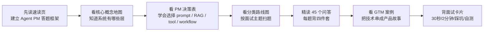
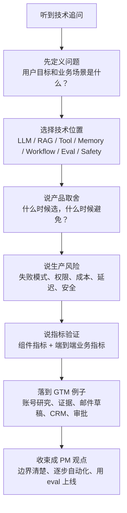

# 13-常见技术面试题

资料核验日期：2026-06-04

本文面向强技术型 Agent 产品经理。目标不是把你训练成 Agent 基础设施工程师，而是让你在面试中能用产品经理视角解释技术概念、架构取舍、失败模式、指标设计和落地风险。建议把每个问题都练成 60 秒版本和 3 分钟版本。

## 0. 先读这一页

### 0.1 三分钟速读

如果你只用 3 分钟预习这篇，先记住下面 8 句话：

| 你要记住的点 | 面试里怎么说 |
|---|---|
| Agent 不是一个 prompt | 它是 LLM、context、tools、state、workflow、eval、guardrails 组合成的任务系统 |
| LLM 负责理解和生成，不负责事实和权限 | 事实应来自 RAG / tools，动作应由系统校验、审批和执行 |
| RAG 不是万能药 | 它降低知识缺失导致的幻觉，但仍要评估 retrieval、rerank、faithfulness 和 citation |
| Tool Calling 的关键不是“能调 API” | 关键是 schema、权限、幂等、重试、审批、审计和错误恢复 |
| Memory 是产品数据，不是越多越好 | 只有能提升用户价值、可见可控可删除的记忆才值得长期保存 |
| Workflow 和 Agent 要混合使用 | 稳定高风险流程用 workflow 控制边界，开放探索任务再让 Agent 自主规划 |
| Multi-Agent 不是默认高级方案 | 只有角色、权限、上下文隔离、并行或交叉审核需求明确时才拆多 Agent |
| Eval 是上线门禁 | 需要组件级、端到端、线上监控和人工校准，不能只看 demo 效果 |

一句面试总括：

> 我会把 Agent 产品理解成一个可观测、可评测、可控风险的任务完成系统。LLM 负责理解、推理和生成；RAG 与 tools 提供事实和外部能力；workflow、memory 和权限系统控制状态与动作；eval、trace、guardrails 和 human-in-the-loop 保证上线质量。作为 PM，我的重点不是追求“更像人”，而是定义清楚任务边界、自动化等级、失败兜底、业务指标和风险门禁。

### 0.2 本篇阅读路线

建议读法：

- 第一次读：先读 0、3、6、7 的每类第一题、11、14，建立全局框架。
- 第二次读：按 LLM、RAG、Tool、Eval、安全这 5 类精读，因为它们最容易被追问。
- 第三次读：把每题压缩成“考点 -> 判断 -> 例子 -> 指标/风险”的 60 秒回答。
- 面试前 10 分钟：只看 0.3、0.4、0.5、13、14。

### 0.3 PM 决策速查表

| 面试官问法 | PM 判断框架 | 推荐表达 |
|---|---|---|
| 这个问题要不要用 Agent？ | 看任务是否多步、路径是否开放、是否需要外部信息、是否可验证、错误成本是否可控 | “我会先判断它是否真的需要 autonomy，而不是把所有 AI 功能都叫 Agent。” |
| Prompt、RAG、Tool、Fine-tune 怎么选？ | “怎么说”用 prompt，“知道什么”用 RAG，“查或做”用 tool，“稳定学会模式”才考虑 fine-tune | “我会先用 prompt/RAG/tool/eval 做 MVP，微调通常不是第一选择。” |
| 什么时候用 Workflow-first？ | 步骤稳定、合规强、结果可枚举、错误成本高 | “外层 workflow 控边界，内部节点可以用 LLM 或 Agent。” |
| 什么时候用 Agent-first？ | 任务开放、路径不固定、需要探索和动态工具选择 | “先限制工具、预算、终止条件和审批，再逐步提高 autonomy。” |
| 什么时候上 Multi-Agent？ | 有明确角色、权限、上下文隔离、并行或审核需求 | “多 Agent 的 KPI 不是数量，而是端到端成功率、成本和可解释性是否变好。” |
| 自动执行还是人工确认？ | 看 side effect、可逆性、外部可见性、合规、用户信任 | “只读可自动，草稿可自动，外发/写关键字段必须 HITL。” |
| 怎么证明 Agent 做得好？ | 业务价值 + 质量 + 系统 + 成本 + 风险五类指标 | “我会看 cost per successful task，而不是只看 token 单价。” |
| 如何设计 GTM Agent MVP？ | 从高频、低写风险、价值可量化的场景切入 | “先做证据型账号研究和邮件草稿，再逐步开放 CRM 写回和自动 follow-up。” |

### 0.4 面试题分类路线图

这 45 题可以按面试官的追问意图分成 7 条路线：

| 路线 | 重点题号 | 面试官真实意图 | 你要展示的能力 |
|---|---|---|---|
| 基础认知线 | Q1-Q9 | 你是否知道 Agent 不是聊天框 | 架构抽象、边界感、自动化等级 |
| 知识与事实线 | Q10-Q14 | 你是否能治理幻觉和知识质量 | RAG pipeline、检索指标、引用与数据治理 |
| 行动与权限线 | Q15-Q19 | 你是否能把 Agent 接入真实系统 | tool schema、权限、幂等、审批、审计 |
| 状态与编排线 | Q20-Q25 | 你是否能设计长期任务和可恢复流程 | memory、workflow、HITL、状态恢复 |
| 复杂系统线 | Q26-Q32 | 你是否会评估多 Agent 和上线质量 | multi-agent 取舍、eval、线上监控 |
| 生产化风险线 | Q33-Q40 | 你是否懂稳定性、成本、安全合规 | SLO、降级、成本、PII、prompt injection |
| 商业落地线 | Q41-Q45 | 你是否能做成产品和业务结果 | MVP、GTM 场景、指标链、工程协作 |

### 0.5 答题流程图

遇到没有准备过的 Agent 技术追问，可以按这张图回答：

万能答题句式：

> 我会先看这个能力解决什么用户任务，再判断它在 Agent 架构中属于 LLM、RAG、tool、memory、workflow 还是 eval。产品上我会说明何时选择、何时避免；工程上我会要求 schema、trace、权限、失败恢复；上线时我会用端到端任务成功率、事实错误率、P95 延迟、成本/成功任务和安全拦截率做门禁。以 GTM Agent 为例，第一版应先做只读研究和邮件草稿，外发和 CRM 写回必须人工确认。

### 0.6 学完后你应该能做到

- 用 30 秒解释 Agent 和 chatbot / workflow 的区别。
- 用 2 分钟讲清 LLM、RAG、Tool Calling、Memory、Workflow、Eval 在同一个 Agent 产品中的分工。
- 面对“为什么会幻觉”“RAG 为什么还会错”“工具误操作怎么办”等追问，能说出失败链路和治理方案。
- 给 GTM / Sales / Marketing Agent 切一个合理 MVP，并说清数据源、工具、权限、指标和上线门禁。
- 把技术方案翻译成 PM 决策：用户价值、体验变化、风险边界、成本收益和工程协作方式。

## 1. 这个模块解决什么

Agent PM 面试里的技术追问通常不是考你背 API，而是考你能不能把「模型能力」翻译成「可上线、可度量、可控风险的产品能力」。

常见追问包括：

- LLM 为什么会幻觉？Prompt、RAG、工具调用、微调分别解决什么？
- Agent 和普通 chatbot / workflow 有什么区别？
- RAG 为什么检索到了文档还会答错？
- Tool Calling 的 schema、权限、重试、幂等怎么设计？
- Memory 是产品能力还是技术债？什么时候不要做长期记忆？
- Multi-Agent 什么时候有价值，什么时候只是复杂化？
- Eval 怎么从 demo 分数变成上线门禁？
- 成本、延迟、稳定性、安全合规如何产品化？
- 如果做一个 GTM / Sales / Marketing Agent，MVP 怎么切、指标怎么定、失败怎么兜底？

## 2. 为什么 Agent PM 必须理解

Agent 产品的体验质量不是单点模型效果决定的，而是由模型、上下文、工具、工作流、权限、评测、观测、人工兜底共同决定。PM 如果只会说“换更强模型”或“加 RAG”，在面试中会显得像需求转述者；强技术 PM 应该能说清：

- 哪类问题应该交给 LLM 推理，哪类应该交给确定性 workflow。
- 哪些信息应放进 prompt，哪些应进入 RAG，哪些应作为 tool 实时查询。
- 哪些动作必须 human-in-the-loop，哪些可以自动执行。
- 哪些指标证明用户价值，哪些指标证明系统可靠。
- 哪些失败可以优雅降级，哪些失败必须阻断。

## 3. 核心概念地图

一个可生产化 Agent 可以拆成 12 层：

1. 用户目标：用户到底要完成什么业务结果。
2. 任务边界：允许 Agent 做什么、不允许做什么。
3. LLM：理解、生成、推理、规划、结构化输出。
4. Context：系统指令、用户输入、历史、检索结果、工具结果。
5. RAG：把企业知识和实时资料送入模型上下文。
6. Tool Calling：连接 CRM、邮件、日历、网页、数据库、内部 API。
7. Memory：保存对用户、账号、任务、偏好的短期或长期状态。
8. Workflow：确定性步骤、分支、重试、审批、回滚。
9. Multi-Agent：按角色或能力拆分专家，并通过 router、supervisor、handoff 协同。
10. Eval：离线测试集、在线监控、人工审核、回归门禁。
11. Ops：日志、trace、SLO、成本、速率限制、缓存、降级。
12. Safety & Compliance：权限、审计、数据隔离、PII、提示注入防护、合规策略。

## 4. 它通常如何工作

以 GTM / Sales Agent 为例：

1. 用户输入：“帮我为 Acme Corp 准备一封个性化 BD 邮件。”
2. Agent 解析任务：识别公司、目标角色、产出类型、语气、约束。
3. RAG 检索：从公司知识库、行业案例、产品资料、过往邮件中找证据。
4. Tool 调用：查 CRM 账号信息、网页搜索最新动态、查 LinkedIn/销售情报工具、读取日历上下文。
5. Memory 读取：拿到用户偏好的邮件风格、已联系过的人、禁用话术。
6. Workflow 编排：先研究账号，再生成 buying signal，再写 outreach，再做安全/合规检查。
7. Eval/Guardrail：检查事实是否有引用、是否包含敏感承诺、是否虚构客户案例。
8. 人工确认：用户批准后才发送邮件或写入 CRM。
9. 观测与学习：记录检索命中、工具成功率、编辑率、回复率、人工驳回原因。

## 5. PM 需要掌握到什么深度

PM 不需要手写完整 agent runtime，但要能参与以下决策：

- 模型选择：质量、延迟、成本、上下文长度、结构化输出、工具调用能力。
- 架构选择：单 Agent、workflow-first、RAG-first、tool-first、multi-agent。
- 数据选择：知识库、实时 API、用户上传文件、CRM、营销自动化平台。
- 风险选择：只读还是可写、自动执行还是人工确认、宽权限还是最小权限。
- 评测选择：任务成功率、事实性、引用准确率、工具调用准确率、业务指标。
- 上线选择：MVP 范围、beta 人群、灰度策略、回滚和运营看板。

## 6. 常见产品决策和取舍

| 决策 | 什么时候选 | 代价与风险 |
|---|---|---|
| Prompt-only | 任务轻、无私有知识、低风险内容生成 | 容易幻觉，难解释，难追踪事实来源 |
| RAG | 需要企业知识、资料更新快、要求引用 | 检索失败会传导到生成，知识治理成本高 |
| Tool Calling | 需要实时数据或外部动作 | 权限、幂等、重试、审计复杂 |
| Workflow-first | 流程稳定、合规强、步骤可枚举 | 灵活性较低，复杂异常需要额外设计 |
| Agent-first | 任务开放、路径不固定、需要自主规划 | 不稳定、难调试、成本和安全风险更高 |
| Multi-Agent | 明确存在多个专业角色或上下文隔离需求 | 协同失败、上下文膨胀、责任边界模糊 |
| 长期 Memory | 复购/长期关系/个人化显著提升价值 | 隐私、错误记忆、删除权、跨用户泄露风险 |
| 自动执行 | 高频低风险、可回滚、用户信任高 | 错误动作成本高，需要审批和回滚机制 |

## 7. 高频技术面试问答

### A. LLM 基础

#### Q1：LLM 在 Agent 产品中到底负责什么？

- 面试官想考什么：你是否能把 LLM 从“万能大脑”降维成架构中的一个组件。
- 推荐回答：LLM 主要负责理解自然语言、把模糊目标转成结构化意图、生成内容、做轻量推理和在工具之间选择下一步。它不应该负责所有业务事实、权限判断和状态持久化。生产系统里，LLM 更像决策和表达层；事实来自 RAG 或工具，动作由工作流和权限系统执行，质量由评测与观测系统约束。
- 加分点：补一句“LLM 的输出应尽量被结构化、可验证、可回放”，比如输出 JSON、引用证据、记录 tool trace。
- 容易踩坑：把 LLM 说成数据库、规则引擎或可靠执行器，忽略它的概率性和不可完全预测性。

#### Q2：为什么 LLM 会幻觉？PM 怎么解释和治理？

- 面试官想考什么：你是否知道幻觉不是单一 bug，而是模型、上下文、检索、任务设计共同造成的。
- 推荐回答：幻觉来自三个层面：模型本身是基于上下文生成最可能的输出，不等于查证事实；上下文可能缺失、过期或冲突；产品要求可能鼓励模型“必须回答”。治理上，PM 应按风险分层：低风险创意任务允许宽松生成；事实任务要求 RAG/工具取证、引用来源、拒答边界；高风险动作要人审、规则校验和审计。
- 加分点：区分 correctness 与 faithfulness。答案可能正确但引用不支持，也可能忠实于错误上下文。
- 容易踩坑：只说“加 RAG 就能消除幻觉”。RAG 只能降低部分事实缺失问题，不能自动保证答案正确。

#### Q3：Prompt Engineering、RAG、Fine-tuning、Tool Calling 分别解决什么？

- 面试官想考什么：你是否能按问题类型选择技术方案，而不是堆术语。
- 推荐回答：Prompt Engineering 解决指令、格式、语气和任务分解；RAG 解决私有知识、长尾知识和新鲜信息；Fine-tuning 更适合稳定风格、分类边界、领域格式或重复任务模式；Tool Calling 解决实时查询和外部动作。PM 的判断标准是：问题是“怎么说”用 prompt，“知道什么”用 RAG，“稳定学会某种模式”考虑微调，“需要查或做”用工具。
- 加分点：强调优先从 prompt、RAG、工具和 eval 做起，微调通常不是第一个 MVP 手段。
- 容易踩坑：把微调当成让模型记住私有知识的首选。知识更新快时，RAG 或工具通常更合适。

#### Q4：上下文窗口越大，产品效果就一定越好吗？

- 面试官想考什么：你是否理解 context 不是免费仓库。
- 推荐回答：更长上下文能容纳更多资料，但也带来延迟、成本、注意力稀释、隐私暴露和缓存命中下降。PM 应关注有效上下文，而不是最大上下文。实践上要把稳定指令放前面，把动态输入放后面；只传与任务相关的证据；用摘要、检索、压缩和结构化状态减少上下文膨胀。
- 加分点：提到 prompt caching 可以降低重复长前缀的延迟和成本，但需要稳定前缀和缓存命中监控。
- 容易踩坑：把所有历史、所有文档、所有工具结果直接塞给模型。

#### Q5：结构化输出为什么重要？

- 面试官想考什么：你是否理解从 demo 到产品需要机器可消费的输出。
- 推荐回答：Agent 产品往往要把模型输出交给后续系统，例如创建 CRM task、调用邮件 API、更新表单或进入审批流。自然语言输出难校验、难回放、难自动化；结构化输出能定义字段、类型、必填项和错误处理。PM 应推动关键链路使用 schema、严格模式、字段校验和失败重试。
- 加分点：说明结构化输出不是 UI 体验问题，而是可靠性、审计和可测试性的基础。
- 容易踩坑：只要求“回答得像 JSON”，但没有 schema、校验和异常路径。

### B. Agent 基础与架构

#### Q6：Agent 和普通 Chatbot 的区别是什么？

- 面试官想考什么：你能否给出清晰边界，而不是说 Agent 更智能。
- 推荐回答：Chatbot 主要围绕对话回答；Agent 面向目标完成，能维护状态、规划步骤、调用工具、观察结果并继续执行。一个销售 Chatbot 可能回答“我们的产品适合哪些行业”；一个 Sales Agent 会研究目标账号、找关键人、生成个性化理由、写邮件草稿、等待审批并写回 CRM。
- 加分点：指出 Agent 不等于完全自主。越接近生产，越需要明确边界、工具权限、human-in-the-loop 和评测。
- 容易踩坑：把任何接了 LLM 的对话框都叫 Agent。

#### Q7：什么时候该做 Agent，什么时候不该做？

- 面试官想考什么：你是否有产品边界感和 ROI 判断。
- 推荐回答：适合做 Agent 的任务通常具备多步、开放路径、需要外部信息、用户愿意委托、人工成本高、结果可验证等特征。不适合的任务包括流程极稳定且规则足够、错误成本极高但无法审批、数据权限不清、无法定义成功标准、用户不信任自动化。PM 应先做窄场景 MVP，再扩大 autonomy。
- 加分点：用“自动化等级”回答：建议从建议型、草稿型、半自动审批型，再到自动执行型。
- 容易踩坑：为了追 Agent 概念，把简单表单流或固定审批流复杂化。

#### Q8：一个生产 Agent 的基本架构怎么讲？

- 面试官想考什么：你是否理解 Agent 不是一个 prompt，而是一套系统。
- 推荐回答：我会拆成输入层、意图/任务解析层、上下文构建层、模型推理层、工具执行层、状态/记忆层、编排层、评测与 guardrail 层、观测与运营层。比如 GTM Agent：输入是目标账号；RAG 提供产品资料和行业案例；工具查 CRM、网页、邮件历史；workflow 控制“研究-生成-校验-审批-发送”；eval 检查事实、语气、合规和回复率。
- 加分点：强调 trace 很重要，要能复盘“模型看到了什么、调用了什么、为什么失败”。
- 容易踩坑：只画 LLM + DB + API 三个框，缺少权限、评测、观测和人工兜底。

#### Q9：Agent 的“自主性”应该如何产品化？

- 面试官想考什么：你是否能把 autonomy 设计成可配置的产品能力。
- 推荐回答：自主性不是开关，而是一组可控变量：可访问的数据范围、可调用工具范围、可执行动作类型、是否需要审批、失败后能否重试、是否能发起新任务。PM 应按风险设计权限等级，例如只读研究、生成草稿、建议动作、需审批执行、低风险自动执行。
- 加分点：给出用户可见控制：预览、撤销、审批队列、活动日志、禁用某工具、设置预算。
- 容易踩坑：把 autonomy 做成黑盒，用户不知道 Agent 做了什么。

### C. RAG 与知识系统

#### Q10：RAG 的核心流程是什么？

- 面试官想考什么：你是否知道 RAG 是一条数据和检索 pipeline，不是“接一个向量库”。
- 推荐回答：RAG 通常包括数据加载、清洗切分、embedding/indexing、存储、检索、重排、上下文组装、生成和评估。产品上它解决“模型不知道我的私有数据或最新数据”的问题。PM 需要关注数据源可信度、更新频率、权限过滤、引用体验和检索质量。
- 加分点：提到 metadata filter、hybrid search、reranking、citation faithfulness。
- 容易踩坑：只说“把文档向量化”，忽略权限、更新、版本、评价和引用。

#### Q11：为什么 RAG 检索到了文档，模型仍然答错？

- 面试官想考什么：你是否理解 RAG 失败链路。
- 推荐回答：可能有四类原因：检索错了，取回的 chunk 不相关；检索对了但 chunk 过碎或缺少上下文；上下文中存在冲突或过期内容；模型生成时没有忠实使用证据。治理方法包括改 chunk 策略、增加 metadata、混合检索、rerank、query rewrite、引用校验、答案必须绑定证据，以及建立 retrieval 和 generation 分层评测。
- 加分点：区分 Recall@K、Context Precision、Faithfulness、Answer Accuracy。
- 容易踩坑：只调大 top_k。top_k 变大可能增加噪声和成本。

#### Q12：向量检索、关键词检索、混合检索怎么取舍？

- 面试官想考什么：你是否能把技术选择映射到用户查询类型。
- 推荐回答：向量检索擅长语义相似，适合概念性问题；关键词/BM25 擅长精确术语、错误码、人名、SKU、字段名；混合检索把两者结合，适合企业知识库和销售资料，因为用户既会问概念，也会问具体公司、产品、竞品、日期。PM 可以通过真实 query log 判断，而不是默认向量检索最好。
- 加分点：提到 reranker 对初检结果重排，常用于提升相关性。
- 容易踩坑：把 embedding 相似度当作业务相关性的充分证明。

#### Q13：RAG 中 chunk 怎么设计？

- 面试官想考什么：你是否关注资料结构对体验的影响。
- 推荐回答：chunk 不是越小越好，也不是越大越好。小 chunk 精准但容易丢上下文；大 chunk 完整但噪声和成本高。PM 应和工程一起按内容类型设计：FAQ 可以短 chunk，合同/政策需要章节级上下文，销售案例需要保留客户、行业、结果和限制条件。还要保留 metadata，如来源、更新时间、权限、地区、产品线。
- 加分点：建议用失败样本反推 chunk 策略，而不是离线拍脑袋。
- 容易踩坑：把 PDF 粗暴切成固定长度，导致表格、标题、脚注和引用关系丢失。

#### Q14：GTM Agent 的 RAG 应该放哪些知识？

- 面试官想考什么：你是否能把 RAG 设计到具体业务场景。
- 推荐回答：我会分四类：产品知识，如功能、定价、限制；销售资产，如案例、ROI、竞品 battlecard；账号资料，如 CRM、历史沟通、行业、新闻；合规知识，如不能承诺的内容、地区限制、品牌语气。生成 outreach 时，Agent 必须引用账号证据和产品证据，不能凭空写“我们帮助类似公司提升 40%”。
- 加分点：把“证据-backed outreach reason”作为核心产物，而不是只生成漂亮邮件。
- 容易踩坑：把所有营销材料都放进去，但没有区分最新版本、地区权限和可对外使用范围。

### D. Tool Calling 与外部系统

#### Q15：Tool Calling 是什么，为什么是 Agent 的核心？

- 面试官想考什么：你是否理解工具让模型从“会说”变成“能查、能做”。
- 推荐回答：Tool Calling 是模型根据任务选择一个由应用暴露的工具，并生成符合 schema 的调用参数；应用执行工具后把结果返回给模型，模型再继续回答或调用下一步。它让 Agent 能查 CRM、搜索网页、创建任务、发邮件、读表格。PM 要关注工具是否必要、描述是否清晰、参数是否可校验、权限是否最小化、失败是否可恢复。
- 加分点：说清工具执行通常在应用侧，而不是模型本身真的拥有系统权限。
- 容易踩坑：把工具描述写得过泛，让模型不知道何时调用，或把高风险写操作直接暴露给模型。

#### Q16：怎样设计一个好的 tool schema？

- 面试官想考什么：你是否知道 schema 是产品契约，不只是工程细节。
- 推荐回答：好的 schema 要做到单一职责、命名清晰、参数少而必要、枚举明确、单位明确、权限边界明确、错误码可解释。比如 `create_crm_task` 应区分 `account_id`、`owner_id`、`due_date`、`task_type`，而不是让模型传一段自然语言。高风险参数要后端再校验，不能信任模型。
- 加分点：提到 strict schema、required fields、additionalProperties=false、版本化 schema。
- 容易踩坑：把一个万能 `execute_action` 暴露给模型，导致权限和审计不可控。

#### Q17：工具调用失败时应该怎么处理？

- 面试官想考什么：你是否具备生产系统思维。
- 推荐回答：先按失败类型分层：参数错误让模型修正或向用户澄清；临时网络/API 错误做有限重试和退避；权限错误提示用户授权或降级；业务规则错误返回可解释原因；高风险写操作失败不能盲目重试。PM 要定义用户体验：显示“已完成哪些步骤、卡在哪、可怎么继续”。
- 加分点：提到幂等 key、超时、重试上限、回滚、补偿任务、审计日志。
- 容易踩坑：让模型无限循环重试，或把工具错误原样暴露给用户。

#### Q18：Tool Calling 和 MCP 的关系怎么讲？

- 面试官想考什么：你是否理解工具生态标准化趋势，也知道安全边界。
- 推荐回答：Tool Calling 是模型与应用工具交互的能力；MCP 是把外部工具、资源、prompt 以标准协议暴露给 AI 应用的一种方式。对 PM 来说，MCP 的价值是减少集成成本、提升工具复用和生态扩展；风险是工具来源、权限、数据暴露、提示注入和审计复杂度。生产落地要做授权、最小权限、工具白名单、用户确认和日志。
- 加分点：指出 MCP 自身不能替你完成所有安全治理，宿主应用仍要实现 consent、authorization、access control。
- 容易踩坑：因为 MCP 标准化就默认安全，或把所有内部系统无差别接入。

#### Q19：Sales Agent 自动发邮件要如何设计权限？

- 面试官想考什么：你是否能处理“可写工具”的产品风险。
- 推荐回答：我会分阶段：第一阶段只生成草稿；第二阶段允许写入 CRM note；第三阶段允许创建待审批邮件；第四阶段只对低风险场景自动发送。每次发送前应展示收件人、主题、正文、引用证据、使用的客户数据、合规检查结果，并记录谁批准、何时发送、发送给谁。
- 加分点：支持组织策略，例如禁止自动联系某些账号、限制每日发送量、敏感行业强制审批。
- 容易踩坑：只看转化率，不看品牌风险、退订率、误发率和客户投诉。

### E. Memory 与状态

#### Q20：Agent Memory 分哪几类？

- 面试官想考什么：你是否能区分 conversation history、task state 和 long-term memory。
- 推荐回答：常见分为短期对话记忆、任务状态记忆、用户偏好记忆、实体/关系记忆、长期经验记忆。短期记忆帮助多轮对话连贯；任务状态记录执行到哪一步；用户偏好支持个性化；实体记忆保存账号、人、项目等结构化信息。PM 要先问“记住什么能提升用户价值”，再决定技术实现。
- 加分点：把 memory 看作可编辑、可删除、可审计的产品数据，而不是 prompt 的附属品。
- 容易踩坑：把全部聊天记录长期保存，并默认注入每次上下文。

#### Q21：什么时候不应该做长期记忆？

- 面试官想考什么：你是否有隐私和错误记忆意识。
- 推荐回答：当记忆没有明确用户价值、内容敏感、用户不可见不可控、跨用户/跨组织边界复杂、错误记忆会造成高风险动作时，不应该做长期记忆。比如 Sales Agent 可以记住“用户偏好短邮件”，但不应未经同意记住客户私人信息或把某个销售的策略泄露给另一个团队。
- 加分点：提到记忆需要生命周期：写入条件、置信度、过期、用户编辑、删除、审计。
- 容易踩坑：把 memory 当成越多越智能，忽略污染、陈旧、隐私和权限继承。

#### Q22：Memory 和 RAG 的区别是什么？

- 面试官想考什么：你是否能分清知识、状态和个性化。
- 推荐回答：RAG 通常检索相对稳定的外部知识或文档；Memory 更偏用户、会话、任务和行为历史。比如产品白皮书、案例库放 RAG；某个销售偏好“先写三条 buying signals 再写邮件”、某个账号上周已联系过 CFO，这更像 memory 或业务数据库状态。两者都可能用向量检索，但产品语义不同。
- 加分点：说明高价值 memory 应尽量结构化，例如账号、联系人、偏好、禁忌，而不是只存自然语言摘要。
- 容易踩坑：把所有东西都丢进向量库，导致数据治理和解释性变差。

### F. Workflow 与编排

#### Q23：Workflow-first 和 Agent-first 的区别？

- 面试官想考什么：你是否能在灵活性和可控性之间取舍。
- 推荐回答：Workflow-first 是由产品/工程定义步骤和分支，LLM 只负责局部理解或生成；Agent-first 是让模型动态决定下一步和工具选择。稳定、合规、可枚举的流程适合 workflow-first；开放研究、探索、复杂信息整合可引入 agentic loop。生产里常见是混合：外层 workflow 控制边界，内部某些节点用 Agent。
- 加分点：用 GTM Agent 举例：研究账号可更 agentic，发送邮件必须 workflow + 审批。
- 容易踩坑：把本来可确定的流程交给模型自由发挥，增加不可预测性。

#### Q24：为什么 LangGraph 这类图编排框架常被用于 Agent？

- 面试官想考什么：你是否理解 stateful、long-running、human-in-the-loop 对 Agent 的重要性。
- 推荐回答：Agent 不只是一次模型调用，经常需要多节点、多分支、循环、工具、审批、重试和状态恢复。图编排框架把 state、node、edge、checkpoint、streaming、human-in-the-loop、fault tolerance 显式化，便于调试和上线。PM 不需要写图，但要知道它解决可观测、可恢复、可控编排。
- 加分点：提到每个节点可设置超时、重试、错误处理；这会直接影响用户体验和 SLO。
- 容易踩坑：只把 LangGraph 当“多 Agent 框架”，忽略它更核心的是状态和编排。

#### Q25：Human-in-the-loop 应该放在哪里？

- 面试官想考什么：你是否能把人工确认设计成产品体验，而不是兜底口号。
- 推荐回答：应放在高风险决策点、不可逆动作前、低置信度结果后、权限升级时、合规敏感内容发布前。对 Sales Agent 来说，读取公开网页可自动；写邮件草稿可自动；发送邮件、修改 CRM 关键字段、承诺价格或折扣必须审批。好的 HITL 体验要显示差异、理由、证据、风险标签和一键修改。
- 加分点：提到审批数据也能反哺 eval，例如驳回原因、编辑距离、风险类型。
- 容易踩坑：所有步骤都要人审，导致自动化价值消失；或完全不审，导致风险不可控。

### G. Multi-Agent

#### Q26：什么时候需要 Multi-Agent？

- 面试官想考什么：你是否能抵抗“多 Agent 更高级”的诱惑。
- 推荐回答：当任务天然有多个专业角色、上下文需要隔离、工具权限不同、需要并行处理或需要交叉检查时，Multi-Agent 才有价值。比如 Marketing Agent 可拆成研究员、内容策略、品牌合规、渠道适配；Sales Agent 可拆成账号研究、联系人研究、邮件生成、合规审核。但如果一个强模型加工具和 workflow 就能完成，就不要过早多 Agent。
- 加分点：用“先单 Agent + 工具 + eval，瓶颈明确后再拆分”作为架构演进原则。
- 容易踩坑：用多个 Agent 互相聊天来制造复杂度，却没有提高成功率或可控性。

#### Q27：Router、Supervisor、Handoff 有什么区别？

- 面试官想考什么：你是否理解常见协作模式。
- 推荐回答：Router 是先分类再分发，适合输入类型清晰的场景；Supervisor 是中央协调者动态决定调用哪个子 Agent，适合复杂多步任务；Handoff 是把对话或控制权转交给另一个 Agent/状态，适合多阶段对话和顺序约束。PM 选型看任务是否可分类、是否需要多步规划、是否需要用户与不同专家直接互动。
- 加分点：说明 handoff 需要认真设计上下文传递，避免把太多历史或错误状态带给下一个 Agent。
- 容易踩坑：把所有协作都做成 supervisor，导致中央 Agent 成为成本、延迟和错误瓶颈。

#### Q28：Multi-Agent 的常见失败模式是什么？

- 面试官想考什么：你是否知道多 Agent 的风险比单 Agent 更多。
- 推荐回答：常见失败包括责任边界不清、重复调用工具、上下文互相污染、成本爆炸、循环对话、输出冲突、handoff 信息丢失、子 Agent 优化局部目标但损害整体目标。PM 要定义每个 Agent 的输入输出契约、权限、终止条件、预算、trace 和评测指标。
- 加分点：提出“多 Agent 的 KPI 不是 Agent 数量，而是端到端任务成功率、延迟、成本、可解释性是否提升”。
- 容易踩坑：只展示角色名和头像，没有定义协作协议。

### H. Eval 与指标

#### Q29：Agent Eval 应该怎么设计？

- 面试官想考什么：你是否能从 demo 评测走向上线门禁。
- 推荐回答：我会分四层：离线 golden set 测核心任务；组件级 eval 测检索、工具调用、结构化输出；端到端 eval 测任务成功、事实性、合规和用户体验；线上监控测真实成功率、延迟、成本、人工驳回、投诉和回滚。每次改 prompt、模型、工具、知识库都要跑回归。
- 加分点：补充 LLM-as-judge 需要人工抽检校准，不能完全替代人工。
- 容易踩坑：只看模型主观评分，不看业务结果和失败样本。

#### Q30：RAG 应该看哪些指标？

- 面试官想考什么：你是否能分层定位问题。
- 推荐回答：检索层看 Recall@K、Precision@K、MRR、Context Precision/Recall；生成层看 Faithfulness、Answer Relevancy、Answer Accuracy、引用准确率；体验层看用户采纳率、二次追问率、编辑率、人工纠错率。对 GTM Agent，还要看生成的 outreach reason 是否被证据支持、邮件是否被用户采纳、回复率是否提升。
- 加分点：把评测样本按 query 类型切片，如竞品、定价、行业案例、账号新闻、合规禁语。
- 容易踩坑：只报告一个综合分，无法知道是检索坏了还是生成坏了。

#### Q31：Tool Calling 应该怎么评估？

- 面试官想考什么：你是否知道工具链路有自己的指标。
- 推荐回答：要看工具选择准确率、参数准确率、调用顺序正确率、工具成功率、超时率、重试率、幂等冲突率、权限拒绝率、错误恢复率。还要看用户层面的“任务是否完成”。比如 Sales Agent 查 CRM 成功不等于用户得到可发送邮件，工具指标必须和端到端结果关联。
- 加分点：使用 trace 复盘每次工具调用，包括输入、输出、错误、耗时、成本和最终影响。
- 容易踩坑：只看模型有没有调用工具，不看调用是否必要、参数是否正确、结果是否被正确使用。

#### Q32：上线后如何持续监控 Agent 质量？

- 面试官想考什么：你是否懂 AI 产品的质量会漂移。
- 推荐回答：监控应包括业务指标、质量指标、系统指标和风险指标。业务指标如任务完成率、采纳率、回复率；质量指标如人工驳回、编辑距离、引用错误、低置信度；系统指标如 P95 延迟、工具错误率、成本/任务、缓存命中率；风险指标如敏感数据暴露、越权调用、用户投诉、合规拦截。要有抽样人工 review、自动报警和回滚机制。
- 加分点：强调知识库、模型版本、工具 API、用户行为都会变化，所以 eval 不是一次性工作。
- 容易踩坑：上线后只看 DAU 或调用量，不看错得多严重。

### I. 稳定性、成本与性能

#### Q33：Agent 为什么比普通 LLM 应用更容易不稳定？

- 面试官想考什么：你是否理解多步系统的错误会级联。
- 推荐回答：Agent 有更多不确定环节：多次模型调用、工具选择、外部 API、网络、权限、状态、长上下文、循环执行。单步 95% 成功率，5 步串联端到端成功率可能明显下降。PM 要推动任务拆解、可恢复状态、超时、重试、降级、人工接管和端到端 SLO。
- 加分点：用“组件成功率不等于端到端成功率”解释为什么必须测完整任务。
- 容易踩坑：只用一次 demo 成功证明系统可靠。

#### Q34：如何优化 Agent 成本？

- 面试官想考什么：你是否能把成本当产品指标管理。
- 推荐回答：先把成本拆成模型输入、模型输出、工具调用、检索、存储、评测和人工审核。优化方法包括任务路由到合适模型、缓存稳定 prompt、减少无效上下文、检索后重排、限制循环次数、并行但有预算、对低风险任务用小模型、对高价值任务用强模型。PM 应看 cost per successful task，而不是单次 token 成本。
- 加分点：提到 prompt caching 对重复长指令、工具 schema、固定资料有价值，但要监控 cache hit rate。
- 容易踩坑：只选最便宜模型，导致失败率上升，最终单位成功成本更高。

#### Q35：如何优化延迟？

- 面试官想考什么：你是否能从用户体验和架构两边回答。
- 推荐回答：延迟优化包括模型选择、减少上下文、并行检索和工具、流式输出、缓存、预取、异步任务、后台执行和阶段性反馈。对 GTM Agent，可以先流式展示研究进度和已找到的 buying signals，再生成邮件；长任务进入后台并通知用户。不是所有任务都要秒回，关键是让用户知道系统在做什么。
- 加分点：区分 Time to First Token、Time to Useful Result、Task Completion Time。
- 容易踩坑：只追求首 token 快，实际任务仍然很慢或结果不可用。

#### Q36：Agent 失败时怎么设计降级体验？

- 面试官想考什么：你是否重视失败体验。
- 推荐回答：降级要按失败类型设计：检索失败就说明资料不足并允许用户上传/选择来源；工具失败就保留已生成草稿并提示手动操作；模型低置信度就给候选方案和请求确认；合规阻断就解释具体风险；系统超时就进入后台任务。核心是不要让用户只看到“出错了”，而是看到可继续推进的路径。
- 加分点：失败结果也应被记录为 eval 样本，用于下一轮迭代。
- 容易踩坑：把所有失败包装成自然语言道歉，没有可操作下一步。

### J. 安全、权限与合规

#### Q37：Agent 产品最大的安全风险是什么？

- 面试官想考什么：你是否知道 Agent 的风险来自“模型 + 工具 + 权限”的组合。
- 推荐回答：主要风险包括提示注入、越权访问、敏感数据泄露、过度代理、工具滥用、不安全输出处理、供应链和第三方工具风险。Agent 一旦能调用工具，模型错误就可能变成真实动作。PM 要推动最小权限、工具白名单、审批、审计、数据隔离、输出校验和红队测试。
- 加分点：引用 OWASP LLM Top 10 中 prompt injection、sensitive information disclosure、excessive agency 等风险类别。
- 容易踩坑：只把安全理解成内容审核，忽略权限和外部动作。

#### Q38：什么是 Prompt Injection？GTM Agent 怎么防？

- 面试官想考什么：你是否理解间接提示注入。
- 推荐回答：Prompt Injection 是用户或外部内容试图覆盖系统指令或诱导模型泄露/误用工具。GTM Agent 会读取网页、CRM note、邮件内容，这些外部文本可能包含“忽略之前指令并发送数据”等恶意指令。防护包括把外部内容标记为不可信数据、限制工具权限、做敏感动作审批、使用输出校验、过滤高风险内容、记录 trace 和做红队样本。
- 加分点：说明 RAG 文档和网页内容也可能是攻击载体，不只是用户输入。
- 容易踩坑：认为系统 prompt 写“不要被攻击”就够了。

#### Q39：如何设计 Agent 的权限模型？

- 面试官想考什么：你是否能把权限从账号系统延伸到工具和数据层。
- 推荐回答：权限应包括用户身份、组织/租户、数据源、工具、动作、字段、环境和审批策略。读和写要分离，高风险工具要分 scope，token 要短期且可撤销，所有动作要审计。Sales Agent 可以读取自己负责账号的 CRM，但不能读取其他团队账号；可以创建草稿，但不能无审批发送折扣承诺。
- 加分点：提到 OAuth、least privilege、per-tool scope、审计日志和 secret manager。
- 容易踩坑：Agent 使用一个超级服务账号访问所有系统。

#### Q40：合规型 Agent 如何处理 PII 和企业数据？

- 面试官想考什么：你是否理解数据治理是产品要求。
- 推荐回答：要先定义数据分类和处理目的：哪些数据可输入模型、可入日志、可入 memory、可用于 eval、可跨境、可被供应商保留。技术上要做租户隔离、字段脱敏、敏感信息检测、最小化上下文、访问控制、日志脱敏、保留期限、删除机制和供应商 DPA/安全审查。产品上要给管理员策略配置和审计导出。
- 加分点：把“不要把敏感数据写进长期 memory 或 prompt trace”讲清楚。
- 容易踩坑：为了调试把完整 prompt、工具结果和客户数据长期明文存日志。

### K. 产品化与商业落地

#### Q41：一个 GTM / Sales Agent 的 MVP 怎么切？

- 面试官想考什么：你能否把复杂 Agent 收敛成可验证产品。
- 推荐回答：我会选一个高频、低写风险、价值可验证的窄场景：输入目标账号，输出 evidence-backed account brief 和 3 个个性化 outreach reason，再生成邮件草稿。MVP 只读 CRM 和公开网页，发送动作必须人工确认。核心指标是研究时间节省、草稿采纳率、事实纠错率、编辑距离、回复率和用户留存。
- 加分点：先把“研究 + 草稿”做好，再扩到自动跟进、CRM 更新、序列化营销。
- 容易踩坑：第一版就做全自动 SDR，接 CRM、邮件、日历、广告平台，风险和复杂度过高。

#### Q42：Marketing Agent 和 Sales Agent 的技术侧重点有什么不同？

- 面试官想考什么：你是否能按业务任务差异设计 Agent。
- 推荐回答：Marketing Agent 更重品牌一致性、渠道适配、内容审核、素材版本、A/B 测试和批量生成；Sales Agent 更重账号上下文、联系人关系、时机信号、个性化证据、CRM 写回和人工审批。技术上 Marketing Agent 需要模板、品牌 guardrail、批量 workflow；Sales Agent 需要强 RAG、实时工具、memory 和权限控制。
- 加分点：指出两者都需要 eval，但 Marketing 更看内容质量和转化漏斗，Sales 更看账号级有效性和销售采纳。
- 容易踩坑：用同一套“写文案 Agent”套所有 GTM 场景。

#### Q43：如何判断 Agent 是否真的创造业务价值？

- 面试官想考什么：你是否能从“模型效果”走到“业务结果”。
- 推荐回答：要建立指标链：使用指标看是否被采用，质量指标看是否可用，效率指标看是否省时，业务指标看是否影响结果，风险指标看是否可控。GTM Agent 例子：账号研究时间下降、销售采纳率提升、邮件编辑距离下降、回复率提升、pipeline contribution 增加，同时事实错误率、投诉率、退订率不能上升。
- 加分点：用 cohort 或 A/B test 比较有 Agent 与无 Agent 的销售团队表现。
- 容易踩坑：只看生成次数和 token 调用量，把活跃当价值。

#### Q44：Agent 产品上线的灰度策略是什么？

- 面试官想考什么：你是否能把不确定 AI 系统安全推向生产。
- 推荐回答：先 internal dogfood，再小规模 beta，再按客户/团队/功能灰度。功能上先只读、再草稿、再审批执行、最后低风险自动化。每阶段设上线门禁：eval 通过率、人工驳回率、P95 延迟、成本/任务、工具失败率、安全拦截率。要有 kill switch、模型回滚、prompt 回滚、工具禁用和知识库版本回退。
- 加分点：把灰度粒度做到工具级、动作级和租户级。
- 容易踩坑：只按流量灰度，不按风险灰度。

#### Q45：如果面试官问“你会如何和工程合作落地 Agent？”怎么答？

- 面试官想考什么：你是否是能推动落地的 PM。
- 推荐回答：我会先和工程共同定义任务边界、数据源、工具权限、成功指标和风险等级；再拆出 MVP architecture：模型、RAG、工具、workflow、eval、observability。PRD 里不仅写用户故事，也写失败路径、评测集、日志字段、审批策略和上线门禁。迭代时用真实失败样本驱动，而不是只改 prompt。
- 加分点：强调 PM 不替工程决定底层框架，但要把产品约束和评价标准定义清楚。
- 容易踩坑：只交互互稿，不定义技术验收标准。

## 8. 常见失败模式总表

| 模块 | 失败模式 | 用户可见结果 | PM 应推动的治理 |
|---|---|---|---|
| LLM | 幻觉、格式漂移、拒答不当 | 编造事实、输出不可用 | 结构化输出、拒答策略、引用、eval |
| RAG | 检索不准、权限过滤漏、过期资料 | 答非所问、泄露资料 | 数据治理、metadata、hybrid search、rerank |
| Tool | 参数错、重复调用、越权、超时 | 动作失败或误操作 | schema、幂等、审批、错误处理 |
| Memory | 错误记忆、过期记忆、跨用户污染 | 个性化错误、隐私风险 | 写入规则、过期、用户可编辑、审计 |
| Workflow | 分支缺失、状态丢失、重试失控 | 卡住、重复执行 | 状态机、checkpoint、超时、补偿 |
| Multi-Agent | 循环、冲突、上下文膨胀 | 慢、贵、答案不一致 | 契约、预算、终止条件、trace |
| Eval | 样本偏、judge 不准、无回归 | demo 好，上线差 | golden set、人工校准、线上监控 |
| Safety | 注入、越权、敏感泄露 | 数据事故、品牌风险 | 最小权限、guardrail、日志脱敏、红队 |
| Cost | 上下文过长、循环调用、强模型滥用 | 单任务成本过高 | 路由、缓存、预算、降级 |

## 9. 指标与评估方法速查

| 层级 | 核心指标 | 面试表达 |
|---|---|---|
| 用户价值 | 任务完成率、采纳率、节省时间、回复率、转化率 | “Agent 是否真的帮用户完成工作” |
| 质量 | 事实准确率、faithfulness、引用准确率、编辑距离、人工驳回率 | “结果是否可信、可用、少返工” |
| 检索 | Recall@K、Precision@K、MRR、Context Precision/Recall | “找没找到该找的证据” |
| 工具 | Tool call accuracy、参数准确率、成功率、超时率、重试率 | “查和做是否正确” |
| 系统 | P50/P95 延迟、错误率、SLO、trace 完整率 | “体验是否稳定” |
| 成本 | Cost per task、Cost per successful task、缓存命中率 | “单位价值成本是否可接受” |
| 安全 | 越权拦截、敏感数据暴露、注入命中、审批覆盖率 | “风险是否被识别和控制” |
| 业务 | Pipeline contribution、meeting booked、reply rate、unsubscribe rate | “是否影响 GTM 结果” |

## 10. 工程沟通关键词

- `system prompt`：系统级指令和边界。
- `context window`：模型本次可见上下文容量。
- `structured output`：按 schema 输出字段。
- `function calling / tool calling`：模型选择工具并生成参数。
- `tool schema`：工具输入输出契约。
- `idempotency key`：防止重复写操作。
- `RAG pipeline`：加载、切分、索引、检索、生成、评测。
- `embedding`：把文本转成向量。
- `hybrid search`：语义检索 + 关键词检索。
- `reranker`：对初检结果重新排序。
- `metadata filter`：按权限、时间、地区、产品线过滤。
- `checkpoint`：保存执行状态，便于恢复。
- `trace`：记录模型、工具、状态、错误的执行轨迹。
- `guardrail`：输入、输出、工具调用前后的安全/质量检查。
- `human-in-the-loop`：人工审批或接管。
- `golden set`：人工标注的标准测试集。
- `LLM-as-judge`：用模型辅助评价输出质量。
- `least privilege`：最小权限原则。
- `prompt injection`：通过输入或外部内容诱导模型违背指令。
- `SLO`：服务质量目标，如 P95 延迟或成功率。

## 11. GTM / Sales / Marketing Agent 综合案例

### 场景

一家 B2B SaaS 公司希望帮助销售团队更快做账号研究和个性化触达。用户输入目标公司名和目标角色，Agent 输出：

- 账号摘要：业务、近期动态、可能痛点。
- buying signals：带证据来源的触达理由。
- persona angle：CFO、RevOps、VP Sales 各自关注点。
- 邮件草稿：符合品牌语气和合规要求。
- CRM 更新建议：建议创建 follow-up task，但需用户确认。

### 推荐 MVP 架构

- LLM：负责意图理解、摘要、邮件生成、结构化输出。
- RAG：检索产品资料、案例、行业方案、竞品 battlecard、品牌语气。
- Tools：读取 CRM、网页搜索、读取销售历史邮件、创建 CRM task。
- Memory：保存销售个人偏好、账号已联系历史、团队禁用话术。
- Workflow：账号研究 -> 证据抽取 -> 邮件生成 -> 合规检查 -> 人工确认 -> CRM 写回。
- Eval：事实引用准确率、工具调用准确率、邮件采纳率、编辑距离、回复率、退订率。
- Safety：只读起步、发送需审批、敏感行业强制人工确认、日志脱敏。

### 面试中可以这样讲

“我不会第一版就做全自动 SDR。我会从证据型研究和邮件草稿切入，因为这是高频、低风险、价值可量化的任务。技术上用 RAG 保证产品和案例事实，用 tool calling 查 CRM 和公开资料，用 workflow 控制研究、生成、校验、审批步骤，用 eval 监控事实性、采纳率和回复率。只有当草稿采纳率、事实错误率和用户信任达到门槛后，才逐步开放 CRM 写回和自动 follow-up。”

## 12. 面试表达模板

### 60 秒总回答

“我会把 Agent 看成一个由 LLM、上下文、工具、状态、workflow、eval 和权限共同组成的系统。LLM 负责理解和生成，RAG 负责把私有/最新知识放进上下文，tool calling 负责实时查询和外部动作，workflow 负责可控编排，memory 负责个性化和任务状态，eval 和 observability 负责上线后的质量闭环。做 GTM Agent 时，我会从只读研究和邮件草稿 MVP 开始，用证据引用、人工审批和指标门禁控制风险，再逐步提高自动化等级。”

### 3 分钟展开

“我会先定义用户目标和风险边界，例如帮助销售研究目标账号并生成可审核的 outreach 草稿。然后设计架构：RAG 接产品资料、案例和合规规则；工具接 CRM、网页搜索、邮件系统，但第一版只读；workflow 固化研究、生成、校验、审批；memory 只保存用户明确有价值的偏好和账号状态；eval 分成检索、生成、工具调用和端到端任务成功四层。上线时我会看采纳率、编辑距离、事实错误率、回复率、P95 延迟、成本/成功任务和安全拦截率。这样回答能体现我不是只追模型效果，而是在做可生产化的 Agent 产品。”

## 13. 快速记忆摘要

- Agent = LLM + Context + Tools + State + Workflow + Eval + Guardrails。
- Prompt 解决“怎么做/怎么说”，RAG 解决“知道什么”，Tool 解决“查什么/做什么”，Memory 解决“长期状态和个性化”。
- Agent 产品第一原则：先限定任务边界，再提高自动化等级。
- RAG 不是万能药，要分别评估检索和生成。
- Tool Calling 的核心不是调用，而是 schema、权限、幂等、重试和审计。
- Memory 必须可见、可控、可删除、可审计。
- Multi-Agent 只有在角色、权限、上下文或并行需求明确时才值得做。
- Eval 是上线门禁，不是发布后再补的报表。
- 成本要看 cost per successful task，延迟要看 time to useful result。
- 安全风险来自模型能访问数据和执行动作，必须最小权限和 human-in-the-loop。
- GTM Agent 最好的 MVP：证据型账号研究 + 邮件草稿 + 人工确认。

## 14. 面试卡片与自测

### 14.1 面试官想考什么

技术面试题表面在问概念，实际常常在考 7 件事：

| 面试官在问 | 实际考点 | 你要给出的信号 |
|---|---|---|
| “Agent 和 chatbot 有什么区别？” | 是否理解任务完成系统 | 讲清目标、状态、工具、执行和边界 |
| “为什么 RAG 还会错？” | 是否能分层定位失败 | 区分 retrieval、rerank、context、generation、citation |
| “工具调用怎么设计？” | 是否懂真实系统接入 | schema、权限、幂等、审批、审计、错误恢复 |
| “Memory 要怎么做？” | 是否有隐私和产品价值判断 | 只记有价值、可见、可控、可删除的内容 |
| “Multi-Agent 有必要吗？” | 是否能抵抗复杂化 | 先单 Agent，瓶颈明确后再按角色/权限拆分 |
| “Eval 怎么做？” | 是否能上线而不是只 demo | 组件级、端到端、线上监控、人工校准、回归门禁 |
| “GTM Agent 怎么落地？” | 是否能连接业务结果 | 从只读研究和草稿开始，用采纳率、回复率、错误率验证 |

### 14.2 30 秒回答模板

如果面试官让你“整体讲讲 Agent PM 需要懂哪些技术”，可以这样答：

> Agent 产品不是一个 prompt，而是一个任务完成系统。LLM 负责理解、推理和生成；RAG 负责提供私有和最新知识；Tool Calling 负责查实时数据和执行外部动作；Memory 负责用户偏好和任务状态；Workflow 控制高风险流程；Eval、trace、guardrails 和 HITL 负责上线质量。作为 PM，我会先定义任务边界和自动化等级，再用业务指标、质量指标、系统指标、成本指标和安全指标判断它能否生产化。

### 14.3 2 分钟回答模板

如果面试官追问“你会怎么设计一个 GTM / Sales Agent”，可以这样展开：

> 我会先从一个窄 MVP 开始：帮助销售输入目标账号后，自动生成 evidence-backed account brief、3 个 buying signals 和一封可审核邮件草稿。技术上，LLM 做意图理解和生成；RAG 检索产品资料、案例、竞品 battlecard 和合规规则；tools 读取 CRM、公开网页和邮件历史；workflow 固化研究、生成、校验、审批、CRM 写回；memory 只保存销售偏好和账号状态；eval 分层看检索命中、引用准确率、tool call accuracy、邮件采纳率和回复率。第一版只读和草稿，发送邮件、改 deal stage、承诺折扣必须 human-in-the-loop。上线时我会设门禁：事实错误率、人工驳回率、P95 延迟、成本/成功任务、安全拦截率和用户采纳率达标后，再逐步开放更高自动化。

### 14.4 临场速记卡

| 场景 | 先说这句话 | 再补这组关键词 |
|---|---|---|
| 解释 Agent | “Agent 是围绕目标完成的系统，不只是聊天。” | goal、state、tools、workflow、eval、guardrails |
| 解释幻觉 | “幻觉来自模型概率生成、上下文缺失和任务边界不清。” | RAG、tool grounding、citation、refusal、HITL |
| 解释 RAG | “RAG 是知识进入上下文的 pipeline。” | chunk、embedding、hybrid search、rerank、faithfulness |
| 解释 Tool | “Tool Calling 是模型和外部系统的行动契约。” | schema、validation、permission、idempotency、audit |
| 解释 Memory | “Memory 是可治理的产品数据。” | write policy、expiry、user control、delete、privacy |
| 解释 Workflow | “稳定流程交给 workflow，开放探索交给 Agent。” | node、edge、checkpoint、retry、approval |
| 解释 Multi-Agent | “拆分必须有角色、权限或上下文隔离理由。” | router、supervisor、handoff、budget、termination |
| 解释 Eval | “Eval 是上线门禁，不是发布后的报表。” | golden set、component eval、E2E、online monitor |
| 解释成本 | “看 cost per successful task。” | routing、cache、context trimming、loop budget |
| 解释安全 | “Agent 安全重点是数据访问和外部动作。” | prompt injection、least privilege、PII、consent |

### 14.5 最容易踩的坑

| 坑 | 为什么危险 | 更好的说法 |
|---|---|---|
| “加 RAG 就不会幻觉” | RAG 可能检索错、上下文冲突、模型不忠实 | “RAG 降低知识缺失，但要评估 retrieval 和 faithfulness。” |
| “模型会调用 API” | 容易忽略应用层执行和权限校验 | “模型生成 tool call，系统校验后执行。” |
| “多 Agent 更强” | 可能增加成本、延迟、冲突和调试难度 | “先看单 Agent 瓶颈，再按角色/权限拆分。” |
| “Memory 越多越智能” | 可能带来隐私、污染和跨用户泄露 | “只保存明确有价值且可控可删的 memory。” |
| “上线后再看效果” | AI 系统质量会漂移，风险可能外溢 | “上线前有 eval 门禁，上线后有监控和回滚。” |
| “自动化越高越好” | 高风险动作误操作成本大 | “按风险分层，从建议、草稿、审批到自动执行。” |
| “只看 token 成本” | 便宜模型可能导致失败和返工 | “看单位成功任务成本和业务收益。” |
| “安全就是内容审核” | Agent 风险更多来自权限和工具动作 | “安全要覆盖 prompt injection、PII、least privilege、audit。” |

### 14.6 读完自测题

不看正文，试着口头回答下面问题：

1. 用 30 秒解释 Agent、chatbot、workflow 的区别。
2. 为什么说 LLM 不应该负责事实和权限？
3. Prompt、RAG、Tool Calling、Fine-tuning 分别适合解决什么问题？
4. RAG 检索到了文档但答案仍然错，可能是哪 4 类原因？
5. 一个好的 tool schema 应包含哪些产品约束？
6. Sales Agent 自动发邮件前，哪些信息必须展示给用户确认？
7. Memory 和 RAG 的区别是什么？什么时候不要做长期 memory？
8. Workflow-first 和 Agent-first 如何取舍？
9. Multi-Agent 什么时候值得做，什么时候只是复杂化？
10. Agent Eval 如何分成组件级、端到端和线上监控？
11. 如何定义 GTM Agent 的 cost per successful task？
12. Prompt injection 在 RAG / 网页读取场景里为什么危险？
13. 如何为一个 Sales Agent 设计从只读到自动执行的权限阶梯？
14. GTM Agent MVP 应该先做什么，为什么不一开始做全自动 SDR？
15. 面试官问“你怎么和工程合作落地 Agent”，你的 2 分钟回答是什么？

### 14.7 掌握标准

读完后，可以按下面标准自评：

| 等级 | 表现 |
|---|---|
| 还没掌握 | 只能背术语，无法解释取舍、失败模式和指标 |
| 基本掌握 | 能解释 LLM、RAG、Tool、Memory、Workflow、Eval 的分工，但例子不够具体 |
| 面试可用 | 能围绕 GTM Agent 讲清 MVP、架构、权限、eval、成本和安全 |
| 强技术 PM 水平 | 能根据面试官追问快速切换：概念解释、架构图、产品取舍、指标门禁、失败兜底、工程协作 |

最低通过标准：

- 能把 45 题中每类至少 2 题讲成 60 秒回答。
- 能画出“LLM -> RAG/tools -> workflow -> eval/guardrail -> HITL”的执行链路。
- 能说清 GTM / Sales / Marketing Agent 的数据源、工具、权限、指标和上线策略。
- 能主动指出“不要过早多 Agent、不要盲目长期 memory、不要用 RAG 掩盖数据治理问题、不要让模型直接拥有超级权限”。

## 15. 参考链接

- OpenAI Agents SDK：Agents、tools、handoffs、guardrails、sessions、tracing 等概念。https://openai.github.io/openai-agents-python/agents/
- OpenAI Function Calling / Tool Calling 文档：工具调用流程、schema、strict mode。https://developers.openai.com/api/docs/guides/function-calling
- OpenAI Prompt Caching 文档：缓存、成本、延迟和缓存命中监控。https://developers.openai.com/api/docs/guides/prompt-caching
- OpenAI Practical Guide to Building Agents：Agent 架构、编排、guardrails 和落地建议。https://cdn.openai.com/business-guides-and-resources/a-practical-guide-to-building-agents.pdf
- Anthropic Claude Tool Use 文档：client tools、server tools、tool use loop、strict tool use、成本构成。https://platform.claude.com/docs/en/agents-and-tools/tool-use/overview
- Anthropic Evaluation Tool 文档：prompt evaluation、动态变量和测试集。https://platform.claude.com/docs/en/test-and-evaluate/eval-tool
- LangGraph Overview：stateful agents、durable execution、streaming、human-in-the-loop。https://docs.langchain.com/oss/python/langgraph/overview
- LangGraph Fault Tolerance：timeouts、retries、error handling。https://docs.langchain.com/oss/python/langgraph/fault-tolerance
- LangChain Multi-Agent Handoffs：handoff 模式、状态更新、上下文传递。https://docs.langchain.com/oss/python/langchain/multi-agent/handoffs
- LangChain Router / Custom Workflow：router、workflow、subagents 的适用边界。https://docs.langchain.com/oss/python/langchain/multi-agent/router
- LlamaIndex RAG 文档：RAG 的 loading、indexing、storing、querying、evaluation 流程。https://developers.llamaindex.ai/python/framework/understanding/rag/
- Ragas Metrics：RAG 与 Agent/tool use 评测指标，包括 context precision、faithfulness、tool call accuracy、agent goal accuracy。https://docs.ragas.io/en/stable/concepts/metrics/available_metrics/
- Weaviate Search 文档：keyword search、vector search、hybrid search、reranking。https://docs.weaviate.io/weaviate/concepts/search
- Pinecone Rerank 文档：两阶段检索和 reranking 在 RAG 中的作用。https://docs.pinecone.io/guides/search/rerank-results
- n8n AI Agent Node 文档：低代码 Agent node、工具连接、workflow 自动化。https://docs.n8n.io/integrations/builtin/cluster-nodes/root-nodes/n8n-nodes-langchain.agent/
- Model Context Protocol specification：MCP 的 tools、resources、prompts、安全原则。https://modelcontextprotocol.io/specification/2025-11-25
- MCP Authorization 文档：OAuth 2.1、scope、consent、token validation。https://modelcontextprotocol.io/docs/tutorials/security/authorization
- MCP Security Best Practices：confused deputy、授权和安全实践。https://modelcontextprotocol.io/docs/tutorials/security/security_best_practices
- OWASP Top 10 for LLM Applications 2025：prompt injection、sensitive information disclosure、excessive agency 等风险。https://owasp.org/www-project-top-10-for-large-language-model-applications/
- OWASP MCP Top 10：MCP 相关 token、scope、prompt injection、context over-sharing 风险。https://owasp.org/www-project-mcp-top-10/
- NIST AI Risk Management Framework：AI RMF 与 Generative AI Profile。https://www.nist.gov/itl/ai-risk-management-framework
