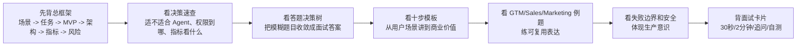
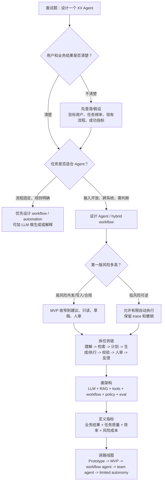
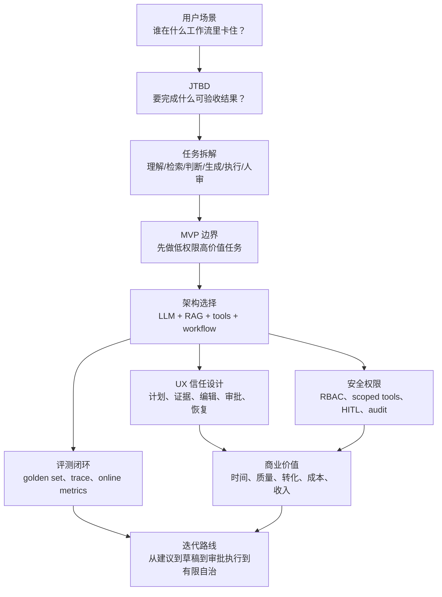
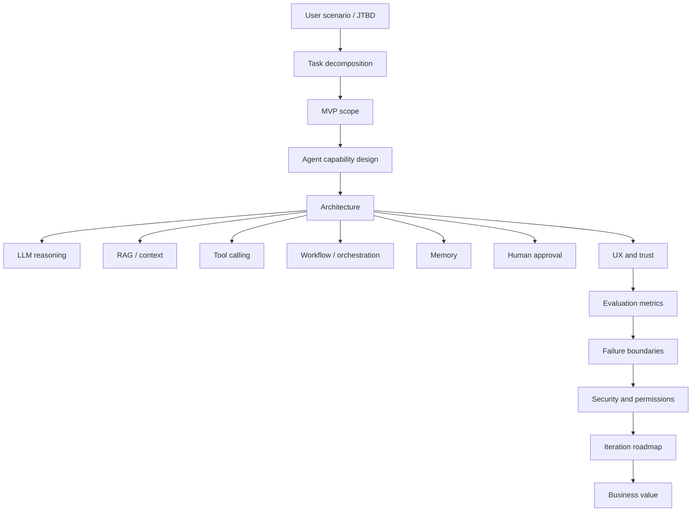
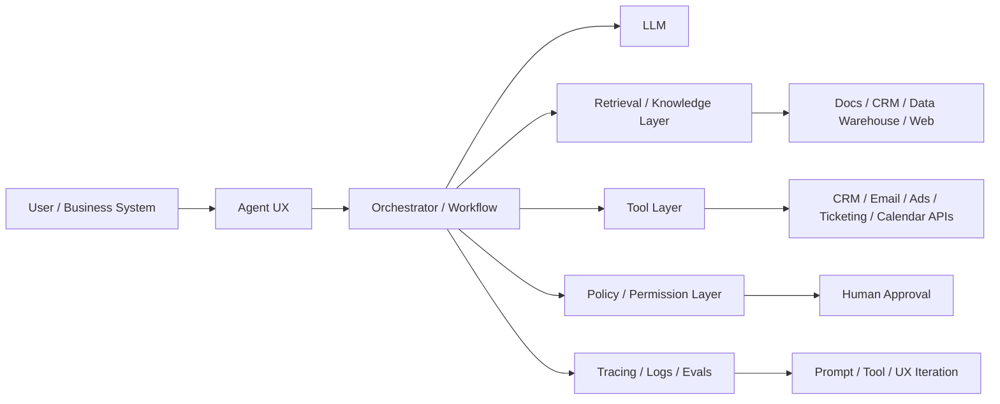

# Agent 产品设计题答题框架

> 面向强技术型 Agent 产品经理。目标不是背一套“万能 Agent 模板”，而是能在面试中把“设计一个 XX Agent”讲成一个完整产品方案：用户场景清楚、任务边界清楚、MVP 克制、架构可信、指标可验证、风险可控、商业价值能落地。

## 0. 先读这一页

### 0.1 三分钟速读

如果你只用 3 分钟预习这篇，先记住下面 8 句话：

| 你要记住的点 | 面试里怎么说 |
|---|---|
| Agent 设计题先讲用户任务，不先讲模型能力 | 我会从目标用户、业务结果和现有流程出发，而不是从“AI 能做什么”出发 |
| Agent 不是聊天框 | 它是 LLM + context/RAG + tools + workflow + permissions + eval + UX 的组合 |
| 好 MVP 要窄 | 第一版选高价值、低权限、可验证的任务，先建议/草稿/只读，再扩大执行权限 |
| 架构要 hybrid | 用 workflow 控制确定性路径，用 LLM 处理开放判断，用 policy layer 控制动作 |
| 评测要看过程 | 不只看最终回答，还要看工具调用、引用、审批、trace、风险事件和业务结果 |
| 安全不是 prompt | 权限、审批、审计、回滚、速率限制必须在系统层做 |
| UX 要让用户信任但不过度信任 | 展示计划、证据、置信度、可编辑输出、确认点和失败恢复 |
| PM 的技术表达要服务取舍 | 我懂技术模块，所以能定义边界、指标和风险，不把自己讲成底层工程师 |

一句面试总括：

> 我会把 XX Agent 设计成一个有明确业务任务边界的工作流型 Agent：先定义目标用户和高频高价值任务，再拆出检索、判断、生成、执行和人审步骤；MVP 从低权限、高 ROI 的单场景开始；架构上用 LLM 做理解和生成，RAG 提供可信上下文，tool calling 连接业务系统，workflow 和 policy layer 控制状态、权限和审批；最后用离线 golden set、过程 trace、在线业务指标和风险指标持续迭代。

### 0.2 本篇阅读路线

建议读法：

- 如果明天就面试：先读 `0. 先读这一页`、`4. How it works`、`11. GTM / Sales / Marketing Agent examples`、`16. 面试卡片与自测`。
- 如果要系统补强：按全文顺序读，重点理解每个技术模块对应的产品取舍。
- 如果已经熟悉 Agent 技术：重点看 PM 决策表、评分 rubric、常见追问和例题表达。

### 0.3 PM 决策速查表

| 决策问题 | 推荐判断 | 面试表达 |
|---|---|---|
| 这个题适不适合做 Agent？ | 高频高价值、跨系统、需要非结构化理解、路径有不确定性、风险可控 | 如果流程完全固定，我会优先用 workflow；如果需要动态判断和工具选择，才值得做 Agent |
| 第一版做多宽？ | 只做一个最窄高价值任务 | MVP 不追求全自动员工，先验证一个可度量工作流 |
| Agent 权限给到哪里？ | 默认 L1-L2：只读或草稿；外发/写入/删除逐级审批 | 先低权限高价值，后有限自治 |
| 用 Agent 还是固定 workflow？ | 企业级场景大多 hybrid | 规则和审批走 workflow，开放判断和生成交给 LLM |
| 需要 RAG 吗？ | 需要企业知识、实时资料、引用和权限过滤时需要 | 关键事实不靠模型记忆，靠可信上下文和来源 |
| 需要多 Agent 吗？ | 第一版通常不需要；角色、权限、评测标准明显不同才拆 | 不为了先进而多 Agent，先让单 Agent + workflow 稳定 |
| 怎么设计 UX？ | 展示计划、证据、可编辑输出、审批点、错误恢复 | 信任来自可理解和可控，不来自拟人化 |
| 怎么做 eval？ | golden set + trace grading + online metrics + risk review | 不只评最终答案，也评过程和业务结果 |
| 怎么证明商业价值？ | 时间、质量、转化、成本、收入、留存至少落一个 | 指标要贴业务结果，不只看生成次数 |
| 什么时候不能自动化？ | 外部可见、不可逆、高合规、权限不清、置信度低 | 高风险动作必须 human-in-the-loop |

### 0.4 设计题答题决策树

### 0.5 从用户场景到架构、指标、安全的流程图

### 0.6 学完后你应该能做到

- 用 30 秒回答“你会怎么设计一个 XX Agent”。
- 把任意 Agent 题拆成用户、任务、MVP、架构、指标、安全和商业价值。
- 判断某个场景应该做 Agent、Copilot、workflow automation，还是暂时不做。
- 给 GTM / Sales / Marketing Agent 设计 MVP、工具列表、权限边界和指标。
- 解释如何体现技术理解，但不把自己讲成纯工程师。
- 回答常见追问：幻觉、权限、eval、多 Agent、自动执行、冷启动、成本、护城河。

## 1. What this module solves

这篇文档解决一类高频面试题：**“请设计一个 XX Agent”**。

目标不是背一个万能答案，而是形成一套能迁移到 GTM、Sales、Marketing、客服、知识库、办公自动化、数据分析等场景的答题框架。强技术型 Agent PM 在面试中需要同时讲清楚四件事：

1. 用户为什么需要 Agent，而不是普通 SaaS 功能、Copilot 或自动化工作流。
2. Agent 具体替用户完成什么任务，哪些任务应由人确认。
3. 技术上如何把 LLM、RAG、工具调用、工作流、记忆、权限、安全和评测组织成一个可上线产品。
4. 如何用业务指标和评测闭环证明它值得做、能做好、可持续迭代。

一个好的答案应该像一个小型 PRD + 技术方案 + 商业论证，而不是泛泛地说“让 AI 自动帮用户完成任务”。

## 2. Why an Agent PM must understand it

Agent 产品设计题考察的不是“会不会说 AI 很厉害”，而是面试官在判断你是否具备以下能力：

- **场景抽象能力**：能从模糊需求里拆出用户、任务、约束、价值和边界。
- **技术产品化能力**：知道 Agent 不是一个聊天框，而是模型、上下文、工具、权限、工作流、观测和评测的组合。
- **MVP 判断能力**：能选择一个高价值、低风险、可验证的切入点，而不是一上来做全自动通用员工。
- **风险意识**：知道幻觉、错误工具调用、权限过大、数据泄露、提示注入、成本失控、用户过度信任都会让 Agent 产品失败。
- **商业闭环能力**：能把技术能力映射到效率、收入、转化率、成本、留存和可扩展性。

强技术 PM 的表达重点是：**我懂系统怎么工作，因此我知道产品边界怎么画、指标怎么设、风险怎么控；但我不会把面试变成底层工程实现汇报。**

## 3. Core concept map

回答任何 Agent 产品设计题，都可以用这张概念地图：

面试中可以把它压缩成一句话：

> 我会先定义目标用户和高频高价值任务，再拆出哪些步骤适合 Agent 自主完成、哪些必须人审；MVP 选择低权限但高 ROI 的工作流；架构上用 LLM 做规划和生成，RAG 提供可信上下文，工具调用连接 CRM、邮件、搜索、数据库等系统，用工作流和权限层控制执行，用 eval、trace 和人工反馈持续迭代。

## 4. How it works：通用答题模板

### 4.1 30 秒开场模板

当面试官说“设计一个 XX Agent”时，不要马上讲功能列表。先给出结构化开场：

> 我会把这个 Agent 定义为一个面向 [目标用户] 的任务型助手，核心目标是把 [高频、耗时、可被上下文和工具支持的任务] 从人工执行变成“Agent 草拟/执行 + 人类确认”的流程。第一版不会追求完全自治，而是先覆盖 [最窄高价值场景]，用 [业务指标] 和 [离线/在线 eval] 验证效果，再逐步扩大工具权限和自动化程度。

示例：

> 我会把 Sales Agent 定义为面向 AE/SDR 的账号研究和外联准备助手。第一版不自动发送邮件，而是先完成账号研究、联系人识别、购买信号总结和个性化外联草稿，最后由销售确认。这样既能节省销售准备时间，又能避免错误触达客户带来的品牌风险。

### 4.2 十步答题骨架

#### Step 1：明确用户和场景

回答格式：

- 用户是谁：角色、团队规模、工作系统、成熟度。
- 高频任务是什么：每天/每周重复发生，且对业务有影响。
- 痛点是什么：耗时、信息分散、质量不稳定、响应慢、需要跨系统操作。
- 为什么现在适合 Agent：LLM 能理解非结构化信息，工具调用能跨系统行动，RAG 能接入企业知识，工作流能控制边界。

面试表达：

> 我不会从“Agent 能做什么”出发，而是从“用户现在为了完成一个业务结果要跨多少系统、做多少判断、承担多少错误成本”出发。

#### Step 2：定义 Job-to-be-Done 和成功结果

一个 Agent 的 JTBD 应该是可验收的，不是抽象的“提升效率”。

| 场景 | 弱 JTBD | 好 JTBD |
| --- | --- | --- |
| Sales Agent | 帮销售更高效 | 在销售开新机会前，10 分钟内生成含证据来源的账号摘要、关键联系人、触达理由和邮件草稿 |
| Marketing Agent | 帮市场写内容 | 基于 Campaign brief、品牌规范和历史素材，生成可审核的多渠道内容包，并预测适配人群 |
| 客服 Agent | 自动回答问题 | 在低风险问题上直接解决用户请求，在退款、投诉、合规问题上收集信息并转人工 |
| 数据分析 Agent | 帮我分析数据 | 将自然语言问题转成受控 SQL/BI 查询，返回图表、解释和可追溯口径 |

#### Step 3：任务拆解

把“设计一个 Agent”拆成任务链：

1. 输入理解：用户意图、目标、约束、上下文。
2. 信息获取：RAG、搜索、CRM、数据仓库、文档、第三方 API。
3. 计划生成：分解步骤、选择工具、确定是否需要人类补充信息。
4. 执行动作：查询、写入、生成内容、创建任务、更新系统。
5. 结果校验：引用来源、格式校验、规则校验、业务逻辑校验。
6. 人类确认：高风险动作前请求确认，低风险动作可自动完成。
7. 反馈学习：记录用户修改、采纳、拒绝、转人工原因，进入评测和迭代。

面试重点：

> 拆任务时要区分“判断型步骤”和“执行型步骤”。判断型步骤需要模型能力和上下文，执行型步骤需要工具权限、幂等性、审计和回滚。

#### Step 4：MVP 取舍

MVP 的原则是：**先做高价值、低权限、可验证的任务，不先做全自动高风险闭环。**

推荐 MVP 范围：

- 先建议，后执行。
- 先只读工具，后写入工具。
- 先单一场景，后跨场景。
- 先人审发布，后自动发布。
- 先内部用户，后外部客户。
- 先结构化输出，后开放式对话。

不推荐的第一版：

- 自动替销售给客户发送大量邮件。
- 自动承诺价格、合同条款、退款或法律意见。
- 自动修改核心生产数据且无审批。
- 允许 Agent 访问所有内部系统和所有客户数据。
- 没有评测集、日志和人工兜底就上线外部用户。

#### Step 5：能力设计

Agent 能力可以分成六层：

| 能力层 | 作用 | PM 需要关心的问题 |
| --- | --- | --- |
| Reasoning | 理解目标、规划步骤、做判断 | 任务是否真的需要自主规划，还是固定工作流更稳定 |
| Context / RAG | 提供事实依据和企业知识 | 数据源是否可信、权限是否正确、引用是否可追溯 |
| Tools | 查询和执行外部动作 | 哪些工具只读、哪些可写、是否需要审批和回滚 |
| Memory | 记住用户偏好、历史任务、团队规范 | 记什么、不记什么、何时过期、用户能否管理 |
| Workflow | 固化关键流程和状态 | 哪些步骤必须确定性执行，哪些交给模型判断 |
| Evaluation | 持续测试质量和风险 | 离线评测、在线指标、人工审核如何形成闭环 |

#### Step 6：技术架构

通用架构可以这样讲：

PM 讲技术架构时要讲“为什么这么设计”：

- **Orchestrator / Workflow**：控制状态、步骤、重试、超时、人工审批和工具调用顺序。复杂场景不要完全依赖模型自由发挥。
- **LLM**：负责理解、生成、计划、分类、总结和调用工具参数，但不直接绕过权限层执行动作。
- **RAG / Context Layer**：给模型提供企业知识、客户资料、历史记录和证据，避免纯凭模型记忆回答。
- **Tool Layer**：把 Agent 连接到 CRM、邮件、广告平台、工单、日历、数据仓库等系统。工具 schema 要清晰，参数要校验。
- **Policy / Permission Layer**：控制谁能看什么、做什么，哪些动作必须人审，哪些动作禁止执行。
- **Observability / Eval**：记录 trace、工具调用、输入输出、错误类型、用户采纳和人工修改，用于定位问题和持续优化。

#### Step 7：UX 与人机协同

Agent 的 UX 重点不是“像人聊天”，而是让用户知道它能做什么、做得怎样、何时需要接管。

关键设计：

- 明确能力范围：告诉用户 Agent 能处理哪些任务，不能处理哪些任务。
- 显示证据来源：尤其是销售研究、市场洞察、知识库问答和数据分析。
- 展示计划和中间状态：让用户知道 Agent 正在查什么、准备做什么。
- 高风险前确认：发送外部消息、修改客户记录、下单、退款、删除数据前必须确认。
- 可编辑输出：邮件、广告文案、报告、SQL 结果解释都应方便修改。
- 支持撤销和审计：执行动作后可追踪、可回滚或可补救。
- 降低过度信任：用置信度、引用、差异提示和异常提醒表达不确定性。

可引用的 UX 原则：Microsoft Human-AI Interaction Guidelines 强调系统需要让用户理解 AI 能做什么、做得多好，并在出错时支持纠正和恢复。

#### Step 8：指标和评测

Agent 不能只看 DAU 或生成次数。要把指标拆成四类：

| 指标类型 | 示例 |
| --- | --- |
| 业务结果 | pipeline created、reply rate、meeting booked、ticket deflection、resolution rate、campaign conversion、analysis cycle time |
| 任务质量 | task success rate、answer correctness、citation accuracy、tool call success、format validity、human acceptance rate |
| 效率体验 | time saved、steps reduced、latency、user edits per output、handoff rate、retry rate |
| 风险成本 | hallucination rate、unsafe action rate、permission violation、data leakage incident、cost per successful task |

评测方法：

1. **离线 golden set**：收集真实任务样本和标准答案，例如 100 个账号研究任务、100 个客服问题、50 个营销 brief。
2. **LLM-as-judge + 人审抽样**：用模型做初筛评分，但关键业务样本要有人审，避免评测本身漂移。
3. **Trace grading**：不仅评估最终答案，还评估工具是否调用正确、是否使用了正确证据、是否遵守审批策略。
4. **在线 A/B**：比较人工流程、Copilot 流程、Agent 流程在业务指标上的差异。
5. **红队测试**：测试提示注入、越权访问、敏感数据泄露、错误工具调用和成本攻击。
6. **反馈闭环**：记录用户采纳、编辑、拒绝、转人工、撤销原因，沉淀为下一轮 eval 数据。

#### Step 9：失败边界和安全权限

Agent 产品设计必须提前说清失败边界：

- **事实错误**：引用过期、RAG 召回错误、模型编造来源。
- **任务误解**：用户目标不明确，Agent 自行补全错误假设。
- **工具误用**：调用错误 API、参数错误、重复执行、不可逆写入。
- **权限越界**：用户无权访问的数据被 Agent 读到或写出。
- **提示注入**：网页、邮件、文档里的恶意内容诱导 Agent 泄露信息或执行危险动作。
- **记忆污染**：错误偏好、恶意指令或过期信息被长期记住。
- **成本失控**：循环调用工具、长上下文、批量任务没有预算限制。
- **责任不清**：用户以为 Agent 已经确认事实，团队却没有审计记录。

权限策略可以分级：

| 等级 | Agent 权限 | 适合场景 |
| --- | --- | --- |
| L0 | 只生成建议，不接系统 | 面试 Demo、早期原型 |
| L1 | 只读内部知识和数据 | 账号研究、知识库问答、数据摘要 |
| L2 | 可创建草稿或任务 | 邮件草稿、Campaign brief、CRM note |
| L3 | 可写入低风险系统，但需审批 | 更新 CRM 字段、创建工单、排程 |
| L4 | 可自动执行有限动作 | 低风险客服自助、内部自动化 |
| L5 | 高自治跨系统执行 | 仅适合成熟评测、严格权限、强审计场景 |

面试中推荐表达：

> 我会把权限设计成渐进式，而不是一开始给 Agent 全量 API key。MVP 多数场景停在 L1-L2，高价值但低风险；只有当 eval、审计、回滚和权限隔离成熟后，才扩大到自动写入和跨系统执行。

#### Step 10：路线图和商业价值

路线图可以按“能力成熟度”讲：

| 阶段 | 产品能力 | 验证重点 |
| --- | --- | --- |
| V0 Prototype | 单场景 demo，人工上传上下文，生成建议 | 用户是否认为输出有用 |
| V1 MVP | 接入 1-2 个核心数据源，只读或草稿权限 | 任务成功率、采纳率、节省时间 |
| V2 Workflow Agent | 接入核心系统，支持审批、执行、trace | 工具成功率、错误率、转人工率 |
| V3 Team Agent | 团队级记忆、角色权限、批量任务、管理后台 | 组织采纳、质量稳定性、成本 |
| V4 Autonomous Loop | 在明确边界内自动执行和优化 | 业务结果、风险事件、ROI |

商业价值要落到可量化结果：

- Sales：增加有效触达、提升回复率和会议预约率，缩短 research 时间。
- Marketing：提高内容生产速度和一致性，提升 campaign throughput 和实验频率。
- 客服：降低人工工单量，提高首次解决率，缩短响应时间。
- 知识库：减少内部问答和重复搜索，提高新人 onboarding 效率。
- 数据分析：缩短从问题到洞察的周期，提高非技术人员自助分析比例。

## 5. What depth a PM needs

强技术 Agent PM 需要掌握到“能做产品取舍和与工程对齐”的深度。

### 必须懂

- Agent 与 chatbot、copilot、workflow automation 的区别。
- 什么时候需要 Agent，什么时候固定工作流更好。
- LLM、RAG、tool calling、memory、orchestration、eval、guardrails 的作用。
- 工具调用为什么需要 schema、参数校验、幂等、权限和审计。
- 为什么 Agent eval 不只评估最终回答，还要评估过程和工具调用。
- Prompt injection、excessive agency、sensitive data disclosure 等风险。
- 人机协同设计：何时自动、何时建议、何时确认、何时转人工。

### 不必深挖

- 不必讲具体模型训练细节。
- 不必手写向量数据库索引或调参。
- 不必展开底层分布式调度实现。
- 不必证明自己能从零实现 LangGraph / Agents SDK。
- 不必把所有问题都变成多 Agent 架构。

### PM 该有的技术表达

好的表达：

> 这里我会用 workflow 约束关键路径，让模型只在需要判断和生成的节点发挥作用。比如销售外联中，账号数据获取、联系人过滤、合规检查是确定性步骤；触达理由总结和邮件个性化可以交给 LLM；发送前必须人审。

不好的表达：

> 我会用一个大模型 Agent 自动规划所有步骤，然后自动调用所有工具完成销售工作。

## 6. Common product decisions and tradeoffs

### 6.1 Agent vs Workflow

| 选择 | 适合 | 风险 |
| --- | --- | --- |
| 固定 workflow | 流程清晰、规则稳定、合规要求高 | 灵活性不足，边界外问题处理弱 |
| Agent | 输入开放、路径不确定、需要动态选择工具 | 不稳定、成本高、解释和测试更难 |
| Hybrid | 大多数企业级 Agent 产品 | 设计复杂，需要清楚划分模型自由度 |

面试推荐：多数产品选 Hybrid。用 workflow 控制主路径，用 Agent 处理开放判断。

### 6.2 Single-agent vs Multi-agent

第一版通常不需要多 Agent。多 Agent 适合明显不同角色、工具权限、上下文和评测标准的任务，比如“研究 Agent + 文案 Agent + 合规审核 Agent”。

但多 Agent 会带来：

- 调试复杂。
- 成本和延迟上升。
- handoff 出错。
- 责任边界更难解释。
- 评测需要覆盖中间过程。

面试表达：

> 我不会为了显得先进而先做多 Agent。只有当任务天然分工、工具权限不同、质量标准不同，或者需要独立审核角色时，才拆成多个 Agent。

### 6.3 RAG vs Long Context

- RAG 适合企业知识、频繁更新资料、权限过滤、引用追溯。
- Long context 适合单次任务内需要完整阅读的大文件或长对话。
- 两者可以组合：先检索候选材料，再把关键证据放入上下文。

PM 关注点：

- 召回质量是否影响答案。
- 数据是否新鲜。
- 引用是否可点击。
- 权限是否在检索层生效。
- 用户是否能发现“没有足够证据”的情况。

### 6.4 自动执行 vs 人类确认

判断原则：

- 外部影响越大，越需要确认。
- 可逆性越低，越需要确认。
- 数据敏感性越高，越需要确认。
- 模型置信度越低，越需要确认。
- 用户经验越不足，越需要解释和确认。

### 6.5 通用 Agent vs 垂直 Agent

面试中优先设计垂直 Agent。垂直 Agent 更容易定义数据源、工具、权限、评测和 ROI。

通用 Agent 的问题是：

- 场景太宽，MVP 不清。
- 工具权限边界难画。
- 评测集难构建。
- 商业价值难证明。

## 7. Common failure modes

### 产品失败

- 只做了聊天入口，没有嵌入真实工作流。
- 输出看似聪明，但用户还要大量核查，节省时间不明显。
- MVP 太宽，什么都能做但都不可靠。
- 缺少明确的业务指标，无法证明 ROI。
- 用户不信任，因为看不到来源、计划和审批点。

### 技术失败

- RAG 召回错误导致答案错误。
- 工具 schema 不清，模型频繁填错参数。
- 没有幂等和去重，重复发送、重复创建记录。
- 没有 trace，出错后无法复盘。
- 没有离线 eval，每次 prompt 调整都靠感觉。
- 上下文和记忆混乱，把过期信息当事实。

### 安全失败

- Agent 读取了用户无权访问的数据。
- 外部网页或邮件中的提示注入影响工具调用。
- 过度自治导致错误外发、错误退款、错误删除。
- 敏感信息被写入 prompt、日志、第三方工具或模型上下文。
- 没有预算和速率限制，出现成本攻击或循环调用。

## 8. Metrics and evaluation methods

### 8.1 通用评分指标

| 维度 | 指标 | 解释 |
| --- | --- | --- |
| 任务完成 | task success rate | Agent 是否完成用户目标 |
| 正确性 | factual accuracy / citation precision | 答案是否正确，引用是否支持结论 |
| 工具能力 | tool call precision / success rate | 是否调用正确工具，参数是否正确 |
| 用户价值 | acceptance rate / edit distance | 用户是否采纳，需要改多少 |
| 效率 | time-to-completion / steps saved | 是否真的节省时间 |
| 稳定性 | retry rate / error recovery rate | 出错后能否恢复 |
| 安全 | policy violation rate | 是否越权、泄露、执行危险动作 |
| 成本 | cost per successful task | 每个成功任务的模型和工具成本 |

### 8.2 分场景指标

Sales Agent：

- 账号研究时间下降。
- 个性化外联草稿采纳率。
- 邮件回复率、会议预约率。
- CRM 数据完整度提升。
- 错误联系人/错误公司信息率。

Marketing Agent：

- Campaign 内容生产周期。
- 品牌规范通过率。
- 多渠道内容复用率。
- A/B 实验数量和学习速度。
- 合规/品牌审核返工率。

客服 Agent：

- 自动解决率。
- 首次响应时间。
- 首次解决率。
- 转人工率和转人工原因。
- CSAT、投诉率、错误承诺率。

知识库 Agent：

- 答案命中率。
- 引用准确率。
- 无答案时拒答率。
- 内部搜索时间下降。
- 新人 onboarding 问题减少。

数据分析 Agent：

- SQL/查询正确率。
- 指标口径一致性。
- 图表解释准确率。
- 从问题到洞察的时间。
- 高风险查询拦截率。

### 8.3 推荐评测集结构

每个 Agent MVP 至少准备：

- 50-100 个真实任务样本。
- 标准输入、期望输出、可接受输出范围。
- 必须引用的数据源。
- 禁止行为列表。
- 边界样本：缺数据、冲突数据、过期数据、恶意输入、权限不足。
- 人工评分 rubric：正确性、完整性、可执行性、风险、表达质量。

## 9. Keywords for engineering communication

面试中可以自然使用这些关键词，但每个词都要服务产品判断：

- Agent orchestration
- Tool calling / function calling
- Tool schema
- Structured outputs
- RAG / retrieval layer
- Vector search / hybrid search / reranking
- Memory / session state / long-term preference
- Workflow state machine
- Human-in-the-loop
- Guardrails / policy layer
- Role-based access control / scoped tokens
- Idempotency / retries / rollback
- Trace / observability
- Golden set / offline eval / online eval
- LLM-as-judge
- Prompt injection
- Excessive agency
- Data leakage
- Cost per successful task
- Handoff
- MCP / tool server

## 10. High-frequency interview questions and answers

### Q1：你怎么判断一个场景适不适合做 Agent？

推荐回答：

> 我会看四个条件：任务是否高频高价值，是否需要跨系统和非结构化信息，路径是否存在一定不确定性，错误成本是否能通过权限、人审和回滚控制。如果流程完全固定，用普通 workflow 更稳；如果任务开放但没有可用数据和工具，Agent 也很难创造价值。

### Q2：为什么不是做一个 Copilot？

推荐回答：

> Copilot 更偏辅助生成和建议，Agent 更强调目标导向、步骤规划、工具调用和执行闭环。我的 MVP 可能从 Copilot-like 体验开始，但会在明确边界内逐步加入工具和工作流，让它从“帮我写”变成“帮我完成这件事的一部分”。

### Q3：你会怎么设计 Sales Agent 的 MVP？

推荐回答：

> 第一版只做账号研究和外联准备，不自动发送。输入是目标账号或 lead，Agent 读取 CRM、公司网站、新闻、历史互动和产品资料，输出账号摘要、关键联系人、购买信号、痛点假设、证据链接和邮件草稿。销售可以编辑并确认。核心指标是研究时间、草稿采纳率、回复率和错误事实率。

### Q4：如何控制幻觉？

推荐回答：

> 我会从产品和技术两侧控制：产品上要求关键结论带引用，缺证据时允许拒答或提示不确定；技术上用 RAG、结构化输出、工具返回校验、事实一致性 eval 和人工抽样审核。对于高风险动作，不让模型直接执行，而是进入审批。

### Q5：如何设计权限？

推荐回答：

> 权限要跟用户身份和动作风险绑定。读取数据时继承用户权限，工具 token 要 scope 化；写入动作按风险分级，低风险可自动，高风险必须确认；所有工具调用要有审计日志。MVP 优先只读和草稿权限，避免一开始给全量系统访问。

### Q6：你会怎么做 Agent eval？

推荐回答：

> 我会建立真实任务 golden set，评估最终输出和过程 trace。最终输出看正确性、完整性、引用、可执行性；过程看是否选对工具、是否遵守权限、是否触发人审。上线后再看采纳率、编辑距离、转人工、业务结果和风险事件。

### Q7：什么时候需要多 Agent？

推荐回答：

> 当任务天然分成不同专业角色，并且各自工具、权限、上下文和质量标准不同，才值得拆。比如 Marketing Agent 可以有 researcher、copywriter、brand reviewer。否则单 Agent + workflow 更容易上线、评测和调试。

### Q8：如果用户让 Agent 做超出权限的事怎么办？

推荐回答：

> UX 上要明确拒绝并解释原因，同时给替代路径，例如生成可复制草稿或发起审批。系统上权限层必须在工具调用前拦截，不能只依赖 prompt。拒绝、审批和越权尝试都应进入日志，用于安全评估。

### Q9：如何避免把自己讲成纯工程师？

推荐回答：

> 我会用技术解释产品取舍，而不是展开实现细节。比如我会说“这里需要工具 schema 和结构化输出，是为了降低错误字段写入 CRM 的概率，并方便 eval”，而不是详细讲函数调用代码。重点始终回到用户价值、风险边界和指标。

### Q10：Agent 做错了，责任怎么处理？

推荐回答：

> 产品上要定义责任模型：哪些动作是建议、哪些是用户确认后执行、哪些可自动执行；高风险动作保留审批和审计。系统上保留 trace、输入、工具调用和版本信息，支持复盘、回滚和改进评测集。

## 11. GTM / Sales / Marketing Agent examples

### 11.1 例题一：设计一个 GTM / Sales Agent

#### 用户场景

目标用户是 B2B SaaS 的 SDR、AE 和 RevOps。典型任务是找到目标账号、研究公司动态、识别关键联系人、生成触达理由、写个性化邮件，并把信息同步到 CRM。

#### 痛点

- 信息分散在 CRM、LinkedIn、公司网站、新闻、财报、通话记录和内部 battlecard。
- 销售研究耗时，导致有效触达量不足。
- 外联内容泛化，回复率低。
- CRM 记录不完整，团队难以复用上下文。

#### MVP

第一版做“账号研究 + 外联草稿”，不自动发送。

输入：

- account name / domain。
- 目标 persona。
- 产品线。
- 可选：销售想验证的假设。

输出：

- 公司摘要和业务背景。
- 最近触发事件：融资、招聘、技术迁移、合规压力、市场扩张等。
- 关键联系人和推荐触达顺序。
- 可能痛点与产品价值映射。
- 带证据链接的触达理由。
- 2-3 个外联邮件草稿。
- CRM note 草稿。

#### 架构

- RAG：CRM notes、call transcripts、产品资料、case studies、battlecards。
- Web/search：公司官网、新闻、职位、公开报告。
- Tools：CRM read、contact enrichment、email draft、calendar availability、CRM note create。
- Workflow：账号输入 -> 数据收集 -> 证据去重 -> 痛点推理 -> 草稿生成 -> 人审 -> CRM 写入。
- Guardrails：不自动发送邮件；不得编造客户事实；价格、合同、法律承诺必须禁止。

#### 指标

- 账号研究时间从 30 分钟降到 5-10 分钟。
- 草稿采纳率。
- 邮件回复率和会议预约率。
- 错误事实率。
- CRM note 写入率。
- 每个成功 meeting 的 Agent 成本。

#### 常见追问

追问：如果 Sales Agent 生成了错误客户信息怎么办？

推荐回答：

> 关键事实必须带来源，UI 上把“事实”和“推测”分开。没有来源的内容不能作为触达理由。上线前用历史账号做 eval，上线后采样审核错误事实率。外发前人审，避免错误直接影响客户。

追问：为什么不自动发邮件？

推荐回答：

> 因为外发是品牌和合规风险较高的动作，第一版的主要价值是节省研究和起草时间。等到草稿采纳率、事实正确率和退信/投诉指标稳定后，可以对低风险、低价值 lead 做小流量自动发送实验。

### 11.2 例题二：设计一个 Marketing Agent

#### 用户场景

目标用户是增长市场、内容市场和 Campaign manager。他们需要基于产品发布、行业事件或目标客群快速生成多渠道 campaign 资产。

#### 痛点

- Brief、品牌规范、历史素材和渠道限制分散。
- 内容生产慢，返工多。
- 不同渠道风格不一致。
- 市场团队难以快速做多版本实验。

#### MVP

第一版做“Campaign content pack generator”，人审发布。

输入：

- Campaign 目标。
- 目标 audience。
- 核心 message。
- 渠道：email、LinkedIn、landing page、ads、webinar invite。
- 品牌规范和禁止表达。

输出：

- campaign brief 补全建议。
- 核心 message hierarchy。
- 多渠道文案草稿。
- 视觉/素材需求清单。
- A/B 测试假设。
- 合规和品牌风险提示。

#### 架构

- RAG：品牌规范、历史 campaign、产品文档、客户案例、竞品定位。
- Tools：CMS draft、marketing automation draft、ad platform draft、asset library search。
- Workflow：brief 解析 -> audience 匹配 -> 素材检索 -> 文案生成 -> brand check -> compliance check -> 人审发布。
- Memory：团队偏好的 tone、常用 CTA、历史表现好的 message，但要可编辑和可过期。

#### 指标

- campaign 从 brief 到草稿的时间。
- 品牌审核一次通过率。
- 文案采纳率。
- A/B 实验数量。
- 生成内容带来的 CTR、CVR、MQL，但要区分 Agent 贡献和渠道影响。
- 返工率和合规拦截率。

#### 常见追问

追问：Marketing Agent 如何避免生成同质化内容？

推荐回答：

> 我会把差异化信息放在上下文层：客户案例、产品 positioning、竞品 battlecard、历史高表现素材。生成时要求输出 message rationale 和目标人群假设；评测时不只看语法，还看品牌一致性、差异化和渠道适配度。

### 11.3 例题三：设计一个 Customer Support Agent

#### 用户场景

目标用户是客服团队和终端客户。Agent 处理退款查询、订单状态、账号问题、产品使用问题，并在复杂问题上转人工。

#### MVP

只覆盖高频低风险问题：订单状态、基础 FAQ、密码重置指引、产品使用步骤。不处理法律投诉、复杂退款、医疗/金融建议、愤怒客户升级。

#### 架构

- RAG：帮助中心、政策文档、产品文档、历史工单。
- Tools：order lookup、ticket create、account status read、refund eligibility check。
- Human handoff：置信度低、用户情绪强烈、政策冲突、金额高、合规词触发。

#### 指标

- 自动解决率。
- 首次响应时间。
- CSAT。
- 转人工率。
- 错误回答率。
- 错误承诺或错误退款率。

#### 面试亮点

客服 Agent 的关键不是“回答更多”，而是“正确地自动化低风险问题，并把高风险问题带着上下文转给人”。

### 11.4 例题四：设计一个 Enterprise Knowledge Agent

#### 用户场景

员工在 Slack、Notion、Google Drive、Confluence、Jira、CRM 中查找公司政策、项目背景、客户信息和流程。

#### MVP

做内部问答和来源聚合，不做自动执行。

#### 关键设计

- 检索层必须做权限过滤。
- 答案必须引用来源。
- 允许回答“不知道”。
- 支持冲突信息提示：例如两个文档给出不同政策。
- 支持文档新鲜度提示。

#### 指标

- 搜索时间下降。
- 答案引用准确率。
- 无答案拒答率。
- 员工采纳率。
- 权限违规率为零。

### 11.5 例题五：设计一个 Office Automation Agent

#### 用户场景

面向运营、管理者和项目经理，自动整理会议纪要、创建任务、更新项目状态、安排日历。

#### MVP

会议后生成纪要、行动项和 Jira/Asana/Trello task 草稿，由用户确认创建。

#### 关键设计

- 输入来自会议 transcript、日历、项目文档。
- Agent 识别 action item、owner、deadline、dependency。
- 创建任务前需要人审。
- 对不确定 owner/deadline 标记待确认。

#### 指标

- 会议后整理时间下降。
- action item 捕捉率。
- 错误 owner/deadline 率。
- 任务创建采纳率。
- 项目更新及时性。

### 11.6 例题六：设计一个 Data Analysis Agent

#### 用户场景

业务用户用自然语言询问指标，例如“上周 SMB 渠道转化为什么下降？”

#### MVP

自然语言 -> 指标口径确认 -> 受控查询 -> 图表和解释，不允许任意 SQL 写入。

#### 架构

- Semantic layer：定义指标口径、维度、表关系和权限。
- Tools：SQL query read-only、BI chart generation、data catalog search。
- Guardrails：限制查询范围、敏感字段脱敏、大查询预算控制。
- Eval：SQL 正确率、口径一致性、解释是否被数据支持。

#### 指标

- 分析周期缩短。
- 自助分析比例。
- SQL/指标正确率。
- 分析师返工率。
- 错误决策风险事件。

## 12. How to say it in interviews

### 12.1 推荐答题顺序

1. 先定义用户和业务目标。
2. 再拆任务链。
3. 讲 MVP，明确不做什么。
4. 讲架构，用技术解释产品边界。
5. 讲 UX、人审、权限和失败边界。
6. 讲评测指标。
7. 讲迭代路线和商业价值。

### 12.2 技术理解的表达方式

应该这样说：

> 我会把模型放在需要语言理解、推理和生成的位置，把确定性业务规则放在 workflow 和 policy layer 里。比如工具调用必须经过 schema 校验和权限检查，高风险动作进入 human-in-the-loop。这样 Agent 有灵活性，但不会失控。

避免这样说：

> 我会用最强模型加多 Agent，让它自己规划和执行所有任务。

应该这样说：

> 评测上我不只看最终答案，还看 trace：它有没有查正确数据源、有没有调用正确工具、有没有在需要审批时停下来。这比只看 thumbs up/down 更能指导迭代。

避免这样说：

> 我们上线后看用户反馈，再调 prompt。

### 12.3 面试中的 PM 定位

你可以明确说：

> 作为 PM，我会定义任务边界、权限分级、用户体验、评测标准和商业指标；具体的工具执行框架、向量索引策略、重试队列和服务稳定性由工程团队深入设计。我需要懂这些模块的作用和 tradeoff，才能做正确的产品决策。

这句话能体现你技术强，但不抢工程师角色。

## 13. Scoring rubric：Agent 产品设计题评分标准

| 评分维度 | 1 分 | 3 分 | 5 分 |
| --- | --- | --- | --- |
| 用户场景 | 泛泛说用户需要 AI | 有明确用户和痛点 | 有角色、频率、业务结果和现有流程 |
| 任务拆解 | 只有功能列表 | 能拆主要步骤 | 区分判断、检索、执行、人审和反馈 |
| MVP | 想做大而全 | 有初版范围 | 高价值、低风险、可验证，并明确不做什么 |
| 技术架构 | 只说用大模型 | 提到 RAG/工具 | 能讲 orchestration、tools、权限、eval、trace 的关系 |
| UX | 只有聊天框 | 有基本交互 | 有计划展示、引用、人审、撤销、错误恢复 |
| 安全边界 | 简单说加权限 | 有审批意识 | 有分级权限、提示注入、数据泄露、审计、回滚 |
| 指标评测 | 只说 DAU | 有业务指标 | 有任务质量、过程 eval、在线指标和风险指标 |
| 商业价值 | 提高效率 | 能量化部分价值 | 能连接收入、成本、转化、留存或组织效率 |
| 面试表达 | 像工程或空谈 | 基本清楚 | 技术服务产品判断，结构完整，有取舍 |

一个 5 分答案通常长这样：

> 我先从一个明确角色和任务切入，定义 Agent 的输入输出和成功结果；MVP 只做低权限高价值链路；技术上采用 hybrid workflow，让 LLM 负责开放判断和生成，RAG 负责可信上下文，工具层连接业务系统，权限层控制动作，人审处理高风险；评测上同时看最终结果、工具过程、业务指标和风险指标；路线图从建议到草稿到审批执行再到有限自治。

## 14. Common follow-up questions and recommended answers

### 追问 1：如果面试官要求“更创新”怎么办？

推荐回答：

> 我会把创新放在工作流重构，而不是把权限放大。比如 Sales Agent 不只是写邮件，而是把账号研究、触达理由、CRM 更新和 follow-up 提醒串起来，形成可复用的销售动作系统。创新点是让 Agent 成为业务流程的一部分，而不是一个生成文本的入口。

### 追问 2：如果面试官问“如何冷启动”？

推荐回答：

> 冷启动分三层：数据冷启动用现有文档、历史记录和人工 curated examples；评测冷启动用专家标注的 golden set；用户冷启动从低风险团队和高频任务开始，收集采纳、编辑和拒绝原因。不要一开始依赖长期记忆，先让 Agent 在单次任务中可靠。

### 追问 3：如果数据质量很差怎么办？

推荐回答：

> Agent 不应该掩盖数据质量问题。产品上要显示数据缺口和置信度；架构上可以加 data quality check、来源优先级和冲突检测；路线图上把 CRM hygiene 或知识库治理作为 Agent 成功的前置条件之一。

### 追问 4：如何处理模型成本？

推荐回答：

> 成本要按成功任务看，而不是按 token 看。优化方式包括任务路由、小模型处理分类和抽取、大模型处理高价值推理、缓存常用检索结果、限制工具循环、设置预算和批量任务队列。PM 要关注 cost per successful task 和 ROI。

### 追问 5：Agent 的护城河是什么？

推荐回答：

> 单纯接一个模型不是护城河。护城河来自场景数据、深度工作流集成、评测数据、权限和治理能力、用户反馈闭环，以及对具体行业任务的 know-how。越接近真实业务系统和可衡量结果，越难被通用聊天产品替代。

### 追问 6：如果 Agent 输出质量不稳定，优先改什么？

推荐回答：

> 我会先看 trace 和失败分布，而不是直接换模型。判断问题来自意图理解、检索、工具参数、业务规则、prompt、模型能力还是 UX 输入不清。不同原因对应不同解法：检索错就改数据和 rerank，工具错就改 schema 和校验，任务太开放就收窄流程或增加确认。

### 追问 7：如何让用户信任 Agent？

推荐回答：

> 信任来自可理解和可控。让用户看到 Agent 的计划、证据、置信度和审批点；允许编辑、拒绝、撤销和转人工；高风险动作不默认自动执行。不要用拟人化承诺替代可验证性。

## 15. Quick memory summary

记住这套口诀：

> 用户场景 -> 任务拆解 -> MVP 收窄 -> 架构分层 -> UX 信任 -> 评测指标 -> 失败边界 -> 权限安全 -> 迭代路线 -> 商业价值。

再记住三个原则：

1. **先低权限高价值，后高自治闭环。**
2. **用 workflow 控制确定性，用 LLM 处理开放判断，用 eval 驱动迭代。**
3. **技术表达要回到产品取舍：用户价值、风险边界、指标和 ROI。**

面试中最稳的结尾：

> 所以我不会把这个 Agent 设计成一个什么都能做的黑盒，而是把它设计成一个有明确任务边界、可信上下文、受控工具、可审计过程和可量化业务结果的产品。第一版先证明它能稳定完成一个高价值工作流，再逐步扩大自动化范围。

## 16. 面试卡片与自测

### 16.1 面试官想考什么

这类题表面是“设计一个 Agent”，实际在考 7 个能力：

| 面试官想考 | 他在听什么 | 低分信号 | 高分信号 |
|---|---|---|---|
| 场景判断 | 你是否先讲用户和业务结果 | 一上来列 AI 功能 | 先定义用户、任务频率、现有流程和成功指标 |
| 产品边界 | 你是否知道第一版该收窄 | 做全自动通用 Agent | 选择单一高价值低风险 MVP |
| 技术理解 | 你是否懂 Agent 系统组成 | 只说接大模型 | 能讲 LLM、RAG、tools、workflow、policy、eval 的关系 |
| 人机协同 | 你是否知道何时让人接管 | 全自动执行 | 高风险动作 human-in-the-loop |
| 评测意识 | 你是否能证明质量 | 看用户反馈再改 prompt | golden set、trace grading、online metrics、risk metrics |
| 风险意识 | 你是否考虑生产事故 | 简单说加权限 | 越权、注入、幻觉、成本、审计、回滚都能覆盖 |
| 商业判断 | 你是否能证明 ROI | 提高效率 | 量化时间、转化、收入、成本或质量提升 |

### 16.2 30 秒回答模板

通用模板：

> 我会先把 XX Agent 定义成面向 [目标用户] 的 [任务型/工作流型] Agent，核心目标是完成 [高频高价值任务]。第一版不会做全自动，而是先覆盖 [最窄 MVP]：Agent 负责 [检索/总结/生成/草稿/建议]，高风险动作由用户确认。架构上用 LLM 做理解和生成，用 RAG 接入可信上下文，用 tools 连接业务系统，用 workflow 和 policy layer 控制权限、审批和状态。指标上我会同时看 [业务结果]、任务成功率、采纳率、节省时间、错误率和风险事件。

Sales Agent 版本：

> 我会把 Sales Agent 设计成 AE/SDR 的账号研究和外联准备助手。第一版不自动发邮件，而是读取 CRM、公司公开信息、历史互动和产品资料，生成带证据的账号摘要、购买信号、联系人建议和外联草稿，由销售确认。架构上是 RAG + CRM/search tools + workflow + 人审；指标看研究时间、草稿采纳率、回复率、会议预约率和错误事实率。

Marketing Agent 版本：

> 我会把 Marketing Agent 设计成 campaign 内容包生成和品牌审核助手。第一版基于 brief、品牌规范、历史素材和目标人群，生成多渠道文案、message hierarchy、A/B 假设和风险提示，发布前人审。指标看从 brief 到草稿的时间、品牌审核通过率、内容采纳率、实验数量、CTR/CVR 和合规返工率。

### 16.3 2 分钟回答模板

可以按这个顺序完整回答：

1. **用户和场景**：目标用户是谁？他们在哪个工作流里耗时、出错或漏机会？
2. **JTBD**：Agent 最终帮用户完成什么可验收结果？
3. **任务拆解**：把任务拆成输入理解、信息获取、计划、生成/执行、校验、人审、反馈。
4. **MVP**：第一版只做一个高价值低风险链路，明确不做什么。
5. **架构**：LLM 负责理解/生成/判断；RAG 提供可信上下文；tools 接系统；workflow 控状态；policy 控权限；eval 和 trace 做闭环。
6. **UX**：展示计划、证据、可编辑输出、审批点、失败恢复，避免黑盒。
7. **指标**：业务结果 + 任务质量 + 效率体验 + 风险成本。
8. **安全边界**：权限分级、提示注入、数据泄露、人审、审计、回滚、成本限制。
9. **路线图**：prototype -> MVP -> workflow agent -> team agent -> limited autonomy。
10. **商业价值**：把 Agent 连接到收入、转化、成本、质量、留存或组织效率。

2 分钟示例收尾：

> 所以这个 Agent 的核心不是“让 AI 多说几句话”，而是把一个真实业务工作流从人工跨系统操作，变成可追踪、可评测、可审批的智能流程。第一版先证明任务成功率和 ROI，再逐步扩大工具权限和自动化范围。

### 16.4 容易踩坑

| 踩坑 | 为什么扣分 | 更好的说法 |
|---|---|---|
| 一上来做全自动员工 | 显得没有 MVP 和风险意识 | 第一版先建议/草稿/只读，人审后执行 |
| 只讲功能列表 | 没有产品结构 | 按用户、任务、MVP、架构、指标、安全组织 |
| 把 Agent 等同聊天框 | 忽略业务系统和工具 | Agent 要嵌入真实工作流，连接数据和工具 |
| 只讲 prompt | 技术深度不够 | 讲 RAG、tool calling、workflow、permission、eval |
| 只讲技术架构 | 像工程师，不像 PM | 每个技术点都回到用户价值、边界、指标 |
| 不讲失败 | 生产意识不足 | 主动讲幻觉、越权、注入、工具误用和成本 |
| 不讲评测 | 无法证明能上线 | 离线 golden set + 过程 trace + 在线业务指标 |
| 业务指标太虚 | ROI 不清 | 用 reply rate、meeting booked、CSAT、CTR、time saved 等具体指标 |
| 乱用多 Agent | 显得追概念 | 只有角色、权限、上下文和评测标准不同才拆 |
| 忽略人审 UX | 用户不敢信也不可控 | 展示证据、计划、审批、编辑和撤销 |

### 16.5 读完自测题

用下面问题检验自己能不能真正开口回答：

1. 用 30 秒解释 Agent、Copilot、workflow automation 的区别。
2. 为什么“设计一个 Sales Agent”第一版不建议自动发邮件？
3. 给 Sales Agent 列出 5 个工具，并说明哪些只读、哪些写入、哪些需要审批。
4. Marketing Agent 如何避免生成同质化、低品牌一致性的内容？
5. 客服 Agent 什么时候必须转人工？至少说出 5 个触发条件。
6. Knowledge Agent 为什么必须在检索层做权限过滤，而不是只靠 prompt？
7. Data Analysis Agent 的 eval 为什么不能只看回答是否流畅？
8. 一个 Agent 输出质量下降，你如何定位是检索、工具、prompt、模型还是 UX 输入问题？
9. 什么情况下你会使用 multi-agent？什么情况下你会坚持 single-agent + workflow？
10. 如何向面试官解释“我懂技术，但我的角色还是 PM”？

### 16.6 自测题参考答案要点

| 题目 | 答案要点 |
|---|---|
| Agent vs Copilot vs workflow | Copilot 偏建议/生成；workflow 偏确定性自动化；Agent 目标导向、能规划、调工具、处理开放路径 |
| Sales Agent 不自动发邮件 | 外部可见、品牌风险、事实错误风险、合规风险；先验证研究和草稿价值 |
| Sales Agent 工具 | CRM read、company search、contact enrichment、email draft、CRM note create；发送邮件需审批 |
| Marketing 同质化 | 接入品牌规范、客户案例、竞品定位、历史素材；评测品牌一致性、差异化、渠道适配 |
| 客服转人工 | 置信度低、政策冲突、情绪强烈、高金额、投诉/法律/合规、权限不足、重复失败 |
| Knowledge 权限 | 检索前过滤才能避免越权内容进入上下文；prompt 不能当权限系统 |
| Data Agent eval | 看 SQL 正确率、口径一致性、权限、图表解释、是否被数据支持 |
| 质量下降定位 | 看 trace 和失败分布：意图、检索、工具参数、业务规则、prompt、模型、UX 输入 |
| Multi-agent 判断 | 角色/工具/权限/上下文/eval 标准明显不同才拆；否则保持简单 |
| PM 技术表达 | 用技术解释产品取舍：边界、风险、指标、用户价值，而不是展开 SDK 实现 |

### 16.7 掌握标准

读完这篇后，你可以用下面标准判断自己是否过关：

| 掌握级别 | 你能做到什么 |
|---|---|
| 入门 | 能复述 Agent 产品设计十步框架，但例子还比较泛 |
| 合格 | 能完整回答 Sales / Marketing / 客服 Agent 设计题，覆盖 MVP、架构、指标和安全 |
| 面试可用 | 能根据追问动态调整边界，解释为什么先做/不做某能力，并把技术点讲成产品取舍 |
| 强技术 PM | 能主动提出 eval、trace、权限分级、提示注入、工具误用、成本和路线图，且不陷入工程细节 |
| 高分 | 能把 Agent 设计成业务系统的一部分，清楚证明 ROI、风险控制和长期护城河 |

最终自检：

- 我能不能在 30 秒内讲清楚这个 Agent 的用户、任务、MVP 和指标？
- 我能不能画出 LLM、RAG、tools、workflow、policy、eval 的关系？
- 我能不能说清哪些动作能自动、哪些必须人审、为什么？
- 我能不能给出一个可执行的评测集和上线后指标？
- 我能不能把每个技术模块都讲回用户价值、风险边界和商业结果？

如果以上都能做到，这篇就达到了“80% 面试 ready”的目标。

## 17. References

- OpenAI Help Center: [Function Calling in the OpenAI API](https://help.openai.com/en/articles/8555517-function-calling-in-the-openai-api)
- OpenAI Platform: [Agent evals](https://platform.openai.com/docs/guides/agent-evals)
- OpenAI Agents SDK: [Agents](https://openai.github.io/openai-agents-python/agents/), [Guardrails](https://openai.github.io/openai-agents-python/guardrails/), [Tracing](https://openai.github.io/openai-agents-js/guides/tracing), [Handoffs](https://openai.github.io/openai-agents-js/guides/handoffs/)
- OpenAI: [A practical guide to building agents](https://cdn.openai.com/business-guides-and-resources/a-practical-guide-to-building-agents.pdf)
- Anthropic: [Building Effective AI Agents](https://www.anthropic.com/engineering/building-effective-agents)
- Anthropic Claude Docs: [Tool use with Claude](https://platform.claude.com/docs/en/docs/agents-and-tools/tool-use/overview/) and [How tool use works](https://platform.claude.com/docs/en/agents-and-tools/tool-use/how-tool-use-works)
- Anthropic Claude Docs: [Using the Evaluation Tool](https://anthropic.mintlify.app/en/docs/test-and-evaluate/eval-tool)
- LangGraph Docs: [Durable execution](https://docs.langchain.com/oss/python/langgraph/durable-execution)
- LlamaIndex Docs: [Agents](https://docs.llamaindex.ai/en/logan-material_docs/use_cases/agents/) and [Multi-agent workflows](https://docs.llamaindex.ai/en/stable/understanding/agent/multi_agent/)
- n8n Docs: [What is an agent in AI?](https://docs.n8n.io/advanced-ai/examples/understand-agents/) and [AI Agent node documentation](https://docs.n8n.io/integrations/builtin/cluster-nodes/root-nodes/n8n-nodes-langchain.agent/)
- Microsoft Research: [Guidelines for Human-AI Interaction](https://www.microsoft.com/en-us/research/articles/guidelines-for-human-ai-interaction-eighteen-best-practices-for-human-centered-ai-design)
- OWASP: [Top 10 for LLM Applications 2025 PDF](https://owasp.org/www-project-top-10-for-large-language-model-applications/assets/PDF/OWASP-Top-10-for-LLMs-v2025.pdf)
- OWASP: [Top 10 for Agentic Applications 2026 PDF](https://www.aigl.blog/content/files/2026/02/OWASP-Top-10-For-Agentic-Applications-2026.pdf)
- NIST: [AI Risk Management Framework](https://www.nist.gov/itl/ai-risk-management-framework)
- Salesforce: [Agentforce announcement](https://investor.salesforce.com/news/news-details/2024/Salesforces-Agentforce-Is-Here-Trusted-Autonomous-AI-Agents-to-Scale-Your-Workforce/default.aspx) and [Introduction to Agentforce for Salesforce Admins](https://admin.salesforce.com/blog/2024/introduction-to-agentforce-for-salesforce-admins)
- HubSpot Knowledge Base: [Understand Breeze](https://knowledge.hubspot.com/ai-tools/use-breeze-ai)
- Gartner: [2026 Hype Cycle for Agentic AI](https://www.gartner.com/en/articles/hype-cycle-for-agentic-ai) and [task-specific AI agents prediction](https://www.gartner.com/en/newsroom/press-releases/2025-08-26-gartner-predicts-40-percent-of-enterprise-apps-will-feature-task-specific-ai-agents-by-2026-up-from-less-than-5-percent-in-2025)
