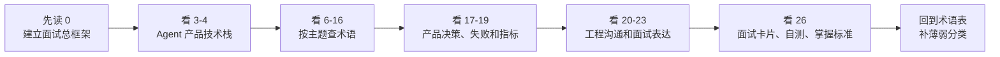
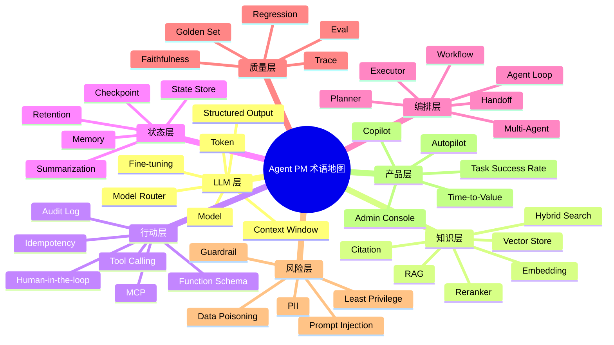

# 15. 术语表与速查表

更新日期：2026-06-05

目标读者：强技术型 Agent PM / AI Native PM / Agent Builder PM。本文不是工程手册，而是面试和产品决策速查表：你应该能快速解释术语、判断产品意义、和工程师对齐实现边界，并把概念放进一个 GTM / Sales Agent 的完整故事里。

## 0. 先读这一页

### 0.1 三分钟速读

如果你只用 3 分钟预习这篇，先记住下面 8 句话：

| 你要记住的点 | 面试里怎么说 |
| --- | --- |
| Agent 不是更会聊天的 LLM | Agent 是 LLM 加上下文、工具、状态、工作流、评估和安全治理后的任务系统 |
| RAG 解决知识和证据，不自动解决正确性 | RAG 要分别评估 retrieval、rerank、generation、citation 和 faithfulness |
| Tool Calling 是行动契约 | 模型提出结构化工具调用，应用层负责鉴权、校验、执行、审批和审计 |
| Memory 是可治理的数据产品 | 长期记忆必须有写入策略、权限、保留周期、更正和删除能力 |
| Workflow 和 Agent 应该混合使用 | Workflow 管稳定边界，Agent 管开放理解、检索、规划和生成 |
| Multi-Agent 不是默认答案 | 只有分工、并行、上下文隔离或审核收益大于复杂度时才上 |
| Eval 是从 demo 到生产的分水岭 | 没有 golden set、trace 和 regression eval，就很难稳定迭代 Agent |
| 安全不能靠一句 prompt | 需要最小权限、HITL、策略引擎、红队、审计和成本预算 |

一句面试总括：

> 我会把 Agent PM 的技术理解组织成一张产品系统图：LLM 提供推理和生成，RAG 提供知识和证据，Tool Calling 连接业务系统，Memory 保持连续性，Workflow 控制边界，Eval 证明质量，Safety 和 Cost 决定能不能规模化上线。

### 0.2 本篇阅读路线



建议阅读方式：

- 面试前 30 分钟：只读 `0. 先读这一页`、`17. Common Product Decisions And Tradeoffs`、`23. How To Say It In Interviews`、`26. 面试卡片与自测`。
- 系统补课：按 `LLM -> RAG -> Tool Calling -> Memory -> Workflow -> Eval -> Safety -> Productization` 顺序读。
- 做方案前：先看 `PM 决策速查表` 和 `容易混淆术语对照表`，避免把技术名词当产品方案。

### 0.3 PM 决策速查表

| 决策问题 | 推荐判断 | 不推荐做法 | 面试关键词 |
| --- | --- | --- | --- |
| 需要 RAG 还是长上下文？ | 高频知识服务、权限过滤、可引用答案优先 RAG；一次性深读长文档可用长上下文 | 把所有文档都塞进 prompt | retrieval recall, citation, context window |
| 需要 RAG 还是 fine-tuning？ | 私有/实时知识优先 RAG；稳定风格、标签、格式可考虑 fine-tuning | 用微调更新每天变化的事实 | grounding, behavior tuning |
| 需要 Tool Calling 吗？ | 需要查实时数据、调用 API、写系统、发起审批时需要 | 只生成文本也强行接工具 | tool schema, side effect |
| 工具能否自动执行？ | 读操作可自动；写操作按可逆性、外部影响和合规风险分级 | 让模型直接执行高风险写操作 | HITL, idempotency, audit log |
| 需要 Memory 吗？ | 多轮任务、偏好、账户历史、长期项目需要 | 把所有聊天历史无限塞回上下文 | short-term memory, long-term memory |
| 需要 Workflow 还是自由 Agent？ | 稳定高风险流程用 Workflow；开放探索节点用 Agent | 所有业务流程都让 Agent 自由循环 | orchestration, graph, stop condition |
| 需要 Multi-Agent 吗？ | 角色分工、并行研究、审核合成有明显收益时使用 | 为了显得高级而拆多个 Agent | router, supervisor, handoff |
| 如何证明 Agent 能上线？ | 建 golden set、trace、回归评估、线上监控和灰度发布 | Demo 看起来不错就全量上线 | eval, observability, canary |
| 如何控制成本？ | 模型路由、缓存、预算、超时、并行/批处理、失败分类 | 单纯换便宜模型 | cost per successful task |
| 如何控制安全风险？ | 最小权限、外部内容隔离、审批、审计、红队、策略引擎 | 只写“不要违规”的 prompt | prompt injection, least privilege |

### 0.4 术语分类地图

把术语按“产品系统中的位置”记，比按字母背更有效：



### 0.5 面试速记卡

| 卡片 | 背诵表达 |
| --- | --- |
| Agent 定义 | Agent 是围绕目标动态使用模型、上下文、工具和状态完成任务的系统，不只是聊天入口 |
| RAG 定义 | RAG 通过检索外部知识增强模型回答，核心价值是私有知识、新鲜事实和证据链 |
| Tool Calling 定义 | Tool Calling 是模型与外部系统之间的结构化行动契约 |
| Memory 定义 | Memory 是让 Agent 跨轮和跨会话保持连续性的状态系统，但必须可治理 |
| Workflow 定义 | Workflow 用确定性编排控制 Agent 的边界、顺序、分支、审批和失败恢复 |
| Eval 定义 | Eval 是用数据集、评分标准、trace 和人工/模型评审持续衡量 Agent 质量 |
| Safety 定义 | Agent 安全是权限、数据、工具、输出、审计和成本的系统治理，不是单点过滤 |
| GTM Agent 例子 | Sales Agent 的价值不是生成邮件，而是账户研究、证据检索、触达建议、审批写回和效果反馈闭环 |

### 0.6 容易混淆术语对照表

| 容易混淆 | 区别 | PM 判断 |
| --- | --- | --- |
| Chatbot vs Agent | Chatbot 以对话回答为主；Agent 以任务完成为主 | 是否需要工具、状态、规划和执行闭环 |
| RAG vs Fine-tuning | RAG 引入外部知识；fine-tuning 改变模型行为模式 | 知识新鲜度用 RAG，稳定风格/分类用 fine-tuning |
| Context Window vs Memory | Context window 是单次请求容量；Memory 是跨轮/跨会话状态 | 不要把长期记忆全部塞进上下文 |
| Tool Calling vs API Integration | Tool Calling 是模型生成调用意图；API integration 是系统实际连接外部服务 | 模型负责“想调用”，后端负责“能否执行和如何执行” |
| Structured Output vs Tool Calling | Structured output 只保证输出结构；tool calling 连接外部动作 | 抽取分类用结构化输出，外部查询/写入用工具 |
| Workflow vs Agent Loop | Workflow 是可控流程图；Agent loop 是模型驱动的动态循环 | 高风险流程用 Workflow，开放探索用 Agent loop |
| Guardrail vs Policy Engine | Guardrail 是泛称；policy engine 是工程化策略执行系统 | 关键策略要可测试、可审计、可版本化 |
| Eval vs Monitoring | Eval 偏离线/回归质量验证；Monitoring 偏线上运行观测 | 两者都需要，不能互相替代 |
| Citation vs Faithfulness | Citation 是给来源；faithfulness 是答案能否被来源支持 | 有引用不代表引用真的支持结论 |
| Copilot vs Autopilot | Copilot 辅助人决策；Autopilot 自动执行 | 自动化等级越高，审批和审计要求越高 |

### 0.7 学完后你应该能做到

- 用 30 秒讲清 Agent、RAG、Tool Calling、Memory、Workflow、Eval 的关系。
- 遇到一个 Agent 产品方案时，能判断该用 RAG、长上下文、工具调用、Workflow 还是 Multi-Agent。
- 能指出一个 Agent 方案的主要失败模式：幻觉、漏召回、误调用、越权、成本爆炸、不可复现。
- 能和工程师用 `schema`、`retriever`、`reranker`、`trace`、`idempotency`、`checkpoint`、`RBAC` 等关键词对齐实现。
- 能围绕 GTM / Sales Agent 讲出一套从数据、工具、审批、评估到商业指标的完整面试答案。

## 1. What This Module Solves

Agent 产品面试里常见问题不是“你会不会背术语”，而是：

- 你能否把 LLM、RAG、Tool Calling、Memory、Workflow、Eval、安全、成本和产品体验连成一个系统。
- 你能否解释“为什么这里要用 Agent，而不是普通 Chatbot / Workflow / Search”。
- 你能否和工程师讨论实现边界：模型负责什么，代码负责什么，工作流负责什么，人工确认负责什么。
- 你能否说清楚上线后怎么监控效果、失败、成本和风险。

这份文档解决两个问题：

- 面试前快速查术语：每个重要术语包含一句话解释、PM 要点、工程沟通关键词、常见误区和面试速记。
- 做方案时快速定边界：知道何时用 RAG、何时用 Tool Calling、何时用 Workflow、何时需要 Human-in-the-loop、何时需要 Eval 和治理。

## 2. Why An Agent PM Must Understand It

Agent PM 不需要自己实现模型推理框架，但必须能做这些判断：

- 产品价值：这个术语对应什么用户问题，能带来准确率、效率、自动化、信任还是可控性。
- 交互体验：用户看到的是答案、引用、进度、审批、错误恢复、还是自动执行结果。
- 工程边界：哪些交给模型，哪些必须用确定性代码、权限系统、队列、数据库和审计日志。
- 风险边界：幻觉、工具误调用、权限越界、RAG 注入、隐私泄漏、成本爆炸如何被发现和控制。
- 面试表达：能用“架构层 + tradeoff + metric + failure mode”的方式回答，而不是只说概念定义。

## 3. Core Concept Map

一个生产级 Agent 产品可以记成 8 层：

```text
User Experience
  -> Orchestration / Workflow
  -> Agent Loop / Planning
  -> LLM / Reasoning Model
  -> Context / Prompt / Memory
  -> RAG / Knowledge / Retrieval
  -> Tools / APIs / MCP / External Systems
  -> Eval / Observability / Safety / Governance
  -> Cost / Latency / Reliability / Product Metrics
```

面试速记表达：

> 我会把 Agent 看成“LLM 加上下文、工具、状态、工作流和评估闭环”的产品系统。PM 的重点不是追模型名，而是定义任务边界、工具权限、数据来源、失败恢复、可观测指标和用户信任机制。

## 4. How It Works: Agent Product Stack In One Page

| 层级 | 解决什么 | PM 关注点 | 工程沟通关键词 | 常见误区 |
| --- | --- | --- | --- | --- |
| LLM | 语言理解、生成、推理、分类、抽取 | 模型能力和成本是否匹配任务 | model selection, context window, temperature, structured output | 把所有问题都当成换更大模型 |
| Prompt / Context | 给模型任务、约束和资料 | 指令是否清晰、上下文是否够且不污染 | system prompt, developer message, context packing | 以为 prompt 可以替代权限和验证 |
| RAG | 引入外部知识 | 数据新鲜度、可引用、召回质量 | chunking, embedding, retriever, rerank, citations | 以为 RAG 自动消除幻觉 |
| Tool Calling | 让模型调用外部能力 | 哪些动作可自动执行，哪些要审批 | function schema, tool choice, idempotency, auth | 让模型直接决定高风险操作 |
| Memory / State | 跨轮、跨会话保留信息 | 什么该记、多久记、如何更正和删除 | checkpoint, store, session state, summarization | 把聊天记录全塞回上下文 |
| Workflow | 把 Agent 放入可控流程 | 稳定性、可解释、可复用、SLA | DAG, node, branch, retry, queue | 把所有流程都做成自由 Agent |
| Multi-Agent | 专家分工或多阶段协作 | 是否真的需要，路由和合成如何控制 | supervisor, router, handoff, sub-agent | 用多 Agent 包装复杂度，反而更慢更贵 |
| Eval / Observability | 衡量质量和定位问题 | 离线评测、在线监控、人工复核 | trace, dataset, judge, golden set, regression | 只看 demo，不建回归集 |
| Safety / Compliance | 控制安全、隐私、合规和品牌风险 | 权限、审计、红队、数据治理 | PII, policy, guardrail, audit log, HITL | 只靠安全提示词 |
| Productization | 从 demo 到可卖产品 | 目标场景、成功指标、失败体验、集成 | onboarding, tenant, billing, analytics, admin | 只做聊天框，不做业务闭环 |

## 5. What Depth A PM Needs

PM 不需要掌握：

- 向量索引底层算法的完整推导。
- 模型训练和分布式推理基础设施细节。
- 每个框架的 API 语法。

PM 必须掌握：

- 每个技术选择解决什么产品问题。
- 何时选择 RAG、长上下文、微调、工具调用、确定性 Workflow。
- 评估指标如何映射到用户体验和业务结果。
- 生产故障如何出现：错答、漏召回、工具失败、权限越界、成本抖动、延迟超时、不可复现。
- 和工程师对齐的关键词、边界、验收标准。

## 6. Glossary: LLM And Model Basics

| 术语 | 一句话解释 | PM 要点 | 工程沟通关键词 | 常见误区 | 面试速记 |
| --- | --- | --- | --- | --- | --- |
| LLM | 大语言模型，用概率方式理解和生成文本/代码/结构化内容。 | 是能力底座，不等于完整产品。 | model, tokenizer, inference, provider | 以为 LLM 自带业务知识和权限。 | “LLM 是推理和生成引擎，产品还需要上下文、工具和治理。” |
| Foundation Model | 可被迁移到多任务的大模型。 | 关注通用能力、生态、成本、合规。 | base model, API model, hosted model | 把基础模型和应用模型混为一谈。 | “基础模型提供通用能力，应用层负责场景闭环。” |
| Reasoning Model | 更擅长多步推理、规划、代码、复杂分析的模型。 | 适合高价值复杂任务，但通常更慢更贵。 | reasoning effort, chain of thought hidden, budget | 对所有请求都用最强推理模型。 | “复杂规划用 reasoning，简单抽取用小模型或规则。” |
| Multimodal Model | 能处理文本、图片、音频、视频等多模态输入/输出。 | 适合销售材料、截图、合同、网页、语音场景。 | vision, audio, OCR, modality | 以为多模态等于准确理解所有图表。 | “多模态扩展输入界面，但仍要验证输出。” |
| Context Window | 单次请求可放入模型的最大上下文长度。 | 影响长文档、记忆、成本、延迟。 | token limit, context packing, truncation | 以为窗口越大越好。 | “长窗口缓解上下文，但不替代检索和信息架构。” |
| Token | 模型处理文本的基本计费和长度单位。 | 决定成本、延迟、上下文容量。 | input tokens, output tokens, token budget | 用字数估成本。 | “Agent 成本通常是 token、工具调用和重试次数的函数。” |
| Temperature | 控制输出随机性。 | 高温适合创意，低温适合稳定任务。 | temperature, top_p, deterministic | 以为设 0 就完全确定。 | “面向生产流程，先低温再用 eval 验稳定性。” |
| Structured Output | 要求模型按 JSON Schema 等结构返回。 | 适合抽取、分类、下游自动化。 | JSON schema, strict mode, validation | 以为结构化输出保证事实正确。 | “结构化保证格式，不保证内容真实。” |
| System Prompt | 系统级指令，定义角色、边界和行为优先级。 | 是产品策略和安全边界的一部分。 | system message, instruction hierarchy | 把业务规则都塞到系统 prompt。 | “系统 prompt 定义行为，但权限必须由代码控制。” |
| Developer Instruction | 开发者级约束，常用于应用逻辑和输出格式。 | PM 可参与定义产品语气和任务边界。 | developer message, prompt template | 认为用户 prompt 可覆盖一切。 | “指令层级是防越权和一致性的基础。” |
| Prompt Engineering | 设计指令、示例、上下文和输出格式的方法。 | 用于快速验证，但长期要产品化为模板、变量和评测。 | few-shot, prompt template, constraints | 把 prompt 当一次性玄学。 | “Prompt 是可测试的产品配置，不是魔法咒语。” |
| Few-shot | 在 prompt 中给少量示例引导模型。 | 适合风格、标签、复杂格式对齐。 | examples, demonstrations, pattern | 示例过多导致成本和偏置。 | “few-shot 解决对齐，不能替代数据覆盖。” |
| Fine-tuning | 用训练样本调整模型行为。 | 适合稳定风格、分类、格式、领域语言；不适合频繁更新知识。 | training data, eval set, overfitting | 用微调解决知识新鲜度。 | “知识更新优先 RAG，行为稳定可考虑微调。” |
| Embedding Model | 把文本等内容转成向量，用于语义检索和聚类。 | 影响 RAG 召回、成本和多语言效果。 | embeddings, dimensions, cosine similarity | 以为 embedding 能理解权限和事实。 | “Embedding 是相似度工具，不是事实判断器。” |
| Model Router | 根据任务、成本、延迟、风险选择模型。 | 提升毛利和体验，是规模化 Agent 的关键。 | routing, fallback, classifier, policy | 手动为所有场景固定大模型。 | “高频简单任务走便宜模型，关键任务升级模型。” |
| Fallback Model | 主模型失败或超时时切换的备用模型。 | 影响可用性和一致性。 | fallback, timeout, circuit breaker | 备用模型无评测就上线。 | “Fallback 要验证输出差异，不只是换供应商。” |
| Model Drift | 模型版本或行为变化导致线上效果变化。 | SaaS API 模型升级也可能改变产品体验。 | version pinning, regression eval, canary | 只在大版本升级时评估。 | “模型是依赖项，升级要像代码发布一样回归。” |

## 7. Glossary: Agent Concepts

| 术语 | 一句话解释 | PM 要点 | 工程沟通关键词 | 常见误区 | 面试速记 |
| --- | --- | --- | --- | --- | --- |
| Agent | 能根据目标动态使用上下文、工具和状态完成任务的系统。 | 重点是任务闭环，不只是聊天。 | agent loop, tools, state, planner | 把任何聊天机器人都叫 Agent。 | “Agent = 模型 + 工具 + 状态 + 控制循环 + 评估。” |
| Agent Loop | 模型反复观察、思考、调用工具、接收结果、继续决策的循环。 | 决定自主性、成本和失败风险。 | observe, plan, act, tool_result, stop condition | 没有停止条件。 | “Agent loop 要有预算、超时、退出和人工接管。” |
| Autonomy Level | Agent 可自主决策和执行的程度。 | 决定风险和 UX，从建议到自动执行分级。 | approval, policy, permission, automation level | 一上来全自动。 | “先 copilot，再 partial automation，最后 autopilot。” |
| Planner | 生成任务步骤或执行计划的组件。 | 适合多步任务，但计划需可检查。 | plan, decomposition, task graph | 计划写得漂亮但不可执行。 | “规划要落到可执行节点和验收条件。” |
| Executor | 执行计划中具体动作的组件。 | 需要权限、重试、幂等和日志。 | executor, tool call, job runner | 让模型直接操作核心系统。 | “执行层要工程化，不应只靠模型自由发挥。” |
| ReAct | Reason + Act，模型边推理边调用工具。 | 适合探索型任务，但成本和可控性较差。 | thought/action/observation, tool loop | 把 ReAct 当生产稳定性的保证。 | “ReAct 适合开放问题，关键路径要加约束和评测。” |
| Plan-and-Execute | 先规划再执行的 Agent 模式。 | 适合复杂任务、可展示进度和审批。 | planner, executor, step status | 初始计划不随新信息更新。 | “先给用户可见计划，再逐步执行和修正。” |
| Reflection | Agent 自我检查、修正或重试。 | 可提升质量，但增加成本和延迟。 | critique, self-check, verifier | 以为自我反思等于客观评估。 | “Reflection 是启发式，关键质量仍要外部 eval。” |
| Self-Correction | 基于错误、验证失败或反馈修正输出。 | 适合结构化校验、代码、查询生成。 | validation, retry, repair | 无限重试。 | “自修复必须有最大次数和错误分类。” |
| Human-in-the-loop | 人在关键步骤审批、纠错或接管。 | 用于高风险、高价值、低置信任务。 | approval gate, interrupt, review queue | 所有步骤都让人审，失去效率。 | “HITL 应放在不可逆、高风险或低置信节点。” |
| Guardrail | 对输入、输出、工具、权限和策略的保护机制。 | 保护安全、合规和品牌体验。 | input filter, output policy, validator | 只把 guardrail 理解成敏感词。 | “Guardrail 是多层控制，不是单一提示词。” |
| Confidence Score | 系统对答案或动作可信度的估计。 | 决定是否回答、引用、转人工或追问。 | calibrated confidence, uncertainty | 模型自报信心可靠。 | “置信度要结合检索证据、校验和历史表现。” |
| Escalation | Agent 失败或风险过高时转人工/上级流程。 | 是产品体验的一部分，不是异常边角。 | escalation path, handoff, SLA | 失败只返回错误。 | “好的 Agent 要知道什么时候不该继续自动化。” |
| Task Boundary | Agent 被允许解决的问题范围。 | 决定 MVP、评测集、安全边界。 | scope, allowed actions, out-of-scope | 让 Agent 解决所有问题。 | “Agent 的能力边界要比营销文案更窄更清楚。” |
| Goal Hijacking | 用户或外部内容让 Agent 偏离原目标。 | 高风险工具和 RAG 场景必须防。 | prompt injection, policy, instruction hierarchy | 只防用户输入，不防网页/文档。 | “Agent 读到的内容不能自动变成指令。” |
| Excessive Agency | 给 Agent 过多权限、工具或自主性。 | OWASP 重点风险，PM 要定义权限最小化。 | least privilege, approval, sandbox | 功能越多越智能。 | “Agent 权限要按任务最小化，而不是按可能性最大化。” |

## 8. Glossary: RAG, Knowledge, Search

| 术语 | 一句话解释 | PM 要点 | 工程沟通关键词 | 常见误区 | 面试速记 |
| --- | --- | --- | --- | --- | --- |
| RAG | 检索外部资料并放入上下文，让模型基于资料回答。 | 解决私有知识、实时知识、可引用。 | retrieval, augmentation, generation | RAG 自动保证正确。 | “RAG 提供证据，不自动保证推理正确。” |
| Knowledge Base | 可被检索的文档、网页、数据库或业务知识集合。 | 重点是来源、权限、新鲜度、维护流程。 | corpus, source, ACL, sync | 上传一堆文档就完事。 | “知识库是运营资产，不是一次性文件夹。” |
| Document Loader | 从文件、网页、数据库等读取内容的组件。 | 决定覆盖哪些数据源和格式。 | loader, connector, parser | 忽视解析质量。 | “解析失败会直接变成检索失败。” |
| Chunking | 把文档切成可检索的小段。 | 影响召回、引用、成本、上下文噪声。 | chunk size, overlap, parent-child chunk | 切得越小越好。 | “Chunk 要贴合用户问题和文档结构。” |
| Node | LlamaIndex 等框架中表示文档切片的基本单元。 | 有助于讨论引用、元数据和检索粒度。 | node, metadata, document id | 只存纯文本不存来源。 | “可追溯 RAG 要保留 node metadata。” |
| Metadata | 文档切片的来源、时间、作者、权限、标签等信息。 | 用于过滤、排序、审计和权限控制。 | metadata filter, source, timestamp, tenant | 只做向量相似度，不做过滤。 | “企业 RAG 没 metadata 就很难产品化。” |
| Vector Store | 存储向量并支持相似度搜索的数据库。 | 影响召回、隔离、成本、扩展性。 | vector DB, namespace, index, ANN | 把向量库当普通数据库。 | “向量库解决相似检索，不替代业务权限。” |
| Semantic Search | 基于语义相似度而非关键词匹配的搜索。 | 适合自然语言查询和同义表达。 | cosine similarity, dense retrieval | 对精确编号、日期、权限不可靠。 | “语义搜索适合意图，关键词适合精确约束。” |
| Hybrid Search | 结合向量搜索和关键词/BM25 搜索。 | 企业知识库常用，兼顾语义和精确匹配。 | BM25, dense, sparse, hybrid | 只上向量搜索。 | “Sales 资料里公司名、职位、日期常需要 hybrid。” |
| Retriever | 根据 query 找回相关内容的组件。 | 是 RAG 质量的第一道门。 | top_k, filters, recall, reranker | 只调 prompt 不调 retriever。 | “RAG 问题先拆成检索问题和生成问题。” |
| Reranker | 对初步召回结果重新排序的模型/组件。 | 提升相关性，但增加延迟和成本。 | cross-encoder, rerank top_n | top_k 越大越好。 | “召回要宽，进入上下文要精。” |
| Contextual Compression | 对召回内容压缩，只保留与问题相关片段。 | 降低 token 和噪声。 | compression, extractive, summary | 压缩丢关键证据。 | “压缩要评测 faithfulness 和引用完整性。” |
| Citation | 在答案中标注来源。 | 增强信任、可审计，B2B 很重要。 | source link, span citation, provenance | 有引用就代表答案正确。 | “引用是信任入口，不是正确性的最终证明。” |
| Grounding | 让输出基于给定资料或工具结果。 | 降低幻觉，提升可解释。 | grounded answer, source-constrained | 模型仍可能错误综合。 | “Grounding 要配合拒答和证据不足处理。” |
| Hallucination | 模型生成看似合理但不真实/无依据的内容。 | 影响信任和合规，需用引用、拒答、eval 控制。 | unsupported claim, fabrication | 以为换大模型就消失。 | “幻觉是系统风险，不是单一模型 bug。” |
| Retrieval Miss | 正确答案在知识库里但没被检索到。 | 用户感知为错答或不知道。 | recall failure, query rewrite | 只看最终答案，不看检索 trace。 | “RAG 评估要先看 hit rate / recall。” |
| Query Rewrite | 改写用户问题以提升检索。 | 适合口语化、多轮、省略主语的问题。 | rewrite, expansion, decomposition | 改写改变用户意图。 | “Rewrite 要保留原意，并可在 trace 中审计。” |
| Multi-hop RAG | 需要多次检索或跨文档推理的 RAG。 | 适合账户研究、竞品分析、合规问答。 | sub-questions, iterative retrieval | 一次 top_k 解决所有问题。 | “复杂 GTM research 通常是 multi-hop，不是单次搜索。” |
| Freshness | 知识的新鲜度。 | 影响新闻、市场、客户动态、政策。 | sync cadence, timestamp, stale data | 不标数据时间。 | “回答动态事实时要暴露来源时间。” |
| Access Control in RAG | 检索时遵守用户/租户权限。 | 企业上线硬门槛。 | ACL, RBAC, tenant isolation | 先检索再过滤敏感内容。 | “权限必须在检索前和检索中生效。” |
| RAG Injection | 恶意文档通过检索结果注入指令。 | Agent 读取网页/邮件/CRM 资料时高风险。 | indirect prompt injection, content sanitization | 只防用户 prompt injection。 | “检索内容是数据，不是指令。” |

## 9. Glossary: Tool Calling, MCP, Actions

| 术语 | 一句话解释 | PM 要点 | 工程沟通关键词 | 常见误区 | 面试速记 |
| --- | --- | --- | --- | --- | --- |
| Tool Calling | 模型生成结构化工具调用，由系统或服务执行。 | 让 Agent 能查数据、发邮件、建任务、写 CRM。 | function calling, tool schema, tool_result | 模型自己执行工具。 | “模型决定调用意图，应用负责执行和校验。” |
| Function Schema | 工具名称、描述、参数和类型约束。 | 影响模型是否会正确调用。 | JSON schema, required fields, enum | schema 写得模糊。 | “工具描述就是模型的 API 产品文案。” |
| Tool Choice | 控制模型是否、何时、必须调用某工具。 | 决定自主性和成本。 | auto, required, none, forced tool | 所有问题都强制工具。 | “工具触发策略要按任务和风险设计。” |
| Strict Tool Use | 要求工具参数严格符合 schema。 | 降低格式错误，但不保证业务正确。 | strict, schema validation | 以为 strict 能防误调用。 | “Strict 解决格式，审批解决风险。” |
| Tool Result | 工具执行后返回给模型的结果。 | 要控制可见信息、错误格式和引用。 | observation, result payload, structured content | 工具返回海量原始数据。 | “Tool result 要短、结构化、可追溯。” |
| Idempotency | 同一动作重复执行不会造成重复副作用。 | 发邮件、建订单、改 CRM 必须考虑。 | idempotency key, dedupe, retry-safe | 重试导致重复动作。 | “可重试动作必须幂等。” |
| Side Effect | 工具调用会改变外部系统状态。 | 高风险动作需确认、回滚和审计。 | write action, mutation, rollback | 把读写工具风险等同。 | “读工具可自动，写工具要分级审批。” |
| Sandbox | 在隔离环境中执行代码或工具。 | 降低执行风险，适合代码、浏览器、文件操作。 | sandbox, container, permission | 沙箱里就不需要权限。 | “沙箱是边界之一，不是安全全部。” |
| MCP | Model Context Protocol，标准化连接模型和外部工具/资源/提示的协议。 | 有助于扩展工具生态和企业集成。 | tools/list, tools/call, resources, prompts | 以为 MCP 自动安全。 | “MCP 是连接标准，产品仍要做权限和确认。” |
| Resource | MCP 中可被模型读取的外部上下文资源。 | 适合文件、数据库记录、知识片段。 | resource URI, mimeType, subscription | 资源暴露过宽。 | “资源是上下文入口，要按最小权限暴露。” |
| Prompt Resource | MCP 或平台中可复用的提示模板。 | 有利于标准化场景流程。 | prompt template, arguments | 模板版本无管理。 | “提示也要版本化和评测。” |
| API Connector | 连接 Salesforce、HubSpot、Slack、Gmail 等外部系统。 | 决定 Agent 是否真的进入业务流。 | OAuth, scopes, rate limit | 只做 demo mock 数据。 | “B2B Agent 的价值常在系统集成里。” |
| Rate Limit | API 或模型调用频率限制。 | 影响峰值体验、批处理和 SLA。 | QPS, RPM, TPM, backoff | 上线后才发现限流。 | “Agent 规划要考虑外部系统限流。” |
| Authentication | 验证用户或系统身份。 | Agent 代用户行动必须有身份边界。 | OAuth, API key, service account | 用共享 API key 操作所有用户。 | “代用户执行要有用户级授权。” |
| Authorization | 判断身份能做什么。 | 决定工具权限和数据可见性。 | RBAC, ABAC, scopes | 认证成功就全权限。 | “AuthN 证明是谁，AuthZ 决定能做什么。” |
| Audit Log | 记录 Agent 看到什么、做了什么、为什么做。 | 企业信任、合规、debug 必需。 | trace, action log, actor, timestamp | 只记录最终答案。 | “可审计 Agent 要记录输入、证据、工具和审批。” |
| Confirmation Prompt | 执行高风险动作前让用户确认。 | 降低误操作，增强控制感。 | approval UI, preview, confirm | 每个动作都确认导致疲劳。 | “确认要放在不可逆或对外可见动作前。” |

## 10. Glossary: Memory And State

| 术语 | 一句话解释 | PM 要点 | 工程沟通关键词 | 常见误区 | 面试速记 |
| --- | --- | --- | --- | --- | --- |
| Memory | Agent 跨轮或跨会话保存并使用信息。 | 提升个性化和连续性，也带来隐私和污染风险。 | short-term memory, long-term memory, store | 把 memory 等同聊天历史。 | “Memory 是可治理的数据产品，不是无限聊天记录。” |
| Short-term Memory | 当前会话或线程内的上下文状态。 | 支持多轮对话、任务进度。 | thread state, checkpoint, messages | 会话越长越好。 | “短期记忆要压缩、截断和摘要。” |
| Long-term Memory | 跨会话长期保存用户偏好、事实、规则。 | 适合个性化，但需要同意、更正、删除。 | persistent store, semantic memory | 自动记住所有信息。 | “长期记忆必须有写入策略和用户控制。” |
| Episodic Memory | 记住过去事件或交互经历。 | 适合客户跟进、项目历史。 | episode, timeline, interaction log | 与事实记忆混用。 | “事件记忆回答‘发生过什么’。” |
| Semantic Memory | 记住稳定事实、偏好、实体关系。 | 适合客户画像、产品偏好。 | facts, profile, knowledge graph | 不处理过期和冲突。 | “事实记忆要可更新和可撤销。” |
| Procedural Memory | 记住如何执行任务的规则或流程。 | 适合组织 SOP、销售方法论。 | policy, playbook, skill | 规则变更无版本。 | “程序性记忆像 playbook，要版本化。” |
| Checkpoint | 保存工作流/Agent 的中间状态以便恢复。 | 支持长任务、人工中断、重试。 | persistence, resume, checkpoint id | 只保存最终结果。 | “长流程 Agent 必须能中断和恢复。” |
| State Store | 存储会话、任务、变量和记忆的数据库。 | 决定可恢复、可追踪、可并发。 | Postgres, Redis, KV, graph state | 把状态存在 prompt。 | “状态属于系统，不属于模型上下文。” |
| Memory Retrieval | 从记忆库中找回相关记忆。 | 避免把所有历史塞进上下文。 | memory search, relevance, recency | 召回旧错误记忆。 | “记忆要按相关性、时间和可信度召回。” |
| Memory Write Policy | 决定什么信息可以写入记忆。 | 直接影响隐私、成本、质量。 | write filter, consent, PII | 默认自动写。 | “不是所有对话都值得记。” |
| Memory Poisoning | 恶意或错误信息进入记忆，影响未来行为。 | 高风险 Agent 必须防。 | poisoning, validation, user-controlled delete | 只关注 prompt injection。 | “长期记忆是攻击面。” |
| Summarization | 将长历史压缩成摘要。 | 降成本，但可能丢细节。 | rolling summary, compaction | 摘要永远准确。 | “摘要要可回溯到原始记录。” |
| Forgetting / Deletion | 用户或策略要求删除记忆。 | 隐私合规和用户信任关键。 | retention, deletion, GDPR/CCPA | 只在 UI 删除，不删底层存储。 | “可删除是记忆产品的基本能力。” |

## 11. Glossary: Workflow And Orchestration

| 术语 | 一句话解释 | PM 要点 | 工程沟通关键词 | 常见误区 | 面试速记 |
| --- | --- | --- | --- | --- | --- |
| Workflow | 由节点、条件、工具和模型组成的可控流程。 | 稳定、可解释、适合生产化。 | DAG, node, edge, branch | Workflow 不智能。 | “Workflow 给 Agent 加边界，Agent 给 Workflow 加弹性。” |
| Chatflow | 面向多轮对话的工作流。 | 适合客服、销售助手、内部 copilot。 | session, memory, chat trigger | 和单轮 workflow 混淆。 | “Chatflow 管对话状态，Workflow 管任务流程。” |
| DAG | 有向无环图，表示固定执行依赖。 | 适合确定性流程和可观测。 | directed acyclic graph | 所有业务流程都无环。 | “DAG 稳定，但复杂探索要 Agent loop。” |
| Node | 工作流中的一个步骤。 | PM 可定义节点输入、输出、失败处理。 | node input/output, variables | 节点太粗导致难 debug。 | “节点粒度决定可观测和复用。” |
| Branching | 根据条件走不同路径。 | 适合风险分级、意图分类、权限判断。 | if/else, router, condition | 让模型自由决定所有分支。 | “关键分支优先确定性规则或分类器。” |
| Parallel Execution | 多个分支同时执行。 | 降延迟，适合多源研究。 | parallel, fan-out/fan-in | 并行结果冲突无人处理。 | “并行要有合并策略。” |
| Loop / Iteration | 对列表或条件重复执行节点。 | 适合逐个账户研究、批量线索处理。 | loop, iterator, max iterations | 无上限循环导致成本爆炸。 | “循环必须有预算和停止条件。” |
| Queue | 异步任务排队执行。 | 支持长任务、峰值、重试。 | job queue, worker, async | 所有操作同步等待。 | “长耗时 Agent 应异步化并展示进度。” |
| Retry | 失败后重试。 | 提升成功率，但需避免重复副作用。 | exponential backoff, retry policy | 盲目重试工具写操作。 | “读可重试，写要幂等。” |
| Timeout | 超过时间终止。 | 控制用户体验和成本。 | deadline, timeout, cancellation | 无超时导致卡死。 | “每个工具和 Agent loop 都要有超时。” |
| Circuit Breaker | 依赖异常时暂停调用以保护系统。 | 防止供应商或工具故障扩散。 | circuit breaker, degraded mode | 故障时让用户一直等。 | “Agent 产品也需要降级体验。” |
| Deterministic Logic | 由代码规则稳定执行的逻辑。 | 金融、权限、计费、合规不能靠模型判断。 | rule engine, validation, policy | 迷信模型推理。 | “高风险判断用代码，模型做理解和生成。” |
| Orchestrator | 协调模型、工具、子任务和状态的控制层。 | Agent 产品真正的“大脑”常在编排层。 | orchestrator, runtime, graph | 把模型当 orchestrator 全部自由控制。 | “生产 Agent 的核心是编排，不只是模型调用。” |

## 12. Glossary: Multi-Agent

| 术语 | 一句话解释 | PM 要点 | 工程沟通关键词 | 常见误区 | 面试速记 |
| --- | --- | --- | --- | --- | --- |
| Multi-Agent System | 多个专门 Agent 协作完成任务。 | 适合多领域、多角色、多阶段任务。 | supervisor, sub-agent, handoff | 为了酷而上多 Agent。 | “多 Agent 是复杂度工具，不是默认架构。” |
| Supervisor Agent | 负责分配任务、汇总结果的上级 Agent。 | 适合研究、写作、审核分工。 | supervisor, coordinator | supervisor 也会犯错。 | “Supervisor 要有 trace 和最终校验。” |
| Router | 根据输入选择专家/路径。 | 降成本、提精度。 | routing classifier, intent | 路由错误无兜底。 | “Router 要有 fallback 和混淆矩阵。” |
| Handoff | 一个 Agent 把控制权交给另一个 Agent。 | 适合用户可感知的专家切换。 | handoff, transfer, active agent | 用户不知道谁在负责。 | “Handoff 要保留上下文和责任边界。” |
| Sub-agent As Tool | 主 Agent 把子 Agent 当工具调用。 | 控制更集中，适合复杂但需可控场景。 | agent tool, isolation | 子 Agent 共享全部上下文。 | “子 Agent 应只拿必要上下文。” |
| Debate / Critic | 多个 Agent 互相评审或辩论。 | 可提升复杂决策质量，但成本高。 | critic, verifier, majority vote | 以为多数投票一定正确。 | “多 Agent 评审要看独立性和评测收益。” |
| Swarm | 多 Agent 分散协作的模式。 | 适合探索，但生产可控性弱。 | swarm, decentralized | 难定位责任。 | “生产场景优先可控 supervisor/router。” |
| Context Isolation | 不同 Agent 只看到与自己任务相关的上下文。 | 降成本、防污染、提升专注。 | scoped context, least context | 给所有 Agent 全量历史。 | “多 Agent 的价值之一是上下文隔离。” |

## 13. Glossary: Eval, Observability, Quality

| 术语 | 一句话解释 | PM 要点 | 工程沟通关键词 | 常见误区 | 面试速记 |
| --- | --- | --- | --- | --- | --- |
| Eval | 对模型/Agent 输出和行为的系统评估。 | 是从 demo 到生产的分水岭。 | offline eval, online eval, benchmark | 只人工看几个样例。 | “没有 eval 的 Agent 不能规模化迭代。” |
| Golden Set | 人工整理的代表性测试集和期望结果。 | 覆盖高频、长尾、风险、失败样本。 | test dataset, labels, expected output | 只用正例。 | “Golden set 要从真实生产失败中增长。” |
| Regression Eval | 每次改 prompt、模型、工具后跑回归。 | 防止局部优化破坏旧能力。 | regression suite, CI | 只在上线前测一次。 | “Prompt 变更也要像代码一样回归。” |
| LLM-as-Judge | 用强模型评价输出质量。 | 可规模化评估，但要校准和抽检。 | judge model, rubric, calibration | 完全相信 judge。 | “Judge 是效率工具，不是最终真理。” |
| Human Eval | 人工评价输出。 | 高价值、主观和合规场景必需。 | annotation, reviewer, inter-rater agreement | 没有评分 rubric。 | “人工评估要有一致标准和抽样策略。” |
| Faithfulness | 输出是否能由给定上下文支持。 | RAG 关键指标，衡量少幻觉。 | supported claims, context-grounded | 和正确性混淆。 | “Faithfulness 看是否忠于证据。” |
| Answer Relevance | 答案是否回应了用户问题。 | 衡量跑题、冗余、漏答。 | response relevancy | 相关不等于真实。 | “相关性和真实性要分开评估。” |
| Context Precision | 检索结果中排在前面的内容是否相关。 | 衡量 retriever 排序质量。 | precision@k, ranking | 只看生成答案。 | “RAG 要同时评检索和生成。” |
| Context Recall | 需要的证据是否被检索到。 | 召回不足会导致模型无从回答。 | recall@k, hit rate | 只优化 precision。 | “先召回到，再排序好。” |
| MRR | 正确结果排名倒数的平均值。 | 衡量搜索结果是否靠前。 | mean reciprocal rank | 不适合所有生成任务。 | “MRR 适合检索排序评估。” |
| Pass@k | k 次尝试里至少一次成功的概率。 | 常见于代码/工具任务评估。 | pass@1, pass@k | 高 pass@k 掩盖单次体验差。 | “产品体验更看 pass@1 和修复成本。” |
| Trace | 记录一次 Agent 执行的每一步输入、输出和工具调用。 | Debug、审计、优化必需。 | spans, events, trace id | 只存 final answer。 | “Agent 没 trace 就像后端没日志。” |
| Observability | 对延迟、成本、质量、工具、错误的可观测能力。 | PM 能看真实用户体验和 ROI。 | metrics, logs, traces, dashboards | 只看 API 成功率。 | “Agent 观测要覆盖模型、工具和业务结果。” |
| Red Teaming | 主动攻击和测试安全边界。 | 上线前识别 prompt injection、越权和泄漏。 | adversarial testing, jailbreak | 只做一次。 | “红队应进入持续评测集。” |
| A/B Test | 对比不同模型、prompt、流程的线上效果。 | 衡量真实用户和业务指标。 | experiment, treatment, control | 只看主观质量。 | “A/B 要同时看成功率、延迟、成本和风险。” |
| Canary | 小流量发布验证。 | 降低模型/流程升级风险。 | canary release, rollback | 全量切换模型。 | “模型升级要灰度，不要豪赌。” |

## 14. Glossary: Reliability, Cost, Performance

| 术语 | 一句话解释 | PM 要点 | 工程沟通关键词 | 常见误区 | 面试速记 |
| --- | --- | --- | --- | --- | --- |
| Latency | 用户等待时间。 | Agent 多步调用容易慢，需要进度和异步体验。 | p50, p95, streaming | 只看平均延迟。 | “Agent 要优化 p95 和可感知等待。” |
| Streaming | 边生成边返回内容。 | 降低等待感，但不适合所有结构化任务。 | token streaming, event streaming | 流式输出等于任务完成。 | “长任务要流式展示进度，不只是文字。” |
| Cost Per Task | 完成一次业务任务的总成本。 | 比单次模型调用成本更重要。 | token cost, tool cost, retry cost | 只看模型单价。 | “Agent 成本是多步链路成本。” |
| Token Budget | 为一次任务设置最大 token/调用预算。 | 防止成本失控。 | max tokens, budget, cap | 不设预算让 Agent 自由探索。 | “开放任务必须有预算。” |
| Caching | 复用重复输入、检索或工具结果。 | 降成本和延迟，需注意新鲜度。 | prompt caching, response cache, TTL | 缓存过期导致旧答案。 | “缓存要有失效策略。” |
| Batching | 合并多个请求一起处理。 | 适合批量线索评分、文档处理。 | batch API, async batch | 不适合强交互实时任务。 | “批处理优化吞吐，不优化实时体验。” |
| SLA | 服务可用性和响应承诺。 | B2B 产品销售关键。 | uptime, p95, support SLA | AI 功能不需要 SLA。 | “企业 Agent 要承诺系统层 SLA，而非模型完美。” |
| Degraded Mode | 部分能力不可用时提供降级体验。 | 提升可靠性和信任。 | fallback UX, limited mode | 失败就报错。 | “工具挂了也要告诉用户还能做什么。” |
| Error Taxonomy | 对错误类型分类。 | 指导优先级和修复。 | model error, retrieval error, tool error, policy error | 把所有失败都叫 hallucination。 | “先分类失败，再谈优化。” |
| SLO | 内部质量目标。 | 可设置任务成功率、引用覆盖率、人工接管率。 | service level objective | 只定技术可用率。 | “Agent SLO 要有业务成功指标。” |
| Unit Economics | 单位经济模型。 | 决定定价、毛利、限额。 | gross margin, cost per active user | 免费无限调用。 | “Agent 定价要绑定任务价值和成本上限。” |
| Prompt Bloat | prompt 越堆越长导致成本高、效果差。 | 常见于快速迭代后期。 | prompt refactor, context pruning | 继续往 prompt 塞规则。 | “Prompt 也需要重构和模块化。” |

## 15. Glossary: Safety, Security, Compliance

| 术语 | 一句话解释 | PM 要点 | 工程沟通关键词 | 常见误区 | 面试速记 |
| --- | --- | --- | --- | --- | --- |
| Prompt Injection | 输入内容试图覆盖系统指令或劫持行为。 | Agent + RAG + 工具场景最高频风险之一。 | direct/indirect injection, instruction hierarchy | 只靠提示“不要被攻击”。 | “不可信内容不能拥有指令权。” |
| Jailbreak | 诱导模型违反安全策略。 | 面向开放聊天和内容生成尤其重要。 | adversarial prompt, refusal, policy | 模型更新后无需再测。 | “Jailbreak 要持续红队和回归。” |
| Indirect Prompt Injection | 恶意指令藏在网页、邮件、文档等外部内容里。 | 读外部资料的 Agent 必须防。 | retrieved content, untrusted data | 只审用户输入。 | “Agent 看到的网页内容也是攻击面。” |
| Data Leakage | 敏感信息被错误暴露。 | 企业信任底线。 | PII, secrets, DLP, masking | 只关注训练数据泄漏。 | “检索、日志、工具结果都可能泄漏。” |
| PII | 可识别个人身份的信息。 | 影响存储、日志、记忆、跨境和删除。 | personal data, masking, retention | 只把身份证号当 PII。 | “PII 要按法规和业务上下文定义。” |
| Least Privilege | 最小权限原则。 | Agent 工具权限按任务最小化。 | scopes, RBAC, ACL | 给 Agent 管理员权限省事。 | “权限越小，误调用影响越小。” |
| Policy Engine | 用规则/策略判断输入、输出和动作是否允许。 | 关键风险不靠模型自由判断。 | policy as code, rule engine | 策略只写在 prompt。 | “策略应工程化、可审计、可测试。” |
| Content Moderation | 对不当内容进行检测和处理。 | 影响开放输入、UGC、品牌安全。 | moderation, classifier, blocked categories | 过度拦截损害体验。 | “安全要看误杀率和漏放率。” |
| System Prompt Leakage | 系统提示被用户诱导泄露。 | 可能暴露策略、工具和内部逻辑。 | prompt extraction, secret hygiene | 把密钥写进 prompt。 | “Prompt 里不放秘密。” |
| Supply Chain Risk | 模型、插件、工具、数据源、依赖的第三方风险。 | 企业采购和安全评审会问。 | vendor risk, SBOM, third-party | 只评模型供应商。 | “Agent 供应链包括工具和知识源。” |
| Data Poisoning | 训练数据、知识库或记忆被污染。 | RAG 和 memory 产品必须监控。 | poisoning, provenance, approval | 只发生在训练阶段。 | “企业 Agent 的知识库也会被投毒。” |
| Vector Weakness | 向量库带来的隔离、反推、污染、误召回风险。 | 多租户 RAG 必须重视。 | namespace, tenant isolation, embedding inversion | 向量不可读所以安全。 | “向量也承载敏感信息。” |
| Unbounded Consumption | 被诱导或错误配置导致无限调用和成本爆炸。 | 直接影响毛利和可用性。 | rate limit, quota, budget | 不设用户/任务限额。 | “每个 Agent 都要有消费上限。” |
| AI RMF | NIST AI 风险管理框架，强调治理、映射、测量、管理。 | 帮 PM 把风险转成流程和责任。 | govern, map, measure, manage | 当成法律合规清单。 | “AI RMF 是风险治理框架，不是单一安全工具。” |
| EU AI Act | 欧盟 AI 法案，按风险分类并规定 GPAI/高风险系统义务。 | 涉欧产品需关注透明度、文档、人类监督等。 | high-risk AI, GPAI, transparency | 以为只约束模型厂商。 | “应用方也可能有 deployer obligations。” |
| Auditability | 系统行为可追溯、可解释、可复核。 | 企业购买 Agent 的核心信任点。 | audit trail, trace, evidence | 只提供聊天记录。 | “可审计 = 谁在何时基于什么做了什么。” |

## 16. Glossary: Productization And GTM

| 术语 | 一句话解释 | PM 要点 | 工程沟通关键词 | 常见误区 | 面试速记 |
| --- | --- | --- | --- | --- | --- |
| Copilot | 辅助用户完成任务，最终由用户决策。 | 低风险切入，适合早期 MVP。 | assistive UX, draft, suggest | 价值弱于全自动。 | “Copilot 是建立信任和数据闭环的好入口。” |
| Autopilot | 系统自动完成任务并可能执行动作。 | 价值高但风险、评测、权限要求高。 | automation, approval policy | 过早全自动。 | “Autopilot 需要成熟 eval、审计和回滚。” |
| Agent Builder | 可视化/低代码构建 Agent 的产品。 | 重点是模板、工具、权限、发布、监控。 | visual builder, node, deployment | 只做画布不做运行治理。 | “Builder 的壁垒在运行时和治理。” |
| Template | 可复用的场景方案。 | 降低上手成本，利于 GTM。 | workflow template, starter | 模板无法适配企业差异。 | “模板解决 80%，配置解决 20%。” |
| Onboarding | 用户接入数据、工具、权限和目标的流程。 | 决定激活率和 Time-to-Value。 | connector setup, OAuth, import | 只问一句“你想做什么”。 | “Agent onboarding 本质是配置业务上下文。” |
| Time-to-Value | 用户首次获得明确价值的时间。 | Agent 产品关键增长指标。 | activation, first successful task | 只看注册转化。 | “用户第一次成功完成任务才算激活。” |
| Task Success Rate | 任务完成且用户认可的比例。 | Agent 核心质量指标。 | success label, completion | API 成功等于任务成功。 | “业务任务成功比模型调用成功重要。” |
| Deflection Rate | 自动解决而无需人工介入的比例。 | 客服/运营常用，但要结合满意度。 | automation rate, containment | 盲目提高导致错处理。 | “自动化率必须和质量一起看。” |
| Human Review Rate | 需要人工审批或修正的比例。 | 反映信任和自动化成熟度。 | review queue, escalation | 越低越好。 | “高风险场景适度 review 是产品能力。” |
| Evidence-backed Output | 带证据、来源、引用的输出。 | B2B 决策场景比华丽文案更重要。 | citations, provenance | 引用堆砌。 | “销售 Agent 的信任来自证据链。” |
| Admin Console | 管理工具、数据、权限、审计、成本的后台。 | 企业化必需。 | tenant admin, policy, analytics | 只做终端用户聊天 UI。 | “企业 Agent 需要管理员视角。” |
| Tenant Isolation | 不同客户数据和配置隔离。 | B2B SaaS 底线。 | multi-tenant, namespace, encryption | 只在前端隔离。 | “隔离必须覆盖数据、向量、日志、缓存。” |
| Usage Analytics | 分析用户如何使用 Agent。 | 指导迭代、定价和成功指标。 | funnel, task analytics | 只看 DAU。 | “Agent analytics 要看任务和工具链路。” |
| GTM Agent | 用 Agent 支持市场、销售、客户研究和触达。 | 是面试中很好讲的综合案例。 | account research, lead scoring, outreach | 只生成邮件，不做证据和 CRM 闭环。 | “GTM Agent 的核心是研究、证据、动作和反馈闭环。” |

## 17. Common Product Decisions And Tradeoffs

### RAG vs Fine-tuning vs Long Context

| 决策 | 选择它当 | 避免它当 | 关键指标 | 面试表达 |
| --- | --- | --- | --- | --- |
| RAG | 需要私有/实时/可引用知识 | 数据质量差、权限复杂但未建治理 | retrieval recall, faithfulness, citation coverage | “知识新鲜度和证据链优先 RAG。” |
| Fine-tuning | 需要稳定格式、风格、分类、领域表达 | 频繁更新事实知识 | accuracy, consistency, cost per task | “微调改行为，不适合当知识库。” |
| Long Context | 单次任务需要完整资料，如长合同 | 大量重复查询或需要权限过滤 | answer quality, latency, cost | “长上下文适合一次性深读，RAG 适合持续知识服务。” |
| Prompt Only | 快速原型或简单任务 | 复杂流程、高风险动作、强一致性 | first-pass success | “Prompt only 适合验证，不适合承担生产边界。” |

### Agent vs Workflow

| 决策 | 用 Agent | 用 Workflow | Hybrid 方式 |
| --- | --- | --- | --- |
| 任务是否开放 | 问题路径不确定、需要探索 | 步骤稳定、规则明确 | Workflow 控制大路径，Agent 处理开放节点 |
| 风险 | 低风险或有审批 | 高风险、不可逆、合规强 | Agent 给建议，Workflow 做审批和执行 |
| 可解释性 | 可用 trace 解释 | 天然更容易解释 | Agent 每步输出结构化状态 |
| 成本 | 可能多轮多工具更贵 | 成本可预测 | 给 Agent 设置预算和退出条件 |

面试速记表达：

> 我不会把 Agent 和 Workflow 对立。生产里常见是 Workflow 负责确定性边界，Agent 负责不确定的理解、检索、生成和工具选择。

### Single Agent vs Multi-Agent

| 选择 | 适合场景 | 风险 | 验收指标 |
| --- | --- | --- | --- |
| Single Agent | 任务单域、工具少、上下文不复杂 | prompt 变长、角色混乱 | task success, latency, cost |
| Router + Specialists | 多意图、多领域、成本敏感 | 路由错误 | routing accuracy, fallback rate |
| Supervisor + Sub-agents | 多阶段研究、写作、审核 | 总成本和 trace 复杂 | stage success, synthesis quality |
| Custom Workflow | 高合规、高确定性流程 | 开发成本高 | SLA, auditability, error rate |

## 18. Common Failure Modes

| Failure Mode | 用户看到什么 | 可能原因 | PM 该问工程什么 | 指标 |
| --- | --- | --- | --- | --- |
| 错答但有自信 | 看似专业但事实错 | 幻觉、证据不足、过度生成 | 是否有引用和拒答策略 | unsupported claim rate |
| 找不到已有答案 | “知识库没有相关信息” | chunking、召回、权限过滤错误 | retrieval trace 是否命中 | hit rate, recall@k |
| 引用不支持答案 | 引用看起来相关但不能证明结论 | 生成和证据脱节 | 是否做 faithfulness eval | faithfulness |
| 工具误调用 | 发错邮件、改错 CRM | schema 模糊、权限过宽、缺审批 | 写操作是否分级和幂等 | tool error rate, approval reversal |
| 成本突然升高 | 账单异常、响应慢 | 循环、重试、prompt bloat | 是否有 token budget 和 rate limit | cost/task, loop count |
| 多轮记忆错误 | Agent 记错客户偏好 | memory write 无过滤、旧记忆冲突 | 记忆是否可更正/删除 | memory correction rate |
| Prompt injection 成功 | Agent 忽略原任务或泄露信息 | 外部内容被当指令 | 不可信内容是否隔离 | attack success rate |
| 无法复现问题 | 用户投诉但查不到原因 | 没有 trace/log | 是否记录工具和上下文版本 | trace coverage |
| 延迟过高 | 用户放弃等待 | 多工具串行、模型太大 | 是否可并行、缓存、异步 | p95 latency, abandonment |
| 过度拒答 | 合法请求被拦截 | guardrail 过严 | 误杀率如何评估 | false refusal rate |

## 19. Metrics And Evaluation Methods

### Product Metrics

| 指标 | 定义 | 适用场景 | PM 解读 |
| --- | --- | --- | --- |
| Task Success Rate | 用户任务被完成并认可的比例 | 所有 Agent | 北极星质量指标 |
| Time-to-Value | 首次成功任务所需时间 | Onboarding / PLG | 决定激活 |
| Automation Rate | 无人工介入完成比例 | 销售运营、客服 | 要和质量一起看 |
| Human Review Rate | 需要人工审批/修正比例 | 高风险流程 | 不是越低越好 |
| User Correction Rate | 用户修改 Agent 输出比例 | 写作、CRM 更新 | 反映可用性 |
| Evidence Coverage | 输出中关键结论有证据比例 | Research / RAG | B2B 信任指标 |
| Cost Per Successful Task | 每个成功任务的平均成本 | 商业化 | 比 cost/request 更重要 |

### Technical Quality Metrics

| 指标 | 定义 | 适用层 | PM 提问 |
| --- | --- | --- | --- |
| Retrieval Recall / Hit Rate | 应检索到的证据是否被找回 | RAG | “正确文档是否进入 top_k？” |
| Context Precision | top 结果是否真的相关 | RAG | “我们是否把噪声塞进上下文？” |
| Faithfulness | 输出是否被上下文支持 | RAG/回答 | “答案是否忠于证据？” |
| Tool Call Accuracy | 是否选择正确工具和参数 | Tool | “误调用和漏调用各是多少？” |
| Schema Validity | 输出是否符合结构 | Structured output | “下游解析失败率是多少？” |
| Latency p95 | 95% 请求的响应时间 | UX/SLA | “慢请求由哪个节点贡献？” |
| Attack Success Rate | 红队攻击成功比例 | Safety | “prompt injection 防住了吗？” |

## 20. Keywords For Engineering Communication

### 和模型工程师对齐

- model selection, context window, token budget, structured output, function calling, temperature, eval set, regression, fallback, latency p95

一句话表达：

> 这个任务是否需要 reasoning model？如果不用，我们能否用小模型加结构化输出和校验来降低成本？

### 和后端工程师对齐

- API connector, OAuth scopes, idempotency key, retry policy, queue, timeout, audit log, rate limit, tenant isolation, RBAC

一句话表达：

> 模型只产出 tool intent，真正执行需要后端做鉴权、幂等、审计和失败恢复。

### 和数据/搜索工程师对齐

- chunking strategy, metadata filter, hybrid search, reranker, recall@k, ACL filtering, freshness, ingestion pipeline

一句话表达：

> 这个 RAG 问题要拆成 ingestion、retrieval、reranking 和 generation 四段分别看 trace。

### 和安全/合规团队对齐

- prompt injection, indirect injection, PII, DLP, least privilege, auditability, red teaming, retention, deletion, policy engine

一句话表达：

> 我们把外部内容当不可信数据处理，工具权限按最小权限分级，高风险动作进入人工审批和审计。

### 和销售/CS 团队对齐

- evidence-backed output, CRM sync, account research, buying signal, admin console, SLA, onboarding, ROI, customer data boundary

一句话表达：

> 这个 Agent 不只是生成话术，它要把证据、动作和 CRM 反馈闭环打通，才能证明销售效率提升。

## 21. High-Frequency Interview Questions And Answers

### Q1: 什么是 Agent？它和 Chatbot 有什么区别？

答：

Agent 不是一个更会聊天的 Chatbot，而是能围绕目标使用上下文、工具、状态和工作流完成任务的系统。Chatbot 通常以回答为终点，Agent 以任务完成为终点。比如 GTM Agent 不只是回答“这家公司怎么样”，而是研究目标账户、找关键人、识别 buying signal、生成有证据的触达理由，并把结果写回 CRM。

### Q2: RAG 能解决幻觉吗？

答：

RAG 能显著改善知识新鲜度和可引用性，但不能自动消除幻觉。失败可能发生在召回阶段、排序阶段、上下文压缩阶段和生成阶段。PM 要同时看 retrieval recall、context precision、faithfulness、citation coverage，并设计证据不足时的拒答和追问。

### Q3: 什么时候用 Agent，什么时候用 Workflow？

答：

如果路径明确、风险高、需要稳定 SLA，我会优先 Workflow。如果任务开放、需要探索、多步推理或动态工具选择，我会用 Agent。生产里常见是混合：Workflow 控制边界和审批，Agent 负责开放节点，比如账户研究、信息抽取、个性化文案生成。

### Q4: Tool Calling 的产品风险是什么？

答：

最大风险不是参数格式，而是副作用和权限。读工具通常风险较低，写工具如发邮件、改 CRM、创建订单需要分级权限、预览确认、幂等、重试策略和审计日志。面试中我会强调：模型产生调用意图，应用层执行鉴权和校验。

### Q5: 你会如何评估一个 Sales Agent？

答：

我会分层评估：检索层看目标账户资料召回率和新鲜度，生成层看事实忠实度和引用覆盖，工具层看 CRM/邮件工具调用准确率，产品层看销售节省时间、触达采纳率、回复率、meeting booked rate，以及每个成功任务成本。上线后把用户修正和失败样本回流到 golden set。

### Q6: Memory 应该怎么设计？

答：

我会区分短期会话状态和长期用户/业务记忆。短期记忆用于多轮任务连续性，可用 checkpoint 和摘要；长期记忆只保存有价值、可解释、可更正、可删除的信息，并有写入策略、权限隔离、保留周期和 memory poisoning 防护。

### Q7: 多 Agent 一定更好吗？

答：

不一定。多 Agent 适合多角色、多阶段、上下文隔离明显的任务，但会带来路由错误、成本上升、trace 复杂和责任不清。PM 应先问：单 Agent 加工具是否足够？Workflow 是否更稳？如果上多 Agent，要定义 supervisor、handoff、合成和评估指标。

### Q8: 你如何控制 Agent 成本？

答：

从产品和工程两边控制：任务分级和模型路由，简单任务用小模型；RAG 和工具结果压缩；设置 token budget、loop limit、timeout；缓存稳定上下文和工具结果；批处理离线任务；用 cost per successful task 作为核心指标，而不是只看模型单价。

### Q9: 如何防 Prompt Injection？

答：

首先区分可信指令和不可信数据。用户输入、网页、邮件、文档、RAG 内容都不能覆盖系统和开发者指令。其次做工具最小权限、写操作审批、输出校验、敏感信息过滤、红队评测和 trace 审计。提示词是其中一层，不是全部。

### Q10: 你怎么把 Agent 从 Demo 做到生产？

答：

我会先收窄场景和任务边界，定义成功指标和失败兜底；接入真实数据和工具，但按最小权限；建立 golden set、trace、离线回归和线上监控；设计审批、引用、错误恢复和 admin console；最后通过灰度发布和用户反馈闭环持续迭代。

## 22. GTM / Sales / Marketing Agent Example

### 场景

一个 GTM Agent 帮销售团队研究目标账户，找关键人，识别 buying signals，生成有证据支持的个性化触达理由，并支持后续 CRM 更新和跟进。

### 架构速查

| 模块 | 在 GTM Agent 中做什么 | 关键术语 |
| --- | --- | --- |
| LLM | 总结账户、生成洞察、写 outreach | reasoning model, structured output |
| RAG | 检索公司新闻、官网、CRM 记录、通话纪要 | chunking, hybrid search, reranker, citations |
| Tool Calling | 查 CRM、查 LinkedIn/新闻、建任务、草拟邮件 | tool schema, OAuth, idempotency |
| Memory | 记住销售偏好、账户历史、上次跟进 | short-term memory, semantic memory |
| Workflow | 账户研究 -> 人物识别 -> 信号判断 -> 文案生成 -> 审批 -> CRM 写回 | DAG, branch, HITL |
| Multi-Agent | Research Agent、Message Agent、Compliance Reviewer 分工 | supervisor, sub-agent as tool |
| Eval | 检查证据、文案相关性、工具调用准确率 | faithfulness, task success, trace |
| Safety | 防止泄露客户数据、误发邮件、RAG 注入 | least privilege, approval, audit log |
| Productization | Admin 配置数据源、权限、模板、ROI dashboard | onboarding, tenant isolation, analytics |

### 一个可面试的产品方案

1. 用户选择目标账户或上传账户列表。
2. Workflow 拉取 CRM 记录、官网、新闻、产品使用数据，并做权限过滤。
3. Research Agent 对每个账户生成结构化账户摘要：公司背景、近期事件、潜在痛点、证据链接。
4. Retriever 使用 hybrid search 和 rerank，确保公司名、人员、日期等精确信息不被向量相似度误伤。
5. Message Agent 基于证据生成三条 outreach angle，并标注每条证据。
6. Compliance / Brand Reviewer 检查是否包含敏感信息、夸大承诺或不合规表达。
7. 用户预览并确认后，工具写回 CRM 或草拟邮件；直接发送属于更高自动化等级，需要单独授权。
8. 系统记录 trace、用户修改、回复率和 meeting booked rate，回流到 eval set。

### 面试速记表达

> 对 GTM Agent，我不会只做“生成销售邮件”。我会把它设计成账户研究、证据检索、工具动作、人工确认和效果反馈的闭环。核心指标是节省研究时间、触达采纳率、回复率、会议转化率、证据覆盖率和每个成功账户研究的成本。

## 23. How To Say It In Interviews

### 30 秒版本

> 我理解的 Agent 产品不是单一模型能力，而是一个由 LLM、RAG、工具调用、记忆、工作流、评估和安全治理组成的系统。PM 的关键职责是定义任务边界、用户体验、工具权限、失败恢复和衡量指标，让 Agent 从 demo 变成可上线、可审计、可迭代的产品。

### 60 秒版本

> 如果我要做一个 Sales Agent，我会先明确它完成的任务不是“聊天”，而是“帮助销售找到有证据的触达机会”。技术上，我会用 RAG 接入 CRM、新闻和官网资料，用 tool calling 查询和写回业务系统，用 workflow 控制账户研究、文案生成、审批和写回步骤，用 memory 保留用户偏好和账户上下文。上线前我会建 golden set 和 trace，评估检索召回、faithfulness、工具调用准确率、任务成功率、延迟和成本。高风险动作如发邮件或改 CRM 会 human-in-the-loop，并有审计日志。

### Tradeoff 版本

> 我会优先用确定性 workflow 包住高风险和稳定流程，再在开放节点引入 Agent。RAG 用来解决私有知识和证据链，微调用来稳定风格或分类，长上下文用于一次性深读。多 Agent 只在角色分工和上下文隔离带来明确收益时使用，否则单 Agent 加工具更便宜、更容易调试。

### 风险版本

> Agent 的主要生产风险包括幻觉、检索失败、工具误调用、prompt injection、memory poisoning、权限越界、成本失控和不可复现。我的控制思路是：证据和引用、工具最小权限、写操作审批、预算和超时、红队和回归评测、trace 和审计、失败时转人工。

## 24. Quick Memory Summary

- Agent = LLM + Context + Tools + State + Workflow + Eval + Safety。
- RAG 解决知识和证据，不自动解决正确性。
- Tool Calling 让模型提出动作，应用层负责执行、鉴权、校验和审计。
- Memory 要分短期和长期；长期记忆必须可治理、可更正、可删除。
- Workflow 提供稳定边界，Agent 处理不确定任务；生产常用 hybrid。
- Multi-Agent 不是越多越好，只有在分工、隔离、并行或审核有明确收益时才上。
- Eval 要分检索、生成、工具、业务结果和安全；没有回归集就不能稳定迭代。
- 成本看 cost per successful task，不只看模型单价。
- 安全不能靠提示词：最小权限、人工审批、审计、红队、策略引擎都要有。
- 面试回答永远带上：产品问题、技术选择、tradeoff、failure mode、metric、GTM 例子。

## 26. 面试卡片与自测

### 26.1 面试官想考什么

面试官问术语，通常不是想听百科定义，而是想判断你是否能把术语变成产品决策。

| 面试官问题 | 真正在考什么 | 好回答应该包含 |
| --- | --- | --- |
| 你怎么理解 Agent？ | 是否理解系统架构，而非只懂聊天 | LLM、工具、状态、工作流、评估、安全 |
| RAG 有什么坑？ | 是否懂知识系统的失败边界 | 召回、排序、引用、权限、新鲜度、注入 |
| Tool Calling 怎么设计？ | 是否懂行动风险和工程边界 | schema、鉴权、HITL、幂等、审计 |
| Memory 该怎么做？ | 是否懂连续性和隐私治理 | 短期/长期、写入策略、删除、更正 |
| Workflow 和 Agent 怎么选？ | 是否懂稳定性和自主性的取舍 | 确定性流程、开放节点、混合架构 |
| Multi-Agent 什么时候用？ | 是否会克制复杂度 | router、supervisor、handoff、成本和 trace |
| Eval 怎么设计？ | 是否能把质量变成可迭代系统 | golden set、trace、judge、人工抽检、线上指标 |
| 如何保证安全合规？ | 是否能跨产品、工程、安全协作 | 最小权限、PII、prompt injection、red team、audit |
| 如何衡量 ROI？ | 是否能连接技术指标和业务价值 | task success、time saved、conversion、cost/success |

### 26.2 30 秒回答模板

> 我会把 Agent 看成一个任务系统，而不是单点模型能力。LLM 负责理解和生成，RAG 提供知识和证据，Tool Calling 连接业务系统，Memory 保持连续性，Workflow 控制稳定边界，Eval 和 Observability 证明质量，Safety 和 Cost 决定能否上线。作为 PM，我关注的是任务边界、用户信任、权限审批、失败恢复和 business metric。

可替换最后一句：

- 面向销售场景：我会看账户研究成功率、证据覆盖、触达采纳率、回复率和每个成功任务成本。
- 面向内部工具：我会看任务完成率、人工节省时间、错误率、审批率和员工满意度。
- 面向客服场景：我会看自动解决率、用户满意度、转人工质量、误答率和安全拦截。

### 26.3 2 分钟回答模板

> 如果我要设计一个 GTM / Sales Agent，我会先收窄任务边界：帮助销售研究目标账户、识别 buying signal、生成有证据的触达理由，并在用户确认后写回 CRM。
>
> 技术上，我会用 RAG 接入 CRM、官网、新闻和销售通话纪要，用 hybrid search、metadata filter 和 reranker 提升检索质量，用 citations 增强信任。模型层用 structured output 生成账户摘要、信号类型、联系人优先级和 outreach angle。Tool Calling 负责查 CRM、创建 draft、写回任务，但写操作要有 OAuth scopes、idempotency、审批和 audit log。Workflow 负责账户研究、信号判断、文案生成、合规检查、人工确认和 CRM 写回这些稳定步骤；开放研究节点可以交给 Agent。Memory 只保存有价值的用户偏好和账户历史，且可更正、可删除。
>
> 上线前我会建 golden set 和 trace，看 retrieval recall、faithfulness、tool call accuracy、latency p95、cost per successful task。上线后看销售节省时间、触达采纳率、回复率、meeting booked rate 和用户修正率。风险上重点防幻觉、RAG 注入、权限越界、误发邮件和成本失控。

### 26.4 容易踩坑

| 坑 | 为什么危险 | 更好的说法 |
| --- | --- | --- |
| “Agent 就是会调用工具的 Chatbot” | 忽略状态、工作流、评估和治理 | “工具调用是 Agent 的行动层，不是 Agent 的全部” |
| “RAG 可以解决 hallucination” | RAG 也会漏召回、误召回、错综合 | “RAG 降低无依据回答，但需要 faithfulness 和 citation eval” |
| “多 Agent 更强” | 增加成本、延迟、路由错误和调试复杂度 | “先证明分工收益，再引入多 Agent” |
| “Memory 越多越个性化” | 带来隐私、污染、过期和权限风险 | “Memory 要按价值写入、按权限召回、可删除更正” |
| “安全靠 guardrail prompt” | 提示词容易被绕过，且不能控制权限 | “安全要做成权限、策略、审批、审计和红队闭环” |
| “评估看最终答案就行” | 无法定位检索、工具、模型还是流程问题 | “Agent eval 要分层看 trace” |
| “成本就是模型价格” | Agent 多轮、工具、重试、缓存都会影响成本 | “看 cost per successful task 和 p95 latency” |
| “上线后再收集问题” | 没有回归集会反复修坏旧能力 | “上线前建 golden set，上线后持续回流失败样本” |

### 26.5 读完自测题

1. 用一句话解释 Agent、RAG、Tool Calling、Memory、Workflow、Eval 的关系。
2. 为什么“有 citation 的答案”仍然可能不可信？
3. Sales Agent 要自动写回 CRM，你会加哪些权限、审批和审计设计？
4. 一个 RAG 系统回答“知识库没有信息”，但用户确认文档里有答案，你会从哪几层排查？
5. 什么场景下 long context 比 RAG 更合适？什么场景下 RAG 更合适？
6. 为什么 fine-tuning 不适合解决每天更新的公司新闻和政策知识？
7. Multi-Agent 相比 single Agent 的收益和成本分别是什么？
8. Memory write policy 应该考虑哪些因素？
9. 如何设计一个 Agent 的 golden set？里面应该包含哪些失败样本？
10. 如果 Agent 成本突然上涨，你会看哪些指标和 trace？
11. Prompt injection 和 indirect prompt injection 的区别是什么？
12. Copilot、partial automation、autopilot 三种自动化等级如何影响产品体验和风险？

### 26.6 自测参考答案

| 题号 | 答案要点 |
| --- | --- |
| 1 | LLM 是能力底座；RAG 给知识证据；Tool Calling 连接外部动作；Memory 保持状态；Workflow 控制流程；Eval 证明质量 |
| 2 | 引用可能不相关、不能支持结论、被错误综合，或检索内容本身过期/有权限问题 |
| 3 | OAuth scopes、RBAC、用户确认、preview、idempotency key、retry policy、audit log、回滚/撤销 |
| 4 | ingestion、chunking、metadata/ACL、retriever top_k、reranker、query rewrite、上下文压缩、生成拒答策略 |
| 5 | 单次深读完整长文档适合 long context；长期、多用户、可引用、权限过滤的知识服务适合 RAG |
| 6 | Fine-tuning 更适合稳定行为和格式，频繁变化知识应通过检索/数据同步更新 |
| 7 | 收益是分工、并行、上下文隔离、专家审核；成本是延迟、费用、路由错误、trace 复杂 |
| 8 | 用户同意、信息价值、敏感性、可信度、过期时间、可更正删除、租户隔离 |
| 9 | 高频真实问题、长尾问题、权限边界、无答案场景、攻击样本、工具失败、历史线上失败 |
| 10 | token、loop count、tool calls、retries、model routing、prompt length、cache hit rate、p95 latency |
| 11 | 直接注入来自用户输入；间接注入来自网页、邮件、文档、RAG 内容等外部数据 |
| 12 | Copilot 人决策风险低；partial automation 关键点审批；autopilot 自动执行，需要最高评估、权限和审计 |

### 26.7 掌握标准

| 等级 | 你能做到什么 | 面试表现 |
| --- | --- | --- |
| 只会背术语 | 能说出 RAG、Tool Calling、Memory 的字面定义 | 回答散，缺 tradeoff 和指标 |
| 及格 | 能解释每个术语解决什么产品问题 | 能答基础题，但复杂方案容易跳到技术名词 |
| 面试可用 | 能把术语串成 Agent 产品架构，并讲清取舍、失败和指标 | 能用 GTM Agent 讲完整方案 |
| 强技术型 PM | 能和工程、安全、数据、销售分别对齐实现边界和验收标准 | 能主动指出风险、灰度、eval 和 ROI |
| 高级 Agent PM | 能把术语转成产品路线图、发布门槛和商业化策略 | 能讨论从 demo 到平台化的长期演进 |

读完本文，至少应该达到“面试可用”；如果你能不用看笔记讲出 2 分钟 GTM Agent 架构，并回答自测题中的 8 题以上，就基本达到 80% interview-ready。

## 27. References

官方和高可信资料，按主题归类。访问日期：2026-06-04。

### OpenAI

- OpenAI Agents / AgentKit docs: https://platform.openai.com/docs/guides/agents
- OpenAI Agents SDK docs: https://platform.openai.com/docs/guides/agents-sdk/
- OpenAI Tools docs: https://platform.openai.com/docs/guides/tools
- OpenAI Function Calling help: https://help.openai.com/en/articles/8555517-function-calling-in-the-openai-api
- OpenAI Structured Outputs guide: https://platform.openai.com/docs/guides/structured-outputs
- OpenAI Safety Evaluations Hub: https://openai.com/safety/evaluations-hub/
- OpenAI Preparedness Framework update: https://openai.com/index/updating-our-preparedness-framework/

### Anthropic / Claude

- Claude tool use overview: https://platform.claude.com/docs/en/agents-and-tools/tool-use/overview
- Claude define tools / strict tool use docs: https://platform.claude.com/docs/en/agents-and-tools/tool-use/define-tools
- Claude evaluation tool docs: https://platform.claude.com/docs/en/test-and-evaluate/eval-tool
- Claude prompt caching docs: https://platform.claude.com/docs/en/build-with-claude/prompt-caching

### LangGraph / LangChain

- LangGraph memory docs: https://langchain-ai.github.io/langgraph/how-tos/persistence-functional/
- LangGraph multi-agent docs: https://langchain-ai.github.io/langgraph/tutorials/multi_agent/multi-agent-collaboration/
- LangGraph overview docs: https://langchain-ai.github.io/langgraph/

### LlamaIndex

- LlamaIndex RAG introduction: https://docs.llamaindex.ai/en/stable/understanding/rag/
- LlamaIndex evaluation guide: https://docs.llamaindex.ai/en/stable/module_guides/evaluating/
- LlamaIndex multi-agent patterns: https://docs.llamaindex.ai/en/stable/understanding/agent/multi_agent/
- LlamaIndex observability docs: https://docs.llamaindex.ai/en/stable/examples/instrumentation/instrumentation_observability_rundown/

### Dify / n8n / Product Builders

- Dify Workflow & Chatflow docs: https://docs.dify.ai/en/use-dify/build/workflow-chatflow
- Dify Agent node docs: https://docs.dify.ai/en/use-dify/nodes/agent
- Dify Knowledge Retrieval docs: https://docs.dify.ai/en/use-dify/nodes/knowledge-retrieval
- n8n RAG docs: https://docs.n8n.io/advanced-ai/rag-in-n8n/
- n8n memory docs: https://docs.n8n.io/advanced-ai/examples/understand-memory/
- n8n metric-based evaluations: https://docs.n8n.io/advanced-ai/evaluations/metric-based-evaluations/

### MCP

- Model Context Protocol tools specification: https://modelcontextprotocol.io/specification/2025-06-18/server/tools
- Model Context Protocol resources specification: https://modelcontextprotocol.io/specification/2025-06-18/server/resources
- Model Context Protocol prompts specification: https://modelcontextprotocol.io/specification/2025-06-18/server/prompts

### Evaluation

- Ragas faithfulness metric: https://docs.ragas.io/en/v0.2.8/concepts/metrics/available_metrics/faithfulness/
- Ragas response relevancy metric: https://docs.ragas.io/en/v0.2.7/concepts/metrics/available_metrics/answer_relevance/
- Ragas context precision metric: https://docs.ragas.io/en/v0.3.5/concepts/metrics/available_metrics/context_precision/

### Security, Risk, Compliance

- OWASP Top 10 for LLM Applications 2025 PDF: https://owasp.org/www-project-top-10-for-large-language-model-applications/assets/PDF/OWASP-Top-10-for-LLMs-v2025.pdf
- OWASP GenAI Security Project: https://genai.owasp.org/
- NIST AI RMF Generative AI Profile, NIST AI 600-1: https://www.nist.gov/publications/artificial-intelligence-risk-management-framework-generative-artificial-intelligence
- NIST AI Risk Management Framework overview: https://www.nist.gov/itl/ai-risk-management-framework
- EU AI Act official explorer: https://ai-act-service-desk.ec.europa.eu/en/ai-act-explorer
- EU General-purpose AI obligations under the AI Act: https://digital-strategy.ec.europa.eu/en/factpages/general-purpose-ai-obligations-under-ai-act
