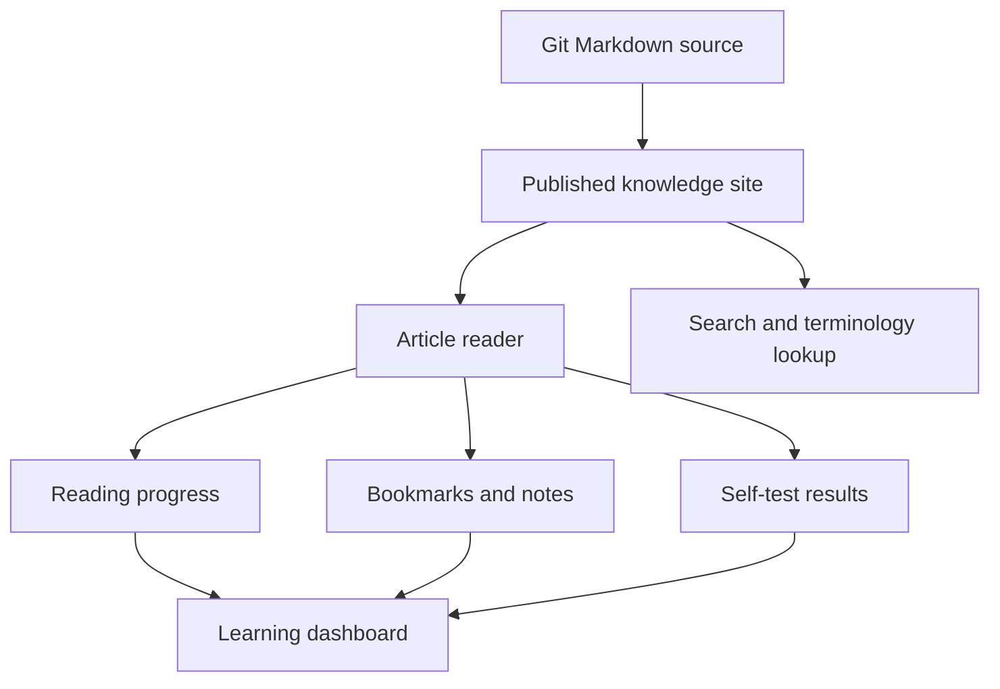

# Personal Agent PM Knowledge Workbench Requirements

## Summary

Build a private personal knowledge website for the Agent PM technical study materials. The site turns the Markdown documents in `agent-pm-tech-knowledge/` into a deployable learning workbench with login, cross-device study state, search, bookmarks, notes, self-tests, and mastery tracking.

---

## Problem Frame

The current materials are strong but text-heavy Markdown files. Reading them one by one is easy to interrupt, hard to resume, and not ideal for repeated interview preparation.

The user wants a personal site that can live on their own server and be opened anytime. The site should preserve the source-of-truth Markdown workflow while making learning feel more like a focused product than a folder of documents.

---

## Key Decisions

- **Personal learning workbench, not a public content platform.** The product serves one primary user preparing for Agent PM interviews, so the first version optimizes for private study speed instead of public growth, registration, or community features.
- **Git-sourced content.** Markdown remains the content source. Updates flow through Git rather than an online editing backend.
- **Single-user login with synced learning data.** The site should require login and sync reading progress, bookmarks, notes, self-test results, and mastery state across devices.
- **Full learning loop in the first version.** Reading, search, bookmarking, note-taking, self-test, weak-point review, and dashboard visibility are all in scope.
- **No online Markdown editor.** Content authoring stays outside the website. The website is for studying and reviewing, not maintaining the source documents.

---

## Actors

- A1. **Learner.** The user who logs in, reads the materials, searches concepts, saves notes, completes self-tests, and reviews weak areas.
- A2. **Content source.** The Git-tracked Markdown files under `agent-pm-tech-knowledge/`.
- A3. **Knowledge website.** The deployed private site that renders content and provides the study experience.
- A4. **Study data store.** The persistence layer that keeps user-specific progress and learning records separate from Markdown content.

---

## Requirements

**Content and publishing**

- R1. The site must publish the Agent PM knowledge materials from `agent-pm-tech-knowledge/` as navigable web pages.
- R2. The site must support the existing 00-15 document set, including `agent-pm-tech-knowledge/INDEX.md` as a natural entry point.
- R3. Git updates to the Markdown source must be able to refresh the published website without requiring online content editing.
- R4. Content refresh must preserve existing study data whenever the same document or section can still be matched.

**Reading experience**

- R5. Each document page must provide a readable article layout with chapter navigation, responsive desktop and mobile behavior, and support for tables, code blocks, links, and diagrams.
- R6. The reader must track per-document reading progress and last-read location.
- R7. The reader must let the learner bookmark important sections or passages.
- R8. The reader must let the learner attach personal notes to a document, section, or selected passage.

**Search and lookup**

- R9. The site must provide full-text search across titles, headings, body text, interview questions, and terminology content.
- R10. Search results must help the learner jump directly to the relevant document and section.
- R11. The site must support terminology lookup as a fast path for reviewing concepts from `agent-pm-tech-knowledge/15-术语表与速查表.md`.

**Learning dashboard**

- R12. The homepage must show continue-reading state, unfinished documents, recent activity, recent bookmarks or notes, weak modules, and a global search entry.
- R13. The dashboard must make it obvious what the learner should do next without forcing a rigid study plan.
- R14. The dashboard must show both document-level progress and topic-level mastery signals.

**Self-test and mastery**

- R15. The site must expose each document's self-test or mastery-check content as an interactive study surface.
- R16. The learner must be able to mark self-test items as mastered, uncertain, or not yet mastered.
- R17. The site must aggregate uncertain and not-yet-mastered items into a weak-point review view.
- R18. Mastery state must sync across devices after login.

**Access and deployment**

- R19. The site must be private by default and require login before exposing content or study data.
- R20. The first version must support one primary user account.
- R21. The site must be deployable on the user's own server.
- R22. The deployed site must separate content updates from user study records so a content redeploy does not wipe learning history.

---

## Key Flows

- F1. Content update flow
  - **Trigger:** The learner updates Markdown locally and pushes the Git repository.
  - **Actors:** A1, A2, A3.
  - **Steps:** The server receives or pulls the updated content, rebuilds or refreshes the searchable site content, and keeps existing study data intact where matching content still exists.
  - **Outcome:** The website shows the latest Markdown content without requiring a web editor.

- F2. Continue learning flow
  - **Trigger:** The learner opens the site after a break.
  - **Actors:** A1, A3, A4.
  - **Steps:** The learner logs in, lands on the dashboard, sees the last-read document and weak modules, and resumes the most relevant study item.
  - **Outcome:** The learner knows where to continue within a few seconds.

- F3. Deep reading flow
  - **Trigger:** The learner opens a document page.
  - **Actors:** A1, A3, A4.
  - **Steps:** The learner navigates chapters, reads the article, bookmarks key passages, adds notes, and the site saves reading position.
  - **Outcome:** The document becomes reviewable later instead of being a one-time read.

- F4. Search and terminology flow
  - **Trigger:** The learner wants to quickly review a concept such as Tool Calling, RAG, eval, memory, or MCP.
  - **Actors:** A1, A3.
  - **Steps:** The learner searches globally or opens terminology lookup, sees ranked matching sections, and jumps into the source document.
  - **Outcome:** The site works as a personal Agent PM reference, not only a linear course.

- F5. Self-test and weak-point review flow
  - **Trigger:** The learner finishes a document or wants to prepare for interview recall.
  - **Actors:** A1, A3, A4.
  - **Steps:** The learner answers or self-rates test items, marks weak items, and later reviews aggregated weak points from the dashboard.
  - **Outcome:** The learner can convert reading into interview-ready retention.

---

## Acceptance Examples

- AE1. Covers R1, R2, R5. Given the site is deployed, when the learner opens the knowledge base, then all 00-15 documents are available as readable pages with working navigation.
- AE2. Covers R6, R12. Given the learner reads half of `agent-pm-tech-knowledge/04-Tool-Calling工具调用.md`, when they return later, then the dashboard shows that document as a continue-reading item.
- AE3. Covers R7, R8. Given the learner finds a useful passage about human-in-the-loop, when they bookmark it and add a note, then the note appears in that document and in a review surface.
- AE4. Covers R9, R10, R11. Given the learner searches for `tool schema`, when results load, then relevant sections from Tool Calling or terminology content are discoverable and jumpable.
- AE5. Covers R15, R16, R17. Given the learner marks several self-test items as not yet mastered, when they open weak-point review, then those items appear grouped by document or topic.
- AE6. Covers R18, R19, R20. Given the learner logs in on another device, when they open the site, then their progress, bookmarks, notes, and mastery state are available.
- AE7. Covers R3, R4, R22. Given Markdown content is updated through Git, when the site refreshes content, then existing study records remain available unless the underlying content can no longer be matched.

---

## Success Criteria

- All 16 core documents are readable from the deployed site.
- The learner can resume a previous reading session after logging in from another device.
- Global search can find concepts across document body text and terminology content.
- Bookmarks, notes, self-test states, and mastery state persist across sessions.
- The dashboard gives a useful next action without needing the learner to remember where they stopped.
- Content can be updated from Git without touching study records.
- The site is private by default and not discoverable as a public content platform.

---

## Scope Boundaries

In scope:

- Private single-user knowledge website.
- Git-sourced Markdown publishing.
- Server deployment.
- Login and cross-device sync.
- Dashboard, reader, search, terminology lookup, bookmarks, notes, self-tests, and mastery tracking.

Out of scope:

- Public registration or multi-user community features.
- Online Markdown editing backend.
- Payment, subscriptions, or content commercialization.
- Team collaboration, shared annotations, or comments.
- AI chat over the knowledge base.
- Mobile native app.

---

## Dependencies and Assumptions

- The Markdown files under `agent-pm-tech-knowledge/` remain the authoritative content source.
- The user has or will provide a server suitable for deploying a small private web app.
- Git-based content refresh is acceptable as the content maintenance workflow.
- Existing self-test and mastery sections inside the Markdown documents are sufficient to seed the first interactive self-test experience.
- Exact deployment mechanism, authentication method, and data persistence approach are planning decisions.

---

## Outstanding Questions

Deferred to planning:

- What server environment, domain, and deployment workflow should be used?
- Should content refresh be automatic on Git push or manually triggered from the server?
- How should bookmarks and notes behave when a Markdown section is renamed or moved?
- Should self-test items be extracted automatically from Markdown, curated manually during build, or both?

---

## Sources

- `agent-pm-tech-knowledge/INDEX.md`
- `agent-pm-tech-knowledge/04-Tool-Calling工具调用.md`
- `agent-pm-tech-knowledge/15-术语表与速查表.md`
- `agent-pm-tech-knowledge/scripts/build-04-html.mjs`
