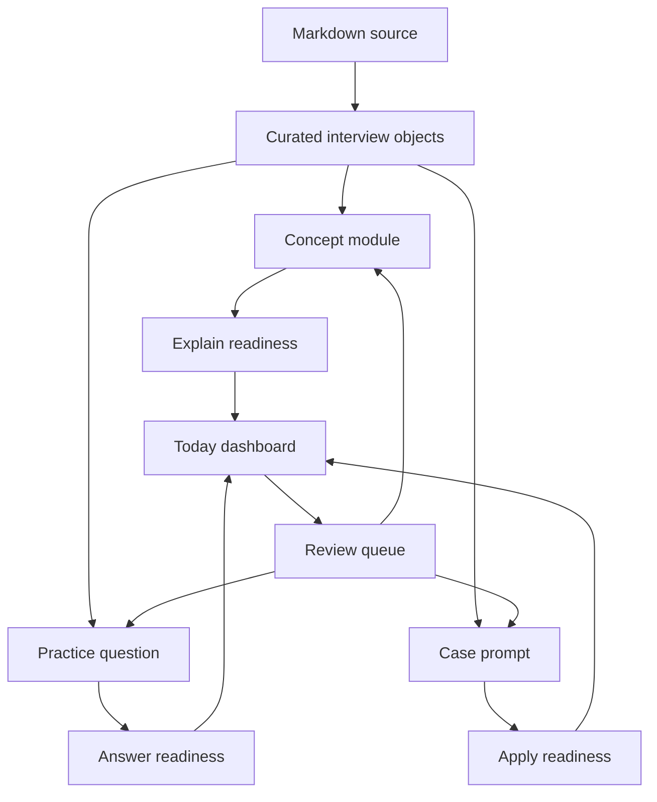

# Agent PM Interview Workbench Redesign Requirements

## Summary

Redesign the current Agent PM knowledge site into an interview preparation product. The product should help the learner build Agent PM technical understanding, convert it into interview-ready answers, practice product design cases, and repeatedly review weak points.

---

## Problem Frame

The current site is not a good interview website. It publishes Markdown as a private knowledge base, but the user's real job is not to read documents. The user needs to prepare for Agent product manager interviews.

That creates a different product problem. Interview preparation requires active recall, answer formation, case practice, feedback loops, and confidence tracking. A document reader can preserve content, but it does not tell the learner what to practice today, how to answer a hard question, or whether they can explain a concept under interview pressure.

The redesign should treat the existing Markdown files as source material, not as the primary user experience.

---

## Market Research Synthesis

Good interview preparation products share a few patterns:

| Product reference | Useful pattern | Implication for this product |
|---|---|---|
| [Exponent PM interview prep](https://www.tryexponent.com/courses/pm) | PM interview prep is organized around interview types, frameworks, examples, and practice. | Agent PM prep should be organized around answerable interview tasks, not document chapters. |
| [PM Exercises](https://www.pmexercises.com/) | Large question banks and practice prompts help PM candidates rehearse common interview formats. | The workbench needs a question bank and answer practice surface. |
| [Google Interview Warmup](https://grow.google/certificates/interview-warmup/) | Practice answers are analyzed for improvement signals without making the user manage raw notes. | The workbench should surface answer-quality feedback and repeated weak phrases. |
| [Hello Interview](https://www.hellointerview.com/) | Strong prep products pair structured lessons with guided practice and mocks. | Learning pages should end in drills and mock-style prompts. |
| [LeetCode Explore](https://leetcode.com/explore/) | Roadmaps, progress, topic grouping, and repeated problem solving create momentum. | Agent PM modules need a visible path, progress state, and practice status. |
| [Quizlet Learn](https://quizlet.com/features/learn) | Flashcard learning works because it uses retrieval, repetition, and confidence states. | Concepts and interview answers should be reviewable through active recall. |

The strongest pattern is that mature prep products are not content libraries. They are practice systems.

---

## Product Thesis

The product should help the user answer this question every time they open it:

> "What should I practice next so I become more interview-ready for Agent PM roles?"

The site succeeds when the user can explain Agent technology from a PM perspective, answer common technical interview questions, handle product design cases, and identify weak spots without rereading long documents.

---

## Key Decisions

- **Practice-first, content-second.** Reading remains available, but the product's main surface is training.
- **Agent PM specific, not generic AI learning.** The site should teach technical concepts only to the depth needed for Agent product interviews.
- **Interview answer as a first-class object.** Each concept should produce a 30-second answer, a deeper answer, and likely follow-up answers.
- **Case practice as a core surface.** Agent PM interviews often test product judgment, not only terminology.
- **Weak-point review over passive completion.** A module is not "done" because the user read it. It is done when the user can answer and apply it.
- **Current documents become raw material.** The 00-15 Markdown set should be reorganized into modules, drills, answer cards, cases, and review items.

---

## Actors

- A1. **Candidate.** The user preparing for Agent PM or AI-native PM interviews.
- A2. **Interview coach surface.** The product layer that turns content into prompts, answer structures, and feedback.
- A3. **Knowledge source.** The Markdown documents under `agent-pm-tech-knowledge/`.
- A4. **Practice state.** The saved progress, answers, confidence ratings, weak points, and review history.

---

## Requirements

**Product positioning and navigation**

- R1. The homepage must present the product as an Agent PM interview preparation workbench, not a document library.
- R2. The primary navigation must expose training surfaces: Today, Knowledge Map, Practice Questions, Case Lab, Review, and Library.
- R3. Library and search must remain available but should be secondary to practice and review.
- R4. Every major page must answer one user question: what to learn, what to practice, what to review, or how to improve.

**Today dashboard**

- R5. The dashboard must show the next best action for the learner, such as "practice Tool Calling follow-ups" or "review weak Eval questions".
- R6. The dashboard must show readiness signals by capability, not only document completion.
- R7. The dashboard must separate reading progress from interview readiness.
- R8. The dashboard must expose quick entry points for one short drill, one case prompt, one weak-point review, and one module continuation.

**Knowledge map**

- R9. The site must show an Agent PM capability map covering LLM basics, Agent basics, architecture, tool calling, RAG, memory, workflow, multi-agent, eval, reliability, safety, productization, and product design cases.
- R10. Each capability must show status across three dimensions: understand, explain, and apply.
- R11. The map must make dependencies visible, such as Tool Calling before workflow orchestration and Eval before reliability trade-offs.

**Module learning page**

- R12. Each module page must replace long article-first reading with an interview-oriented structure.
- R13. Each module must start with a 30-second explanation that the candidate can say in an interview.
- R14. Each module must include PM framing: why the concept matters for product decisions, user value, feasibility, cost, risk, and UX.
- R15. Each module must include a simple visual model or flow diagram when the concept is process-shaped.
- R16. Each module must include common misunderstandings and PM traps.
- R17. Each module must include likely interview questions, strong answer structures, and follow-up prompts.
- R18. The original full reading content must remain accessible after the practice-first module surface.

**Practice question bank**

- R19. The product must provide a question bank grouped by concept, interview type, and difficulty.
- R20. Questions must support at least four types: concept explanation, technical trade-off, product judgment, and scenario debugging.
- R21. Each question must include an answer guide, scoring rubric, common weak answers, and likely follow-ups.
- R22. The candidate must be able to mark each question as confident, uncertain, or weak.

**Case Lab**

- R23. The product must provide Agent PM product design cases, not only technical questions.
- R24. Each case must guide the candidate through problem framing, user segment, MVP, agent architecture, eval, reliability, cost, safety, and success metrics.
- R25. Cases must include examples of strong answer outlines rather than only prompts.
- R26. Cases must connect back to relevant modules so the candidate can repair missing knowledge.

**Review and retention**

- R27. The product must collect weak questions, weak concepts, and unfinished cases into a review queue.
- R28. Review items must use active recall before showing the answer.
- R29. The product must track repeated weakness, not just the latest rating.
- R30. Saved notes must be attached to practice items or concepts, not only document passages.

**Content transformation**

- R31. The existing 16 Markdown documents must be transformed into smaller learning objects: concepts, answer cards, questions, cases, diagrams, terms, and source reading sections.
- R32. The site must preserve source attribution back to the original document and section.
- R33. The content model must allow manual curation because interview answer quality cannot be guaranteed by automatic Markdown splitting alone.

**Design and content presentation**

- R34. The visual design must feel like a focused interview cockpit: dense enough for practice, calm enough for study, and clearly task-oriented.
- R35. The first screen must not look like a blog, article archive, or generic SaaS dashboard.
- R36. Pages must use compact learning cards, answer panels, rubric blocks, progress state, diagrams, and drill controls where they improve comprehension.
- R37. Long prose must be progressively disclosed behind summaries, examples, and practice prompts.
- R38. UI copy must use interview preparation language, not generic knowledge-base labels.

---

## Key Flows

- F1. Today practice flow
  - **Trigger:** The candidate opens the site.
  - **Actors:** A1, A2, A4.
  - **Steps:** The dashboard shows readiness, weak points, and one recommended drill. The candidate starts a short practice item, answers it, checks the guide, and updates confidence.
  - **Outcome:** The candidate makes progress without deciding where to go.

- F2. Module mastery flow
  - **Trigger:** The candidate opens a module such as Tool Calling.
  - **Actors:** A1, A2, A3, A4.
  - **Steps:** The module shows a 30-second answer, PM framing, visual model, traps, interview questions, and source reading. The candidate practices follow-ups and rates confidence.
  - **Outcome:** The candidate can explain the concept in interview language.

- F3. Case practice flow
  - **Trigger:** The candidate starts an Agent PM design case.
  - **Actors:** A1, A2, A4.
  - **Steps:** The product prompts for product goal, user, MVP, agent architecture, eval, risk, and metrics. The candidate compares their outline with a strong answer structure.
  - **Outcome:** The candidate practices product judgment, not only technical recall.

- F4. Weak-point repair flow
  - **Trigger:** The candidate marks questions or concepts as weak.
  - **Actors:** A1, A2, A4.
  - **Steps:** The review queue resurfaces weak items, hides the answer first, asks the candidate to recall, then links back to explanation and source reading.
  - **Outcome:** Weakness becomes a targeted study queue.

---

## Information Architecture

| Surface | Primary job |
|---|---|
| Today | Decide what the candidate should practice now. |
| Knowledge Map | Show Agent PM capability coverage and readiness. |
| Module | Teach one concept in interview-ready form. |
| Practice Questions | Train concept explanation, trade-offs, and follow-ups. |
| Case Lab | Train Agent PM product design answers. |
| Review | Repair weak points through active recall. |
| Library | Preserve full source documents for deep reading. |
| Glossary | Fast lookup for terms and definitions. |

---

## Acceptance Examples

- AE1. **Covers R1, R5, R8.** Given the candidate opens the homepage, when the page loads, then the first useful action is a practice or review task rather than a document link.
- AE2. **Covers R9, R10, R11.** Given the candidate opens Knowledge Map, when they inspect Tool Calling, then they see separate understand, explain, and apply status plus related dependencies.
- AE3. **Covers R12-R18.** Given the candidate opens Tool Calling, when they scan the page, then they can find a 30-second answer, PM framing, visual model, traps, questions, follow-ups, and source reading.
- AE4. **Covers R19-R22.** Given the candidate opens a practice question, when they reveal the answer guide, then they see scoring criteria, common weak answers, and likely follow-ups.
- AE5. **Covers R23-R26.** Given the candidate starts an Agent lead-generation case, when they complete the prompt, then the product helps them structure MVP, eval, safety, cost, and metrics.
- AE6. **Covers R27-R30.** Given the candidate marks Eval questions as weak several times, when they open Review, then Eval appears as a repeated weakness with active recall prompts.
- AE7. **Covers R31-R33.** Given the source Markdown changes, when content is rebuilt, then curated interview objects can still point back to source sections.

---

## Success Criteria

- The homepage tells the candidate what to practice in under 5 seconds.
- At least 80% of modules have a 30-second answer, PM framing, traps, questions, follow-ups, and review prompts.
- The candidate can practice at least 60 interview questions across concept explanation, trade-off, product judgment, and scenario debugging.
- The candidate can complete at least 8 Agent PM product design cases.
- Every weak item can be reviewed through active recall.
- Reading progress and interview readiness are displayed separately.
- The user no longer needs to open the raw Markdown file to know how to prepare for an interview.

---

## Scope Boundaries

In scope:

- Redesigning the product around interview readiness.
- Turning existing Markdown into curated interview training objects.
- New homepage, knowledge map, module page, practice question bank, case lab, and review queue.
- Personal progress, confidence, weak-point tracking, and answer notes.
- Preserving the full document library as a secondary source-reading surface.

Deferred for later:

- AI-generated answer scoring.
- Voice mock interviews.
- Multi-user accounts.
- Public content publishing.
- Payment or subscription features.
- Community practice or peer matching.

Outside this product's identity:

- A generic AI course site.
- A public blog or article archive.
- A pure flashcard app.
- A LeetCode-style coding platform.

---

## Dependencies and Assumptions

- The user is preparing for Agent PM or AI-native PM interviews.
- The existing `agent-pm-tech-knowledge/` documents remain the starting source material.
- The first redesign can prioritize a strong experience over full automation.
- Manual curation is acceptable for high-value answer cards, cases, and rubrics.
- The site remains private and single-user unless the user later changes the product goal.

---

## Outstanding Questions

Resolve before planning:

- Should the first redesign ship as a full IA change, or should it first prove the new pattern with Today and Tool Calling?
- Should answer practice be self-rated only in v1, or should AI feedback be included immediately?
- What interview target should the content optimize for first: Agent PM, AI Product Manager, or strong technical PM for AI products?

Deferred to planning:

- How should curated interview objects be stored and updated?
- How much of the current reader and search implementation can be reused?
- What is the minimum migration path from the current deployed workbench?

---

## Sources

- Existing requirements: `docs/brainstorms/2026-06-05-personal-agent-pm-knowledge-workbench-requirements.md`
- Current app surfaces: `app/(workbench)/page.tsx`, `components/dashboard/dashboard-overview.tsx`, `components/reader/document-reader.tsx`
- Source content: `agent-pm-tech-knowledge/`
- [Exponent PM interview prep](https://www.tryexponent.com/courses/pm)
- [PM Exercises](https://www.pmexercises.com/)
- [Google Interview Warmup](https://grow.google/certificates/interview-warmup/)
- [Hello Interview](https://www.hellointerview.com/)
- [LeetCode Explore](https://leetcode.com/explore/)
- [Quizlet Learn](https://quizlet.com/features/learn)
