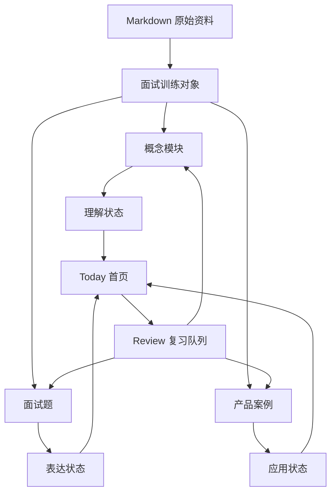

# Agent PM 面试训练工作台重设计 PRD

## Summary

将当前 Agent PM 知识库网站重设计为一个面向面试准备的训练型产品。它不应只是展示 Markdown 文档，而应帮助用户建立 Agent PM 技术理解、形成面试表达、练习产品设计题、追踪薄弱点，并持续提升面试可用能力。

---

## Problem Frame

当前网站不是一个合格的面试准备网站。它把 `agent-pm-tech-knowledge/` 下的 Markdown 内容发布成了可阅读网页，但用户真正要完成的任务不是“读完文档”，而是“准备好 Agent 产品经理面试”。

面试准备和文档阅读是两个不同问题。文档阅读关注信息获取，面试准备关注主动回忆、表达组织、案例拆解、追问应对、弱点修复和信心建立。一个文档库可以保存资料，但无法告诉用户今天应该练什么、某个问题应该怎么答、哪里还讲不清楚、能否在面试压力下说出一个合格答案。

因此，重设计的核心不是继续美化阅读器，而是把现有资料转化为面试训练对象。

---

## Product Thesis

每次用户打开网站，产品都应该回答一个问题：

> 我今天应该练什么，才能更接近一个合格的 Agent PM 面试候选人？

这个产品成功的标志不是用户读完了 16 篇文档，而是用户能用 PM 语言解释 Agent 技术、回答常见技术追问、完成 Agent 产品设计题，并且清楚知道自己的薄弱点在哪里。

---

## Market Research Synthesis

成熟的面试准备产品通常不是资料库，而是训练系统。

| 参考产品 | 值得学习的模式 | 对本产品的启发 |
|---|---|---|
| [Exponent PM interview prep](https://www.tryexponent.com/courses/pm) | 按面试题型、框架、样例和练习组织 PM 面试准备。 | Agent PM 备考应围绕可回答的面试任务组织，而不是围绕文档章节组织。 |
| [PM Exercises](https://www.pmexercises.com/) | 用大量题库和练习提示帮助 PM 候选人反复训练。 | 产品需要题库、答案结构和练习入口。 |
| [Google Interview Warmup](https://grow.google/certificates/interview-warmup/) | 通过模拟回答和反馈信号帮助用户改进表达。 | 产品应关注答案质量、关键词、表达完整度和弱点信号。 |
| [Hello Interview](https://www.hellointerview.com/) | 将结构化课程、练习和 mock interview 结合。 | 每个模块都应该落到练习和模拟追问上。 |
| [LeetCode Explore](https://leetcode.com/explore/) | 路线图、题目、进度和重复练习形成学习动力。 | Agent PM 模块需要可视化路线、状态和练习记录。 |
| [Quizlet Learn](https://quizlet.com/features/learn) | 用主动回忆、重复复习和掌握状态提升记忆。 | 概念和面试回答应该可以被反复召回和复习。 |

共同结论：好的面试产品不是把内容摆出来，而是把内容变成路径、题目、反馈和复习循环。

---

## Key Decisions

- **练习优先，内容其次。** 阅读仍然保留，但默认入口必须是训练、复习和题目。
- **服务 Agent PM 面试，不做泛 AI 课程。** 技术解释只深入到 Agent 产品经理面试真正需要的程度。
- **面试答案是一等对象。** 每个核心概念都应产出 30 秒回答、深入回答、常见追问回答和弱回答示例。
- **产品设计案例是核心能力。** Agent PM 面试不只考术语，还会考需求判断、MVP、架构边界、评测、成本、安全和指标。
- **掌握度不等于阅读进度。** 用户读完一篇文章不代表会答面试题，产品必须区分“看过”和“能说出来”。
- **现有 Markdown 是素材，不是产品结构。** 16 篇文档应被拆解为概念、题目、答案卡、案例、术语、图解和源文档。

---

## Target User

- 正在准备 Agent PM、AI Product Manager 或强技术型 PM 面试的个人用户。
- 已经有一定产品感觉，但需要补齐 Agent 技术理解和技术表达能力。
- 不希望只看长文，希望通过结构化训练快速形成面试可用表达。
- 需要一个私人备考空间，能保存进度、错题、笔记和薄弱点。

---

## Core Job To Be Done

当用户准备 Agent PM 面试时，他需要一个系统帮助自己把分散的 Agent 技术知识转化为可在面试中说出口的答案、案例分析和产品判断，而不是继续堆积更多资料。

---

## Information Architecture

| 页面 | 核心任务 |
|---|---|
| Today | 告诉用户今天最应该练什么。 |
| Knowledge Map | 展示 Agent PM 能力地图和掌握状态。 |
| Module | 用面试视角学习一个概念。 |
| Practice Questions | 练习技术解释、追问、权衡和场景判断。 |
| Case Lab | 练习 Agent PM 产品设计题。 |
| Review | 用主动回忆修复薄弱点。 |
| Library | 保留完整源文档，作为深度阅读入口。 |
| Glossary | 快速查术语和高频概念。 |

---

## Requirements

**产品定位与导航**

- R1. 首页必须呈现为 Agent PM 面试训练工作台，而不是文档库首页。
- R2. 一级导航必须突出训练入口：Today、Knowledge Map、Practice Questions、Case Lab、Review、Library。
- R3. Library 和 Search 必须保留，但不能成为产品的主体验。
- R4. 每个核心页面都必须服务一个明确任务：今天练什么、学什么、答什么、复习什么、哪里变强。

**Today 首页**

- R5. 首页必须在 5 秒内告诉用户下一步最值得做什么。
- R6. 首页必须展示面试准备状态，而不只是文档阅读进度。
- R7. 首页必须区分阅读进度、概念理解、表达能力和案例应用能力。
- R8. 首页必须提供四个快速入口：一个短练习、一个案例题、一个薄弱点复习、一个继续学习模块。
- R9. 首页文案必须使用面试训练语言，例如“练习 Tool Calling 追问”，而不是“继续阅读文档”。

**Knowledge Map 能力地图**

- R10. 产品必须提供 Agent PM 能力地图，覆盖 LLM 基础、Agent 基础、架构、Tool Calling、RAG、Memory、Workflow、Multi-Agent、Eval、稳定性成本、安全合规、产品化和产品设计题。
- R11. 每个能力点必须展示三个状态：理解、能解释、能应用。
- R12. 能力点之间必须体现依赖关系，例如 Tool Calling 影响 Workflow，Eval 影响稳定性和产品指标。
- R13. 能力地图必须帮助用户发现薄弱区域，而不是只展示目录。

**Module 模块页**

- R14. 模块页必须从长文阅读改为面试训练结构。
- R15. 每个模块开头必须提供一个可以直接在面试中说的 30 秒回答。
- R16. 每个模块必须提供 PM 视角解释：为什么这个概念影响产品价值、用户体验、技术可行性、成本、风险和指标。
- R17. 每个模块必须在适合时提供简单图解或流程图。
- R18. 每个模块必须列出常见误区和 PM 容易踩的坑。
- R19. 每个模块必须包含常见面试题、强答案结构、弱答案示例和可能追问。
- R20. 原始完整阅读内容必须保留，但应放在训练结构之后或作为展开阅读。

**Practice Questions 题库**

- R21. 产品必须提供题库，并按概念、题型和难度组织。
- R22. 题型至少包括概念解释题、技术权衡题、产品判断题和场景诊断题。
- R23. 每道题必须包含答案框架、评分标准、常见弱回答和可能追问。
- R24. 用户必须能将题目标记为熟练、不确定或薄弱。
- R25. 题库必须能反向关联到模块和源文档，方便补课。

**Case Lab 案例训练**

- R26. 产品必须提供 Agent PM 产品设计案例，而不是只提供技术问答。
- R27. 每个案例必须引导用户完成问题定义、用户细分、MVP、Agent 架构、工具调用、评测、稳定性、成本、安全和成功指标。
- R28. 每个案例必须提供强答案大纲，而不是只给一个题目。
- R29. 案例必须能关联相关模块，例如 Eval、Tool Calling、Workflow、Safety。
- R30. 案例练习结果必须进入用户的能力状态和复习系统。

**Review 复习系统**

- R31. 产品必须把薄弱题目、薄弱概念和未完成案例汇总到复习队列。
- R32. 复习必须先让用户主动回忆，再展示答案。
- R33. 产品必须记录重复薄弱，而不是只看最近一次标记。
- R34. 用户笔记必须能绑定到概念、题目、案例和模块，而不只是文档段落。
- R35. 复习队列必须能按能力点聚合，例如“Eval 解释弱”“Tool Calling 追问弱”“Case 指标弱”。

**内容改造**

- R36. 现有 16 篇 Markdown 必须被转化为更小的学习对象：概念卡、答案卡、题目、案例、图解、术语和源文档片段。
- R37. 每个学习对象必须保留与原始文档和章节的来源关系。
- R38. 内容改造必须支持人工策划，因为面试答案质量不能完全依赖自动切分。
- R39. 第一版内容不追求全自动生成，优先保证高频模块和高频题目的质量。

**视觉与信息呈现**

- R40. 视觉设计必须像一个专注的面试训练台，而不是博客、资料库或普通 SaaS 看板。
- R41. 首屏必须有明确的训练任务、状态反馈和下一步行动。
- R42. 页面应使用紧凑学习卡、答案面板、评分 rubric、能力状态、图解和练习控件。
- R43. 长文必须被摘要、例子、题目和展开阅读逐层组织，不能默认铺满屏幕。
- R44. UI 文案必须服务面试准备，避免“知识库”“文档”“阅读器”成为主叙事。

---

## Key Flows

- F1. Today 练习流
  - **Trigger:** 用户打开网站。
  - **Actors:** A1, A2, A4。
  - **Steps:** 首页展示当前能力状态、薄弱点和一个推荐练习。用户进入短练习，先回答，再查看答案框架，并更新掌握状态。
  - **Outcome:** 用户不用自己决定从哪里开始，也能完成一次有效训练。

- F2. 模块掌握流
  - **Trigger:** 用户打开 Tool Calling、RAG 或 Eval 等模块。
  - **Actors:** A1, A2, A3, A4。
  - **Steps:** 模块展示 30 秒回答、PM 视角、图解、常见误区、面试题和追问。用户练习后标记信心。
  - **Outcome:** 用户能把概念讲成面试可用答案，而不是只知道定义。

- F3. 案例训练流
  - **Trigger:** 用户进入一个 Agent PM 产品设计案例。
  - **Actors:** A1, A2, A4。
  - **Steps:** 产品引导用户依次思考用户、痛点、MVP、Agent 方案、评测、成本、安全和指标。用户完成后对照强答案大纲。
  - **Outcome:** 用户训练产品判断和技术边界表达。

- F4. 薄弱点修复流
  - **Trigger:** 用户多次将题目或概念标记为薄弱。
  - **Actors:** A1, A2, A4。
  - **Steps:** Review 页面聚合薄弱点，先隐藏答案让用户回忆，再展示答案结构，并链接回相关模块。
  - **Outcome:** 薄弱点被转化为下一轮训练任务。

---

## Page-Level Product Shape

### Today

Today 是默认首页，不是欢迎页，也不是文档列表。它应该展示：

- 今天推荐练习
- 当前面试准备状态
- 最弱的 3 个能力点
- 一个 5 分钟短题
- 一个案例题入口
- 一个继续学习模块
- 最近复习结果

### Knowledge Map

Knowledge Map 是用户的 Agent PM 能力雷达。它应该展示：

- Agent PM 核心能力图谱
- 每个能力的理解、解释、应用状态
- 依赖关系
- 推荐补课路径
- 与题库和案例的关联

### Module

Module 是概念学习页。推荐结构：

- 30 秒面试回答
- 一句话定义
- PM 为什么要懂
- 工作流程或架构图
- 面试高频问法
- 强答案结构
- 常见弱回答
- 可能追问
- 产品设计中的应用
- 自测题
- 展开阅读

### Practice Questions

Practice Questions 是题库页。它应该支持：

- 按模块筛选
- 按题型筛选
- 按难度筛选
- 按掌握状态筛选
- 先答题再看答案
- 标记熟练、不确定、薄弱
- 查看评分标准和追问

### Case Lab

Case Lab 是产品设计题训练区。它应该支持：

- Agent 产品场景题
- 结构化作答引导
- 强答案大纲
- 常见遗漏点
- 关联知识模块
- 练习记录和复盘

### Review

Review 是复习系统。它应该支持：

- 薄弱概念复习
- 薄弱题目复习
- 薄弱案例复习
- 主动回忆模式
- 重复薄弱统计
- 按能力点聚合

---

## Example: Tool Calling Module Shape

Tool Calling 不应该只是长文。它应该被呈现为：

1. **30 秒回答**
   - Tool Calling 是让 LLM 通过结构化参数调用外部工具，从“会聊天”变成“能执行任务”的关键机制。

2. **PM 为什么要懂**
   - 它决定 Agent 能做什么、哪些步骤可自动化、哪里需要人工确认、失败成本在哪里、权限边界怎么设计。

3. **核心流程**
   - 用户意图 → 模型判断是否需要工具 → 生成参数 → 工具执行 → 返回结果 → 模型继续推理或输出。

4. **面试高频问题**
   - Tool Calling 和普通 API 调用有什么区别？
   - 为什么 Tool Calling 会失败？
   - PM 如何判断一个功能适不适合用 Tool Calling？
   - 什么时候必须加入 human-in-the-loop？

5. **强答案结构**
   - 先定义机制，再解释价值，再讲风险，最后落到产品设计判断。

6. **常见弱回答**
   - “就是让模型调用接口。”这个回答太浅，没有讲清楚 schema、参数、权限、失败处理和产品边界。

7. **产品设计应用**
   - 在销售线索 Agent 中，Tool Calling 可以用于查公司、找联系人、写触达理由，但发送消息前可能需要人工确认。

---

## Acceptance Examples

- AE1. **Covers R1, R5, R8.** 用户打开首页后，5 秒内能看到一个明确的推荐练习，而不是先看到文档列表。
- AE2. **Covers R10-R13.** 用户打开 Knowledge Map 后，能看出 Tool Calling、Workflow、Eval 之间的依赖和自己的掌握状态。
- AE3. **Covers R14-R20.** 用户打开 Tool Calling 模块后，能直接看到 30 秒回答、PM 视角、图解、面试题、追问和展开阅读。
- AE4. **Covers R21-R25.** 用户练一道题后，能先作答，再看到答案框架、评分标准、弱回答和追问。
- AE5. **Covers R26-R30.** 用户完成一个 Agent 线索生成案例后，能复盘 MVP、工具调用、评测、成本、安全和指标。
- AE6. **Covers R31-R35.** 用户多次标记 Eval 相关题目为薄弱后，Review 页面能把 Eval 作为重复薄弱点展示。
- AE7. **Covers R36-R39.** 内容重建后，训练对象仍能追溯到原始 Markdown 章节。

---

## Success Criteria

- 首页能在 5 秒内告诉用户今天应该练什么。
- 至少 80% 的核心模块具备 30 秒回答、PM 视角、误区、题目、追问和复习提示。
- 题库至少包含 60 道 Agent PM 面试题，覆盖概念解释、技术权衡、产品判断和场景诊断。
- Case Lab 至少包含 8 个 Agent PM 产品设计案例。
- 每个薄弱项都能通过主动回忆进入 Review。
- 阅读进度和面试准备度在 UI 中被明确区分。
- 用户不需要打开原始 Markdown，也能知道如何准备面试。

---

## Scope Boundaries

In scope:

- 将产品定位从知识库改为面试训练工作台。
- 重做 Today、Knowledge Map、Module、Practice Questions、Case Lab 和 Review。
- 将 Markdown 内容拆成概念、题目、答案卡、案例和复习对象。
- 保存个人进度、掌握状态、弱点和笔记。
- 保留完整 Library 作为源文档阅读入口。

Deferred for later:

- AI 自动评分。
- 语音 mock interview。
- 多用户账号。
- 公开内容发布。
- 付费订阅。
- 社区练习和互评。

Outside this product's identity:

- 泛 AI 课程网站。
- 公共博客或文章归档。
- 纯闪卡应用。
- LeetCode 式刷题平台。

---

## Dependencies and Assumptions

- 用户正在准备 Agent PM、AI PM 或强技术型 PM 面试。
- `agent-pm-tech-knowledge/` 仍然是第一批内容来源。
- 第一版可以接受人工策划内容，以保证面试答案质量。
- 产品仍然是私人单用户工具。
- 现有阅读器、搜索和进度能力可以作为底层能力复用，但不能继续主导信息架构。

---

## Outstanding Questions

Resolve before planning:

- 第一版应该完整改 IA，还是先用 Today 和 Tool Calling 模块验证新范式？
- v1 是否只做自评，还是立即加入 AI 答案反馈？
- 内容优先面向 Agent PM、AI Product Manager，还是强技术型 PM？

Deferred to planning:

- 训练对象应该如何存储和更新？
- 当前阅读器、搜索、进度系统哪些能复用？
- 当前已部署版本如何平滑迁移？
- 如何批量把 16 篇文档拆成高质量面试训练对象？

---

## Sources

- Existing requirements: `docs/brainstorms/2026-06-05-personal-agent-pm-knowledge-workbench-requirements.md`
- Current app surfaces: `app/(workbench)/page.tsx`, `components/dashboard/dashboard-overview.tsx`, `components/reader/document-reader.tsx`
- Source content: `agent-pm-tech-knowledge/`
- [Exponent PM interview prep](https://www.tryexponent.com/courses/pm)
- [PM Exercises](https://www.pmexercises.com/)
- [Google Interview Warmup](https://grow.google/certificates/interview-warmup/)
- [Hello Interview](https://www.hellointerview.com/)
- [LeetCode Explore](https://leetcode.com/explore/)
- [Quizlet Learn](https://quizlet.com/features/learn)
