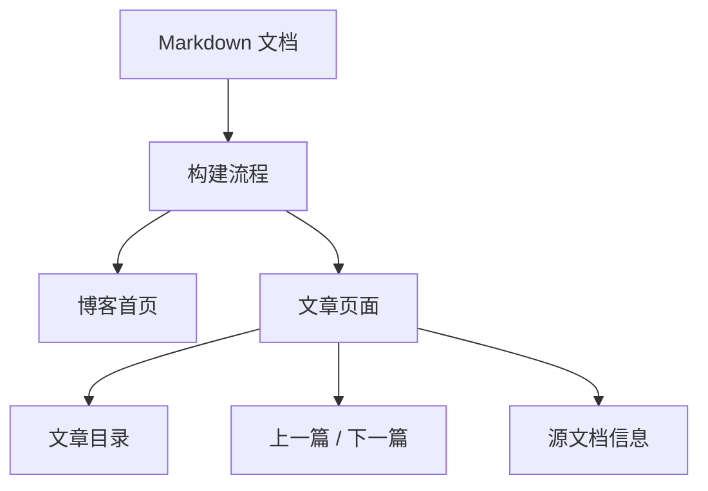

# Agent PM Markdown 博客资料站 PRD

## Summary

建设一个简单、清爽、好阅读的个人博客资料站，用来展示已经整理好的 Agent PM Markdown 文档。网站的核心目标是把 `agent-pm-tech-knowledge/` 里的资料以网页形式呈现出来，方便随时访问、阅读、分享和维护，不做复杂学习系统。

---

## Problem Frame

当前资料主要以 Markdown 文件形式存在。Markdown 适合编辑和沉淀内容，但不适合长期作为阅读入口：文件列表不够直观，阅读体验不稳定，手机访问不方便，也不利于部署到个人服务器后随时查看。

用户现在不需要一个复杂的面试训练产品，也不需要账号、进度、题库、笔记、弱点复习等功能。用户真正想要的是一个像博客一样的网站，把整理好的内容漂亮、清楚、稳定地展示出来。

因此，本项目的产品边界应回到最小可用资料站：内容来自 Markdown，网站负责组织、排版、导航和部署。

---

## Product Positioning

这是一个个人 Agent PM 技术资料博客站。

它不是：

- 面试训练系统
- 在线课程平台
- 知识库 SaaS
- 多用户社区
- 笔记软件

它是：

- 一个公开或半公开可访问的资料展示网站
- 一个把 Markdown 内容变成网页的阅读入口
- 一个便于后续持续更新内容的个人博客站

---

## Key Decisions

- **Markdown 仍然是内容源。** 用户继续用 Markdown 整理资料，网站只负责展示。
- **功能从简。** 第一版不做登录、数据库、学习进度、收藏、评论、题库和 AI 功能。
- **阅读体验优先。** 文章页排版、目录、代码块、表格、移动端阅读体验比复杂交互更重要。
- **首页像博客，不像后台系统。** 首页应该展示文章列表、分类入口和最近更新，而不是 dashboard。
- **可部署到个人服务器。** 网站应能稳定部署在用户自己的服务器上。
- **后续可扩展，但第一版不提前复杂化。** 先把内容站做好，再决定是否加入搜索、订阅、评论或训练功能。

---

## Target User

- A1. **站点所有者。** 负责整理 Agent PM Markdown 内容，并希望把资料部署成网站。
- A2. **阅读者。** 可能是用户本人，也可能是用户分享链接后访问的人。
- A3. **内容源。** `agent-pm-tech-knowledge/` 下的 Markdown 文档。

---

## Requirements

**内容展示**

- R1. 网站必须展示 `agent-pm-tech-knowledge/` 中已经整理好的 Markdown 文档。
- R2. 网站必须支持当前 00-15 共 16 篇核心文档。
- R3. 每篇 Markdown 文档必须生成一个独立文章页面。
- R4. 文章页面必须保留 Markdown 中的标题、列表、表格、代码块、引用、链接和 Mermaid 图表。
- R5. 文章页面必须显示更新时间或来源信息，帮助读者判断内容版本。

**首页**

- R6. 首页必须像博客首页，展示站点标题、简介、文章列表和最近更新。
- R7. 首页必须让用户快速进入 16 篇核心文档。
- R8. 首页必须避免复杂 dashboard、学习指标或训练任务。
- R9. 首页可以展示推荐阅读顺序，但不能把它做成强制学习计划。

**导航与结构**

- R10. 网站必须提供清晰的文章目录或侧边栏导航。
- R11. 文章必须按主题或编号排序，保持与现有 Markdown 资料结构一致。
- R12. 文章页必须提供当前文章内的目录，方便跳转到二级和三级标题。
- R13. 网站必须提供上一篇和下一篇导航。
- R14. 网站必须提供返回首页或文章列表的入口。

**阅读体验**

- R15. 文章页必须有良好的中文阅读排版，包括合适的行宽、字号、行距和标题层级。
- R16. 桌面端阅读时，正文、文章目录和站点导航必须布局清晰。
- R17. 移动端阅读时，正文必须优先，导航可以折叠。
- R18. 长文阅读时，页面不能显得拥挤或像后台管理系统。
- R19. 代码块和表格必须在移动端可横向滚动，不能撑破页面。

**视觉风格**

- R20. 网站视觉应简洁、克制、偏博客和技术手册风格。
- R21. 颜色、字体和间距应服务阅读，不追求复杂动效。
- R22. 页面不应使用过多卡片、面板、数据指标和学习状态组件。
- R23. 首屏必须明确传达“Agent PM 技术资料博客”这个定位。

**内容维护**

- R24. 新增 Markdown 文档后，网站应能通过构建流程自动生成对应文章页。
- R25. 修改 Markdown 内容后，重新构建即可更新网站。
- R26. 内容组织应尽量沿用现有文件名、编号和 `INDEX.md`。
- R27. 网站不需要在线编辑功能。

**部署**

- R28. 网站必须能部署到用户自己的服务器。
- R29. 第一版应尽量减少运行时依赖，优先保证稳定访问。
- R30. 部署后访问路径必须稳定，文章链接不应频繁变化。

---

## Nice To Have

这些功能可以做，但不应该影响第一版上线：

- N1. 全站搜索。
- N2. 标签或分类筛选。
- N3. 深色模式。
- N4. 阅读进度条。
- N5. RSS feed。
- N6. 站点地图。
- N7. 复制代码按钮。

---

## Key Flows

- F1. 阅读首页流程
  - **Trigger:** 用户打开网站。
  - **Actors:** A1, A2。
  - **Steps:** 用户看到站点标题、简介、文章列表和最近更新，点击一篇文档进入阅读。
  - **Outcome:** 用户能快速找到想读的资料。

- F2. 阅读文章流程
  - **Trigger:** 用户打开某篇 Agent PM 文档。
  - **Actors:** A2。
  - **Steps:** 用户阅读正文，通过文章目录跳转章节，通过上一篇/下一篇继续浏览。
  - **Outcome:** 用户获得稳定、舒适的长文阅读体验。

- F3. 内容更新流程
  - **Trigger:** 用户修改或新增 Markdown 文件。
  - **Actors:** A1, A3。
  - **Steps:** 用户更新 Markdown，重新构建网站，部署到服务器。
  - **Outcome:** 网站展示最新资料，不需要在线后台。

---

## Information Architecture

| 页面 | 作用 |
|---|---|
| 首页 | 展示站点定位、简介、最近更新和文章列表。 |
| 文章列表页 | 展示全部 Markdown 文档，可按编号或主题排序。 |
| 文章详情页 | 展示 Markdown 转换后的正文内容。 |
| 关于页 | 简单说明站点用途和内容来源。 |

第一版可以把首页和文章列表页合并，减少页面数量。

---

## Acceptance Examples

- AE1. **Covers R1-R4.** 给定网站完成构建，当用户打开文章列表时，能看到当前 16 篇 Agent PM Markdown 文档。
- AE2. **Covers R6-R9.** 给定用户打开首页，页面展示博客标题、简介、最近更新和文章入口，不出现训练任务或学习 dashboard。
- AE3. **Covers R10-R14.** 给定用户打开任意文章，页面提供文章内目录、上一篇/下一篇和返回首页入口。
- AE4. **Covers R15-R19.** 给定用户在手机上打开长文，正文排版清晰，表格和代码块不会撑破页面。
- AE5. **Covers R24-R27.** 给定用户新增一篇 Markdown 文档，重新构建后网站能出现对应文章页。
- AE6. **Covers R28-R30.** 给定网站部署到用户服务器，用户可以通过固定 URL 访问首页和文章详情页。

---

## Success Criteria

- 16 篇核心 Markdown 文档都能以网页形式访问。
- 首页能清楚表达这是 Agent PM 技术资料博客。
- 用户能在 5 秒内找到文章入口。
- 文章页适合长时间阅读，不像后台系统或复杂产品界面。
- 手机端阅读体验可用。
- 修改 Markdown 后能通过重新构建更新网站。
- 第一版不引入账号、数据库、题库、学习进度、评论等复杂功能。

---

## Scope Boundaries

In scope:

- Markdown 文档展示。
- 博客首页。
- 文章列表。
- 文章详情页。
- 文章目录。
- 上一篇/下一篇导航。
- 基础响应式阅读体验。
- 部署到个人服务器。

Deferred for later:

- 全站搜索。
- 标签和分类体系。
- RSS。
- 深色模式。
- 评论。
- 登录。
- 阅读进度。
- 收藏。

Out of scope:

- 面试训练系统。
- 题库和案例练习。
- AI 问答。
- 用户账号体系。
- 后台 CMS。
- 在线 Markdown 编辑器。
- 多用户协作。
- 付费订阅。

---

## Dependencies and Assumptions

- `agent-pm-tech-knowledge/` 是内容来源。
- 现有 Markdown 文档结构基本可复用。
- 用户愿意继续通过本地文件维护内容。
- 第一版优先做静态或近静态资料展示，不追求复杂交互。
- 网站部署在用户自己的服务器上。

---

## Outstanding Questions

Resolve before planning:

- 网站是否需要公开访问，还是只给自己用但不登录？
- 第一版是否需要全站搜索，还是先只做目录和文章列表？
- 视觉风格更偏“个人博客”还是“技术手册”？

Deferred to planning:

- Markdown 到网页的具体构建方式。
- Mermaid、代码高亮和表格的渲染方案。
- 部署路径和域名配置。
- 是否沿用当前 Next.js 项目，还是改成更轻量的静态站点结构。

---

## Sources

- `agent-pm-tech-knowledge/`
- `agent-pm-tech-knowledge/INDEX.md`
- `docs/brainstorms/2026-06-05-personal-agent-pm-knowledge-workbench-requirements.md`
- `docs/brainstorms/2026-06-10-agent-pm-interview-workbench-redesign-requirements.zh.md`
