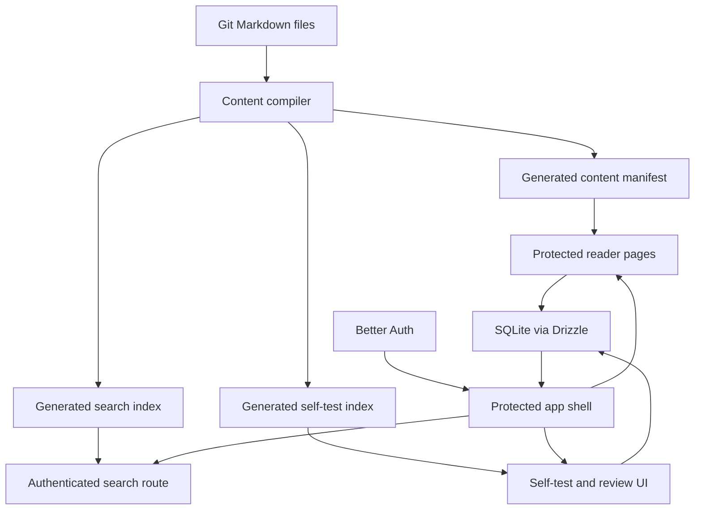
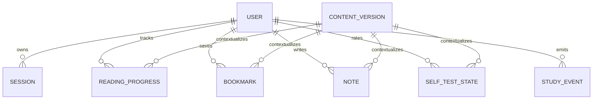

# feat: Build personal Agent PM knowledge workbench

## Summary

Build a private, self-hosted learning workbench that turns `agent-pm-tech-knowledge/` Markdown into a login-protected study site. The app will provide a dashboard, article reader, full-text search, terminology lookup, bookmarks, notes, self-test state, mastery tracking, and Git-based content refresh.

---

## Problem Frame

The repository currently contains high-quality Agent PM study Markdown and one single-document HTML prototype. That prototype proves the desired reading feel, but it is not a deployable, synced learning system.

The implementation should preserve Markdown as the content source while adding a small full-stack app for private access and server-side learning data. The plan follows the brainstorm scope in `docs/brainstorms/2026-06-05-personal-agent-pm-knowledge-workbench-requirements.md`.

---

## Requirements

**Content and publishing**

- R1. The app publishes the 00-15 Markdown documents from `agent-pm-tech-knowledge/` as protected web pages.
- R2. The content build extracts document metadata, headings, sections, diagrams, tables, self-test items, mastery standards, and terminology entries.
- R3. Git-sourced content refresh rebuilds generated content and search data without requiring an online Markdown editor.
- R4. Content updates preserve study data through stable document, section, passage, and self-test identifiers where possible.

**Private learning app**

- R5. The app requires login before showing content or study data.
- R6. The first version supports one primary user account with server-side session persistence.
- R7. Reading progress, bookmarks, notes, self-test status, mastery state, and activity history sync across devices.

**Reader and study workflow**

- R8. The document reader supports responsive article layout, table rendering, code blocks, Mermaid diagrams, chapter navigation, progress tracking, bookmark actions, and note actions.
- R9. The dashboard surfaces continue-reading state, unfinished modules, weak points, recent bookmarks or notes, and global search.
- R10. Self-test items can be marked as mastered, uncertain, or not yet mastered, and weak items aggregate into a review view.

**Search and lookup**

- R11. Global search covers document titles, headings, section text, interview questions, and terminology content.
- R12. Search results jump to the relevant document section without exposing content through public static search assets.
- R13. Terminology lookup provides a fast concept-review path seeded from `agent-pm-tech-knowledge/15-术语表与速查表.md`.

**Deployment and operations**

- R14. The app can be deployed on the user's own server as a Node.js service behind a reverse proxy.
- R15. Deployment separates generated content artifacts from persistent user study data.
- R16. The server supports both automated Git refresh and a manual refresh fallback.

---

## Key Technical Decisions

- **KTD1. Use a self-hosted Next.js App Router app.** The project needs protected pages, server mutations, route handlers, and simple deployment on a personal server. Next.js supports self-hosting as a Node service and the official docs recommend a reverse proxy such as nginx in front of it.
- **KTD2. Keep Markdown as source and generate structured content at build time.** The app should not parse large Markdown documents ad hoc on every request. A content compiler will create a typed manifest, rendered article data, section index, terminology index, and self-test index, with a source-controlled override file for extraction corrections.
- **KTD3. Render private content through authenticated app routes.** A purely static public documentation site would be easier, but it conflicts with the private-by-default requirement. Reader pages, search results, and generated indexes should only be available after authentication.
- **KTD4. Use Better Auth with Drizzle and SQLite for the personal server.** Better Auth provides email/password and session handling, Drizzle has a SQLite path, and SQLite is enough for a single-user private app while remaining easy to back up.
- **KTD5. Search runs server-side over a generated section index.** Pagefind is strong for public static sites, but a static search bundle can expose private content if served publicly. Server-side Fuse.js-style weighted search over generated sections keeps private content behind auth.
- **KTD6. Study data uses stable content IDs plus excerpts as fallback anchors.** Markdown headings may change during Git updates. Records should store stable slugs and hashes where possible, plus selected text or excerpt fallback for bookmarks and notes.
- **KTD7. Reuse the 04 HTML prototype as design direction, not architecture.** `agent-pm-tech-knowledge/scripts/build-04-html.mjs` should inform typography, layout, and reader affordances, but the new app should use reusable components and a shared design system.
- **KTD8. Treat content refresh as deployment behavior.** The app should support webhook-triggered or manually triggered rebuild/restart, but it should not become an online content management system.

---

## High-Level Technical Design





---

## Alternatives Considered

- **Static HTML plus Pagefind.** This would be fast to ship, but static search assets can expose private content unless every asset path is protected. It also does not naturally solve login-synced study data.
- **Full CMS with online Markdown editing.** This would centralize authoring, but it violates the brainstorm boundary that Markdown stays Git-sourced and would add maintenance cost.
- **Browser-only local storage.** This would keep deployment simple, but it fails the cross-device sync requirement.
- **External hosted database first.** This would simplify backups later, but local SQLite is a better first fit for a single-user server and can be migrated if usage grows.

---

## Page Structure

- `/login` — email/password login for the primary user.
- `/` — learning dashboard with continue reading, weak points, recent bookmarks, notes, and search entry.
- `/library` — document list following the recommended order from `agent-pm-tech-knowledge/INDEX.md`.
- `/docs/[slug]` — article reader with table of contents, progress, bookmarks, notes, self-test entry, and study rail.
- `/search` — global search UI backed by authenticated server-side search.
- `/terms` — terminology lookup and category browsing from the terminology document.
- `/review` — weak-point review from uncertain and not-yet-mastered self-test items.
- `/bookmarks` — saved passages and notes across documents.
- `/settings` — account, content version, refresh status, and backup/export controls.

---

## Data Model

Better Auth owns its user, session, account, and verification tables. Application tables should be separate and keyed by Better Auth user IDs.

| Table | Purpose | Key fields |
|---|---|---|
| `content_versions` | Tracks generated content snapshots. | `id`, `gitSha`, `contentHash`, `generatedAt`, `documentCount` |
| `reading_progress` | Stores document and section progress. | `userId`, `documentSlug`, `sectionId`, `scrollPercent`, `completedPercent`, `lastReadAt`, `contentVersionId` |
| `bookmarks` | Stores saved passages or sections. | `userId`, `documentSlug`, `sectionId`, `anchorId`, `excerpt`, `createdAt`, `contentVersionId` |
| `notes` | Stores personal notes tied to documents or passages. | `userId`, `documentSlug`, `sectionId`, `anchorId`, `selectedText`, `body`, `updatedAt`, `contentVersionId` |
| `self_test_states` | Stores mastery status for extracted questions. | `userId`, `itemId`, `documentSlug`, `status`, `updatedAt`, `contentVersionId` |
| `study_events` | Supports dashboard activity and recent actions. | `userId`, `eventType`, `documentSlug`, `sectionId`, `createdAt` |

Generated content artifacts should include:

| Artifact | Purpose |
|---|---|
| `.generated/knowledge/documents.json` | Ordered document manifest and metadata. |
| `.generated/knowledge/sections.json` | Section-level content for rendering and search. |
| `.generated/knowledge/self-tests.json` | Extracted self-test questions and mastery prompts. |
| `.generated/knowledge/terms.json` | Terminology entries and categories. |

---

## Output Structure

```text
app/
  (auth)/
  (workbench)/
  api/
components/
  dashboard/
  layout/
  reader/
  search/
  self-test/
  ui/
db/
  migrations/
  schema.ts
lib/
  auth/
  content/
  db/
  search/
  study/
scripts/
  build-content.mjs
  refresh-content.mjs
  seed-user.mjs
tests/
  content/
  db/
  e2e/
  unit/
.generated/
  knowledge/
```

---

## Implementation Units

### U1. Scaffold the full-stack app baseline

- **Goal:** Create the Next.js App Router project structure, TypeScript configuration, styling baseline, test setup, and deployment-oriented build configuration.
- **Requirements:** R5, R8, R14.
- **Dependencies:** None.
- **Files:** `package.json`, `next.config.ts`, `tsconfig.json`, `app/layout.tsx`, `app/globals.css`, `components/ui/`, `tests/unit/`, `tests/e2e/`, `.env.example`.
- **Approach:** Keep the app at the repository root so it can read `agent-pm-tech-knowledge/` directly during content build. Configure standalone-capable output and a design token system derived from the 04 prototype.
- **Patterns to follow:** `agent-pm-tech-knowledge/scripts/build-04-html.mjs` for visual direction and reader affordances.
- **Test scenarios:**
  - App shell renders a basic protected-layout placeholder without hydration errors.
  - Global CSS exposes the reader palette, typography tokens, focus states, and responsive constraints.
  - E2E smoke test opens the app and verifies unauthenticated users are redirected to login.
- **Verification:** The new app can run locally, build without type errors, and show a login boundary.

### U2. Build the Markdown content compiler

- **Goal:** Convert `agent-pm-tech-knowledge/` Markdown into structured generated artifacts for rendering, search, terms, and self-tests.
- **Requirements:** R1, R2, R3, R4, R8, R10, R11, R13.
- **Dependencies:** U1.
- **Files:** `scripts/build-content.mjs`, `lib/content/`, `.generated/knowledge/`, `agent-pm-tech-knowledge/workbench-overrides.json`, `tests/content/build-content.test.ts`.
- **Approach:** Parse Markdown with an AST-based pipeline rather than custom regex. Generate deterministic document slugs, section IDs, heading hierarchy, rendered content data, extracted self-test items, and terminology entries. Preserve Mermaid blocks as renderable diagram blocks.
- **Technical design:** Directional extraction stages: discover ordered docs from `INDEX.md`; parse each file; split by headings; assign stable IDs; classify special sections; apply source-controlled overrides; emit manifest, sections, search records, terms, and tests.
- **Patterns to follow:** Existing Markdown headings and readability conventions in `agent-pm-tech-knowledge/READABILITY-STANDARD.md`.
- **Test scenarios:**
  - Covers AE1. Given all 00-15 Markdown files exist, the compiler emits 16 document records in the index order.
  - Given a document contains Mermaid fences, the generated section preserves diagram blocks without flattening them into plain text.
  - Given a document has `读完自测题`, extracted self-test items include document slug, item text, and stable item ID.
  - Given an override file corrects a self-test or terminology extraction, generated artifacts reflect the override without modifying the source Markdown.
  - Given `15-术语表与速查表.md` contains terminology tables, the compiler emits searchable term entries.
  - Given a heading is renamed but nearby text remains similar, fallback anchor metadata is emitted for later rematching.
- **Verification:** Generated JSON artifacts are deterministic across repeated builds with unchanged content.

### U3. Add authentication, database schema, and persistence foundation

- **Goal:** Add private login, SQLite persistence, Drizzle schema, migrations, and a seed path for the primary user.
- **Requirements:** R5, R6, R7, R14, R15.
- **Dependencies:** U1.
- **Files:** `lib/auth/`, `lib/db/`, `db/schema.ts`, `db/migrations/`, `drizzle.config.ts`, `app/api/auth/[...all]/route.ts`, `scripts/seed-user.mjs`, `tests/db/auth-schema.test.ts`, `tests/e2e/auth.spec.ts`.
- **Approach:** Use Better Auth for email/password and session management. Use Drizzle with SQLite for application data and auth-owned tables. Store secrets and initial user creation inputs in environment variables.
- **Test scenarios:**
  - Covers AE6. A seeded user can log in and receive a persistent session.
  - Unauthenticated access to dashboard, reader, search, terms, review, bookmarks, and settings redirects to login.
  - Auth tables and application tables migrate on an empty SQLite database.
  - Study tables reject records without a valid user relationship.
  - Login failure does not reveal whether an email exists.
- **Verification:** Private routes require session state, and persistent records survive app restart.

### U4. Implement the protected app shell and learning dashboard

- **Goal:** Build the logged-in application shell and dashboard that tells the learner what to do next.
- **Requirements:** R7, R9, R14.
- **Dependencies:** U2, U3.
- **Files:** `app/(workbench)/layout.tsx`, `app/(workbench)/page.tsx`, `components/layout/`, `components/dashboard/`, `lib/study/dashboard.ts`, `tests/unit/dashboard.test.ts`, `tests/e2e/dashboard.spec.ts`.
- **Approach:** Use server-loaded dashboard data for progress, recent notes, bookmarks, weak points, and current content version. Keep the first viewport dense but readable, optimized for repeated study rather than marketing.
- **Test scenarios:**
  - Covers AE2. Given a progress record exists, the dashboard shows the correct continue-reading document and section.
  - Given no progress exists, the dashboard recommends the first unread document from the recommended order.
  - Given weak self-test states exist, the dashboard surfaces weak modules without requiring a search.
  - Given recent bookmarks or notes exist, the dashboard links back to the original section.
  - Mobile viewport stacks dashboard sections without overlapping text or controls.
- **Verification:** A logged-in user can understand current study state from the dashboard without opening a document first.

### U5. Implement the document reader and reading progress

- **Goal:** Build the document reader using generated content, table of contents, responsive article layout, progress tracking, and Mermaid rendering.
- **Requirements:** R1, R2, R7, R8.
- **Dependencies:** U2, U3, U4.
- **Files:** `app/(workbench)/docs/[slug]/page.tsx`, `components/reader/`, `lib/study/progress.ts`, `app/actions/progress.ts`, `tests/unit/reader.test.ts`, `tests/e2e/reader.spec.ts`.
- **Approach:** Render content from generated sections through reusable reader components. Track progress with throttled client events that call authenticated server mutations. Keep section anchors stable and visible for search jumps.
- **Test scenarios:**
  - Covers AE1. Opening each generated document slug renders title, article content, and table of contents.
  - Covers AE2. Scrolling a document updates reading progress and last-read section.
  - Mermaid sections render as diagrams when the client library loads and degrade to readable code when it fails.
  - Tables, code blocks, blockquotes, links, and ordered lists match the readability standard.
  - Unknown document slugs return a private not-found state without leaking generated content lists to unauthenticated users.
- **Verification:** The reader replaces the single-file HTML prototype for every document while preserving the improved reading feel.

### U6. Add bookmarks and notes

- **Goal:** Let the learner save important sections or passages and attach personal notes that sync across devices.
- **Requirements:** R4, R7, R8, R9.
- **Dependencies:** U3, U5.
- **Files:** `components/reader/bookmark-controls.tsx`, `components/reader/note-controls.tsx`, `app/(workbench)/bookmarks/page.tsx`, `app/actions/bookmarks.ts`, `app/actions/notes.ts`, `lib/study/bookmarks.ts`, `lib/study/notes.ts`, `tests/unit/bookmarks-notes.test.ts`, `tests/e2e/bookmarks-notes.spec.ts`.
- **Approach:** Support section-level bookmarking first and selected-passage metadata when browser selection is available. Store excerpt fallback and content version metadata so records remain understandable after Markdown changes.
- **Test scenarios:**
  - Covers AE3. Bookmarking a section from the reader creates a saved item visible on the bookmarks page.
  - Covers AE3. Adding a note to a passage persists the selected text, note body, and source section.
  - Editing and deleting notes only affects the logged-in user's records.
  - When a section ID no longer exists after content refresh, the bookmark still displays its excerpt and document context.
  - Bookmarks and notes created on one browser appear after login in another browser session.
- **Verification:** Saved material becomes a usable review surface, not just a local UI marker.

### U7. Implement global search and terminology lookup

- **Goal:** Add authenticated search across generated sections and a terminology-focused lookup page.
- **Requirements:** R11, R12, R13.
- **Dependencies:** U2, U3, U5.
- **Files:** `app/(workbench)/search/page.tsx`, `app/api/search/route.ts`, `app/(workbench)/terms/page.tsx`, `components/search/`, `lib/search/`, `tests/unit/search.test.ts`, `tests/e2e/search.spec.ts`.
- **Approach:** Build a server-side weighted search index from generated section records. Weight title, heading, terminology, interview-question, and body fields differently. Return section-level hits with snippets and links to anchors.
- **Test scenarios:**
  - Covers AE4. Searching `tool schema` returns Tool Calling and terminology hits with jump links.
  - Searching Chinese terms such as `权限` or `评测` returns relevant sections.
  - Unauthenticated search requests are rejected.
  - Empty or very short queries return guidance rather than expensive full-index results.
  - Terminology lookup can filter or jump by concept category.
- **Verification:** Search works as a private Agent PM reference without exposing a public static search bundle.

### U8. Implement self-test, mastery, and weak-point review

- **Goal:** Convert extracted self-test items into an interactive study loop with mastery status and weak-point review.
- **Requirements:** R7, R9, R10.
- **Dependencies:** U2, U3, U4, U5.
- **Files:** `components/self-test/`, `app/(workbench)/review/page.tsx`, `app/actions/self-test.ts`, `lib/study/mastery.ts`, `tests/unit/self-test.test.ts`, `tests/e2e/self-test.spec.ts`.
- **Approach:** Show self-test items inside document pages and aggregate uncertain or not-yet-mastered items in `/review`. Keep status values simple: `mastered`, `uncertain`, `not_yet`.
- **Test scenarios:**
  - Covers AE5. Marking a self-test item as not yet mastered makes it appear in weak-point review.
  - Changing an item from not yet mastered to mastered removes it from weak-point review.
  - Self-test state is keyed by generated item ID and document slug.
  - Documents without extracted self-test items show a neutral empty state instead of a broken panel.
  - Dashboard mastery totals update after self-test status changes.
- **Verification:** Reading can be converted into recall practice and measurable mastery.

### U9. Add content refresh, deployment, and operations support

- **Goal:** Make the app deployable on the user's server with Git content refresh, persistent database storage, backups, and operational visibility.
- **Requirements:** R3, R4, R14, R15, R16.
- **Dependencies:** U2, U3.
- **Files:** `Dockerfile`, `docker-compose.yml`, `scripts/refresh-content.mjs`, `app/(workbench)/settings/page.tsx`, `lib/content/version.ts`, `tests/unit/content-version.test.ts`, `tests/e2e/settings.spec.ts`, `.env.example`, `.gitignore`.
- **Approach:** Support a server-local refresh process that pulls or receives updated Markdown, rebuilds generated content, records a content version, and restarts or reloads the app. Keep the SQLite database on a persistent volume outside generated build artifacts.
- **Test scenarios:**
  - Covers AE7. Rebuilding generated content with unchanged document slugs preserves progress, bookmarks, notes, and self-test state.
  - Manual refresh records content version metadata visible in settings.
  - If content compilation fails, the previous generated content remains usable and the error is visible in settings.
  - Database file path is configurable and not committed to Git.
  - Docker deployment keeps persistent data mounted outside the image layer.
- **Verification:** The site can be refreshed from Git without wiping learning history.

### U10. Final visual QA, accessibility, and documentation

- **Goal:** Polish the full study experience and document how to run, deploy, refresh, and back up the app.
- **Requirements:** R8, R9, R14, R15, R16.
- **Dependencies:** U1, U4, U5, U6, U7, U8, U9.
- **Files:** `README.md`, `docs/deployment.md`, `tests/e2e/workbench-smoke.spec.ts`, `app/globals.css`, `components/`.
- **Approach:** Run desktop and mobile browser checks for dashboard, reader, search, review, and settings. Ensure focus states, contrast, text wrapping, and empty/error states work. Document the self-hosted operational path.
- **Test scenarios:**
  - Logged-out user cannot access protected routes.
  - Logged-in smoke path covers dashboard, document read, search, bookmark, note, self-test, review, and settings.
  - Mobile viewport shows usable navigation and no overlapping reader/sidebar content.
  - Keyboard navigation reaches primary controls in login, dashboard, reader, search, notes, and self-test surfaces.
  - Deployment docs explain environment variables, database persistence, content refresh, and backup expectations.
- **Verification:** The app is ready for daily personal use and server deployment.

---

## Scope Boundaries

In active scope:

- Private single-user web app.
- Markdown content compiler and protected reader.
- Server-side login and synced study data.
- Dashboard, search, terminology lookup, bookmarks, notes, self-test, review, and deployment support.

Deferred to follow-up work:

- Public registration or multiple independent users.
- AI chat over the knowledge base.
- Online Markdown editor.
- Native mobile app.
- Payment, subscription, community, or sharing workflows.
- Advanced spaced-repetition scheduling beyond basic weak-point review.

---

## Risks and Mitigations

| Risk | Impact | Mitigation |
|---|---|---|
| Static search index leaks private content. | Private knowledge base becomes publicly retrievable. | Keep search server-side behind auth and avoid public search artifacts. |
| Markdown structure varies across documents. | Self-test and terminology extraction becomes incomplete. | Use AST parsing plus tolerant section detection and empty states. |
| Content refresh breaks anchors. | Bookmarks and notes lose their target. | Store stable IDs, content hashes, selected text, and excerpts for fallback display. |
| Auth or session handling is underbuilt. | Private data is exposed or sessions become unreliable. | Use Better Auth rather than hand-rolled auth. |
| SQLite file is lost during redeploy. | Study history disappears. | Store the database on a persistent server volume and document backups. |
| The app becomes a CMS by accident. | Scope expands beyond a small personal tool. | Keep content editing in Git and exclude online Markdown editing. |

---

## Acceptance Examples

- AE1. Given the app is deployed and the user is logged in, opening `/library` shows all 16 core documents in the recommended order.
- AE2. Given the user reads half of the Tool Calling document, returning later shows that document on the dashboard as a continue-reading item.
- AE3. Given the user bookmarks a passage and writes a note, both appear in the document context and in the bookmarks surface.
- AE4. Given the user searches for `tool schema`, results include relevant Tool Calling and terminology sections and link to anchors.
- AE5. Given the user marks several self-test items as not yet mastered, `/review` groups those items by document or topic.
- AE6. Given the user logs in from another device, progress, bookmarks, notes, and mastery state are available.
- AE7. Given Markdown content is updated through Git, rebuilding content does not wipe study records.

---

## Operational Notes

- Run the app behind nginx or another reverse proxy on the user's server.
- Keep `.env` secrets and the SQLite database outside Git.
- Back up the SQLite database before content or app upgrades.
- Make content refresh observable from settings so failed rebuilds do not silently leave stale content.
- Prefer a single server instance for the first version; multi-instance cache coordination is out of scope.

---

## Sources and Research

- Origin requirements: `docs/brainstorms/2026-06-05-personal-agent-pm-knowledge-workbench-requirements.md`
- Existing content source: `agent-pm-tech-knowledge/INDEX.md`
- Existing reader prototype: `agent-pm-tech-knowledge/scripts/build-04-html.mjs`
- Readability source: `agent-pm-tech-knowledge/READABILITY-STANDARD.md`
- Next.js self-hosting guidance: https://nextjs.org/docs/app/guides/self-hosting
- Next.js route handlers: https://nextjs.org/docs/app/getting-started/route-handlers
- Next.js mutating data guidance: https://nextjs.org/docs/app/getting-started/mutating-data
- Better Auth email/password guidance: https://better-auth.com/docs/authentication/email-password
- Better Auth Drizzle adapter guidance: https://better-auth.com/docs/adapters/drizzle
- Drizzle SQLite guidance: https://orm.drizzle.team/docs/get-started/sqlite-existing
- Pagefind static search reference: https://pagefind.app/
- Fuse.js search reference: https://www.fusejs.io/
